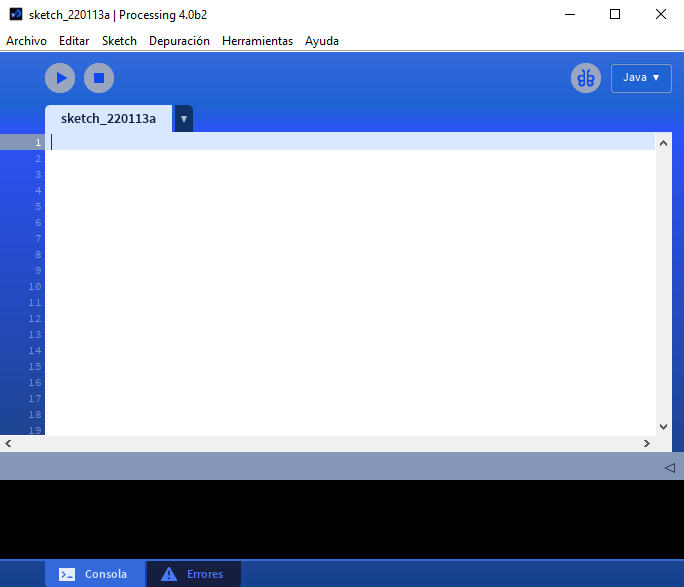
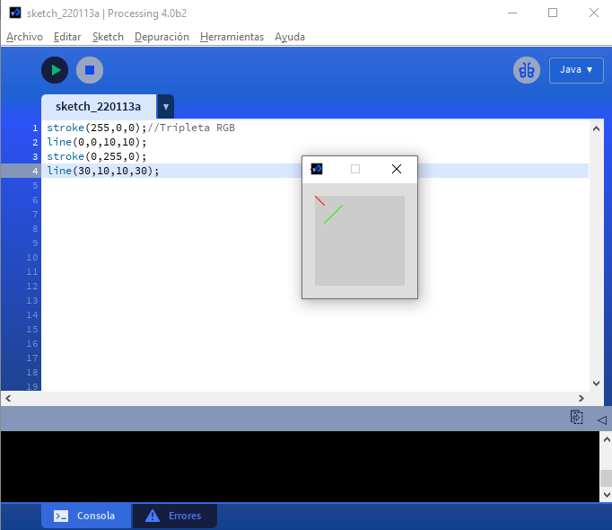
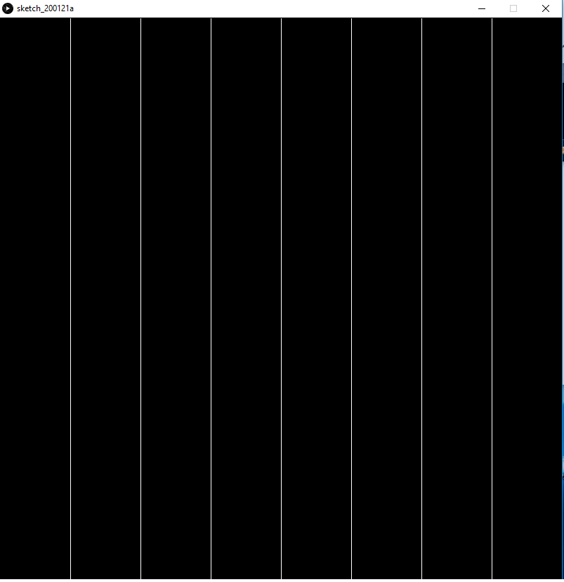
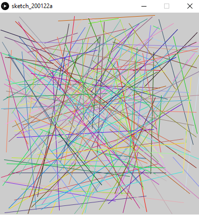
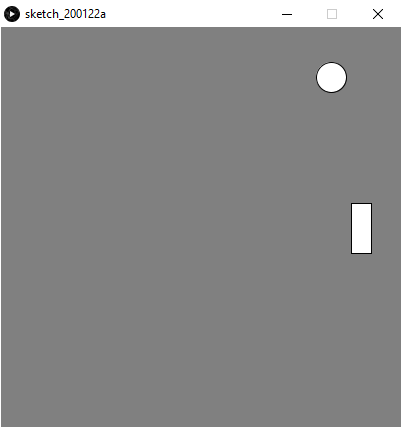

## Práctica 1. Introducción a Processing y p5.js

### Contenidos

[Introducción](#Introducción)  
[Instalando Processing](#12-instalando-processing)  
[Instalando p5.js](#13-instalando-p5js)  
[Modo básico](#14-modo-básico)  
[Modo continuo](#15-modo-continuo)   
[Otras fuentes](#16-otras-fuentes)  
[Tarea](#17-tarea)  
[Referencias](#referencias)


<!--- OJO s://github.com/processing/p5.js-editor/blob/master/README.md p5js editor deprecated use Atom --->


### 1.1. Introducción  

[Processing](http://processing.org) es un proyecto de código abierto basado en el lenguaje Java, que tiene como objetivo facilitar cualquier desarrollo con fines creativos. Se concibe como un cuaderno de dibujo para estudiantes, artistas digitales o informáticos, programadores y diseñadores.
La facilidad sintáctica de Java, y la enorme comunidad existente, sirven de gran apoyo, ofreciendo un conjunto de herramientas para la creación de aplicaciones creativas. Su diseño pretende facilitar la programación que integre imágenes, animación, sonido e interacción, ofreciendo un entorno de desarrollo para prototipado rápido que además de las posibilidades de visualización, permite la integración de sensores y actuadores. Entre sus posibilidades más recientes, hace además factible el desarrollo para Android, p5.js, Python, etc. En esta práctica se introducen Processing y p5.js haciendo un recorrido general por sus características básicas.

Es ampliamente utilizado en las mencionadas comunidades tanto para el aprendizaje de programación básica [Pazos21, ,Nyhoff17], como la creación de
prototipos y la producción audiovisual. Cubre por tanto necesidades no sólo para enseñar los fundamentos de programación, sino también como cuaderno de prototipos software, o herramienta de producción profesional.
Processing está disponible en el siguiente [enlace](http://processing.org/), si bien
en la sección de referencias se enumeran otros recursos con ejemplos, demos y bibliografía.

### 1.2. Instalando Processing

La instalación requiere previamente realizar la descarga a través del mencionado [enlace](http://processing.org/), y descomprimir.. En enero de 2022, la última versión estable es la 3.5.4, con la 4.0 en versión beta 2.
Una vez instalado, al lanzar la aplicación se presenta la interfaz del entorno de desarrollo de Processing (PDE), ver figura~\ref{fig:processing_entorno}. En caso de querer modificar el lenguaje de la interfaz, puede escogerse a través del menú
con *File $\rightarrow$ Preferences*.


El mencionado entorno de desarrollo, ver la siguiente figura, consiste en un editor de texto para escribir código, un área de mensajes, una consola
de texto, fichas de gestión de archivos, una barra de herramientas con botones para las acciones comunes, y una serie de menús.
Antes de comenzar a codificar, destacar que es posible acceder a diversos ejemplos
a través de la barra de menú *Archivo -> Ejemplos*. Cuando
se ejecuta un programa, se abre en una nueva ventana denominada ventana de visualización (*display window*).

  
*Imagen del entorno de programación, PDE, de Processing 4.0 beta 2*

Cada pieza de software escrito con Processing se denomina boceto o *sketch*. Se escribe a través del editor de texto, disponiendo de las funciones típicas
para cortar y pegar, así como las de búsqueda y reemplazo de texto.  

El área de mensajes, en la parte inferior, ofrece información de la salida de texto del programa en ejecución,
al hacer uso de las funciones *print()* y *println()*,
además de mensajes de error, tanto en ejecución como durante la edición. Las utilidades para la
depuración integradas en el entorno están disponibles desde la versión 2.0b7. Los botones de la barra de herramientas permiten ejecutar y detener programas:

| Icono  | Acción | Resultado |
| ------------- | ------------- | ------------- |
|    | Ejecutar  | Compila el código, abre una ventana de visualización, y ejecuta el programa |
|    | Detener  | Finaliza la ejecución de un programa |


 Comandos adicionales se encuentran dentro de la barra de menú: *Archivo*, *Editar*, *Sketch*, *Depuración*, *Herramientas*,
 *Ayuda*. Los submenús son sensibles al contexto,  lo que significa que
 sólo los elementos pertinentes a la labor que se está llevando a cabo estarán disponibles.


### 1.3. Instalando p5.js

[p5.js](https://p5js.org) es una biblioteca JavaScript que comparte con Processing el objetivo de proporcionar herramientas de programación para fines creativos, con la salvedad de que su concepción y realización se orientan a la web. Como cambio de concepto, no se limita a posibilitar el dibujo sobre el lienzo, sino que considera todo el navegador, permitiendo interactuar con otros objetos HTML5.
A diferencia de  [Processing.js](https://processingjs.org/) que es un puerto JavaScript para Processing, p5.js no es un puerto sino una nueva interpretación. Mencionar la reciente propuesta de [q5.js](https://github.com/LingDong-/q5xjs) a cargo de Lingdong Huang, que pretende ofrecer una versión aún más ligera y rápida.

Trabajar con p5.js *offline* además de descargar la biblioteca, requiere un editor, un servidor web, y un navegador. Dicha opción es probablemente  la mejor para código de cierta envergadura. Sin embargo, para los ejemplos básicos que se presentan a continuación, se propone utilizar un editor *online*, como el proporcionado en la web de [p5.js](https://editor.p5js.org), o alternativas a través de [OpenProcessing](https://www.openprocessing.org/sketch/create),  u otras propuestas como por ejemplo [Stamper](https://www.openprocessing.org/sketch/createhttps://p5stamper.com) (para Chrome). Para diversas operaciones, como almacenar y descargar el trabajo realizado, habitualmente será necesario registrarse.  

Abrir el editor de la web de p5.js, nos presenta un esqueleto de programación como en el que vemos en la siguiente figura, con las funciones *setup* y *draw*. En breve lo probaremos.


  
*Imagen del editor de p5.js*


### 1.4 Modo básico

Tanto Processing como p5.js distinguen dos modos de programación: el  básico, y el  continuo, se describen a continuación brevemente ambos.
El modo básico permite la elaboración de imágenes estáticas, es decir que no se modifican. De forma sucinta, líneas de código tienen una representación directa en la ventana de visualización.


#### 1.4.1 Dibujo de primitivas básicas

Un ejemplo mínimo de dibujo de una línea entre dos puntos de la pantalla se presenta en el siguiente código:

**Processing**
```
line(0,0,10,10);
```

Con p5.js será neecesario introducir los comandos en la función *setup*, pudiendo eliminar *draw*. Dicha función también existe en Processing, si bien en modo básico puede omitirse su mención. Observar, aunque lo reiteramos más adelantes, que en Processing las funciones se definen con la palabra reservada *void* en luhar de *function*.

**p5.js**
```
function setup() {
  line(0,0,10,10);
}
```

Para dibujar en pantalla, se debe tener en cuenta que se emplea el sistema de coordenadas cartesiano, como es habitual, teniendo su origen en la esquina superior izquierda. Esto quiere decir que para cualquier tamaño de ventana, la coordenada *(0,0)* se corresponde con la esquina superior izquierda como se ilustra en la
figura:

  
*Coordenadas de pantalla*

Processing también permite dibujar en tres dimensiones. En el plano imagen,
la coordenada *z* es cero, con valores
*z* negativos moviéndose hacia atrás en el espacio, como ilustra la siguiente figura.

  
*Sistema de coordenadas en 2 y 3 dimensiones en Processing  (imagen de processing.org)*

Cuando se realiza el dibujo en 3D simulado, la cámara se coloca en el centro de la pantalla.


Un nuevo ejemplo dibuja dos líneas, modificando el color del pincel para cada una de ellas con la función *stroke*.

**Processing**
```
stroke(255,0,0);//Tripleta RGB
line(0,0,10,10);
stroke(0,255,0);
line(30,10,10,30);
```

En el código, se especifica el color con una tripleta RGB. A través del
[enlace](http://www.w3schools.com/colors/colors\_rgb.asp)
puede practicarse con el espacio de color RGB
(rojo, verde y azul) modificando los valores de cada canal.
RGB es el modelo de color por defecto, si bien puede adoptarse otro con la función *colormode*. El resultado de la ejecución de dicho código se muestra en la figura.

  
*Entorno con el código del ejemplo y su salida correspondiente*

Recordar que el mismo código es correcto en p5.js, si bien debe estar contenido en la función *setup*.

Además de la tripla RGB, el comando *stroke* puede hacer uso de un cuarto valor para especificar la transparencia del pincel a partir de dicho momento. Al contrario, si se expresara un
único valor, entre 0 y 255, se interpreta como tono de gris, p.e. *stroke(0);* especifica el color negro, y *stroke(255);* el blanco. También la combinación RGB puede indicarse como un valor hexadecimal *stroke(\#9ACD32);*.


Los ejemplos previos fijan el color de las líneas, una posibilidad es asignarlo a partir de valores aleatorios haciendo uso de *random*, tal y como se muestra el siguiente ejemplo.

**Processing**
```
size(640, 360);
stroke(random(255),random(255),random(255));
line(0,0,10,10);
```

**p5.js**
```
function setup() {
  createCanvas(640, 360);
  stroke(random(255),random(255),random(255));
  line(0,0,10,10);
}
```

El valor entre paréntesis fija el valor máximo admisible. Cabe destacar la especificación del tamaño de la ventana de visualización en Ptocessing con el comando *size*, siendo diferente para p5.js que requiere *createCanvas*.


Una vez comprendido el dibujo de líneas, puede plantearse pintar un cuadrado haciendo uso de cuatro líneas. ¿Cómo se deducen los puntos extremos de cada segmento? **No mirar el siguiente ejemplo todavía ;)** Puede ser útil usar papel y lápiz.

Nuestra propuesta dibuja el cuadrado considerando como esquinas superior izquierda e inferior derecha respectivamente los puntos *(30,30)* y *(60,60)*. El código además define un color de fondo con *background*, y un grosor de línea con *strokeWeight*.


**Processing**
```
background(128);

size(400,400);

strokeWeight(2); //Modifica el grosor del pincel
line(30,30,30,60);
line(30,60,60,60);
line(60,60,60,30);
line(60,30,30,30);
```

**p5.js**
```
function setup() {
  background(128);

  createCanvas(400,400);

  strokeWeight(2); //Modifica el grosor del pincel
  line(30,30,30,60);
  line(30,60,60,60);
  line(60,60,60,30);
  line(60,30,30,30);
}
```

Sin embargo, como es de esperar existen comandos que facilitan el dibujo de  primitivas sencillas, en el siguiente listado se utiliza el comando *rect* para dibujar en este caso un cuadrado relleno de *10x10* píxeles . Para conocer todas las primitivas 2D, consultar *2D primitives* en *Ayuda -> Referencia*.

**Processing**
```
stroke(255,255,255);
rect(0,0,10,10);
```

Este mismo código en el editor p5.js parecerá no tener efecto, se debe a que el color de relleno por defecto es el blanco, y en el caso de p5.js, también lo es el color del fondo. Para obtewner idéntico resultadop, será necesario definir un color de fondo

**p5.js**
```
function setup() {
  background(128);
  stroke(255,255,255);
  rect(0,0,10,10);
}
```

El color de relleno se define con *fill()*, afectando a topdas las primitivas de dibujo a partir de ese momento

```
stroke(255,0,255);
fill(232,123,87);
rect(0,0,10,10);
```

Al igual que el resto de comandos que definen un color, la especificación de un único valor se interpreta como nivel de gris
(0 negro, 255 blanco). Si se indicaran 4 valores, el último de ellos define la transparencia, el canal alfa.
Las funciones *noFill* y *noStroke* cancelan respectivamente el relleno y el borde de las primitivas.


A modo de resumen, en el siguiente listado se hace uso de varias primitivas de dibujo 2D, con el fin de mostrar al lector una ilustración mínima del repertorio disponible. La imagen resultante se presenta  en la figura~\ref{fig:processing_2Dprimitivas}.

**Processing**
```
size(450,450);

stroke(128);
fill(128);

ellipse(200,300,120,120); //Por defecto modo con coordenadas del centro y ejes

stroke(255,0,255);
noFill();
strokeWeight(2);
ellipse(400,300,60,60);  

stroke(123, 0, 255);
strokeWeight(10);
ellipse(40,123,60,60);  

stroke(0);
strokeWeight(1);
line(40,123,400,300);

triangle(10, 240, 50, 245, 24, 280);

fill(0);
rect(190,290,30,50);

stroke(255,0,0);
fill(255,0,0);
bezier(5,5,10,10,310,320,320,20);
```

**p5.js**
```
function setup() {
  createCanvas(450,450);

  stroke(128);
  fill(128);

  ellipse(200,300,120,120); //Por defecto modo con coordenadas del centro y ejes

  stroke(255,0,255);
  noFill();
  strokeWeight(2);
  ellipse(400,300,60,60);  

  stroke(123, 0, 255);
  strokeWeight(10);
  ellipse(40,123,60,60);  

  stroke(0);
  strokeWeight(1);
  line(40,123,400,300);

  triangle(10, 240, 50, 245, 24, 280);

  fill(0);
  rect(190,290,30,50);

  stroke(255,0,0);
  fill(255,0,0);
  bezier(5,5,10,10,310,320,320,20);
}
```

  
*Salida del ejemplo anterior*


Con los comandos ya conocidos, sería posible  componer un dibujo estático combinando varias primitivas y colores (*rect*, *ellipse*, *line*, ...). Realmente no sería complicado reproducir el Mondrian de la figura~\ref{fig:mondrian}. ¿Te atreves?

  
*Piet Mondrian, "Composición con rojo, amarillo y azul" (1930).*


#### 1.4.2 Variables

El uso de variables aporta muchas posibilidades en la escritura de código. Para comenzar, utilizamos algunas de las variables presentes durante la ejecución, como son las dimensiones dela ventana de visualización, almacenadas respectivamente en las variables *width* y *height*. Dichas variables se utilizan en el listado a continuación,  para pintar una estrella simple que se coloca en en el centro de la ventana, independientemente de las dimensiones fijadas con *size()* o *createCanvas*.

**Processing**
```
line(width/2-10,height/2-10,width/2+10,height/2+10);
line(width/2+10,height/2-10,width/2-10,height/2+10);
line(width/2,height/2-10,width/2,height/2+10);
line(width/2+10,height/2,width/2-10,height/2);
```

  
*Salida del ejemplo de uso de las variables width y height*

Cada variable es básicamente un alias o símbolo que nos permite hacer uso de una zona de almacenamiento en memoria.
Dado que recordar la dirección de memoria, un valor numérico, es engorroso, se hace uso de un nombre o
identificador que permite darle mayor semántica a aquello que contiene la variable. En el caso de las
variables del sistema mencionadas, *width* es una variable que justamente almacena el ancho de la ventana.
Las variables se caracterizan por el nombre, el valor que contienen, su dirección, y el tipo de datos.


Una gran ventaja del uso de variables es que un programador puede definir y utilizar sus propias variables a conveniencia.
En Processing es necesario declarar cualquier variable antes de utilizarla. En el siguiente ejempñlo se utiliza la variable
*l* para establecer el tamaño de la estrella.

**Processing**
```
int l=30;

line(width/2-l,height/2-l,width/2+l,height/2+l);
line(width/2+l,height/2-l,width/2-l,height/2+l);
line(width/2,height/2-l,width/2,height/2+l);
line(width/2+l,height/2,width/2-l,height/2);
```

En p5.js, la definición de variables difiere, existiendo dos palabras reservadas *let* y *var*, según si queremos que la variable sea local o global.

**p5.js**
```
function setup() {
  let l=30;

  line(width/2-l,height/2-l,width/2+l,height/2+l);
  line(width/2+l,height/2-l,width/2-l,height/2+l);
  line(width/2,height/2-l,width/2,height/2+l);
  line(width/2+l,height/2,width/2-l,height/2);
}
```

Para finalizar este apartado, el siguiente código dibuja una línea y un círculo de un determinado radio, haciendo uso de la función *ellipse* definiendo previamente el color de relleno.

```
int Radio = 50 ;

size(500,500);
background(0);
stroke(80);
line(230,220,285,275);
fill(150,0,0);
ellipse(210,100,Radio,Radio);
```


#### 1.4.3 Tipos de datos

Processing está basado en Java, por lo que debe asumirse cualquier característica de dicho lenguaje.
Varios tipos de variables se muestran en el listado~\ref{code:processing-tiposdedatos}. Tener presente que las variables se deben declarar explícitamente y asignarles valor antes de llamar o de realizar una operación
con ellas.

**Processing**
```
// Cadenas
String Name = "La EII";
String Sentence = " nace en ";
String Year = "los 80";  

// Concatenar
String NewSentence = Name + Sentence + Year;
println(NewSentence);

// Enteros
int myInteger = 1;
int myNumber = 50000;
int myAge  	= -48;

// Reales
float myFloat = 9.5435;
float timeCount = 343.2;

// Booleanos // True o False
boolean mySwitch = true;
boolean mySwitch2 = false;
```

En p5.js usaremos las palabras reservadas para definir variables, y *print* en lugar de *println*.

**p5.js**
```
function setup() {
 // Cadenas
  let Name = "La EII";
  let Sentence = " nace en ";
  let Year = "los 80";  

  // Concatenar
  let NewSentence = Name + Sentence + Year;
  print(NewSentence);

  // Enteros
  let myInteger = 1;
  let myNumber = 50000;
  let myAge  	= -48;

  // Reales
  let myFloat = 9.5435;
  let timeCount = 343.2;

  // Booleanos // True o False
  let mySwitch = true;
  let mySwitch2 = false;
}
```

No les descubrimos las utilidades de las estructuras de datos dimensionadas, simplemente recordar  ejemplos de accesos a vectores con un ejemplo tomado de la web de Processing.

**Processing**
```
// Lista de Cadenas
String [] myShoppingList = new String[3];
myShoppingList[0] = "bananas";
myShoppingList[1] = "coffee";
myShoppingList[2] = "tuxedo";

// Lista de enteros
int [] myNumbers = new int[4];
myNumbers[0] = 498;
myNumbers[1] = 23; 	
myNumbers[2] = 467;
myNumbers[3] = 324;

// printamos un dato de la lista
println( myNumbers[2] );  

int a = myNumbers[0] + myNumbers[3];   
println( a );     
```


Processing incluye la clase *ArrayList* de Java, que no requiere conocer su tamaño desde el inicio. De esta forma se facilita añadir objetos
a la lista, ya que el tamaño de la lista aumenta o decrece de forma automática, ver listado~\ref{code:processing-arraylist}.

**Processing**
```
ArrayList lista = new ArrayList();
int i = 0;

while (i<4){
  lista.add(i+3);
  i=i+1;
}

println("\nLos datos son: \n");
Iterator iter = lista.iterator();
while(iter.hasNext()){
  println(iter.next());
}

ArrayList myVectorList ;
myVectorList = new ArrayList();

// Asignamos objectos
myVectorList.add( new PVector(51,25,84) );
myVectorList.add( new PVector(98,3,54) );

// o //
PVector myDirection = new PVector(98,3,54);
myVectorList.add( myDirection  );

// Bucle para acceder a objetos usando ArrayList.size() y ArrayList.get()
for(int i = 0; i < myVectorList.size(); i++){
PVector V = (PVector) myVectorList.get(i);  // ojo con el cast (PVector)
println(V);
}
```


#### 1.4.4 Repeticiones

El siguiente código crea una ventana de dimensiones *800x800* en la que pintamos líneas
verticales de arriba a abajo separadas entre ellas *100* píxeles. Recordar que la coordenada *y* de la parte
superior es *0*, y la inferior es *800* o *height* si usamos la variable correspondiente.

**Processing**
```
size(800,800);
background(0);
stroke(255);
line(100,1,100,height);
line(200,1,200,height);
line(300,1,300,height);
line(400,1,400,height);
line(500,1,500,height);
line(600,1,600,height);
line(700,1,700,height);
```

  
*Resultado del código que dibuja líneas verticales*


Claramente las llamadas a la función *line* son todas muy similares, sólo varían las coordenadas *x* de los
dos puntos. Los lenguajes de programación facilitan la especificación de llamadas repetidas por medio del uso de
bucles. Una versión más compacta del dibujo de las líneas verticales:

**Processing**
```
size(800,800);
background(0);
stroke(255);
for (int i=100;i<=700;i=i+100){
    line(i,1,i,height);
```

 El bucle define una variable, *i*, a la que asignamos
un valor inicial *100*, un valor final, *700*, y la forma en que se va modificando *i* con cada
ejecución, en este caso añadiendo $100$.


Como saben, las sentencias repetitivas son particularmente útiles cuando las repeticiones son cientos o miles, o requieren de su integración con condiciones y anidamientos.

#### 1.4.5 Dibujar un tablero de ajedrez

Esta sección aborda el dibujo de un tablero de ajedrez, que contiene $64$ casillas, como
muestra la figura~\ref{fig:tablero}.
El listado~\ref{code:processing-chess1}
fija el fondo a blanco, dibujando los cuatro recuadros negros de la primera fila del tablero.


  
*Rejilla estilo tablero de ajedrez*


**Processing**
```
size(800,800);
background(255);
fill(0);
//Primera fila
rect(0,0,100,100);
rect(200,0,100,100);
rect(400,0,100,100);
rect(600,0,100,100);
```

Dado el patrón presente en las cuatro llamadas a la función *rect*, en este código se aplica un bucle *for* para pintar esas cuatro casillas negras de una forma más compacta

**Processing**
```
size(800,800);
background(255);
fill(0);
//Primera fila

for (int i=0;i<=600;i=i+200){
  rect(i,0,100,100);
}
```

Si replicamos el bucle, integrando un desplazamiento, dibujamos las cuatro filas del tablero de ajedrez que son idénticas.
Una propuesta para dar el salto dibujando cuatro filas, cada una con su bucle particular.

**Processing**
```
size(800,800);
background(255);
fill(0);
//Primera fila

for (int i=0;i<=600;i=i+200){
  rect(i,0,100,100);
}
for (int i=0;i<=600;i=i+200){
  rect(i,200,100,100);
}
for (int i=0;i<=600;i=i+200){
  rect(i,400,100,100);
}
for (int i=0;i<=600;i=i+200){
  rect(i,600,100,100);
}
```

Como realmente cada bucle es muy similar a los demás, tras detectar el patrón de cambio,
si anidamos bucles, queda más
compacto.

**Processing**
```
size(800,800);
background(255);
fill(0);
//Primera fila

for (int j=0;j<=600;j=j+200){
  for (int i=0;i<=600;i=i+200){
    rect(i,j,100,100);
  }
}
```

Restan las otras cuatro filas, que resultan de una leve variación ya que se alternan los tonos blancos y negros:

**Processing**
```
size(800,800);
background(255);
fill(0);
//Primera fila

for (int j=0;j<=600;j=j+200){
  for (int i=0;i<=600;i=i+200){
    rect(i,j,100,100);
    rect(i+100,j+100,100,100);
  }
}
```

**p5.js**
```
function setup() {
  createCanvas(800,800);
  background(255);
  fill(0);
  //Primera fila

  for (let j=0;j<=600;j=j+200){
    for (let i=0;i<=600;i=i+200){
      rect(i,j,100,100);
      rect(i+100,j+100,100,100);
    }
  }
}
```

A lo largo de este apartado, se han mostrado algunas de las posibilidades del modo básico para componer una imagen estática, en la que es posible
 modificar los argumentos de las llamadas, eliminar comandos, o añadir otros. Sin embargo, como ya se ha mencionado, el resultado es siempre estático, no hay movimiento, no hay posibilidad de interacción, de cambio en el resultado. Para jugar con el cambio, neecsitamos el modo continuo.

**Processing**
```
int Radio = 50;
void setup()
{
  size(500,500);
  background(0);
  stroke(80);
  line(230, 220, 285, 275);
  fill(150,0,0);
  ellipse(210, 100, Radio, Radio);
}
```

### 1.5 Modo continuo

#### 1.5.1 El bucle infinito de ejecución


El modo continuo permite integrar interactividad en al ejecución de nuestro código, para ello cuenta con dos métodos básicos, que ya fortman oarte del esqueleto al crear un nuevo *sketch* en el editor p5.js:

- *setup()*  se ejecuta una única vez  al lanzar el programa.
- *draw()*  se ejecuta por defecto de forma continua, permitiendo la escritura de
funciones personalizadas, y hacer uso de la interacción.


  
*Línmeas con extremos y color aleatorio*


Un primer ejemplño con ambos métodos tanto para Processing como p5.js

**Processing**
```
void setup()
{
  size(400, 400);
}

void draw()
{
  stroke(random(255),random(255),random(255));
  line(random(width),random(height),random(width),random(height));
}
```


**p5.js**
```
function setup()
{
  createCanvas(400, 400);
}

function draw()
{
  stroke(random(255),random(255),random(255));
  line(random(width),random(height),random(width),random(height));
}
```

El método *setup* realiza la inicialización, fijando las dimensiones de la ventana. Por otro lado, el método *draw* se encarga de dibujar. En este ejemplo, *draw* pinta una línea con color
y posición aleatoria. La gran diferencia del modo continuo es que las instrucciones contenidas en el método *draw* no se
ejecutan una única vez, sino que se *llama* a dicho método de forma reiterada cada segundo, por defecto *60* veces por segundo.


Haciendo uso únicamente del método *setup*, como hicimos con p5.js, el resultado es equivalente al modo básico, dado
que dicho método se ejecuta una única vez.

**Processing**
```
void setup()
{
  size (240,240); 		// Dimensiones del lienzo
  background(128,128,128); 	// Color de lienzo en formato RGB
  noStroke(); 			// Sin borde para las figuras
  fill(0); 			// Color de relleno de las figuras (0 es negro)
  rect(100, 100, 30, 30); 	// Esquina superior izquierda, ancho y alto
}
```


El siguiente código dibuja cuatro círculos en la pantalla y utiliza además una función propia llamada *circles()*.

**Processing**
```
void setup() {
  size(200, 200);
  noStroke();
  background(255);
  fill(0, 102, 153, 204);
  smooth();
  noLoop();
}

void draw() {
  circles(40, 80);
  circles(90, 70);
}

void circles(int x, int y) {
  ellipse(x, y, 50, 50);
  ellipse(x+20, y+20, 60, 60);
}
```

Observa el modo en que se define, y el uso de las llaves para delimitar las instrucciones contenidas en la función.
En este caso concreto, el código de
*draw()* sólo se ejecuta una vez, porque en *setup()* se llama a la función *noLoop()}, que cancela la repetición, resultando
equivalente al modo básico.

La versión para p5.js, además de las diferencias ya conocidas, se observa que no es necesario usar las palabras reservadas para definir las variables de entrada de las funciones definidas por el usuario.

**p5.js**
```
function setup() {
  createCanvas(200, 200);
  noStroke();
  background(255);
  fill(0, 102, 153, 204);
  smooth();
  noLoop();
}

function draw() {
  circles(40, 80);
  circles(90, 70);
}

function circles(x, y) {
  ellipse(x, y, 50, 50);
  ellipse(x+20, y+20, 60, 60);
}
```


En general la ejecución reiterada tiene sentido cuando exista un cambio en aquello que dibujamos ya sea por movimiento, modificación
del color, etc. El siguiente ejemplo dibuja líneas desde un punto fijo, con el otro extremo aleatorio,
variando también el color de forma aleatoria.

**Processing**
```
void setup() {
  size(400, 400);
  background(0);
}

void draw() {
  stroke(0,random(255),0);  
  line(50, 50, random(400), random(400));
}
```

A continuación se fuerza a que sean líneas aleatorias, pero verticales y grises.

**Processing**
```
void setup() {
  size(400, 400);
}

void draw() {
  stroke(255);

  float dist_izq=random(400);
  line(dist_izq, 0, dist_izq, 399);
}
```

Como se comentaba anteriormente, el color de fondo de la ventana se fija con la llamada al método *background*. Este comando nos puede ser útil si queremos forzar que se borre la pantalla antes de dibujar de nuevo:

**Processing**
```
void setup()
{
  size(400, 400);
}

void draw()
{
  background(51);  //Borra cada vez antes de pintar
  stroke(random(255),random(255),random(255));
  line(random(width),random(height),random(width),random(height));
}
```

El ejemplo del siguiente listado introduce el uso del método *frameRate*, que fija el número de llamadas al
método *draw* por segundo. En este
caso dibuja líneas aleatorias, pero observa la tasa de refresco.

**Processing**
```
void setup() {
  size(400, 400);
  frameRate(4);
}

void draw() {
  background(51);

  line(0, random(height), 90, random(height));
}
```


La tasa de refresco puede además controlarse a través de una serie de funciones:

- *loop()*: Restablece las llamadas a *draw()*, es decir el modo continuo.
- *noLoop()*: Detiene el modo continuo, no se realizan llamadas a *draw()}.
- *redraw()*: Llama a *draw()* una sóla vez.

El código a continuación varía la tasa de refresco en base al número de ejecuciones y el evento de pulsado de
un botón del ratón.

**Processing**
```
int frame = 0;
void setup() {
  size(100, 100);
  frameRate(30);
}
void draw()
{
  if (frame > 60)
  {  // Si han pasado 60 ejecuciones (frames) desde el comienzo
		noLoop();    	// para el programa
		background(0);   // y lo pone todo a negro.
  }
  else
  {       	// En otro caso, pone el fondo
		background(204); // a un gris claro
		line(mouseX, 0, mouseX, 100); // dibuja
		line(0, mouseY, 100, mouseY);
		frame++;
  }
}
void mousePressed() {
  loop();
  frame = 0;
}
```

Un ejemplo que ilustra la llamada a *redraw*.

**Processing**
```
void setup()
{
  size(100, 100);
}
void draw() {
  background(204);
  line(mouseX, 0, mouseX, 100);
}
void mousePressed() {
  redraw(); // Llama a draw() una vez
}
```

Como se ha comentado anteriormente, por defecto se establece el modo continuo con una frecuencia de *60* llamadas por segundo al método *draw()*. En el código siguiente se provoca el desplazamiento de un círculo por la ventana.

**Processing**
```
int Radio = 50;
int cuenta = 0;

void setup()
{
  size(500,500);
  background(0);
}

void draw()
{
  background(0);
  stroke(175);
  fill(175);
  println("Iteraciones: " + cuenta);
  ellipse(20+cuenta, height/2, Radio, Radio);
  cuenta++;
}
```

Finalizamos el apartado señalando que además de dibujar elementos geométricos, es posible escribir texto sobre el lienzo.

**Processing**
```
void setup()
{
  background(128,128,128); // Color de lienzo en formato RGB
  noStroke(); 				// Sin borde para las figuras
  fill(0); 						// Color de relleno de las figuras (0 es negro)

  // Carga una fuente en particular
  textFont(createFont("Georgia",24));
  textAlign(CENTER, CENTER);

  // Escribe en la ventana
  text("'!Hola mundo!", 100,100);
}
```


#### 1.5.2 Control

En un ejemplo previo se desplaza un círculo por la ventana haciendo uso de una variable. Una variante algo más reducida:

**Processing**
```
int cir_x=0;

void setup() {
 size(400, 400);
 noStroke();
 fill(100,255,32);  //Color de relleno
}

void draw() {
  background(127);  
  ellipse(cir_x,50,50,50);

  cir_x=cir_x+1;//Modifica la coordenada x del centro de la figura
}
```

Para evitar que desaparezca la figura a la derecha de la ventana, conociendo las dimensiones de la ventana, puede controlarse el valor de la posición, reiniciando el valor de la coordenada
*x* del círculo cuando llega al borde derecho.

**Processing**
```
int cir_x=0;

void setup() {
 size(400, 400);  
 noStroke();
 fill(100,255,32);
}

void draw() {
  background(127);

  ellipse(cir_x,50,50,50);

  cir_x=cir_x+1;  
  if (cir_x>=width)
  {
    cir_x=0;
  }
}
```

Dibujando dos círculos que se desplazan horizontalmente por la pantalla a distintas velocidades.

**Processing**
```
float cir_rap_x = 0;
float cir_len_x = 0;

void setup() {
  size(400,400);
  noStroke();
}

void draw() {
  background(27,177,245);

  fill(193,255,62);
  ellipse(cir_len_x,50, 50, 50);
  cir_len_x = cir_len_x + 1;

  fill(255,72,0);
  ellipse(cir_rap_x,50, 50, 50);
  cir_rap_x = cir_rap_x + 5;


  if(cir_len_x > 400) {
    cir_len_x = 0;
  }
  if(cir_rap_x > 400) {
    cir_rap_x = 0;
  }
}
```

Modificando la forma del círculo más lento de forma aleatoria cuando se dan ciertas circunstancias.

**Processing**
```
float cir_rap_x = 0;
float cir_len_x = 0;

void setup() {
  size(400,400);
  noStroke();
}

void draw() {
  background(27,177,245);

  float cir_len_tam = 50;

  if(random(10) > 9) {
    cir_len_tam = 60;
  }

  fill(193,255,62);
  ellipse(cir_len_x,50, cir_len_tam, cir_len_tam);
  cir_len_x = cir_len_x + 1;

  fill(255,72,0);
  ellipse(cir_rap_x,50, 50, 50);
  cir_rap_x = cir_rap_x + 5;


  if(cir_len_x > 400) {
    cir_len_x = 0;
  }
  if(cir_rap_x > 400) {
    cir_rap_x = 0;
  }
}
```

Se aprecia cierto efecto de pausa, se debe a que la condición no tiene en cuenta el radio para hacer reaparecer la figura. Modificando para tener una aparición más ajustada.

**Processing**
```
int cir_x=0;

void setup() {
  size(400, 400);

 noStroke();

 fill(100,255,32);
}

void draw() {
  background(127);

  ellipse(cir_x,50,50,50);

  cir_x=cir_x+1;

  if (cir_x-50/2>width)
  {
    cir_x=25;
  }

  if (cir_x+50/2>=width)
  {
    ellipse(cir_x-width,50,50,50);
  }
}
```

En los ejemplos previos, la modificación de la coordenada *x* es siempre un incremento. La nueva propuesta  produce un efecto de rebote al llegar al extremo, modificando el signo del movimiento aplicado, para que pueda ser incremento o decremento.
De esta forma se consigue que el círculo rebote en ambos lados.

**Processing**
```
int pos=0;
int mov=1;

void setup(){
	size(400,400);
}

void draw(){
	background(128);
	ellipse(pos,50,30,30);
	pos=pos+mov;

	if (pos>=400 || pos<=0)
	{
		mov=-mov;
	}
}
```

Una nueva modificación integra
 un *jugador*, que se desplaza en vertical acompañando al ratón, y
también puede alterar el movimiento del círculo cuando haya choque.

    
  *Pelota y jugador*


**Processing**
```
int posX=0;
int posY=50;
int D=30;
int ancho=20;
int alto=50;
int mov=5;

void setup(){
  size(400,400);  
}

void draw(){  
  background(128);
  ellipse(posX,posY,D,D);

  //Donde se encuentra el jugador
  int jugx=width-50;
  int jugy=mouseY-30;
  rect(jugx,jugy,ancho,alto);

  posX=posX+mov;
  //verificando si hay choque
  if (posX>=400 || posX<=0 || (mov>0 && jugy<=posY+D/2 && posY-D/2<=jugy+alto && jugx<=posX+D/2 && posX-D/2<=jugx+ancho))
  {
    mov=-mov;
  }
}
```

Añadimos un marcador contabilizando el número de veces que no controlamos la *pelota*.
Una variable contador, inicialmente a cero, que modifica su valor cada vez que haya
un choque con la pared de la derecha.

**Processing**
```
int posX=0;
int posY=50;
int D=30;
int ancho=20;
int alto=50;
int mov=5;
int goles=0;

void setup(){
  size(400,400);  
}

void draw(){  
  background(128);
  ellipse(posX,posY,D,D);

  //Donde se encuentra el jugador
  int jugx=width-50;
  int jugy=mouseY-30;
  rect(jugx,jugy,ancho,alto);

  posX=posX+mov;
  //verificando si hay choque
  if (posX>=400 || posX<=0 || (mov>0 && jugy<=posY+D/2 && posY-D/2<=jugy+alto && jugx<=posX+D/2 && posX-D/2<=jugx+ancho))
  {
    mov=-mov;
    //Si choca con la derecha, es gol
    if  (posX>=400)
    {
      goles=goles+1;
    }
  }
  text("Goles "+goles, width/2-30, 20);
}
```

Sería también posible mostrar un mensaje cada vez que haya un *gol*, es decir, cuando se toque la pared derecha.
Mostrarlo únicamente al modificar el tanteo, hará que casi no se vea, es por ello que lo hacemos creando un contador
que se decrementa cada vez que se muestra el mensaje:

**Processing**
```
int posX=0;
int posY=50;
int D=30;
int ancho=20;
int alto=50;
int mov=5;
int goles=0;
int muestragol=0;

void setup(){
  size(400,400);  
}

void draw(){  
  background(128);
  ellipse(posX,posY,D,D);

  //Donde se encuentra el jugador
  int jugx=width-50;
  int jugy=mouseY-30;
  rect(jugx,jugy,ancho,alto);

  posX=posX+mov;
  //verificando si hay choque
  if (posX>=400 || posX<=0 || (mov>0 && jugy<=posY+D/2 && posY-D/2<=jugy+alto && jugx<=posX+D/2 && posX-D/2<=jugx+ancho))
  {
    mov=-mov;
    //Si choca con la derecha, es gol
    if  (posX>=400)
    {
      goles=goles+1;
      muestragol=40;
    }
  }
  text("Goles "+goles, width/2-30, 20);
  if (muestragol>0)
  {
    text("GOOOOL", width/2-30, height-50);
    muestragol=muestragol-1;
  }
}
```


Introducir el movimiento en los dos ejes requiere modificar la coordenada *y* de la pelota. El siguiente código
lo integra, manteniendo el rebote en las paredes, ahora también inferior y superior.

**Processing**
```
float cir_x = 300;
float cir_y = 20;
// desplazamento
float mov_x = 2;
float mov_y = -2;

void setup() {
  size(400, 200);
  stroke(214,13,255);
  strokeWeight(7);
}
void draw() {
  background(33,234,115);
  ellipse(cir_x, cir_y, 40, 40);
  cir_x = cir_x + mov_x;
  cir_y = cir_y + mov_y;

  if(cir_x > width) {
    cir_x = width;
    mov_x = -mov_x;
    println("derecha");
  }
  if(cir_y > height) {
    cir_y = height;
    mov_y = -mov_y;
    println("abajo");
  }
  if(cir_x < 0) {
    cir_x = 0;
    mov_x = -mov_x;
    println("izquierda");
  }
  if(cir_y < 0) {
    cir_y = 0;
    mov_y = -mov_y;
    println("arriba");
  }
}
```

#### 1.5.3 Interacción

En el modo continuo será frecuente la interacción con los usuarios vía teclado o ratón.

##### 1.5.3.1 Teclado

Las acciones de teclado puede utilizarse como evento en sí o para recoger los detalles de la tecla pulsada. Por ejemplo la
variable booleana *keyPressed* se activa si una tecla se  presiona, en cualquier otro caso es falsa. Además, dicha variable estará
activa mientras mantengamos la tecla pulsada.
El siguiente código hace uso de dicha variable para desplazar una línea.

**Processing**
```
int x = 20;
void setup() {
  size(100, 100);
  smooth();
  strokeWeight(4);
}
void draw() {
  background(204);
  if (keyPressed == true)
  {
    x++;   // incrementamos x
  }
  line(x, 20, x-60, 80);
}
```

El p5.js la variable se denomina *keyIsPressed*

**p5.js**
```
var x = 20;
function setup() {
  createCanvas(100, 100);
  smooth();
  strokeWeight(4);
}
function draw() {
  background(204);
  if (keyIsPressed == true)
  {
    x++;   // incrementamos x
  }
  line(x, 20, x-60, 80);
}
```

Es posible recuperar la tecla pulsada. La variable *key* es de tipo char y almacena el valor de la tecla que ha sido presionada recientemente. Un código ejemplo para mostrar la última tecla pulsada sobre el lienzo

**Processing**
```
void setup() {
  size(100, 100);
}

void draw() {
  background(0);
  text(key, 28, 75);
}
```

Cada letra tiene un valor numérico en la Tabla ASCII, que también podemos mostrar:

**Processing**
```
void setup() {
  size(100, 100);
}

void draw() {
  background(200);
  if (keyPressed == true)
  {
    int x = key;
    text(key+" ASCII "+x, 20, 20 );
  }
}
```

En p5.js la variable *KeyCode* contiene dicho código para cualquier tecla, no como en Processing que parece sólo tener contenido con las especiales

**p5.js**
```
function setup() {
  createCanvas(200, 100);
}

function draw() {
  background(128);
  text(key + " ASCII " + keyCode, 20, 20 );
}
```

Una particularidad interesante es poder identificar las teclas especiales como por ejemplo: flechas, *Shift*, *Backspace*,
tabulador y otras más.
Para ello, lo primero que debemos hacer es comprobar si se trata de una de estas teclas comprobando el valor de la variable *key == CODED*. El siguiente código utiliza las teclas de las flechas cambie la posición de una figura dentro del lienzo.

**Processing**
```
color y = 35;
void setup() {
  size(100, 100);
}
void draw() {
  background(204);
  line(10, 50, 90, 50);
  if (key == CODED)
  {
    if (keyCode == UP)
    {
      y = 20;
    }
    else
      if (keyCode == DOWN)
      {
        y = 50;
      }
  }
  else
  {
    y = 35;
  }
  rect(25, y, 50, 30);
}
```

Con p5.js hay leves variaciones

**Processing**
```
var y = 35;
function setup() {
  createCanvas(100, 100);
}
function draw() {
  background(204);
  line(10, 50, 90, 50);
  if (keyCode == UP_ARROW || keyCode == DOWN_ARROW)
  {
    if (keyCode == UP_ARROW)
    {
      y = 20;
    }
    else
      y = 50;
  }
  else
  {
    y = 35;
  }
  rect(25, y, 50, 30);
}
```

También es posible detectar eventos individualizados, es decir el pulsado de una tecla en concreto.
El siguiente realiza una acción al pulsar la tecla *t*.

**Processing**
```
boolean drawT = false;

void setup() {
  size(100, 100);
  noStroke();
}

void draw() {
  background(204);
  if (drawT == true)
  {
    rect(20, 20, 60, 20);
    rect(39, 40, 22, 45);
  }
}  
void keyPressed()
{
  if ((key == 'T') || (key == 't'))
  {
    drawT = true;
  }
}

void keyReleased() {
  drawT = false;
}
```

##### 1.5.3.2 Ratón

En ejemplos previos hemos visto que es posible acceder a las coordenadas del ratón, simplemente
haciendo uso de las variables
adecuadas desde el método *draw()*:

**Processing**
```
void setup() {
  size(200, 200);
  rectMode(CENTER);
  noStroke();
  fill(0, 102, 153, 204);
}

void draw() {
  background(255);
  rect(width-mouseX, height-mouseY, 50, 50);
  rect(mouseX, mouseY, 50, 50);
}
```

También es factible hacer uso del evento de ratón, es decir, la función asociada con el mismo. En este caso se utiliza para modificar el color del fondo.

**Processing**
```
 float gray = 0;
void setup() {
  size(100, 100);
}
void draw() {
  background(gray);
}
void mousePressed() {
  gray += 20;
}
```

Otro ejemplo que emplea el evento de pulsado para pasar del modo básico al continuo.

**Processing**
```
void setup()
{
  size(200, 200);
  stroke(255); 	
  noLoop();
}

float y = 100;
void draw()
{
  background(0);   
  line(0, y, width, y);
  line(0, y+1, width, y+1);  
  y = y - 1;
  if (y < 0) {	y = height;  }
}

void mousePressed()
{
  loop();
}
```


Como puede verse, *mousePressed()* es una función enlazada a la acción de
pulsar un botón del ratón. Siendo posible controlar también cuando
se suelta, se mueve, o si se arrastra el ratón con un botón pulsado, ver listado~\ref{code:processing-arrastre}.

**Processing**
```
int dragX, dragY, moveX, moveY;
void setup() {
  size(100, 100);
  smooth();
  noStroke();
}  
void draw() {
  background(204);
  fill(0);
  ellipse(dragX, dragY, 33, 33); // Círculo negro
  fill(153);
  ellipse(moveX, moveY, 33, 33); // Círculo gris
}
void mouseMoved() { // Mueve el gris
  moveX = mouseX;
  moveY = mouseY;
}
void mouseDragged() { // Mueve el negro
  dragX = mouseX;
  dragY = mouseY;
}
```

**p5.js**
```
var dragX,dragY,moveX,moveY;

function setup() {
  createCanvas(400, 400);
  smooth();
  noStroke();
}

function draw() {
  background(220);
  fill(0);
  ellipse(dragX,dragY,30,30);
  fill(150);
  ellipse(moveX,moveY,30,30);
}

function mouseMoved ( ) {
  moveX=mouseX ;
  moveY=mouseY ;
  }

function mouseDragged ( ) {
  dragX=mouseX ;
  dragY=mouseY ;
}
```

Como ya se ha mencionado anteriormente, las coordenadas de ratón se almacenan en las variables *mouseX* y *mouseY*

**Processing**
```
void setup() {
  size(640, 360);
  noStroke();  
}

void draw() {
  background(51);
  ellipse(mouseX, mouseY, 66, 66);
}
```

Ambas son variables que contienen las posiciones actuales del ratón, las previas están disponibles
en *pmouseX* y *pmouseY*. A continuación se utilizan las coordenadas del ratón para pintar
a mano alzada.

**Processing**
```
void setup(){
  size(400,400);

  background(128);
}

void draw(){  
  point(mouseX,mouseY);
}
```

Una alternativa consiste en  restringir el pintado a sólo cuando se pulse un botón del ratón, empleando una estructura condicional:

**Processing**
```
void setup(){
  size(400,400);

  background(128);
}

void draw(){  

  if (mousePressed == true) {
      point(mouseX,mouseY);
  }
}
```

La siguiente propuesta utiliza el teclado, en concreto las teclas del cursor arriba y abajo, para cambiar grosor del pincel (y pintamos círculo),
y cualquier otra tecla para alterar el color. Se identifica primero si se ha pulsado una tecla, y luego la tecla  en concreto pulsada.

**Processing**
```
int grosor=1;
int R=0,G=0,B=0;

void setup(){
  size(400,400);  
  background(128);
}

void draw(){  

  if (mousePressed == true) {
      point(mouseX,mouseY);
  }

  if (keyPressed == true) {
    if (keyCode == UP) {
      grosor = grosor+1;
      strokeWeight(grosor);
    }
    else
    {
      if (keyCode == DOWN) {
        if (grosor>1){
        grosor = grosor-1;
        strokeWeight(grosor);
        }
      }
      else
      {
        R=(int)random(255);
        G=(int)random(255);
        B=(int)random(255);
      }
    }    
  }

  //Muestra del pincel
  noStroke();
  fill(128);
  rect(4,4,grosor+2,grosor+2);
  fill(R,G,B);
  ellipse(5+grosor/2,5+grosor/2,grosor,grosor);

  stroke(R,G,B);
}
```

Haciendo que
el radio del pincel dependa del valor de *x* o *y* del ratón.

**Processing**
```
void setup() {
  size(640, 360);
  noStroke();
  rectMode(CENTER);
}

void draw() {
  background(51);
  fill(255, 204);
  rect(mouseX, height/2, mouseY/2+10, mouseY/2+10);
  fill(255, 204);
  int inversaX = width-mouseX;
  int inversaY = height-mouseY;
  rect(inversaX, height/2, (inversaY/2)+10, (inversaY/2)+10);
}
```


#### 1.5.4 Múltiples lienzos

En los ejemplos previos se trabaja con un único lienzo,
la función *createGraphics*, permite crear un área de dibujo que no sea  la pantalla, y que posteriormente pueda ser mostrada en la ventana de visualización. El siguiente listado, crea una ventana de *400x400* píxeles, integrando en ella otra zona de *100x100* píxeles en la que se dibujan círculos de color aleatorio en el segundo lienzo en base a la posición del ratón. Dicho lienzo se coloca en una zona de la ventana de visualización. ¿Te atreves a probar una posición no fija para su visualización?

**Processing**
```
PGraphics lienzo;

void setup() {
  size(400, 400);
  //Creamos lienzo
  lienzo= createGraphics(100 ,100);
  lienzo.beginDraw();
  lienzo.background(100);
  lienzo.endDraw();

}

void draw() {
  background(220);

  //Dibuja círculos de color aleatorio en el segundo lienzo en base a la posición del ratón
  lienzo.beginDraw();
  lienzo.fill( random (0,255) , random (0,255) , random (0,255) ) ;
  lienzo.ellipse(100*mouseX/width , 100*mouseY/height , 20, 20 ) ;
  lienzo.endDraw();

  image(lienzo, 200, 200);
}
```

**p5.js**
```
var pg;
function setup() {
  createCanvas(400, 400);
  lienzo = createGraphics(100, 100);
  lienzo.background(100);
}

function draw() {
  background(200);

  lienzo.fill(random(0,255),random(0,255),random(0,255)) ;
  lienzo.ellipse(100*mouseX/width,100*mouseY/height,20,20);
  image(lienzo, 200, 200);
}
```

#### 1.5.5 Sonido

De cara a la tarea planteada para esta práctica, describir el modo en que se realiza la reproducción de sonidos presentes en disco como se muestre en el listado~\ref{code:processing-sonido}.Sugerir como fuente de archivos en formato *wav* el [enlace](http://freewavesamples.com/). Tener en cuenta que será necesario instalar previamente la biblioteca de sonido de la *Processing Foundation* a través del menú *Herramientas->Añadir herramienta* y buscando *Sound* en la pestaña *Libraries*.

**Processing**
```
import processing.sound.*;

int pos=0;
int mov=5;

SoundFile  sonido;

void setup(){
  size(400,400);

  sonido = new SoundFile(this,"E:/Intro Programacion con Processing Experto/Bass-Drum-1.wav");
}   

void draw(){
  background(128);
  ellipse(pos,30,30,30);

  pos=pos+mov;

  if (pos>=400 || pos<=0){
    mov=-mov;
    sonido.play();
  }
}
```

Al trabajar en modo continuo, pueden presentarse efectos extraños durante la reproducción de sonido dependiendo de su duración, a menos que se lance el sonido a través de un hilo con el método *thread*, tal y como se muestra en el listado:

**Processing**
```
import processing.sound.*;

int pos=0;
int mov=5;

SoundFile  sonido;

void setup(){
  size(400,400);

  sonido = new SoundFile(this,"E:/Intro Programacion con Processing Experto/Bass-Drum-1.wav");
}   

void draw(){
  background(128);
  ellipse(pos,30,30,30);

  pos=pos+mov;

  if (pos>=400 || pos<=0){
    mov=-mov;
    thread ("Suena");  
  }
}

void Suena( ) {  
  sonido.play();
}
```


En p5.js, la reproducción de sonido requiere la precarga del contenido. El listado a continuación, muestra la adaptación del anterior a p5.js.

**p5.js**
```
var pos=0;
var mov=5;
var sonido;

function preload( ) {
	sonido = loadSound("Bass-Drum-1.wav");
}

function setup() {
  createCanvas(400, 400);
}

function draw() {
  background(128);
  ellipse(pos,30,30,30);

  pos=pos+mov;

  if (pos>=400 || pos<=0){
    mov=-mov;
    sonido.play ( ) ;
  }
}
```

#### 1.5.6 Exportando la pantalla

Para salvar la pantalla en cada iteración, existe el comando *saveFrame*, si no se le indican argumentos, salva en formato tiff de forma correlativa. Un ejemplo salvando en formato png.

**Processing**
```
void setup()
{
  size(400,400);
  stroke(0);
}

void draw()
{
  background(200);
  line(0,0,mouseX,mouseY);  

  saveFrame("fotograma-###.png");
}
```

Si interesara exportar a un archivo con formato gif animado, en versiones previas de Processing era necesario instalar *GifAnimation* a través del menú *Herramientas->Añadir herramientas* y buscando *gif* en la pestaña *Libraries*. Se incluye un pequeño ejemplo que salva lo que ocurra en pantalla hasta que pulsemos un botón del ratón. Para versiones más recientes suele ser necesario realizar la instalación manualmente, más información en este [enlace](https://github.com/akiljohnson1/GifAnimation).

**Processing**
```
import gifAnimation.*;

GifMaker ficherogif;

void setup()
{
  size(400,400);
  stroke(0);

  //gif
  ficherogif = new GifMaker(this, "animacion.gif");
  ficherogif.setRepeat(0);        // anima sin fin
}

void draw()
{
  background(200);
  line(0,0,mouseX,mouseY);  

  ficherogif.addFrame();
}

void mousePressed() {
  ficherogif.finish();          // Finaliza captura y salva
}
```


### 1.6 Otras fuentes

Reiterar que a través del entorno de desarrollo de Processing están disponibles un nutrido y variado repertorio de ejemplos, accesibles seleccionando en la barra de menú *Archivo -> Ejemplos*,
con lo que aparece un desplegable donde por ejemplo puedes descender *Topics -> Motion -> Bounce*,
*Basics -> Input -> Storinginpu*.
El ya mencionado *Fun programming*[Pazos21] propone una introducción a la programación con Processing, como también lo hace el libro de[Nyhoffl17].
Otra interesante fuente de códigos ejemplo es [Open Processing](https://www.openprocessing.org/).

Galerías de desarrollos realizados con Processing están disponibles en la propia página a través del enlace [Processing exhibition archives](https://processing.org/exhibition/). Un foro más amplio que describe propuestas desarrolladas no únicamente con Processing es [Creative Applications Network](http://www.creativeapplications.net/).


Bibliografía adicional sobre Processing, desde los primeros libros de la década pasada[Greenberg07,Reas07], hasta obras más recientes[Noble12,Runberg15,deByl17]. El libro de Runberg cubre también openFrameworks y Arduino, siendo accesible desde la universidad a través del [enlace](http://proquest.safaribooksonline.com/book/programming/graphics/9781449321482). Tener también en cuenta los recursos educativos a través del portal de la [Processing Foundation](http://processing.org/).

Video tutoriales de [Processing](http://learningprocessing.com/videos/) y The Code Train sobre [p5js](https://youtube.com/playlist?list=PLRqwX-V7Uu6Zy51Q-x9tMWIv9cueOFTFA)


### 1.7 Tarea

Realizar de forma individual, un juego similar al Pong para dos jugadores:

  
*Interfaz clásica del Pong*


La propuesta realizada debe incluir al menos: rebote, marcador, sonido, movimiento inicial aleatorio, admitiendo aportaciones propias de cada estudiante. La propuesta debe cuidar aspectos de usabilidad, dado que la evaluación se basará en el cumplimiento de los requisitos, además de la usabilidad, y el rigor y calidad de la documentación.

La entrega se debe realizar a través del campus virtual, remitiendo un enlace a un proyecto github, cuyo README sirva de memoria, por lo que se espera que el README:

- identifique al autor,
- describa el trabajo realizado,
- argumente decisiones adoptadas para la solución propuesta,
- incluya referencias y herramientas utilizadas,
- muestre el resultado con un gif animado.

Se sugiere cuidar el formato y estilo, una referencia interesante puede ser este [enlace](https://www.fast.ai/2020/01/20/blog\_overview/).


### Referencias

[deByl17] Penny de Byl. Creating Procedural Artworks with Processing. Penny and Daniel de Byl, 2017  
[Grenberg07] Ira Greenberg. Processing. Creative Coding and computational art. friendof, 2007  
[Noble12] Joshua Noble. [Programming Interactivity](http://shop.oreilly.com/product/0636920021735.do). O’Reilly, 201
[Nyhoff17] Jeffrey Nyhoff and Larry R Nyhoff. Processing: an introduction to programming. CRC Press,
2017  
[Pazos21] Abe Pazos. Fun programming, Accedido Febrero 2021. URL http://funprogramming.
org/  
[Reas07] Casey Reas and Ben Fry. [Processing: a programming handbook for visual designers
and artists](https://processing.org/img/learning/Processing-Sample-070607.pdf). MIT Press, 2007.  
[Runberg15] Derek Runberg. The sparkfun guide to processing. Sparkfun, 201  


***
Bajo licencia de Creative Commons Reconocimiento - No Comercial 4.0 Internacional
