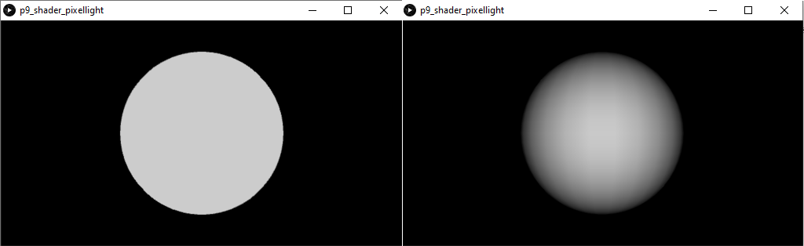
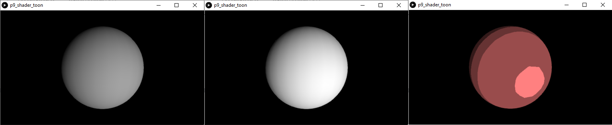
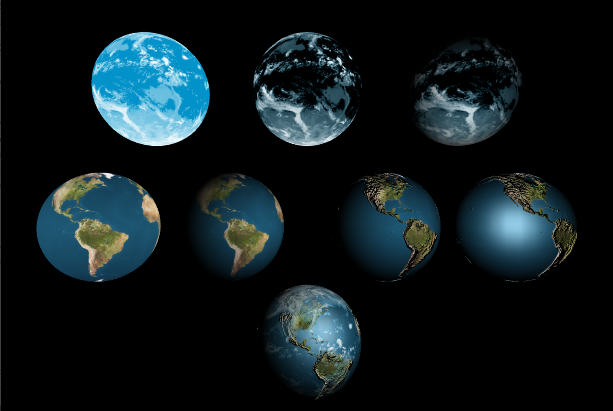

## Práctica 11. Introducción a los *shaders* en Processing (y II)

### Contenidos

[Sheders de vértices](#111-shaders-de-vértices)  
[Transparencias y perturbaciones](#112-transparencias-y-pertuirbaciones)  
[Galería](#113-galería)  
[Tarea](#114-tarea)  


### 11.1 Shaders de vértices

En la práctica previa, el discurso se centraba en el *shader* de fragmentos, cuyo objetivo es básicamente obtener el color (y profundidad) del fragmento/píxel entre manos, almacenando el mencionado color en la variable *built-in* *gl_FragColor*. Otras variables de salida son opcionales, mientras que la variable *gl_FragCoord* es de sólo lectura.


Al igual que en los *shaders* de fragmentos, se cuenta con variables *uniform* que tendrán el mismo valor para todos los vértices de la escena. Las matrices de proyección y transformación son dos de dichas variables, al afectar de igual forma a todos los vértices, como también ocurre con los parámetros de iluminación (posición y color).
Sin embargo existen otras variables que cambian para cada vértice, y se denominan *attribute*, entre las que se distinguen las definidas (*defined*) y las genéricas ()*generic*). Entre las primeras nombrar las normales, corrdenadas de texturas, color, etc, (definidas al crear la forma) mientras que entre las segundas son valores definidos para mallas como tangentes, propiedades de partículas, información de esqueleto (*bones*), etc. como por ejemplo la posición, color y normal del vértice. Para acceder a estas variables desde el *shader* de vértices, debe declararse como *attribute*.  
Por último, existen las variables *varying* que permiten el paso de información entre ambos *shaders*, y que veremos en los siguientes ejemplos que se utilizan para pasar información desde el *shader* de vértices, al de fragmentos. En el ejemplo del listado~\ref{code:processing-glsl-toonshade}, se pasan las variables  *varying* denominadas %*vertColo*,
*vertNormal* y *vertLightDi* para realizar el cálculo de iluminación por píxel en lugar de por vértice, que es el establecido por defecto.

Ejemplos habituales de variables *varying* , además de las dos mencionadas, son las de color del vértice *vertNorm_al*, y las coordenadas de texturas, que son atributos de los vértices. En concreto las  coordenadas de textura fueron utilizadas en los últimos ejemplos del capítulos previo.


### 11.1.1 Ejemplos básicos


Los ejemplos del capítulo previo no se define en ningún caso el *shader* de vértices, por lo que Processing toma el *shader* por defecto. Como primer ejemplo, el siguiente listado dibuja una esfera con el color asignado con el comando *fill* pero al hacer clic, aplica un modelo simple de iluminación, definido con los *shader*, basado en el producto escalar entre la normal del vértice y el vector hacia la luz.

**Processing** [p9_shader_pixellight](https://github.com/otsedom/CIU/tree/master/P9/p9_shader_pixellight)
```
void setup() {
  size(640, 360, P3D);
  noStroke();
  fill(204);
  sh = loadShader("lightfrag.glsl", "lightvert.glsl");
}

void draw() {
  if (mousePressed)
      shader(sh);
  else
      resetShader();

  //Dibuja esfera sin iluminación aplicada
  background(0);
  float dirY = (mouseY / float(height) - 0.5) * 2;
  float dirX = (mouseX / float(width) - 0.5) * 2;
  translate(width/2, height/2);
  sphere(120);
}  
```

<!---
%[*Shader* de fragmentos y vértices para una iluminación simple por píxel, adaptado desde el ejemplo 6.1 del tutorial]{*shader* de fragmentos y vértices para una iluminación simple por píxel, adaptado desde el ejemplo 6.1 del [tutorial](https://processing.org/tutorials/pshader/})
--->

En el *setup* se observa que cada llamada a *loadShadeer* que por primera vez, hace referencia a dos archivos, en primer lugar el *shader* de fragmentos, y en segundo lugar el de vértices. El código del *shader* de fragmentos es mínimo, simplemente asigna a la variable *gl_FragColor* el valor de la variable *varying* recibida desde el *shader* de vértices. Este último, tras asignar valor a la requerida variable *gl_Position*, realiza una serie de cálculos, para obtener el producto escalar del vector que une el vértice con la fuente de luz, y la normal del vértice. Para ello, previamente tanto la posición del vértice como su normal deben ser transformadas al sistema de referencia del observador haciendo uso de diversas variable de tipo *uniform* que contienen la información de vista, transformación y posición de la luz.

**GLSL**
```
lightvert.glsl:
uniform mat4 modelview;
uniform mat4 transform;
uniform mat3 normalMatrix;

//Posición de la fuente de luz
uniform vec4 lightPosition;

//Particulares de cada vértice
attribute vec4 position;
attribute vec4 color;
attribute vec3 normal;

//Valor pasado al shader de fragmentos
varying vec4 vertColor;

void main() {
  //Porisión del vértice tras transformar y proyectar
  gl_Position = transform * position;

  //Posición del vértice en coordenadas del ojo
  vec3 ecPosition = vec3(modelview * position);
  //Normal del vértice en coordenadas del ojo
  vec3 ecNormal = normalize(normalMatrix * normal);
  //Vector hacia la luz normalizado
  vec3 direction = normalize(lightPosition.xyz - ecPosition);
  //Producto escalar normal por verctor hacia la luz
  float intensity = max(0.0, dot(direction, ecNormal));
  //Establece el color del vértice
  vertColor = vec4(intensity, intensity, intensity, 1) * color;
}

lightfrag.glsl:
#ifdef GL_ES
precision mediump float;
precision mediump int;
#endif

varying vec4 vertColor;

void main() {
  //Asigna al fragmento/píxel el color recebido desde el shader de vértices
  gl_FragColor = vertColor;
}
```

  
 *Resultado de la ejecución*

Para mostrar algunas pinceladas adicionales sobre las posibilidades del *shader* de vértices, en esta sección se incluye el ejemplo *File->Examples->Topics->Shaders->ToonShader*, cuyo código adaptado se muestra a continuación, que incluye tres modos de iluminación diferentes para una escena similar, con una esfera, si bien ahora cuenta con una luz direccional asociada al puntero. El modo de visualización, sin *shader* o con las dos variantes,  se cambia haciendo clic con el ratón.

**Processing** [p9_shader_toon](https://github.com/otsedom/CIU/tree/master/P9/p9_shader_toon)
```
/**
 * Adaptado desde el ejemplo incluido en Processing Toon Shading.
 *
  */
PShader toon1, toon2;
int modo = 0,modomax = 2;  

void setup() {
  size(640, 360, P3D);
  noStroke();
  fill(204);
  toon2 = loadShader("ToonFrag.glsl", "ToonVert.glsl");
  toon1 = loadShader("ToonFrag1.glsl", "ToonVert.glsl");
}

void draw() {
  if (modo == 1) {
    shader(toon1);
  }
    else{
      if (modo == 2) {
      shader(toon2);
    }
  }

  //Dibuja esfera
  noStroke();
  background(0);
  float dirY = (mouseY / float(height) - 0.5) * 2;
  float dirX = (mouseX / float(width) - 0.5) * 2;
  directionalLight(204, 204, 204, -dirX, -dirY, -1);
  translate(width/2, height/2);
  sphere(120);
}  

void mousePressed() {
  //Si había un shader activo, lo resetea
  if (modo>0) resetShader();

  modo++;
  if (modo > modomax) modo = 0;
}
```


Como en el ejemplo previo, en el *setup* se incluyen las llamadas a  *loadShader*, siendo dos en este caso, dado que además del modo por defecto, se muestran otros dos modos de iluminación, variando entre ellos únicamente el *shader* de fragmentos, ver listados a continuación. El *shader* de vértices es idéntico en ambos casos.

**Processing** *ToonFrag.glsl*
```
#ifdef GL_ES
precision mediump float;
precision mediump int;
#endif

varying vec3 vertNormal;
varying vec3 vertLightDir;

void main() {  
  float intensity;
  vec4 color;
  // Producto escalar normal y vector hacia la fuente de luz
  intensity = max(0.0, dot(vertLightDir, vertNormal));

  // Cuatro tonos posibles de iluminación
  if (intensity > 0.95) {
    color = vec4(1.0, 0.5, 0.5, 1.0);
  } else if (intensity > 0.5) {
    color = vec4(0.6, 0.3, 0.3, 1.0);
  } else if (intensity > 0.25) {
    color = vec4(0.4, 0.2, 0.2, 1.0);
  } else {
    color = vec4(0.2, 0.1, 0.1, 1.0);
  }

  gl_FragColor = color;
}
```

**Processing** *ToonFrag1.glsl*
```
#ifdef GL_ES
precision mediump float;
precision mediump int;
#endif

varying vec3 vertNormal;
varying vec3 vertLightDir;

void main() {  
  float intensity;
  // Producto escalar normal y vector hacia la fuente de luz
  intensity = max(0.0, dot(vertLightDir, vertNormal));


  // Color con únicamente reflexión difusa
  gl_FragColor = vec4(vec3(intensity),1.);    
}
```
Al observar en detalle los *shader*, en este caso el *shader* de vértices se limita a proporcionar la información de la normal y el vector hacia la luz, a través de las variables *varying* *vertNorm_al* y *vertLightDi*, delegando al *shader* de fragmentos el cálculo de la intensidad. En el caso de *ToonFrag1.glsl* el valor asignado depende del ángulo entre ambos vectores, siendo un resultado de franjas en el caso del *shader* de fragmentos *ToonFrag*.


<!---
%en el de fragmentos aparece la variable ya conocida *gl_FragColor*, que almacena la información del color de cada fragmento. En el de vértices está la variable reservada *gl_Position*  que contiene la posición homogénea del vértice. Por otro lado, existen dos variables de tipo *varying* compartidas entre ambos *shader*: *vertNorm_al* y *vertLightDi* que permiten pasar desde el *shader* de vértices la normal y vector hacia la luz del vértice. Básicamente el *shader* de vértices las pasa al de fragmentos que realiza el cálculo del nuevo color a asignar al píxel. Se presentan dos variantes del *shader* de fragmentos para mostrar dos posible usos de la información recibida. Para cambiar entre ellas debe hacerse clic con el ratón. --->


**GLSL** *ToonVert.glsl*
```
// Toon shader using per-pixel lighting. Based on the glsl
// tutorial from lighthouse 3D:
// http://www.lighthouse3d.com/tutorials/glsl-tutorial/toon-shader-version-ii/

#define PROCESSING_LIGHT_SHADER

uniform mat4 modelview;
uniform mat4 transform;
uniform mat3 normalMatrix;

uniform vec3 lightNormal[8];

attribute vec4 vertex;
attribute vec3 normal;

varying vec3 vertNormal;
varying vec3 vertLightDir;

void main() {
  // Vertex in clip coordinates
  gl_Position = transform * vertex;

  // Normal vector in eye coordinates is passed
  // to the fragment shader
  vertNormal = normalize(normalMatrix * normal);

  // Assuming that there is only one directional light.
  // Its normal vector is passed to the fragment shader
  // in order to perform per-pixel lighting calculation.  
  vertLightDir = -lightNormal[0];
}
```

  
 *Resultado de la ejecución*


### 11.1.2 Tipologías de *shader*

En la práctica previa se mencionan los cuatro tipos de *shaders* presentes en Processing para la clase *TRIANGLE*: Color, iluminación, textura e iluminación con textura. En esta sección se ilustran en un único ejemplo que combina y adapta varias propuestas del tutorial de  [Andrés Colubri](https://codeanticode.github.io/curso-shaders/) cubriendo ejemplos básicos de cada uno de los cuatro tipos.


Recuperando el código básico para dibujar una esfera, si bien en este caso haciendo uso de la estructura *PShape* para poder asociar una textura a la forma, se presenta en el siguiente listado:

**Processing** [p9_shader_reel](https://github.com/otsedom/CIU/tree/master/P9/p9_shader_reel)
```
PShape obj;
float ang;
PShader sh[];
PImage img;
int modo = 0,modomax = 8;  

void setup() {
  size(640, 360, P3D);
  img = loadImage("logoulpgc.png");

  sh = new PShader[8];   
  sh[0] = loadShader("FragBasic.glsl", "ColorVert.glsl");
  sh[1] = loadShader("ColorFrag.glsl", "ColorVert.glsl");
  //Con textura
  sh[2] = loadShader("TexFragBasic.glsl", "TexVert.glsl");
  //Con la textura pixelada
  sh[3] = loadShader("TexFrag1.glsl", "TexVert.glsl");
  //Por vértice, sólo recibe el color
  sh[4] = loadShader("FragBasic.glsl", "LightVert0.glsl");
  //Por píxel, recibe color, normal y luz
  sh[5] = loadShader("LightFrag1.glsl", "LightVert1.glsl");
  //Sólo color y tetxura
  sh[6] = loadShader("TexFragBasic.glsl", "TexLightVert0.glsl");
  //Color, textura, normal y luz
  sh[7] = loadShader("TexLightFrag1.glsl", "TexLightVert1.glsl");
  textureMode(NORMAL);
  beginShape();
  obj = createShape(SPHERE, 120);
  obj.setTexture(img);
  obj.setStroke(255); //Aristas con color de la esfera
}
endShape();

void draw() {
  background(0);

  shader(sh[modo]);
  sh[modo].set("u_time", float(millis())/float(1000));  

  //Dibuja esfera
  pushMatrix();
  pointLight(255, 255, 255, width/2, height/2, 200);
  translate(width/2, height/2);
  rotateY(ang);
  shape(obj);
  ang += 0.01;
  popMatrix();

  resetShader();
  fill(255);
  textSize(20);
  text("Modo " + modo, 10, 30);

}
void mousePressed() {
  resetShader();  
  modo++;
  if (modo >= modomax) modo = 0;
}
```

El código crea una lista *shader* que se cargan en el *setup*, activando uno en concreto a través del clic de ratón. La lista contiene ocho combinaciones de *shader* de vértices y fragmentos.

En primer término, se muestran las combinaciones de propuestas de *shader* de color (sin textura ni luces). Un ejemplo mínimo con ambos *shaders*:

**GLSL** *FragBasic.glsl* y *ColorVert.glsl*
```
ColorVert.glsl:

uniform mat4 transform;

attribute vec4 position;
attribute vec4 color;

varying vec4 vertColor;

void main() {
  gl_Position = transform * position;
  vertColor = color;
}

FragBasic.glsl:

#ifdef GL_ES
precision mediump float;
precision mediump int;
#endif

varying vec4 vertColor;

void main() {
  // Copia color recibido del shader de vértices
  gl_FragColor = vertColor;
}
```

El *shader* de vértices calcula dos valores, posición y color de entrada, que recoge el *shader* de fragmentos sin realizar modificación alguna. La posición se calcula tras multiplicar por la única variable  *uniform*, la matriz *4x4*  *transform*, que combina las matrices de proyección y modelo. El producto por la coordenadas del mundo proporciona las coordenadas transformadas y proyectadas. Pese a que el código Processing, la forma tiene una textura asignada, no se muestra, dado que Processing detecta que el *shader* es de color (sin texturas ni luces).

En la segunda variante, se hace uso de un *shader* de fragmentos modificado, que hace uso de la información del tiempo transcurrido en ejecución, enviada desde *draw* con la función *set*, con el *shader* de fragmentos del listado a continuación, variamos el color del objeto como ya hemos visto en secciones anteriores desde el *shader* de fragmentos.

**GLSL** *ColorFrag.glsl*
```
#ifdef GL_ES
precision mediump float;
precision mediump int;
#endif

uniform float u_time;

varying vec4 vertColor;

void main() {
  if (sign(sin(u_time*10.)) == 1)
    // Copia color del objeto
    gl_FragColor = vertColor;
  else
    // Invierte el color
    gl_FragColor = vec4(vec3(1) - vertColor.xyz, 1);
}
```

En la tercera variante se  adopta un ejemplo mínimo de *shader* de textura (sin luces) mostrado en el listado, cuyo *shader* de fragmentos se limita a utilizar el color recibido desde la variable *varying*.

**GLSL** *TexVert.glsl* y *TexFragBasic.glsl*
```
TexVert.glsl:

uniform mat4 transform;
uniform mat4 texMatrix;

attribute vec4 position;
attribute vec4 color;
attribute vec2 texCoord;

varying vec4 vertColor;
varying vec4 vertTexCoord;

void main() {
  gl_Position = transform * position;

  vertColor = color;
  vertTexCoord = texMatrix * vec4(texCoord, 1.0, 1.0);
}

TexFragBasic.glsl:

#ifdef GL_ES
precision mediump float;
precision mediump int;
#endif

uniform sampler2D texture;

varying vec4 vertColor;
varying vec4 vertTexCoord;

void main() {
  gl_FragColor = texture2D(texture, vertTexCoord.st) * vertColor;
}
```


La novedad es la variable *uniform*
 *texMatrix* que transforma convenientemente (escala e invierte de la coordenada *y) la textura para cada vértice. El *shader* de fragmentos incluye el puntero a la imagen de la textura remitida desde Processing.

En la cuarta variante, también de tetxura, se obtiene un efecto de pixelado sobre la texturamodificando el *shader* de fragmentos:

**GLSL** *TexFrag1.glsl*
```
TexFrag1.glsl

#ifdef GL_ES
precision mediump float;
precision mediump int;
#endif

uniform sampler2D texture;

varying vec4 vertColor;
varying vec4 vertTexCoord;

void main() {
  // Efecto de pixelado en la textura
  int si = int(vertTexCoord.s * 50.0);
  int sj = int(vertTexCoord.t * 50.0);
  gl_FragColor = texture2D(texture, vec2(float(si) / 50.0, float(sj) / 50.0)) * vertColor;
}
```

La quinta variante hace uso del *shader* con la información de las luces, que va a permitir especificar tu propio algoritmo de reproducción (*rendering*). Un modelo sencillo se muestra en el listado a continuación, cuyo *shader* se basa en el ángulo entre la normal del vértice y la luz. Todo ello calculado enel *shader* de vértices, y remitido al *shader* de fragmentos, que se limita a copiar el color. <!--- % *ecPosition* tiene las posición del vértice en coordenadas de los ojos. --->

**GLSL** *LightVert0.glsl* y *FragBasic.glsl*
```
LightVert0.glsl:

uniform mat4 modelview;
uniform mat4 transform;
uniform mat3 normalMatrix;

uniform vec4 lightPosition;

attribute vec4 position;
attribute vec4 color;
attribute vec3 normal;

varying vec4 vertColor;

void main() {
  gl_Position = transform * position;
  vec3 ecPosition = vec3(modelview * position);
  vec3 ecNormal = normalize(normalMatrix * normal);

  vec3 direction = normalize(lightPosition.xyz - ecPosition);
  float intensity = max(0.0, dot(direction, ecNormal));
  vertColor = vec4(intensity, intensity, intensity, 1) * color;
}

FgagBasic.glsl:

#ifdef GL_ES
precision mediump float;
precision mediump int;
#endif

varying vec4 vertColor;

void main() {
  gl_FragColor = vertColor;
}
```

Es un ejemplo con un única fuente de luz, si bien Processing admite pasar información de hasta ocho fuentes con sus respectivos parámetros.

La quinta variante interpola el color, en la sexta los *shaders* llevan  a cabo una interpolación de la normal, con la consiguiente mejora visual del resultado.

**GLSL** *LightVert1.glsl* y *LightFrag1.glsl*
```
LightVert1.glsl:

uniform mat4 modelview;
uniform mat4 transform;
uniform mat3 normalMatrix;

uniform vec4 lightPosition;
uniform vec3 lightNormal;

attribute vec4 position;
attribute vec4 color;
attribute vec3 normal;

varying vec4 vertColor;
varying vec3 ecNormal;
varying vec3 lightDir;

void main() {
  gl_Position = transform * position;
  vec3 ecPosition = vec3(modelview * position);

  ecNormal = normalize(normalMatrix * normal);
  lightDir = normalize(lightPosition.xyz - ecPosition);
  vertColor = color;
}

LightFrag1.glsl:

#ifdef GL_ES
precision mediump float;
precision mediump int;
#endif

varying vec4 vertColor;
varying vec3 ecNormal;
varying vec3 lightDir;

void main() {
  //Obtiene intensidad con los datos recibidos desde el shader de vértices
  vec3 direction = normalize(lightDir);
  vec3 normal = normalize(ecNormal);
  float intensity = max(0.0, dot(direction, normal));
  gl_FragColor = vec4(intensity, intensity, intensity, 1) * vertColor;
}
```

En las dos últimas variantes, se muestran sendos ejemplos  de *shader* en Processing combinando luz y textura. En la séptima se utiliza el mismo *shader* de fragmentos que la tercera variante con textura simpe, si bien en esta ocasión, el *shader* de vértices combina textura e iluminación.

**GLSL** *TexLightVert0.glsl* y *TexLightFrag0.glsl*
```
TexLightVert0.glsl:

uniform mat4 modelview;
uniform mat4 transform;
uniform mat3 normalMatrix;
uniform mat4 texMatrix;

uniform vec4 lightPosition;

attribute vec4 position;
attribute vec4 color;
attribute vec3 normal;
attribute vec2 texCoord;

varying vec4 vertColor;
varying vec4 vertTexCoord;

void main() {
  gl_Position = transform * position;
  vec3 ecPosition = vec3(modelview * position);
  vec3 ecNormal = normalize(normalMatrix * normal);

  vec3 direction = normalize(lightPosition.xyz - ecPosition);
  float intensity = max(0.0, dot(direction, ecNormal));
  vertColor = vec4(intensity, intensity, intensity, 1) * color;

  vertTexCoord = texMatrix * vec4(texCoord, 1.0, 1.0);
}
TexFRagBasic.glsl:

#ifdef GL_ES
precision mediump float;
precision mediump int;
#endif

uniform sampler2D texture;

varying vec4 vertColor;
varying vec4 vertTexCoord;

void main() {
  gl_FragColor = texture2D(texture, vertTexCoord.st) * vertColor;
}
```

Por último, la octava variante cede al *shader* de fragmentos el cálculo de la iluminación, obteniendo un resultado más suave, al realizar el cálculo por píxel en lugar de por vértice.

**GLSL** *TexLightVert1.glsl* y *TexLightFrag1.glsl*
```
TexLightVert1.glsl:
uniform mat4 modelview;
uniform mat4 transform;
uniform mat3 normalMatrix;
uniform mat4 texMatrix;

uniform vec4 lightPosition;

attribute vec4 position;
attribute vec4 color;
attribute vec3 normal;
attribute vec2 texCoord;

varying vec4 vertColor;
varying vec3 ecNormal;
varying vec3 lightDir;
varying vec4 vertTexCoord;

void main() {
  gl_Position = transform * position;
  vec3 ecPosition = vec3(modelview * position);

  ecNormal = normalize(normalMatrix * normal);
  lightDir = normalize(lightPosition.xyz - ecPosition);
  vertColor = color;

  vertTexCoord = texMatrix * vec4(texCoord, 1.0, 1.0);
}
TexLightFrag1.glsl:

#ifdef GL_ES
precision mediump float;
precision mediump int;
#endif

uniform sampler2D texture;

varying vec4 vertColor;
varying vec3 ecNormal;
varying vec3 lightDir;
varying vec4 vertTexCoord;

void main() {
  vec3 direction = normalize(lightDir);
  vec3 normal = normalize(ecNormal);
  float intensity = max(0.0, dot(direction, normal));
  vec4 tintColor = vec4(intensity, intensity, intensity, 1) * vertColor;
  gl_FragColor = texture2D(texture, vertTexCoord.st) * tintColor;
}
```

<!---
%Shaders Gouraud y Phong
%https://forums.khronos.org/showthread.php/79565


%http://www.opengl-tutorial.org/es/beginners-tutorials/tutorial-8-basic-shading/ --->

### 11.2 Transparencias y perturbaciones


Como cierre, esta sección parte de el ejemplo *BlueMarble*, que resulta visualmente atractivo, estando disponible a través de [codeanticode](https://github.com/codeanticode/pshader-experiments). También puede ser de interés este [tutorial](http://learningthreejs.com/blog/2013/09/16/how-to-make-the-earth-in-webgl/). El código original muestra el planeta Tierra con una capa de nubes que se desplaza. La adaptación presentada en esta sección descompone los distintos elementos que dan pie al resultado final. El código Processing:

**Processing** [p9_shader_BlueMarble_CIU](https://github.com/otsedom/CIU/tree/master/P9/p9_shader_BlueMarble_CIU)
```
// Adapted from https://github.com/codeanticode/pshader-experiments/tree/master/BlueMarble

PShape earth;
PShape clouds;
PImage earthTex;
PImage cloudTex;
PImage alphaTex;
PImage bumpMap;
PImage specMap;
PShader earthShader,earthShader0,earthShader1,earthShader2;
PShader cloudShader0,cloudShader1,cloudShader;

float earthRotation;
float cloudsRotation;

void setup() {  
  size(1600, 1200, P3D);

  earthTex = loadImage("earthmap1k.jpg");
  cloudTex = loadImage("earthcloudmap.jpg");
  alphaTex = loadImage("earthcloudmaptrans.jpg");

  bumpMap = loadImage("earthbump1k.jpg");
  specMap = loadImage("earthspec1k.jpg");

  //Shader completo
  earthShader = loadShader("EarthFrag.glsl", "EarthVert.glsl");
  earthShader.set("texMap", earthTex);
  earthShader.set("bumpMap", bumpMap);
  earthShader.set("specularMap", specMap);
  earthShader.set("bumpScale", 0.05);
  //Con simplificaciones
  earthShader0 = loadShader("EarthFrag0.glsl", "EarthVert.glsl");
  earthShader0.set("texMap", earthTex);
  earthShader0.set("bumpMap", bumpMap);
  earthShader0.set("specularMap", specMap);
  earthShader0.set("bumpScale", 0.05);
  earthShader1 = loadShader("EarthFrag1.glsl", "EarthVert.glsl");
  earthShader1.set("texMap", earthTex);
  earthShader1.set("bumpMap", bumpMap);
  earthShader1.set("specularMap", specMap);
  earthShader1.set("bumpScale", 0.05);
  earthShader2 = loadShader("EarthFrag2.glsl", "EarthVert.glsl");
  earthShader2.set("texMap", earthTex);
  earthShader2.set("bumpMap", bumpMap);
  earthShader2.set("specularMap", specMap);
  earthShader2.set("bumpScale", 0.05);  

  //Shader completo
  cloudShader = loadShader("CloudFrag.glsl", "CloudVert.glsl");
  cloudShader.set("texMap", cloudTex);
  cloudShader.set("alphaMap", alphaTex);
  //Co simplificaciones
  cloudShader0 = loadShader("CloudFrag0.glsl", "CloudVert.glsl");
  cloudShader0.set("texMap", cloudTex);
  cloudShader0.set("alphaMap", alphaTex);
  cloudShader1 = loadShader("CloudFrag1.glsl", "CloudVert.glsl");
  cloudShader1.set("texMap", cloudTex);
  cloudShader1.set("alphaMap", alphaTex);

  earth = createShape(SPHERE, 140);
  earth.setStroke(false);
  earth.setSpecular(color(125));
  earth.setShininess(10);

  clouds = createShape(SPHERE, 141);
  clouds.setStroke(false);  
}

void draw() {
  background(0);

  translate(width/2, height/2);

  pointLight(255, 255, 255, 300, 0, 500);  

  float targetAngle = map(mouseX, 0, width, 0, TWO_PI);  
  earthRotation += 0.05 * (targetAngle - earthRotation);

  shader(earthShader0);
  pushMatrix();
  translate(-width/3, height/15);
  rotateY(earthRotation);
  shape(earth);
  popMatrix();

  shader(earthShader1);
  pushMatrix();
  translate(-width/8, height/15);
  rotateY(earthRotation);
  shape(earth);
  popMatrix();

  shader(earthShader2);
  pushMatrix();
  translate(width/8, height/15);
  rotateY(earthRotation);
  shape(earth);
  popMatrix();

  shader(earthShader);
  pushMatrix();
  translate(width/3, height/15);
  rotateY(earthRotation);
  shape(earth);
  popMatrix();

  //Clouds
  shader(cloudShader0);
  pushMatrix();
  translate(-width/4, -height/4);
  rotateY(earthRotation + cloudsRotation);
  shape(clouds);
  popMatrix();

  shader(cloudShader1);
  pushMatrix();
  translate(0, -height/4);
  rotateY(earthRotation + cloudsRotation);
  shape(clouds);
  popMatrix();

  shader(cloudShader);
  pushMatrix();
  translate(width/4, -height/4);
  rotateY(earthRotation + cloudsRotation);
  shape(clouds);
  popMatrix();

  shader(earthShader);
  pushMatrix();
  translate(0, height/3);
  rotateY(earthRotation);
  shape(earth);
  popMatrix();

  shader(cloudShader);
  pushMatrix();
  translate(0, height/3);
  rotateY(earthRotation + cloudsRotation);
  shape(clouds);
  popMatrix();

  cloudsRotation += 0.001;
}
```

El código original, se basa en dibujar dos esferas, a las que aplica texturas, con distintos *shaders*. Con el objetivo de descomponer, y aclarar el comportamiento, los respectivos *shaders* originales,  se han simplificado, para permitir observar su influencia de forma incremental. Al ejecutar la aplicación, se presentan tres filas, en la primera se muestra la capa de nubes reproducida con tres modos distintos, en la segunda el planeta con cuatro modos, y en la tercera la combinación de los modos más elaborados de ambas. En todas ellas, los cambios se introducen únicamente en el *shader* de fragmentos, que decide la información a combinar de cara a la reproducción.


**GLSL** *CloudFrag0.glsl* y *CloudFrag1.glsl*
```
CloudFrag0.glsl

uniform sampler2D texMap;
uniform sampler2D alphaMap;

varying vec3 ecNormal;
varying vec4 vertColor;
varying vec4 vertTexCoord;
varying vec3 lightDir;

void main() {  
  vec2 st = vertTexCoord.st;
  //Sin aplicar canal alpha
  vec4 texColor = vec4(texture2D(texMap, st).rgb, 1.0);
  //Combina textura y color
  vec4 diffuseColor = texColor * vertColor;

  gl_FragColor = diffuseColor;
}

CloudFrag1.glsl

uniform sampler2D texMap;
uniform sampler2D alphaMap;

varying vec3 ecNormal;
varying vec4 vertColor;
varying vec4 vertTexCoord;
varying vec3 lightDir;

void main() {  
  vec2 st = vertTexCoord.st;
  //Aplica canal alpha, pero no iluminación
  vec4 texColor = vec4(texture2D(texMap, st).rgb, 1.0 - texture2D(alphaMap, st).r);
  //Combina textura y color
  vec4 diffuseColor = texColor * vertColor;

  gl_FragColor = diffuseColor;
}
```

El *shader* aplicado al mapa de nubes completo, utiliza dos texturas, definiendo una de ellas el mapa de transparencias que permitirán ver el planeta. Los ejemplos simplificados, no aplican el mapa de transparencias, o la iluminación.

**GLSL** *EarthFrag0.glsl*, *EarthFrag1.glsl* y *EarthFrag2.glsl*
```
EarthFRag0.glsl

uniform sampler2D texMap;
uniform sampler2D bumpMap;
uniform sampler2D specularMap;

uniform float bumpScale;

varying vec3 ecPosition;
varying vec3 ecNormal;
varying vec4 vertColor;
varying vec4 vertTexCoord;
varying vec4 vertSpecular;
varying float vertShininess;
varying vec3 lightDir;

void main() {  
  vec2 st = vertTexCoord.st;
  vec4 texColor = texture2D(texMap, st);

  gl_FragColor = texColor; //Textura de entrada  
}

EarthFrag1.glsl

uniform sampler2D texMap;
uniform sampler2D bumpMap;
uniform sampler2D specularMap;

uniform float bumpScale;

varying vec3 ecPosition;
varying vec3 ecNormal;
varying vec4 vertColor;
varying vec4 vertTexCoord;
varying vec4 vertSpecular;
varying float vertShininess;
varying vec3 lightDir;

void main() {  
  vec2 st = vertTexCoord.st;
  vec4 texColor = texture2D(texMap, st);

  //Diffuse
  vec3 direction = normalize(lightDir);
  float intensity = max(0.0, dot(direction, ecNormal));  
  vec4 diffuseColor = texColor * vec4(vec3(intensity), 1) * vertColor;

  gl_FragColor = diffuseColor; //Textura de entrada y color sin perturbar la normal
}

EarthFrag2.glsl

uniform sampler2D texMap;
uniform sampler2D bumpMap;
uniform sampler2D specularMap;

uniform float bumpScale;

varying vec3 ecPosition;
varying vec3 ecNormal;
varying vec4 vertColor;
varying vec4 vertTexCoord;
varying vec4 vertSpecular;
varying float vertShininess;
varying vec3 lightDir;

// Bump mapping adapted from THREE.js:
// Derivative maps - bump mapping unparametrized surfaces by Morten Mikkelsen
// http://mmikkelsen3d.blogspot.sk/2011/07/derivative-maps.html
// Evaluate the derivative of the height w.r.t. screen-space using forward differencing (listing 2)
vec2 dHdxy_fwd(vec2 vUv) {
  vec2 dSTdx = dFdx(vUv);
  vec2 dSTdy = dFdy(vUv);

  float Hll = bumpScale * texture2D(bumpMap, vUv).x;
  float dBx = bumpScale * texture2D(bumpMap, vUv + dSTdx).x - Hll;
  float dBy = bumpScale * texture2D(bumpMap, vUv + dSTdy).x - Hll;

  return vec2(dBx, dBy);
}

vec3 perturbNormalArb(vec3 surf_pos, vec3 surf_norm, vec2 dHdxy) {
  vec3 vSigmaX = dFdx(surf_pos);
  vec3 vSigmaY = dFdy(surf_pos);
  vec3 vN = surf_norm;		// normalized

  vec3 R1 = cross(vSigmaY, vN);
  vec3 R2 = cross(vN, vSigmaX);

  float fDet = dot(vSigmaX, R1);

  vec3 vGrad = sign(fDet) * (dHdxy.x * R1 + dHdxy.y * R2);
  return normalize(abs(fDet) * surf_norm - vGrad);
}

void main() {  
  vec2 st = vertTexCoord.st;
  vec4 texColor = texture2D(texMap, st);

  //Diffuse
  vec3 normal = perturbNormalArb(normalize(ecPosition), ecNormal, dHdxy_fwd(st));  
  vec3 direction = normalize(lightDir);
  float intensity = max(0.0, dot(direction, normal));  
  vec4 diffuseColor = texColor * vec4(vec3(intensity), 1) * vertColor;

  gl_FragColor = diffuseColor; //Parte difusa con normal perturbada
}
```

Por otro lado, el *shader* aplicado sobre el planeta, además de la textura de superficie, cuenta con un mapa para modificar/perturbar la normal, y el efecto de iluminación especular. Los ejemplos simplificados evitan intergrar alugunos de dichos elementos.

**GLSL** *EarthFrag.glsl*, *EarthVert.glsl*,  *CloudFrag.glsl* y *CloudVert.glsl*
```
EarthFrag.glsl

uniform sampler2D texMap;
uniform sampler2D bumpMap;
uniform sampler2D specularMap;

uniform float bumpScale;

varying vec3 ecPosition;
varying vec3 ecNormal;
varying vec4 vertColor;
varying vec4 vertTexCoord;
varying vec4 vertSpecular;
varying float vertShininess;
varying vec3 lightDir;

// Bump mapping adapted from THREE.js:
// Derivative maps - bump mapping unparametrized surfaces by Morten Mikkelsen
// http://mmikkelsen3d.blogspot.sk/2011/07/derivative-maps.html
// Evaluate the derivative of the height w.r.t. screen-space using forward differencing (listing 2)
vec2 dHdxy_fwd(vec2 vUv) {
  vec2 dSTdx = dFdx(vUv);
  vec2 dSTdy = dFdy(vUv);

  float Hll = bumpScale * texture2D(bumpMap, vUv).x;
  float dBx = bumpScale * texture2D(bumpMap, vUv + dSTdx).x - Hll;
  float dBy = bumpScale * texture2D(bumpMap, vUv + dSTdy).x - Hll;

  return vec2(dBx, dBy);
}

vec3 perturbNormalArb(vec3 surf_pos, vec3 surf_norm, vec2 dHdxy) {
  vec3 vSigmaX = dFdx(surf_pos);
  vec3 vSigmaY = dFdy(surf_pos);
  vec3 vN = surf_norm;		// normalized

  vec3 R1 = cross(vSigmaY, vN);
  vec3 R2 = cross(vN, vSigmaX);

  float fDet = dot(vSigmaX, R1);

  vec3 vGrad = sign(fDet) * (dHdxy.x * R1 + dHdxy.y * R2);
  return normalize(abs(fDet) * surf_norm - vGrad);
}

float blinnPhongFactor(vec3 lightDir, vec3 vertPos, vec3 vecNormal, float shine) {
  vec3 np = normalize(vertPos);
  vec3 ldp = normalize(lightDir - np);
  return pow(max(0.0, dot(ldp, vecNormal)), shine);
}

void main() {  
  vec2 st = vertTexCoord.st;
  vec4 texColor = texture2D(texMap, st);

  //Diffuse
  vec3 normal = perturbNormalArb(normalize(ecPosition), ecNormal, dHdxy_fwd(st));  
  vec3 direction = normalize(lightDir);
  float intensity = max(0.0, dot(direction, normal));  
  vec4 diffuseColor = texColor * vec4(vec3(intensity), 1) * vertColor;

  //Specular
  float specularStrength = texture2D(specularMap, st).r;
  vec4 specularColor = specularStrength * blinnPhongFactor(lightDir, ecPosition, ecNormal, vertShininess) * vertSpecular;

  gl_FragColor = diffuseColor + vec4(specularColor.rgb, 0);
}

EarthVert.glsl

uniform mat4 modelviewMatrix;
uniform mat4 transformMatrix;
uniform mat3 normalMatrix;
uniform mat4 texMatrix;

uniform vec4 lightPosition;

attribute vec4 position;
attribute vec4 color;
attribute vec3 normal;
attribute vec2 texCoord;
attribute vec4 specular;
attribute float shininess;

varying vec3 ecPosition;
varying vec3 ecNormal;
varying vec4 vertColor;
varying vec4 vertTexCoord;
varying vec4 vertSpecular;
varying float vertShininess;

varying vec3 lightDir;

void main() {
  //Vértice en coordenadas transformadas
  gl_Position = transformMatrix * position;
  //Posición del vértice en coordenadas del ojo
  ecPosition = vec3(modelviewMatrix * position);  
  //Normal del vértice en coordenadas del ojo
  ecNormal = normalize(normalMatrix * normal);
  //Características de reflexión
  vertSpecular = specular;
  vertShininess = shininess;
  //Coordenada de textura
  vertTexCoord = texMatrix * vec4(texCoord, 1.0, 1.0);
  //Vector hacia la luz normalizado
  lightDir = normalize(lightPosition.xyz - ecPosition);  
  //Color del vértice
  vertColor = color;
}

CloudFrag.glsl
uniform sampler2D texMap;
uniform sampler2D alphaMap;

varying vec3 ecNormal;
varying vec4 vertColor;
varying vec4 vertTexCoord;
varying vec3 lightDir;

void main() {  
  vec2 st = vertTexCoord.st;
  //Una textutra, y canal alpha obtenido del otro mapa
  vec4 texColor = vec4(texture2D(texMap, st).rgb, 1.0 - texture2D(alphaMap, st).r);

  //Obtiene intensidad por píxel, utilizando normal y vector hacia la luz
  vec3 direction = normalize(lightDir);
  float intensity = max(0.0, dot(direction, ecNormal));  
  vec4 diffuseColor = texColor * vec4(vec3(intensity), 1) * vertColor;

  gl_FragColor = diffuseColor;
}

CloudVert.glsl

uniform mat4 modelviewMatrix;
uniform mat4 transformMatrix;
uniform mat3 normalMatrix;
uniform mat4 texMatrix;

uniform vec4 lightPosition;

attribute vec4 position;
attribute vec4 color;
attribute vec3 normal;
attribute vec2 texCoord;

varying vec3 ecNormal;
varying vec4 vertColor;
varying vec4 vertTexCoord;

varying vec3 lightDir;

void main() {
  //Vértice en coordenadas transformadas
  gl_Position = transformMatrix * position;  
  //Normal del vértice en coordenadas del ojo
  ecNormal = normalize(normalMatrix * normal);
  //Color del vértice
  vertColor = color;
  //Coordenada de textura
  vertTexCoord = texMatrix * vec4(texCoord, 1.0, 1.0);
  //Posición del vértice en coordenadas del ojo
  vec3 ecPosition = vec3(modelviewMatrix * position);
  //Vector hacia la luz normalizado
  lightDir = normalize(lightPosition.xyz - ecPosition);   
}
```

  
 *Resultado de la ejecución*


### 11.3 Recursos adicionales

Complementamops la lista de la práctica anterior con referencias a ejemplos, información y lugares de encuentro de la comunidad:

- [Processing shader examples (Gene Kogan)](https://github.com/blokatt/ProcessingStuff)

- [ProcessingStuff (Jan Vorisek)](https://github.com/genekogan/Processing-Shader-Examples)

- [Vertex Shader Art](https://www.vertexshaderart.com)

- [Geometry shaders in Processing](http://www.nachocossio.com/geometry-shaders-in-processing/)

<!---
%OTROS
%DomeProjection, Deform

%https://discourse.processing.org/t/vertex-shader-displacement/17415
%https://forum.processing.org/two/discussion/3909/vertex-of-shapes-in-shader
% --->

- Un ejemplo de utilización de shaders aportado por Gabriel
 [EveryOne is talking](https://youtu.be/EbfsPFbcBB4)


### 11.4 Tarea


Realizar una propuesta de prototipo que haga uso al menos de un *shader* de fragmentos y/o vértices, sugiriendo que cree un diseño generativo o realice algún procesamiento sobre imagen. Será aceptable la integración en cualquier práctica precedente.

La entrega se debe realizar a través del campus virtual, remitiendo un enlace a un proyecto github, cuyo README sirva de memoria, por lo que se espera que el README:

- identifique al autor,
- describa el trabajo realizado,
- argumente decisiones adoptadas para la solución propuesta,
- incluya referencias y herramientas utilizadas,
- muestre el resultado con un gif animado.
