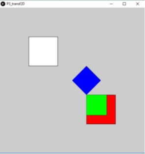
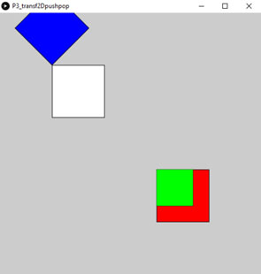
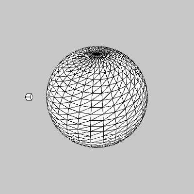

## Práctica 3. Transformaciones

### Contenidos

[Transformación básicas 2D](#31-transformaciones-básica-2d)  
[Concatenación de transformaciones](#32-concatenación-de-transformaciones)  
[Transformaciones básicas 3D](#33-transformaciones-básicas-3d-de-revolución)  
[Objetos de archivo](#34-objetos-de-archivo)  
[Texto e imágenes](35-texto-e-imágenes)  
[Tarea](#36-tarea)  
[Referencias](#referencias)

Desde esta práctica, la mayor parte de los listados de código Processing mostrados en el guion se proporcionan a través del
[enlace github](https://github.com/otsedom/CIU) para facilitar su reproducibilidad, en cuyo caso se indica en la cabecera del listado indicando el nombre del proyecto Processing.

### 3.1 Transformación básicas 2D

En la práctica precedente se ha descrito la utilización de las variables tipo *PShape* para la definición de objetos arbitrarios. A la hora de dibujar, tanto si hacemos uso de primitivas disponibles (2D o 3D) o modelos creados con variables *PShape*, es posible modificar su posición, tamaño y pose haciendo uso de las funciones proporcionadas por Processing para su transformación.
Son tres las transformaciones básicas disponibles:

- escalado,
- traslación
- y rotación

ya sean las rotaciones en 2D o 3D sobre cada uno de los tres eje principales, respectivamente los métodos: *scale*, *translate*, *rotate*, *rotateX*, *rotateY* y *rotateZ*.

El listado ilustrativo a continuación hace uso de transformaciones en 2D para dibujar varios recuadros. Observa sin embargo, que si bien la llamada a la función *rect* siempre usa los mismos argumentos de entrada, *(0,0,100,100)*, el resultado es claramente diferente, y no únicamente en el color, que se ha modificado de forma expresa para poder ilustrar el efecto sobre cada recuadro.

**Processing** [p3_transf2D](https://github.com/otsedom/CIU/tree/master/P3/P3_transf2D)
```
size(500,500,P2D);

translate(100,100);

//Recuadro sin transformar
rect(0,0,100,100);

//Recuadro trasladado rojo
fill(255,0,0);
translate(200,200);
rect(0,0,100,100);

//Recuadro trasladado y escalado verde
fill(0,255,0);
scale(0.7);
rect(0,0,100,100);


//Recuadro trasladado, escalado y rotado azul
fill(0,0,255);
rotate(radians(225));
rect(0,0,100,100);
```

  
*Resultado del código previo*

Si bien el método *translate* se ha utilizado en ejemplos previos, en este caso concreto se aplica en repetidas ocasiones, admitiendo dos o tres parámetros según si trabajamos con dos (P2D), como en este listado, o tres dimensiones (P3D).
El método *scale* realiza un escalado pudiendo tener de uno a tres argumentos, según si el escalado se realiza a todas las coordenadas por igual, o de foma diferenciada a *x* e *y* (P2D), o *x*, *y* y *z* (P3D).
Por último, la rotación con el método *rotate* indica el ángulo en radianes, pudiendo emplearse el método *radians* para facilitar expresarlo en grados.  

Es importante observar que las transformaciones se acumulan, es decir cada nueva primitiva dibujada se presenta tras realizar sobre ella todas las transformaciones previamente expresadas en el código. Sin embargo, existe la posibilidad de evitar, según nos convenga, dicho efecto de acumulación haciendo uso de  los métodos *pushMatrix* y *popMatrix* (*push* y *pop* en p5js coomo se ilustrará más adelante). Estos métodos aportan flexibiliad, permitiendo  trabajar con transformaciones de forma independiente para cada objeto o grupo de ellos.

Por un lado, *pushMatrix* conserva la matriz de coordenadas en dicho momento, con lo que no seguiría acumulando sobre ella las próximas transformaciones, mientras que *popMatrix* restablece la última matriz de transformación almacenada. El listado a continuación ilustra su utilización con un resultado diferente al ejemplo anterior al aplicar a los recuadros rojo y verde las transformaciones entre una pareja  *pushMatrix*-*popMatrix*. Abordaremos con mayor detalle sus particularidades más adelante dentro de este mismo guion de práctica.

**Processing** [p3_transf2Dpushpop](https://github.com/otsedom/CIU/tree/master/P3/P3_transf2Dpushpop)
```
size(500,500,P2D);

//Trasladamos todo
translate(100,100);

//Recuadro sin transformar
rect(0,0,100,100);

//Recuadro trasladado rojo
pushMatrix();
fill(255,0,0);
translate(200,200);
rect(0,0,100,100);

//Recuadro trasladado y escalado verde
fill(0,255,0);
scale(0.7);
rect(0,0,100,100);
popMatrix();

//Recuadro trasladado, escalado y rotado azul
fill(0,0,255);
rotate(radians(225));
rect(0,0,100,100);
```

  
*Resultado del código previo*

Con el objetivo de reforzar la comprensión de las matrices de transformación, las siguientes subsecciones dan más detalles sobre las transformaciones básicas.

### 3.1.1 Traslación

El efecto real de las funciones de transformación es la aplicación de una modificación de los ejes de coordenadas.


  
*Cuadrado antes y después trasladar ([fuente](https://processing.org/tutorials/transform2d))*


Conocida esta circunstancia, para dibujar un cuadrado colocado inicialmente en las coordenadas *(20,20)*, desplazado *60* unidades a la derecha y *80* unidades hacia abajo, existen dos posibilidades:

- Cambiar las coordenadas directamente en la llamada a *rect* mediante la suma a los puntos iniciales: *rect (20 + 60, 20 + 80, 40, 40)*, ilustrado en la figura anterior.
- Desplazando
el sistema de coordenadas con la función *translate*, manteniendo la misma llamada $rect (20, 20, 40, 40)$. Los ejes  antes y después de trasladarlos se  ilustran en la figura siguiente.

  
*Traslación del sistema de referencia ([fuente](https://processing.org/tutorials/transform2d))*

 En el segundo caso, el cuadrado no se mueve de su posición, su esquina superior izquierda se encuentra siempre en la posición *(20,20)*, por el contrario, el sistema de coordenadas se modifica. Se muestran ambas formas en el siguienet listado

 **Processing** [p3_rectequivalentes](https://github.com/otsedom/CIU/tree/master/P3/P3_rectequivalentes)
 ```
void setup()
{
  size(200, 200);
  background(255);
  noStroke();
  // Dibuja el primer objeto gris claro
  fill(192);
  rect(20, 20, 40, 40);
  // Dibuja otro desplazado rojo
  fill(255, 0, 0, 128);
  rect(20 + 60, 20 + 80, 40, 40);

  // El nuevo recuadro usa las mismas coordenadas que el primero pero antes se mueve el sistema de referencia
  fill(0, 0, 255, 128); //azul
  pushMatrix(); //Salva el sistema de coordenadas actual
  translate(60, 80);
  rect(20, 20, 40, 40);
  popMatrix(); //vuelve al sistema de coordenadas original
}
```

 Si bien para un ejemplo simple como el anterior, modificar el sistema de coordenadas puede parecer engorroso o excesivo, las transformaciones facilitan la operación al crecer el número de objetos y su reutilización. El código mostrado a continuación
 presenta dos variantes mostrando lo que significa dibujar una hilera de casas con ambos esquemas. Se utiliza un bucle que llama a la función *house()*, que recibe como parámetros la ubicación, *x* e *y*, de la esquina superior izquierda de cada casa. La segunda opción simplifica la especificación de las coordenadas para cada primitiva de transformación, al estar las tres desplazadas.

 **Processing** [p3_house](https://github.com/otsedom/CIU/tree/master/P3/P3_house)
 ```
  void setup()
{
  size(400, 400);
  background(255);
  for (int i = 10; i < 350; i = i + 50)
  {
    housev1(i, 20);
    //housev2(i, 20);
  }
}

// Variante sin push-popMatrix

void housev1(int x, int y)
{
  triangle(x + 15, y, x, y + 15, x + 30, y + 15);
  rect(x, y + 15, 30, 30);
  rect(x + 12, y + 30, 10, 15);
}

// Variante con push-popMatrix

void housev2(int x, int y)
{
  pushMatrix();
  translate(x, y);
  triangle(15, 0, 0, 15, 30, 15);
  rect(0, 15, 30, 30);
  rect(12, 30, 10, 15);
  popMatrix();
}
```

### 3.1.1 Rotaciones

Tal y como se menciona anteriormente, la rotación 2D se aplica con la función *rotate()*, requiriendo como argumento el número de radianes a rotar. Si un  círculo completo en grados son *360º*, en radianes se corresponde con *2π* como se ilustra en la figura

  
*Ángulos de rotación en grados (negro) y radianes (rojo)  ([fuente](https://processing.org/tutorials/transform2d))*

Recordar que la función *radians()* toma un número de grados como
 argumento y lo convierte a radianes, mientras que  la función *degrees()* convierte radianes a grados.
 A modo de ejemplo, el listado rota  un cuadrado *45* grados en sentido horario. Al no estar una de sus esquinas en el origen, el resultado de la rotación se ilustra en la figura posterior.

 **Processing** [p3_rectrotate](https://github.com/otsedom/CIU/tree/master/P3/P3_rectrotate)
 ```
void setup()
{
  size(200, 200);
  background(255);
  smooth();
  fill(192);
  noStroke();
  rect(40, 40, 40, 40);

  pushMatrix();
  rotate(radians(45));
  fill(0);
  rect(40, 40, 40, 40);
  popMatrix();
}
```

  
*Resultados de la rotación ([fuente](https://processing.org/tutorials/transform2d))*


Si el propósito es rotar el objeto alrededor de un punto específico, por ejemplo una esquina del recuadro o el centro del mismo, será necesario trasladar antes el sistema de coordenadas. A modo de ejemplo, el siguiente  realiza las acciones necesarias para rotar sobre la esquina superior izquierda, que serían las siguientes:

- Trasladar el origen del sistema de coordenadas de (0, 0) a  la esquina superior izquierda  del cuadrado
- Girar *π/4* radianes (*45º*)
- Dibujar el cuadrado

**Processing** [p3_rectrotatepivote](https://github.com/otsedom/CIU/tree/master/P3/P3_rectrotatepivote)
```
void setup()
{
  size(200, 200);
  background(255);
  smooth();
  fill(192);
  noStroke();
  rect(40, 40, 40, 40);

  pushMatrix();
  // mueve el origen al punto pivote
  translate(40, 40);

  // rota sobre ese punto pivote
  rotate(radians(45));

  // y dibuja el cuadrado
  fill(0);
  rect(0, 0, 40, 40);
  popMatrix(); //luego restablece los ejes
}
```

### 3.1.3 Escalado

Como última transformación básica, describimos el escalado. A modo de ilustración, el listado básicomodifica el aspecto que vemos del cuadrado.

**Processing**
```
void setup()
{
  size(200,200);
  background(255);

  stroke(128);
  rect(20, 20, 40, 40);

  stroke(0);
  pushMatrix();
  scale(2.0);
  rect(20, 20, 40, 40);
  popMatrix();
}
```

Si bien pudiera parecer que el cuadrado se ha movido, no ha ocurrido realmente. Su esquina superior izquierda permanece en la
posición *(20, 20)*. También se puede ver que las líneas son más gruesas. Eso no es una ilusión óptica, las líneas son
en realidad dos veces más gruesas, porque el sistema de coordenadas ha crecido al doble de su tamaño original.

### 3.2 Concatenación de transformaciones

Al realizar múltiples transformaciones, el orden es importante. No hay conmutatividad, una rotación seguida de una traslación y de un escalado no
dará el mismo resultado que una traslación seguida de una rotación y un escalado:

**Processing** [p3_rectconcatenados](https://github.com/otsedom/CIU/tree/master/P3/P3_rectconcatenados)
```
void setup()
{
  size(200, 200);
  background(255);
  smooth();
  line(0, 0, 200, 0); // dibuja bordes de la imagen
  line(0, 0, 0, 200);

  pushMatrix();
  fill(255, 0, 0); // cuadrado rojo
  rotate(radians(30));
  translate(70, 70);
  scale(2.0);
  rect(0, 0, 20, 20);
  popMatrix();

  pushMatrix();
  fill(255); // cuadrado blanco
  translate(70, 70);
  rotate(radians(30));
  scale(2.0);
  rect(0, 0, 20, 20);
  popMatrix();
}
```

Cada vez que haces una rotación, traslación, o escalado, la información necesaria para realizar la transformación se acumula en una matriz de transformación. Esta matriz contiene toda la información necesaria para hacer cualquier serie de transformaciones. Y esa es la razón por la que se usan las funciones *pushMatrix()* y *popMatrix()*, para poder obviarla, o deshacer fácilmente operaciones, si fuera necesario.

Estas dos funciones nos permiten manejar una pila de sistemas de referencia, *pushMatrix()* pone el estado actual del sistema de
coordenadas en la parte superior de dicha pila, mientras que *popMatrix()* extrae el último estado de dicha matriz almacenado en la pila.
El ejemplo anterior utiliza *pushMatrix()* y *popMatrix()* para asegurarse de que el sistema de coordenadas estaba *limpio* antes de cada parte del dibujo.

Mencionar que en Processing, el sistema de coordenadas se restaura a su estado original (de origen en la parte superior izquierda de la ventana, sin rotación ni escalado) cada vez que la función *draw()* se ejecuta. Si fuera necesario también es posible resetearla desde programa con la llamada a *resetMatrix*, e incluso mostrar la matriz actual con *printMatrix*.

### 3.3  Transformaciones básicas 3D

Las diferencias entre las transformaciones 2D y 3D no son excesivas, realmente para trabajar en tres dimensiones basta con pasar tres argumentos a las funciones de transformación, con la salvedad de que para las rotaciones haremos uso de las funciones *rotateX()*, *rotateY()*, o *rotateZ()*.

A modo de ejemplo, el listado a continuación hace uso de una primitiva 3D, la esfera, para mostrarla levemente rotada permitiendo observar su  *polo norte*.

**Processing** [p3_rectrotatepivote](https://github.com/otsedom/CIU/tree/master/P3/P3_rectrotatepivote)
```
\begin{lstlisting*[frame=single,caption={Dibujando una esfera levemente rotada (p3\_planeta)*,label=code:processing-planeta]
void setup()
{
  size(500,500,P3D);
  stroke(0);
}


void draw()
{
  background(200);

  //Esfera
  translate(width/2, height/2, 0);
  rotateX(radians(-45));
  sphere(100);
}
```


En el listado a continuación se  introduce movimiento, incorporando en el método *draw* una rotación sobre el eje *y* variable, que pudiera ilustrar la autorrotación *diaria* de un planeta.

**Processing** [p3_planetaR](https://github.com/otsedom/CIU/tree/master/P3/P3_planetaR)
```
float ang;

void setup()
{
  size(500,500,P3D);
  stroke(0);

  //Inicializa
  ang=0;
}


void draw()
{
  background(200);

  //Esfera
  translate(width/2, height/2, 0);
  rotateX(radians(-45));
  rotateY(radians(ang));
  sphere(100);

  //Resetea tras giro completo
  ang=ang+0.25;
  if (ang>360)
    ang=0;
}
```

  
*Planeta copn autorrotación*

Como añadido, el nuevo listado incluye además un *satélite* en órbita geoestacionaria:

**Processing** [p3_planetaRsat](https://github.com/otsedom/CIU/tree/master/P3/P3_planetaRsat)
```
float ang;

void setup()
{
  size(500,500,P3D);
  stroke(0);

  //Inicializa
  ang=0;
}

void draw()
{
  background(200);

  //Esfera
  translate(width/2, height/2, 0);
  rotateX(radians(-45));
  rotateY(radians(ang));
  sphere(100);

  //Resetea tras giro completo
  ang=ang+0.25;
  if (ang>360)
    ang=0;

  //Objeto orbitando geoestacionario
  translate(-width*0.25,0,0);
  box(10);
}
```

  
*Planeta y satélite en órbita geoestacionaria*

Finalmente, un nuevo ejemplo muestra el código con el *satélite* sin una órbita geoestacionaria.

**Processing** [p3_planetaRsatnogeo](https://github.com/otsedom/CIU/tree/master/P3/P3_planetaRsatnogeo)
```
float ang;
float angS;

void setup()
{
  size(500,500,P3D);
  stroke(0);

  //Inicializa
  ang=0;
  angS=0;
}

void draw()
{
  background(200);

  //Esfera
  translate(width/2, height/2, 0);
  rotateX(radians(-45));

  //Planeta
  pushMatrix();
  rotateY(radians(ang));
  sphere(100);
  popMatrix();

  //Resetea tras giro completo
  ang=ang+0.25;
  if (ang>360)
    ang=0;

  //Objeto
  pushMatrix();
  rotateZ(radians(angS));
  translate(-width*0.25,0,0);
  box(10);
  popMatrix();

   //Resetea tras giro completo
  angS=angS+0.25;
  if (angS>360)
    angS=0;
}
```

  
*Planeta y satélite en órbita no geoestacionaria*

En p5.js las transformaciones dse aplican de forma similar, si bien las funciones para manejo de matrices de transformación pasan a denominarse *push* y *pop*. El ejemplo anterior en código p5js:

**p5.js**
```
var ang;
var angS;

function setup() {
  createCanvas(400, 400, WEBGL);
  stroke(0);

  //Inicializa
  ang=0;
  angS=0;
}

function draw() {
  background(200);

  //Esfera
  rotateX(radians(-45));

  //Planeta
  push();
  rotateY(radians(ang));
  sphere(100);
  pop();

  //Resetea tras giro completo
  ang=ang+0.25;
  if (ang>360)
    ang=0;

  //Objeto
  push();
  rotateZ(radians(angS));
  translate(-width*0.3,0,0);
  box(10);
  pop();

   //Resetea tras giro completo
  angS=angS+0.25;
  if (angS>360)
    angS=0;
}
```

### 3.4 Objetos de archivo

Como utilidades, Processing dispone de utilidades para la carga de objetos svg (2D) y obj (3D).
El listado incluido a continuación ilustra la carga de un objeto de archivo svg ([fuente](http://people.sc.fsu.edu/~jburkardt/data/svg/svg.html)).  El archivo a cargar debe estar en la carpeta *data* del prototipo haciendo uso de la función *loadShape*.

**Processing** [p3_svg](https://github.com/otsedom/CIU/tree/master/P3/P3_svg)
```
PShape svg;

void setup() {
  size(600, 600, P2D);
  svg = loadShape("lake_inkscape_curve_fill.svg");
}

void draw() {
  background(255);
  scale(0.7);
  shape(svg);
}
```

Cualquier objeto cargado puede ser sometido a transformaciones. En el siguiente  listado se carga un objeto 3D desde un archivo 3D ([fuente](http://people.sc.fsu.edu/~jburkardt/data/obj/obj.html)), realizando varias transformaciones sobre el mismo antes de visualizarlo.

**Processing** [p3_obj](https://github.com/otsedom/CIU/tree/master/P3/P3_obj)
```
PShape obj;

void setup() {
  size(600, 600, P3D);
  obj = loadShape("lamp.obj");
}

void draw() {
  background(255);
  translate(mouseX,mouseY,0);
  scale(30);
  rotateX(radians(180));
  shape(obj);
}
```

  
*Visualizaciópn de un archivo obj*

### 3.5 Texto e imágenes

Las transformaciones no sólo se aplican sobre vértices y aristas, texto e imágenes son otros elementos de interés. El listado siguiente muestra un mensaje tras aplicarle transformaciones 3D.

**Processing**
```
void setup() {
  size(600, 600, P3D);
  stroke(0);
  fill(0);
}

void draw() {
  background(255);
  translate(mouseX,mouseY,0);

  rotateX(radians(45));
  rotateY(radians(22));
  scale(3);
  text("Hola mundo",10,10);
}
```

Un ejemplo de las variadas posibilidades, se muestra en el listado a continuación, cuya ejecución que puede hacer las delicias de algunos fans ([fuente](https://forum.processing.org/two/discussion/23576/star-wars-text)).

  **Processing** [p3_starwars](https://github.com/otsedom/CIU/tree/master/P3/P3_starwars)
  ```
final int COLOR_MAX = 255;
final char DELIMITER = '\n'; // delimiter for words

final int WORDS_PER_LINE = 5;
final int MAX_TEXT_SIZE = 40;
final int MIN_TEXT_SIZE = 0;

// where to draw the top of the text block
float textYOffset = 500+MAX_TEXT_SIZE; // 500 must match setup canvas size
// start PAST the bottom of the screen so that the
// text comes in instead of just appearing

final float TEXT_SPEED = 0.5; // try changing this to experiment

// story to tell!
final String STORY_TEXT = "A long time ago, in a galaxy far, far "+DELIMITER+
"away.... It is a period of civil war. Rebel spaceships, "+DELIMITER+
"striking from a hidden base, have won their first victory "+DELIMITER+
"against the evil Galactic Empire. During the battle, rebel "+DELIMITER+
"spies managed to steal secret plans to the Empire\'s " +DELIMITER+
"ultimate weapon, the DEATH STAR, an armored space station " +DELIMITER+
"with enough power to destroy an entire planet. Pursued by " +DELIMITER+
"the Empire\'s sinister agents, Princess Leia races home " +DELIMITER+
"aboard her starship, custodian of the stolen plans that " +DELIMITER+
"can save her people and restore freedom to the galaxy....";

String[] storyLines;

void setup()
{
  size(500, 500, P3D);
  textYOffset = height;

  fill(250,250,0);
  textAlign(CENTER,CENTER);
  textSize(MAX_TEXT_SIZE+MIN_TEXT_SIZE);
*

void draw()
{
  background(0);
  translate(width/2,height/2);
  rotateX(PI/3);
  text(STORY_TEXT,0,textYOffset);
  // Make the text slowly crawl up the screen
  textYOffset -= TEXT_SPEED;
*
```

Para hacer algo similar con imágenes necesitamos hacer uso de variables de tipo *PImage*. El listado de ejemplo
muestra el proceso de carga y visualización, tras varias transformaciones.

**Processing** [p3_imagen](https://github.com/otsedom/CIU/tree/master/P3/P3_imagen)
```
PImage img;

void setup() {
  size(600, 600, P3D);
  imageMode(CENTER);
  //Carga de la imagen
  img=loadImage("sample.png");
*

void draw() {
  background(255);
  translate(mouseX,mouseY,0);

  rotateX(radians(45));
  rotateY(radians(22));
  scale(3);
  //Muestra la imagen
  image(img,0,0);
*
```

Como cierre del capítulo, que puede ser de utilidad para dar vistosidad a la tarea, se incluye el ejemplo básico, a partir de un listado previo,  de asignación de una textura a un objeto esfera:

**Processing** [p3_planetaRtextura](https://github.com/otsedom/CIU/tree/master/P3/P3_planetaRtextura)
```
float ang;
PShape planeta;
PImage img;

void setup()
{
  size(500,500,P3D);
  stroke(0);
  img = loadImage("tierra.jpg");

  beginShape();
  planeta = createShape(SPHERE, 100);
  planeta.setStroke(255); //Elimina visualización de aristas
  planeta.setTexture(img);
  endShape(CLOSE);

  //Inicializa
  ang=0;
*


void draw()
{
  background(200);

  //Esfera
  translate(width/2, height/2, 0);
  rotateX(radians(-45));
  rotateY(radians(ang));
  shape(planeta);

  //Resetea tras giro completo
  ang=ang+0.25;
  if (ang>=360)
    ang=0;
*
```

  
*Planeta con textura*

Para p5js la carga de imágenes, neecsaria por ejemplo para el uso de etxturas, requiere usar la función *preload*, que se llama antes de *setup*.
En el caso de utilizar el editor web, previamente debe subirse la imagen al proyecto, como ocurre con cualquier tipo de datos, a través del menú *Sketch->Add File*.

### 3.6 Tarea

Crear un prototipo que muestre un sistema planetario en movimiento que incluya una estrella, al menos cinco planetas y alguna luna, integrando primitivas 3D, texto e imágenes (p.e. imagen de fondo). Se valorará que exista algún tipo de interacción. La propia distribucioón de Processing contiene un ejemplo que puede servirte de inspiración *Ejemplos-> Demos ->Graphics->Planets*.
<!---%Además debe incluir una * nave espacial* cuya localización y orientación pueda modificarse de forma interactiva por medio del teclado/ratón. --->

La entrega se debe realizar a través del campus virtual, remitiendo un enlace a un proyecto github, cuyo README sirva de memoria, por lo que se espera que el README:


- identifique al autor,
- describa el trabajo realizado,
- argumente decisiones adoptadas para la solución propuesta,
- incluya referencias y herramientas utilizadas,
- muestre el resultado con un gif animado.

***
Bajo licencia de Creative Commons Reconocimiento - No Comercial 4.0 Internacional
