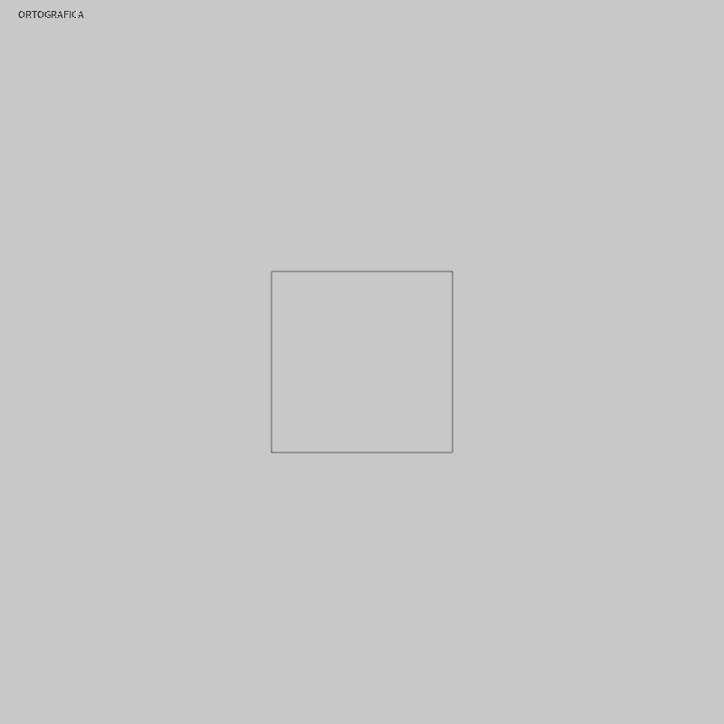
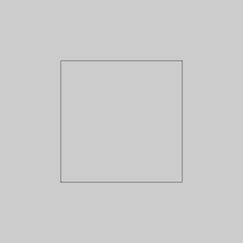
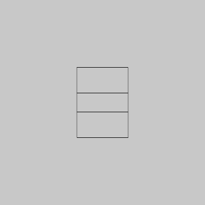
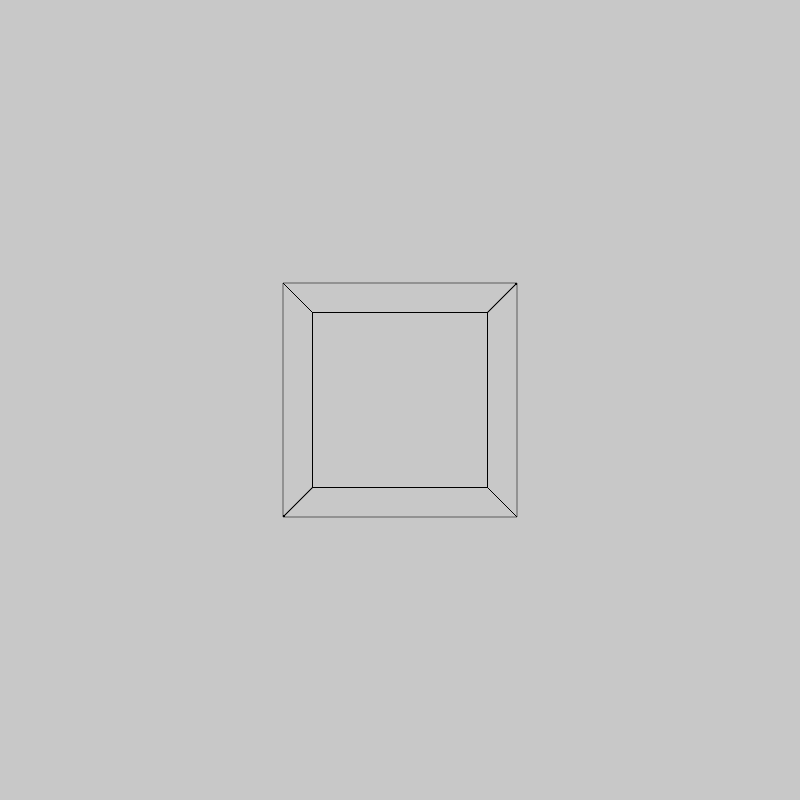

## Práctica 4. Modelo cámara

### Contenidos

[Proyecciones](#41-proyecciones)  
[La cámara](#42-la-cámara)  
[Oclusiones](#43-oclusión)  
[Tarea](#44-tarea)  
[Referencias](#referencias)


La práctica anterior aborda los elementos necesarios para aplicar transformaciones 2D y 3D a objetos, texto e imágenes. El primer paso en la representación gráfica de una escena es justamente la aplicación de transformaciones a los modelos de los objetos presentes en ella. Una vez que los modelos han sido posicionados en el espacio tridimensional, procede localizar la o las cámaras, para finalmente proyectar los puntos al correspondiente plano de proyección en  dos dimensiones.

En esta práctica se resumen las posibilidades disponibles tanto para configurar la proyección a aplicar, como la especificación de una cámara. Procedemos en primer lugar a describir las proyecciones, para posteriormente abordar las opciones de cámara.

### 4.1 Proyecciones

Asumiendo la configurtación de la cámara por defecto, que establece una posición de la cámara fija, que sea móvil se aborda en la siguiente sección, se describen en este apartado las posibilidades para configurar la proyección a realizar.
Nos centramos en los dos grandes grupos de proyecciones, ambos presentes en [Processing](https://processing.org/tutorials/p3d): proyección ortográfica y perspectiva.

Los mencionados dos tipos de proyecciones, ortográfica y perspectiva, se alternan al hacer clic con el ratón con sus respectivas configuraciones por defecto en el listado siguiente. El objeto dibujado es un cubo:

**Processing** [p4_orto_pers](https://github.com/otsedom/CIU/tree/master/P4/p4_orto_pers)
```
int mode;

void setup()
{
  size(800, 800, P3D);
  ortho();
  mode=0;  
}

void draw ()
{
  background(200);

  //Muestra modo proyección actual
  fill(0);
  if (mode == 1) {
    text("PERSPECTIVA", 20,20);
  } else {
    text("ORTOGRÁFICA", 20,20);
  }

  //Dibuja objeto en el centro de la ventana
  noFill();
  translate(width/2, height/2, 0);
  box(200);
}

void mouseClicked() {
  if (mode == 0) {
      mode=1;
      perspective();
    } else {
      mode = 0;
      ortho();
    }
}
```

En el *setup* se aplica la llamada a *ortho* para activar la proyección ortográfica de inicio. A través del control del evento de ratón, con el método *mouseClicked* se alternan las llamadas a *perspective* y la mencionada *ortho*.
El resultado del código es que dibuja un cubo en el centro de la ventana de visualización, hasta donde se ha trasladado el origen de coordenadas, permitiendo cambiar el modo de proyección entre ortográfica y perspectiva al hacer clic con el ratón, como se aprecia en la animación:

  
*Proyección ortográfica y perspectiva de un cubo centrado en el origen*


Se observa que la proyección perspectiva modifica el tamaño del objeto en función de su distancia, no así la ortográfica.
Las siguientes subsecciones describen  con mayor detalle las posibilidades ofrecidas para  ambos tipos de proyección.

#### 4.1.1 Ortográfica

Como se comentaba anteriormente. en una proyección ortográfica dos objetos iguales aparecen del mismo tamaño independientemente de su distancia al observador. La función *ortho*
realmente no requiere parámetros, configuración por defecto, a menos que precisemos indicar el volumen de recorte. En este último caso se especifican cuatro o seis parámetros, dependiendo de si definimos un recuadro de recorte, o un cubo completo de recorte. indicando los planos que delimitan al recuadro/cubo: izquierdo, derecho, inferior, superior, cercano y lejano. El siguiente código:

**Processing** [p4_orto0](https://github.com/otsedom/CIU/tree/master/P4/p4_orto0)
```
size(400, 400, P3D);
ortho(-width/2, width/2, -height/2, height/2);
noFill();
translate(width/2, height/2, 0);
box(100);
```
 muestra un cubo con proyección ortográfica, que nos permite ver las dimensiones de ancho y alto del cubo. No hay información de su profundidad, en realidad no se aprecia si es un cuadrado, un cubo o una caja de mayor profundidad. Para visualizarlo se define una proyección ortográfica con cuatro parámetros, no se definen los planos cercano y lejano.
Los parámetros definidos
tienen en cuenta las dimensiones de la ventana. En este ejemplo concreto, los valores coinciden justamente con los definidos por defecto, es decir asignados en la llamada a *ortho* sin parámetros.

  
*Proyección ortográfica por defecto*


En caso de especificar el recuadro o cubo de recorte, realmente se mapean las coordenadas del mismo a las esquinas de la ventana de visualización. De esta forma si levemente modificamos el ejemplo del listado anterior y modificamos los planos que delimitan en *x* e *y*,el resultado de la visualización, recuerda a un escalado. No hemos constatado utilidad para los parámetros referidos a los planos cercano y lejano en estos ejemplos básicos.

**Processing**
```
size(400, 400, P3D);
ortho(-100, 100, -100, 100);
noFill();
translate(width/2, height/2, 0);
box(100);
```

  
*Proyección ortográfica con connfiguración de los límites x e y no por defecto*

En los ejemplos previos, sólo se aprecian dos dimensiones del objeto tridimensional, un cubo, dado que vemos únicamente una de las tapas.
En el siguiente listado, además de desplazar el cubo al centro, se rota en función del tiempo alrededor del eje *y*
para verlo en movimiento, pudiendo *intuirse* dos caras, lo cual permite, aunque no haya ocultación, al observador apreciar su fondo.

**Processing** [p4_orto1](https://github.com/otsedom/CIU/tree/master/P4/p4_orto1)
```
float ang;

void setup()
{
  size(400, 400, P3D);
  noFill();
  ang=0;
}

void draw ()
{
  background(200);
  ortho(-width/2, width/2, -height/2, height/2);
  translate(width/2, height/2, 0);
  rotateY(radians(ang));
  box(100);

  ang+=0.5;
  if (ang==360) ang=0;
}
```

  
*Proyección ortográfica con rotación dependiente del tiempo*

 Finalmente en el listado a continuación son dos las rotaciones aplicadas, con lo que se llegan a *ver* tres de las caras, si bien al ser un modelo de alambres persiste la ambigüedad.

 **Processing** [p4_orto2](https://github.com/otsedom/CIU/tree/master/P4/p4_orto2)
 ```
float ang;

void setup()
{
  size(400, 400, P3D);
  noFill();
  ang=0;
}

void draw ()
{
  background(200);
  ortho(-width/2, width/2, -height/2, height/2);
  translate(width/2, height/2, 0);
  rotateX(-PI/6);
  rotateY(radians(ang));
  box(100);

  ang+=0.5;
  if (ang==360) ang=0;
}
```

  
*Proyección ortográfica con dos rotaciones, una dependiente del tiempo*

#### 4.1.2 Perspectiva

<!--- https://processing.org/examples/perspective.html --->

La proyección perspectiva se establece con la función *perspective* que no requiere parámetros, configuración por defecto, o bien requiere cuatro parámetros. En este último caso, el primero establece el ángulo de vista, el segundo la relación de aspecto alto-ancho, y los dos últimos, los planos cercano y lejano de recorte en *z*. En caso de no especificar parámetros, como en el listado a continuación, se adoptan los valores por defecto, siendo equivalente a la llamada *perspective(PI/3.0, width/height, cameraZ/10.0, cameraZ*10.0)*, donde *cameraZ* es *((height/2.0) / tan(PI*60.0/360.0))*. Este código representa un ejemplo mínimo de cubo proyectado con la perspectiva por defecto.

**Processing** [p4_pers](https://github.com/otsedom/CIU/tree/master/P4/p4_pers)
```
void setup()
{
  size(800, 800, P3D);
  perspective();  
}

void draw ()
{
  background(200);

  //Dibuja objeto en el centro de la ventana
  noFill();
  translate(width/2, height/2, 0);
  box(200);
}
```

Para ilustrar lo que aportan el ángulo de visión y la relación de aspecto, se presenta un nuevo listado, donde mover el puntero a lo largo del eje *x* afecta al primero, y hacer clic al segundo.

**Processing** [p4_pers1](https://github.com/otsedom/CIU/tree/master/P4/p4_pers1)
```
int aspecto;
float cameraZ;

void setup()
{
  size(800, 800, P3D);
  //Valores por defecto de la perspectiva
  aspecto=width/height;  
  cameraZ= ((height/2.0) / tan(PI*60.0/360.0));
}

void draw ()
{
  background(200);

  perspective(mouseX/float(width) * PI/2, aspecto, cameraZ/10.0, cameraZ*10.0);

  //Dibuja objeto en el centro de la ventana
  noFill();
  translate(width/2, height/2, 0);
  box(200);
}

void mouseClicked() {
  //Modifica la relación de aspecto
  if (aspecto > width/height) {
      aspecto=width/height;

    } else {
      aspecto = 2*width/height;      
    }
}
```

  
*Proyección perspectiva variando ángulo de vista y relación de aspectos*

Para la especificación de los planos de recorte en *z*, se asume al observador en *z=0* mirando hacia al lado positivo de *z*, por lo que ambos deben ser positivos. El listado siguiente mueve el cubo tras definir los planos de recorte en *z*, pudiendo observar el efecto de recorte en el objeto en el momento en que desaparece.


**Processing** [p4_pers2](https://github.com/otsedom/CIU/tree/master/P4/p4_pers2)
```
float muevez;

void setup(){
  size(800,800,P3D);
  noFill();
  perspective(PI/2,width/height,0.1,900);
  muevez=0;
}

void draw(){
 background(200);

 translate(width/2,height/2,muevez);
 box(200);  

 muevez-=0.5;
}

```

Una alternativa para especificar el volumen de recorte es hacer uso de la función *frustum*.
Una llamada *frustum* afecta a la perspectiva utilizada, al especificar los planos que delimitan el volumen de recorte. Señalar que el plano cercano debe ser mayor que 0, y menor que el lejano.

### 4.2 La cámara

Con un comportamiento idéntico a la función *gluLookAt* de OpenGL, Processing dispone de la función *camera*, que permite establecer la localización de la cámara en el espacio tridimensional, la dirección hacia donde mira, y su vertical. En total nueve argumentos: tres para las coordenadas de localización del ojo, tres para las coordenadas de la posición hacia la que mira el ojo, y los tres últimos las coordenadas del vector vertical de la cámara.

La llamada sin argumentos es equivalente a *camera(width/2.0, height/2.0, (height/2.0) / tan(PI*30.0 / 180.0), width/2.0, height/2.0, 0, 0, 1, 0);* que básicamente coloca el ojo a la altura del centro de la pantalla, si bien desplazado en *z*, mirando hacia el centro de la pantalla, y con el vector vertical paralelo a *y*.
 El listado siguiente coloca el ojo mirando hacia el centro de la ventana, justamente donde colocamos el cubo, de forma similar al primer ejemplo de este guion.

 **Processing** [p4_cam1](https://github.com/otsedom/CIU/tree/master/P4/p4_cam1)
 ```
void setup()
{
  size(800, 800, P3D);
  camera();
}

void draw ()
{
  background(200);

  noFill();
  translate(width/2, height/2, 0);
  box(200);
}
```

Como muestra de la configuración de los parámetros, en el listado a continuación se modifican las coordenadas *x* e *y* de la posición del ojo, con las teclas de cursor:

**Processing** [p4_cam2](https://github.com/otsedom/CIU/tree/master/P4/p4_cam2)
```
int px,py;

void setup()
{
  size(800, 800, P3D);  
  px=0;
  py=0;
}

void draw ()
{
  background(200);

  //Configuración de la cámara
  camera(width/2.0-px, height/2.0-py, (height/2.0) / tan(PI*30.0 / 180.0), width/2.0, height/2.0, 0, 0, 1, 0);

  noFill();
  translate(width/2, height/2, 0);
  box(200);
}

void keyPressed() {
  if (key == CODED) {
    if (keyCode == UP) {
      py+=10;
    }
    else
    {
      if (keyCode == DOWN) {
        py-=10;
      }
      else
      {
        if (keyCode == LEFT) {
          px-=10;
        }
        else
        {
          if (keyCode == RIGHT) {
            px+=10;
          }
        }
      }
    }
  }
}
```
 Con el evento de teclado, se procesan las teclas de cursores para modificar la posición de la cámara, si bien mantenemos hacia donde mira y la vertical, ver la figura.

  
*Variación de las coordenadas de localización de la cámara*


El punto al que se mira, el foco de antenbción, se modifica de nuevo de forma interactiva, a través de las teclas del cursor, en este código:

**Processing** [p4_cam3](https://github.com/otsedom/CIU/tree/master/P4/p4_cam3)
```
int px,py;

void setup()
{
  size(800, 800, P3D);  
  px=0;
  py=0;
}

void draw ()
{
  background(200);

  //Configuración de la cámara
  camera(width/2.0, height/2.0, (height/2.0) / tan(PI*30.0 / 180.0), width/2.0-px, height/2.0-py, 0, 0, 1, 0);

  noFill();
  translate(width/2, height/2, 0);
  box(200);
}

void keyPressed() {
  if (key == CODED) {
    if (keyCode == UP) {
      py+=10;
    }
    else
    {
      if (keyCode == DOWN) {
        py-=10;
      }
      else
      {
        if (keyCode == LEFT) {
          px-=10;
        }
        else
        {
          if (keyCode == RIGHT) {
            px+=10;
          }
        }
      }
    }
  }
}
```

y se ilustra en la siguiente figura.

  
*Variación de las coordenadas de localización del foco de la cámara*


Para finalizar las opciones de la cámara, un nuevo listado modifica la vertical del ojo, con lo que cambia la vista obtenida.

**Processing** [p4_cam4](https://github.com/otsedom/CIU/tree/master/P4/p4_cam4)
```
float vx,vy,ang;

void setup()
{
  size(800, 800, P3D);  
  ang=0;
}

void draw ()
{
  background(200);
  //Vertical de partida (0,1,0), rotamos sobre el eje z
  vx=-sin(radians(ang));
  vy=cos(radians(ang));

  //Configuración de la cámara
  camera(width/2.0, height/2.0, (height/2.0) / tan(PI*30.0 / 180.0), width/2.0, height/2.0, 0, vx, vy, 0);

  noFill();
  translate(width/2, height/2, 0);
  box(200);

  ang=ang+0.25;
  if (ang>360) ang=ang-360;
}
```

  
*Variación de la vertical de la cámara*

El resultado será equivalente a rotar el cubo, dado que al no existir otros objetos en la escena, ni iluminación, no se aprecia la diferencia.

Indicar finalmente que toda cámara puede configurar el modo de proyección que se le aplica a través de los modos de proyección mencionados en la sección [Proyecciones](#41-proyecciones).

### 4.3 Oclusión

Processing aplica por defecto el algoritmo de ocultación *z-buffer* a la hora de representar objetos poligonales con relleno. Es una característica que reduce ambigüedad en la reproducción, aportando realismo. Sin embargo, es posible activar o desactivar su acción con la función *hint* pasando como argumento respectivamente *ENABLE_DEPTH_TEST* o *DISABLE_DEPTH_TEST* en cada caso. Por defecto la opción está activada para el modo de reproducción *P3D*.

En los siguientos listados, se muestra la diferencia de comportamiento. El prmer ejemplo muestra el cubo con una proyección ortográfica, que por defecto aplica ocultación.

**Processing** [p4_oculta](https://github.com/otsedom/CIU/tree/master/P4/p4_oculta)
```
size(400, 400, P3D);
ortho(-width/2, width/2, -height/2, height/2);
fill(255);
translate(width/2, height/2, 0);
rotateX(-PI/6);
rotateY(PI/3);
box(100);
```

Se dibuja el cubo con las caras traseras ocultas.

  
*Resultado de aplicar ocultación*

El siguiente listado desactiva el z-buffer.

**Processing** [p4_nooculta](https://github.com/otsedom/CIU/tree/master/P4/p4_nooculta)
```
size(400, 400, P3D);
ortho(-width/2, width/2, -height/2, height/2);

hint(DISABLE_DEPTH_TEST);

fill(255);
translate(width/2, height/2, 0);
rotateX(-PI/6);
rotateY(PI/3);
box(100);
```

Al desactivar el z-buffer,  se obtiene una imagen en la que se ven todas las aristas del cubo, una figura ambigua, como puede verse en la figura:

  
*Resultado de no aplicar ocultación*

La utilización del z-buffer permite resolver situaciones con múltiples objetos, manejando correctamente sus intersecciones. El siguiente código dibuja dos cubos que intersectan en el espacio, y el resultado de la ocultación permite tener una mejor referencia de su localización en el espacio tridimensional, ver la figura más abajo.

**Processing** [p4_oculta3](https://github.com/otsedom/CIU/tree/master/P4/p4_oculta3)
```
size(400, 400, P3D);
ortho(-width/2, width/2, -height/2, height/2);

pushMatrix();
fill(255);
translate(width/2, height/2, 0);
rotateX(-PI/6);
rotateY(PI/3);
box(100);
popMatrix();

pushMatrix();
fill(128);
translate(width/2-15, height/2-20, 55);
rotateX(-PI/6);
rotateY(PI/3);
box(50);
popMatrix();
```

  
*Z-buffer aplicado con dos cubos*

La desactivación del z-buffer, permite dibujar como un pintor, lo último dibujado siempre aparece *arriba*.

<!--- %Ver si %hint(ENABLE_DEPTH_SORT);
%hint(DISABLE_DEPTH_MASK); permiten evitar que algún objeto entre en el z-buffer

%Añadir que la llamada a   $hint(ENABLE\_DEPTH\_SORT);$ permite realizar la ocultación aplicada a triángulos y , reduciendo eficiencia. Por defecto está desactivada, ver listado~\ref{code:ocul3}.

  %\begin{lstlisting}[frame=single,caption={Un cubo con cocultación d líneas},label=code:ocul3]
%size(400, 400, P3D);
%ortho(-width/2, width/2, -height/2, height/2);
%hint(ENABLE_DEPTH_SORT);

%fill(255);
%translate(width/2, height/2, 0);
%rotateX(-PI/6);
%rotateY(PI/3);
%box(100);
%```

%$hint(DISABLE_DEPTH_MASK);$ Parece referirse al zubbufer en sí, dudas sobre si sigue estando soportado. Cuando lo activo junto a SORT desaparecen las aristas ..., ver listado~\ref{code:ocul4}

  %\begin{lstlisting}[frame=single,caption={Un cubo},label=code:ocul4]
%size(400, 400, P3D);
%ortho(-width/2, width/2, -height/2, height/2);

%hint(ENABLE_DEPTH_SORT);
%hint(DISABLE_DEPTH_MASK);

%fill(255);
%translate(width/2, height/2, 0);
%rotateX(-PI/6);
%rotateY(PI/3);
%box(100);
%```


%Luego $ENABLE_OPENGL_4X_SMOOTH$ y $DISABLE_OPENGL_2X_SMOOTH$ para temas de aliasing
%cámaras y oclusión
%https://discourse.processing.org/t/depth-sorting-and-pshape/1730/6

%Ocultación
%http://processingjs.org/reference/hint\_/

%Transparencia

%pdf o svg
%pdf https://processing.org/reference/beginRaw\_.html --->

### 4.4 Tarea

La tarea de la práctica anterior abordaba la definición de un sistema planetario. Para esta nueva entrega, se incluirá una *nave* que de forma interactiva podrá navegar por dicho sistema planetario, enfatizando que el movimiento sea esperable para un objeto en movimiento, es decir, suave, sin saltos, sin paradas repentinas. Tener en cuenta que la navegación de la nave podrá afectar no únicamente a su posición en el espacio, sino también a su vertical y al punto hacia el que se mira desde ella, influyendo por tanto en su definición de cámara.

Si bien no hay impedimento a experimentar con las cámaras existentes en la biblioteca de Processing, cada estudiante debe diseñar su propio mecanismo de interacción para inducir la navegación de la *nave*. El prototipo final debe permitir que se alterne entre una vista general y la vista desde la nave.

<!--- %Diseñar un mecanismo de interacción que permite colocar en la localización de la nave  una cámara, facilitando por tanto la modificación de su localización, además de facilitar orientarla para indicar el punto al que se desea mirar, y la vertical, con el objetivo de dar tener la sensación de navegación desde el punto de vista de la nave. --->


La entrega se debe realizar a través del campus virtual, remitiendo un enlace a un proyecto github, cuyo README sirva de memoria, por lo que se espera que el README:

- identifique al autor,
- describa el trabajo realizado,
- argumente decisiones adoptadas para la solución propuesta,
- incluya referencias y herramientas utilizadas,
- muestre el resultado con un gif animado.


%Sistema planetario con movimiento de cámara entre los planetas. SolarSystemSImple lo hace con elipses, pasarlo a esferas y poder mover la cámara, que sería nuestra nave espacial. Posición  en el espacio, y rotaciones


***
Bajo licencia de Creative Commons Reconocimiento - No Comercial 4.0 Internacional
