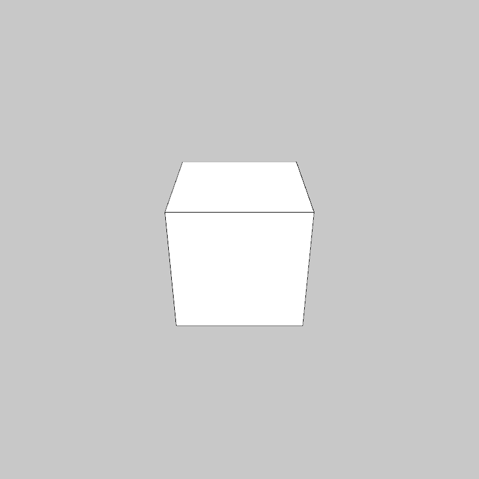
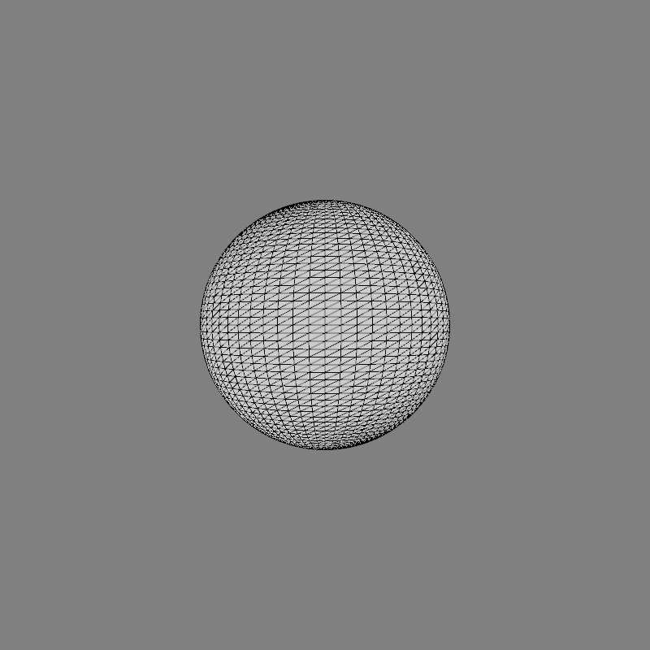
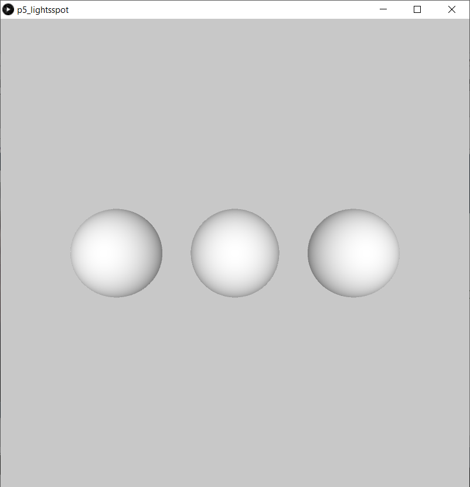
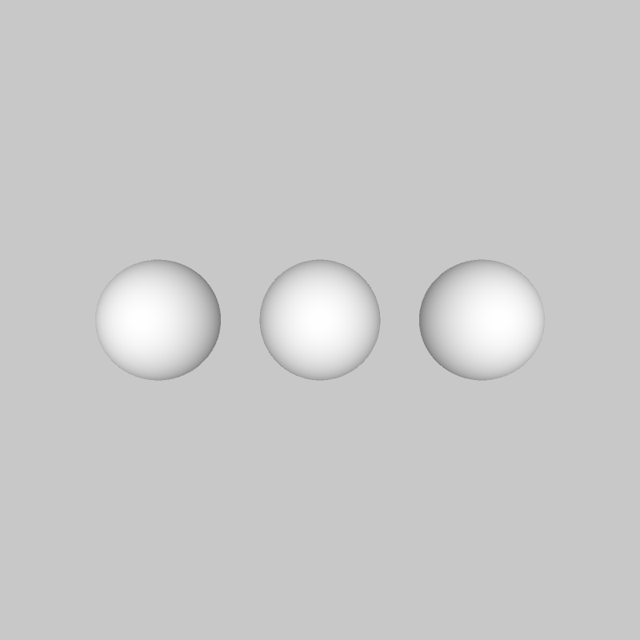
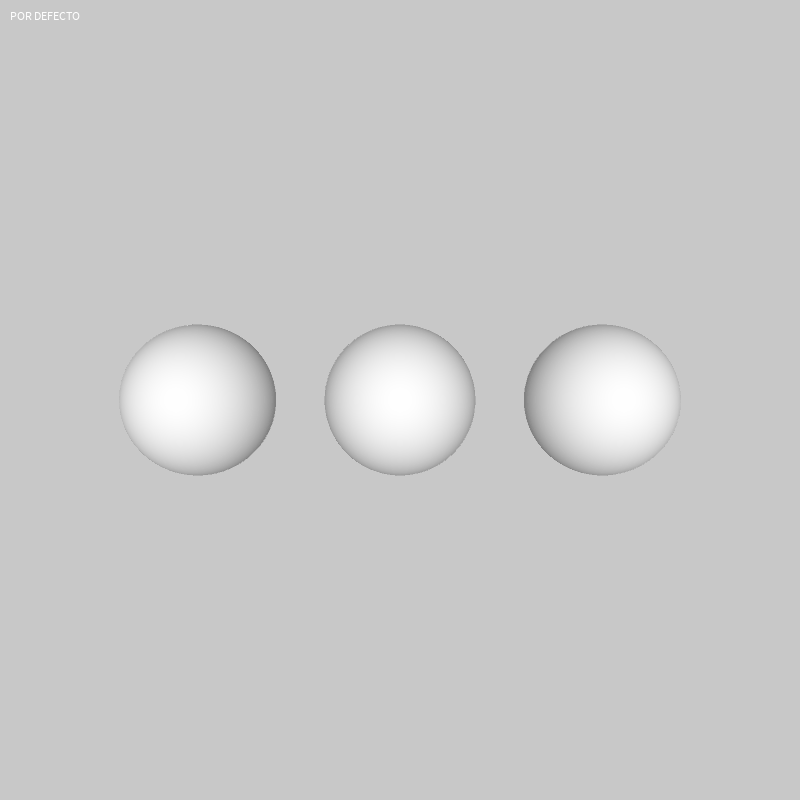
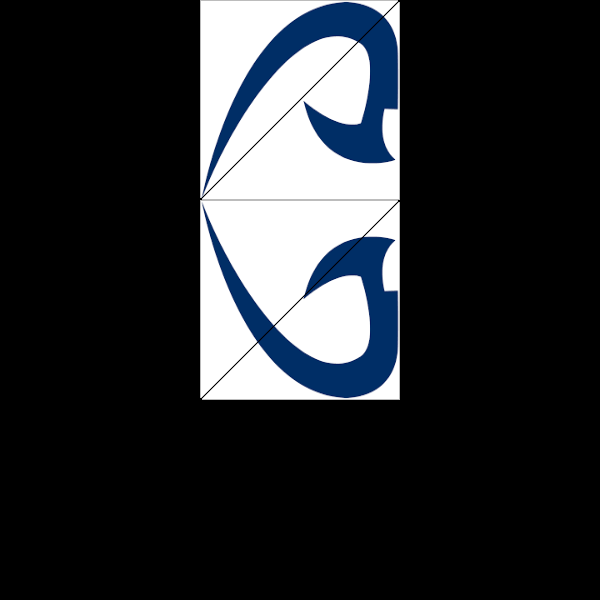
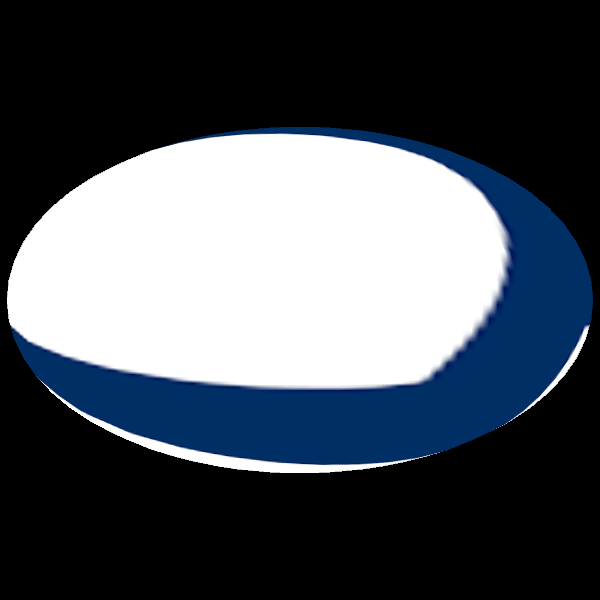
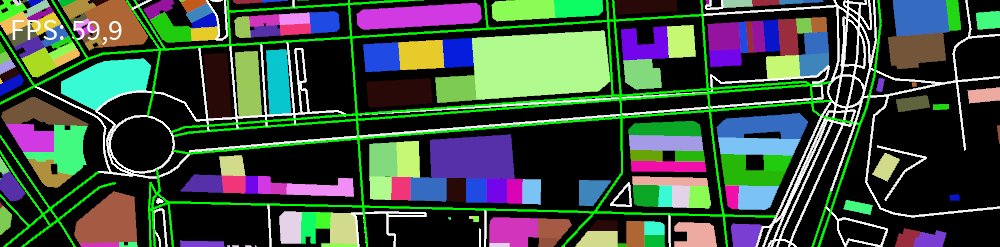
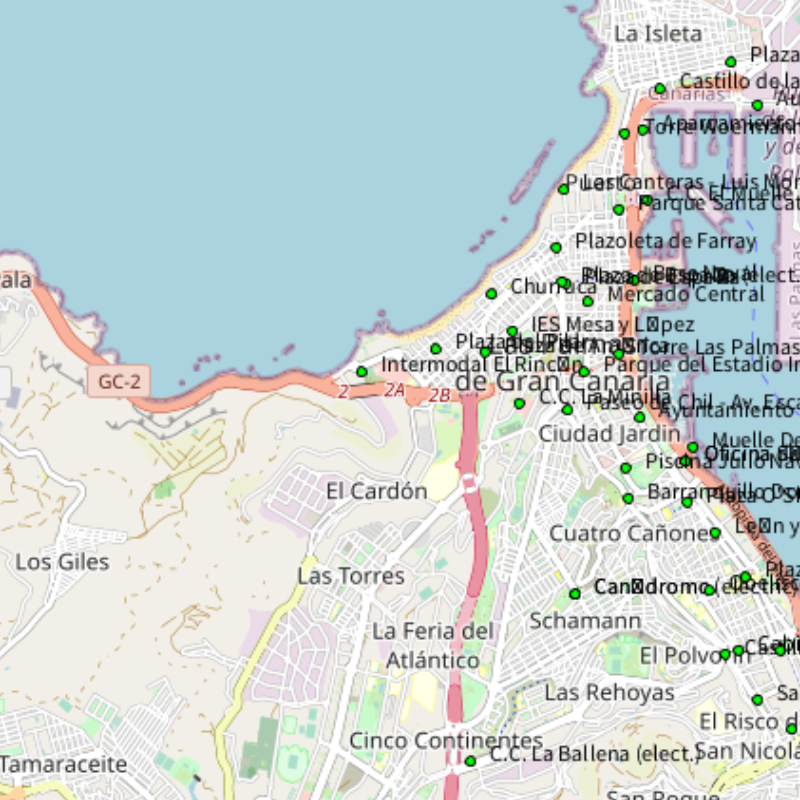

## Práctica 5. Iluminación y texturas

### Contenidos

[Iluminación](#51-iluminación)  
[Texturas](#52-texturas)  
[Mapas](#53-mapas)   
[Tarea](#55-tarea)  
[Referencias](#referencias)

<!--- Ejemplo materiales y textura %ver https://behreajj.medium.com/3d-models-in-processing-7d968a7cede5 --->

### 5.1 Iluminación

Un notorio paso en la mejora del realismo de una escena con objetos tridimensionales es la incorporación de iluminación, aspecto factible en el modo de reproducción [P3D](https://processing.org/tutorials/p3d).

Como primer ejemplo básico, en el siguiente listado se activa la iluminación con su configuración por defecto al pulsar un botón del ratón, desactivándola al soltarlo.

**Processing** [p5_ilubasico](https://github.com/otsedom/CIU/tree/master/P5/p5_ilubasico)
```
float ang;

void setup()
{
  size(800, 800, P3D);
  ang=0;
}

void draw ()
{
  background(200);

  if (mousePressed) {
    lights();
  }

  //Dibuja objeto en el centro de la ventana
  translate(width/2, height/2, 0);
  rotateX(radians(-30));
  rotateY(radians(ang));
  box(200);

  ang+=1;
  if (ang>360) ang=0;
}
```

La ejecución permite observar un cubo en rotación eterna. El color de relleno se aplica cuando no está activada la iluminación, mientras que se ve afectado por la orientación de cada cara en relación a la fuente de luz cuando se activa la iluminacion con la llamada a la función *lights*. Por cierto, *noLights* la desactiva, teniendo sentido en el caso de querer que determinados objetos tengan en cuenta la iluminación, y otros no.

  
*Activación y desactivación de luces*

Cuando hablamos de iluminación de adopta el modelo de reflexión de Phong, que combina características de la fuente de luz y el material. En Processing será posible configurar
aspectos relativos a:

- la intensidad de ambiente,
- el número de fuentes de luz,
- su dirección,
- el decaimiento de la luz,
- la reflexión especular,
- características de reflexión de los materiales.

Cuando se activa la iluminación, incluyendo la llamada a *lights* como en el ejemplo previo, se adopta la siguiente configuración de iluminación por defecto:

- Luz ambiente, equivalente a la llamada  *ambientLight(128, 128, 128)*
- Dirección de la luz, equivalente a la llamada  *directionalLight(128, 128, 128, 0, 0, -1)*
- Decaimiento de la luz, equivalente a la llamada  *lightFalloff(1, 0, 0)*
- Reflexión especular, equivalente a la llamada  *lightSpecular(0, 0, 0)*

Las modificaciones del modo por defecto deben integrarse en el método *draw*, ya que se resetea cualquier nueva configuración en cada nueva ejecución de dicha función. En los siguientes apartados se presentan opciones para evitar la configuración por defecto.

### 5.1.1 Luces

Para los ejemplos de configuración de la iluminación, adoptamos como objeto 3D la esfera que permite apreciar en mayor medida las posibilidades del comportamiento frente a la luz que un cubo, al ser un objeto con una superficie curvada. El listado mostrado a contnuación recuerda el modo de dibujar una esfera en el centro de la ventana, si bien en este caso se incrementa el nivel de detalle de la malla del objeto con la función
 *sphereDetail*, con el objetivo de obtener mejores resultados al iluminar. Observa las diferencias comentando dicha llamada.

 **Processing** [p5_esfera](https://github.com/otsedom/CIU/tree/master/P55p5_esfera)
```
void setup()
{
  size(800, 800, P3D);
  fill(204);
  sphereDetail(60);
}

void draw ()
{
  background(128);

  translate(width/2, height/2, 0);
  sphere(150);
}
```

  
*Esfera de radio 150 con detalle 60*

La iluminación de ambiente no tiene definida dirección, e intenta simular la luz que llega a la superficie de los objetos por reflexión difusa de la luz tras rebotar en todos los elementos de la escena, aspecto no contemplado en el modelo de iluminación/reflexión que nos ocupa. La función admite tres o seis argumentos, los tres primeros definen el color, según del espacio de color activo, y los tres últimos localizan su posición. Con el objetivo de poder comparar, el siguiente listado muestra una escena con tres esferas desplazadas, iluminadas con las condiciones de iluminación establecidas por defecto, ver la figura justo a continuación para el resultado.  


**Processing** [p5_lights1](https://github.com/otsedom/CIU/tree/master/P5/p5_lights1)
```
float ang;

void setup()
{
  size(800, 800, P3D);
  ang=0;
  noStroke();
  sphereDetail(60);
}

void draw ()
{
  background(200);

  if (mousePressed) {
    lights();    
  }

  //Dibuja objetos
  pushMatrix();
  translate(width/4, height/2, 0);
  rotateX(radians(-30));
  rotateY(radians(ang));
  sphere(75);
  popMatrix();

  pushMatrix();
  translate(width/2, height/2, 0);
  rotateX(radians(-30));
  rotateY(radians(ang));
  sphere(75);
  popMatrix();

  pushMatrix();
  translate(3*width/4, height/2, 0);
  rotateX(radians(-30));
  rotateY(radians(ang));
  sphere(75);
  popMatrix();

  ang+=1;
  if (ang>360) ang=0;
}
```

  
*Tres esferas con iluminación por defecto*

En un nuevo listado se muestra el efecto de configurar únicamentye la luz ambiental, como alternativa a la iluminación por defecto activada con la llamada a *lights*. En principio las esferas tienen iluminación por defecto, si bien al hacer clic se establece una intensidad ambiente rojiza, de mayor o menor intensidad dependiendo de la posición del puntero en *x*. La rotación de las esferas es prácticamente imperceptible.

**Processing** [p5_lightsambient](https://github.com/otsedom/CIU/tree/master/P5/p5_lightsambient)
```
float ang;

void setup()
{
  size(800, 800, P3D);
  ang=0;
  noStroke();
  sphereDetail(60);
}

void draw ()
{
  background(200);

  if (mousePressed) {
    float val=(float)mouseX/(float)width*(float)255;
    ambientLight((int)val,0,0);
  }
  else
  {
    lights();
  }

  //Dibuja objetos
  pushMatrix();
  translate(width/4, height/2, 0);
  rotateX(radians(-30));
  rotateY(radians(ang));
  sphere(75);
  popMatrix();

  pushMatrix();
  translate(width/2, height/2, 0);
  rotateX(radians(-30));
  rotateY(radians(ang));
  sphere(75);
  popMatrix();

  pushMatrix();
  translate(3*width/4, height/2, 0);
  rotateX(radians(-30));
  rotateY(radians(ang));
  sphere(75);
  popMatrix();

  ang+=1;
  if (ang>360) ang=0;
}
```

  
*Iluminación por defecto y configurada con únicamente intensidad ambiente*

La función *directionalLight* define una luz direccional, es decir una fuente de luz que viene desde una dirección específica. Cualquier luz afectará a la superficie dependiendo del ángulo entre la normal a la superficie del objeto y la dirección de la fuente de luz. La función dispone de seis parámetros, definiendo en primer lugar el color de la fuente de luz en los tres primeros, y la dirección de la luz en los restantes. El siguiente listado, modifica el anterior estableciendo que al hacer clc con el ratón, además de la iluminación ambiental rojiza, una fuente de luz direccional, con mayor componente verde, que viene desde el lateral derecho hacia la izquierda.

**Processing** [p5_lightsambientdir](https://github.com/otsedom/CIU/tree/master/P5/p5_lightsambientdir)
```
float ang;

void setup()
{
  size(800, 800, P3D);
  ang=0;
  noStroke();
  sphereDetail(60);
}

void draw ()
{
  background(200);

  if (mousePressed) {
    float val=(float)mouseX/(float)width*(float)255;
    ambientLight((int)val,0,0);
    directionalLight(50, 200, 50, -1, 0, 0);
  }
  else
  {
    lights();
  }

  //Dibuja objetos
  pushMatrix();
  translate(width/4, height/2, 0);
  rotateX(radians(-30));
  rotateY(radians(ang));
  sphere(75);
  popMatrix();

  pushMatrix();
  translate(width/2, height/2, 0);
  rotateX(radians(-30));
  rotateY(radians(ang));
  sphere(75);
  popMatrix();

  pushMatrix();
  translate(3*width/4, height/2, 0);
  rotateX(radians(-30));
  rotateY(radians(ang));
  sphere(75);
  popMatrix();

  ang+=1;
  if (ang>360) ang=0;
}
```


Las luces direccionales son luces localizadas en el infinito.
Mayor flexibilidad la aporta la función *spotLight* que además de definir color y dirección, requiere parámetros para localizar la fuente de luz, el ángulo del cono de luz, y la concentración de la luz en dicho cono. El nuevo listado añade a la escena con iluminación no por defecto, una luz, que al mover el puntero llegará a provocar la presencia del reflejo sobre la superficie de la esfera.  

**Processing** [p5_lightsspot](https://github.com/otsedom/CIU/tree/master/P5/p5_lightsspot)
```
float ang;

void setup()
{
  size(800, 800, P3D);
  ang=0;
  noStroke();
  sphereDetail(60);
}

void draw ()
{
  background(200);

  if (mousePressed) {
    float val=(float)mouseX/(float)width*(float)255;
    ambientLight((int)val,0,0);
    directionalLight(50, 200, 50, -1, 0, 0);
    spotLight(204, 153, 0, mouseX, mouseY, 500, 0, 0, -1, PI/2, 600);
  }
  else
  {
    lights();
  }

  //Dibuja objetos
  pushMatrix();
  translate(width/4, height/2, 0);
  rotateX(radians(-30));
  rotateY(radians(ang));
  sphere(75);
  popMatrix();

  pushMatrix();
  translate(width/2, height/2, 0);
  rotateX(radians(-30));
  rotateY(radians(ang));
  sphere(75);
  popMatrix();

  pushMatrix();
  translate(3*width/4, height/2, 0);
  rotateX(radians(-30));
  rotateY(radians(ang));
  sphere(75);
  popMatrix();

  ang+=1;
  if (ang>360) ang=0;
}
```

  
*Tres esferas con iluminación que incluye definición no por defecto  de luz ambiente, luz direccional y spot.*


Para luces no localizadas en el infinito, la función *pointLight* fija una luz con un cono de *180º*, simplificando la definición de luces localizadas, al requerir únicamente definir su color y posición, como se muestre en el siguiente código:

**Processing** [p5_lightspoint](https://github.com/otsedom/CIU/tree/master/P5/p5_lightspoint)
```
float ang;

void setup()
{
  size(800, 800, P3D);
  ang=0;
  noStroke();
  sphereDetail(60);
}

void draw ()
{
  background(200);

  if (mousePressed) {
    float val=(float)mouseX/(float)width*(float)255;
    ambientLight((int)val,0,0);
    directionalLight(50, 200, 50, -1, 0, 0);
    pointLight(204, 153, 0, mouseX, mouseY, 400);
  }
  else
  {
    lights();
  }

  //Dibuja objetos
  pushMatrix();
  translate(width/4, height/2, 0);
  rotateX(radians(-30));
  rotateY(radians(ang));
  sphere(75);
  popMatrix();

  pushMatrix();
  translate(width/2, height/2, 0);
  rotateX(radians(-30));
  rotateY(radians(ang));
  sphere(75);
  popMatrix();

  pushMatrix();
  translate(3*width/4, height/2, 0);
  rotateX(radians(-30));
  rotateY(radians(ang));
  sphere(75);
  popMatrix();

  ang+=1;
  if (ang>360) ang=0;
}
```

  
*Tres esferas con iluminación que incluye definición no por defecto  de luz ambiente, luz direccional y puntual.*

Al ejemplo anterior, se le añade ruido al color de la fuente de luz putual que depende de los fotogramas procesados, haciendo uso de la funció *noise* en el siguiente listado:

**Processing**
```
float ang;

void setup()
{
  size(800, 800, P3D);
  ang=0;
  noStroke();
  sphereDetail(60);
}

void draw ()
{
  background(200);

  if (mousePressed) {
    float val=(float)mouseX/(float)width*(float)255;
    ambientLight((int)val,0,0);
    directionalLight(50, 200, 50, -1, 0, 0);
    pointLight(noise(float(frameCount)/6.0) * 255, noise(float(frameCount)/2.0) * 255, noise(float(frameCount)/3.0) * 255, mouseX, mouseY, 400);
  }
  else
  {
    lights();
  }

  //Dibuja objetos
  pushMatrix();
  translate(width/4, height/2, 0);
  rotateX(radians(-30));
  rotateY(radians(ang));
  sphere(75);
  popMatrix();

  pushMatrix();
  translate(width/2, height/2, 0);
  rotateX(radians(-30));
  rotateY(radians(ang));
  sphere(75);
  popMatrix();

  pushMatrix();
  translate(3*width/4, height/2, 0);
  rotateX(radians(-30));
  rotateY(radians(ang));
  sphere(75);
  popMatrix();

  ang+=1;
  if (ang>360) ang=0;
}
```

  
*Lus puntual tuidosa.*


El color de la luz con reflexión especular se fija con la función *lightSpecular* requiriendo los tres valores del espacio de color como parámetros. El siguiente listado en su configuración de iluminación no por defecto, al hacer clic define una luz puntual blanca posicionada con la posición del ratón, y establece el color del reflejo especular azul. Apreciar las diferencias cuando se activa y cuando no (pulsando cualquier tecla para intercambiar el modo).

**Processing** [p5_lightspecular0](https://github.com/otsedom/CIU/tree/master/P5/p5_lightspecular0)
```
float ang;
float modo;

void setup()
{
  size(800, 800, P3D);
  ang=0;
  noStroke();
  sphereDetail(60);
  modo=1;
}

void draw ()
{
  background(200);

  if (mousePressed) {
    pointLight(255,255,255, mouseX, mouseY, 400);
    if (modo == 1) {
      text("ESPECULAR", 20,20);
      lightSpecular(0, 0, 255);
    }
  }
  else
  {
    lights();
  }

  //Dibuja objetos
  pushMatrix();
  translate(width/4, height/2, 0);
  rotateX(radians(-30));
  rotateY(radians(ang));
  sphere(75);
  popMatrix();

  pushMatrix();
  translate(width/2, height/2, 0);
  rotateX(radians(-30));
  rotateY(radians(ang));
  sphere(75);
  popMatrix();

  pushMatrix();
  translate(3*width/4, height/2, 0);
  rotateX(radians(-30));
  rotateY(radians(ang));
  sphere(75);
  popMatrix();

  ang+=1;
  if (ang>360) ang=0;
}

void keyPressed() {
  if (modo == 0) {
    modo = 1;
  } else {
    modo = 0;
  }
}
```

  
*Tres esferas blancas con iluminación que incluye definición no por defecto de luz  puntual blanca, pudiendo establecer o no el color del reflejo azul.*

#### 5.1.2 Material

El material del objeto también influye en la reflexión que se observa al incidir la luz sobre él. Para especificar características del material de un objeto están disponibles las funciones *ambient*, *emissive*, *specular* y *shininess* que configuran diversos aspectos de la respuesta a la iluminación ambiental (*ambient*) y reflexión (*specular* y *shininess*), mientras que *emissive* dará aspecto de emisor, si bien no afectará a otros objetos, pudiendo considerarse una iluminación ambiental a tope.
El siguiente listado dibuja tres esferas, variando las características de la reflexión difusa y especular en cuatro vistas diferentes que se activan haciendo clic o con las teclas del cursor.

**Processing** [p5_lightmaterial](https://github.com/otsedom/CIU/tree/master/P5/p5_lightmaterial)
```
float ang;
int modo;

void setup()
{
  size(800, 800, P3D);
  ang=0;
  noStroke();
  sphereDetail(60);
  modo = 0;
}

void draw ()
{
  background(200);

  pushStyle();
  switch (modo) {
    case 0:
    Modo0();
    break;
    case 1:
    Modo1();
    break;
    case 2:
    Modo2();
    break;
    case 3:
    Modo3();
    break;  
  }
  popStyle();

  ang+=1;
  if (ang>360) ang=0;
}

void Modo0(){
  text("POR DEFECTO", 10,20);
  lights();

  pushMatrix();
  translate(width*0.25, height*0.5, 0);
  rotateX(radians(-30));
  rotateY(radians(ang));
  sphere(75);
  popMatrix();

  pushMatrix();
  translate(width*0.50, height*0.5, 0);
  rotateX(radians(-30));
  rotateY(radians(ang));
  sphere(75);
  popMatrix();

  pushMatrix();
  translate(width*0.75, height*0.5, 0);
  rotateX(radians(-30));
  rotateY(radians(ang));
  sphere(75);
  popMatrix();
}

void Modo1(){
  text("AMBIENT", 10,20);

  ambientLight(128, 128, 128);
  directionalLight(128,128,128, 0, 1, -1);

  pushMatrix();
  translate(width*0.25, height*0.5, 0);
  rotateX(radians(-30));
  rotateY(radians(ang));
  ambient(255, 255, 255);
  sphere(75);
  popMatrix();

  pushMatrix();
  translate(width*0.50, height*0.5, 0);
  rotateX(radians(-30));
  rotateY(radians(ang));
  ambient(255, 255,0);//Capa el azul del reflejo ambniente
  sphere(75);
  popMatrix();

  pushMatrix();
  translate(width*0.75, height*0.5, 0);
  rotateX(radians(-30));
  rotateY(radians(ang));
  ambient(255, 0,0);//Capa verde y azul del reflejo ambniente
  sphere(75);
  popMatrix();
}

void Modo2(){
  text("SPECULAR & SHININESS", 10,20);

  ambientLight(128, 128, 128);
  lightSpecular(128,128,128);  
  directionalLight(128,128,128, 0, 1, -1);

  pointLight(0, 0, 10,mouseX,mouseY,1000);

  pushMatrix();
  translate(width*0.25, height*0.5, 0);
  rotateX(radians(-30));
  rotateY(radians(ang));
  specular(255,255,255);
  shininess(1.0 + (100 * abs(cos(frameCount * 0.1))));
  ambient(255,255,155);
  sphere(75);
  popMatrix();

  pushMatrix();
  translate(width*0.50, height*0.5, 0);
  rotateX(radians(-30));
  rotateY(radians(ang));
  specular(255,255,255);
  shininess(1.0 + (100 * abs(cos(frameCount * 0.1))));
  ambient(255, 255,0);
  sphere(75);
  popMatrix();

  pushMatrix();
  translate(width*0.75, height*0.5, 0);
  rotateX(radians(-30));
  rotateY(radians(ang));
  specular(255,255,255);
  shininess(1.0 + (100 * abs(cos(frameCount * 0.1))));
  ambient(255, 0,0);
  sphere(75);
  popMatrix();
}

void Modo3(){
  text("EMISSIVE", 10,20);

  ambientLight(128, 128, 128);
  lightSpecular(128,128,128);
  directionalLight(128,128,128, 0, 1, -1);

  pointLight(0, 0, 10,mouseX,mouseY,1000);

  pushMatrix();
  translate(width*0.25, height*0.5, 0);
  rotateX(radians(-30));
  rotateY(radians(ang));
  specular(255,0,0);
  emissive(50,50,50);
  shininess(1.0 + (100 * abs(cos(frameCount * 0.1))));
  ambient(255, 255,0);
  sphere(75);
  popMatrix();

  pushMatrix();
  translate(width*0.5, height*0.5, 0);
  rotateX(radians(-30));
  rotateY(radians(ang));
  emissive(0,50,50);
  specular(255,255,255);
  shininess(1.0 + (100 * abs(cos(frameCount * 0.1))));
  ambient(255, 255,0);
  sphere(75);
  popMatrix();

  pushMatrix();
  translate(width*0.75, height*0.5, 0);
  rotateX(radians(-30));
  rotateY(radians(ang));
  emissive(0,0,50);
  specular(255,255,255);
  shininess(1.0 + (100 * abs(cos(frameCount * 0.1))));
  ambient(255, 255,0);
  sphere(75);
  popMatrix();

}

void keyPressed() {
  if (key == CODED) {
    if (keyCode == UP) {
      modo += 1;
      if (modo > 3) {
          modo=0;      
      }  
    }
    else if (keyCode == DOWN) {
      modo -= 1;
      if (modo < 0) {
          modo=3;      
      }  
    }
  }
}

void mouseClicked() {
  modo += 1;
  if (modo > 3) {
          modo=0;      
   }  
}
```

  
*Tres esferas blancas con iluminación que incluye definición no por defecto de luz  puntual blanca, pudiendo establecer o no el color del reflejo azul.*

Observar en el ejemplo, que las características de un material pueden utilizarse en combinación con las funciones  *pushStyle* y *popStyle* para  que tengan efecto sólo en los objetos entre ambas llamadas.

Para p5js, sugerir el [tutorial](https://www.youtube.com/watch?v=k2FguXvqp60) de The Coding Project.

### 5.2 Texturas

En una práctica previa se describía la asignaci´çon de la textura a una esfera creada como *PShape* con la llamada a *settexture*. De forma general, pàra asociar uan textura a uan forma arbitrariase hace uso del método  *texture* que permite, a la hora de especificar cada uno de los vértices, establecer el mapeo de cada uno con respecto a las coordenadas *u* y *v* de la imagen de textura. Con *textureMode* (*IMAGE* o *NORMAL*) se especifica si se trabaja en coordenadas de la imagen o normalizadas *(0,1)*. El modo *NORMAL* evita tener claramente presentes las coordenadas de la imagen. Un ejemplo ilustrativo se muestra en el siguiente listado, que aplica una textura, el logo de la ULPGC, sobre una cara poligonal, compuesta por cuatro vértices. Si nuestra forma tuviera varias caras, tendrán que asociarse las coordenadas de la textura para cada cara poligonal. La llamada a la función *texture* debe estar entre *beginShape* y *endShape* para tener efecto.

**Processing** [p5_textura](https://github.com/otsedom/CIU/tree/master/P5/p5_textura)
```
PImage img;

void setup() {
  size(640, 360, P3D);
  img = loadImage("logoulpgc.png");
}

void draw() {
  background(0);
  translate(width / 2, height / 2);
  textureMode(NORMAL);
  beginShape();
  texture(img);
  vertex(-100, -100, 0, 0,   0);
  vertex( 100, -100, 0, 1, 0);
  vertex( 100,  100, 0, 1, 1);
  vertex(-100,  100, 0, 0,   1);
  endShape();
}
```

  
*Textura sobre recuadro*

La función *textureWrap* permite establecer si la textura se aplica una única vez o de forma cíclica en base al tamaño de la superficie sobre la que se mapea. En el siguiente listado hace uso del modo *REPEAT* que ^justamente repite la textura en su caso, como se aprecia posteriormente en la figura. El modo por defecto *CLAMP*.


**Processing** [p5_texturarepeat](https://github.com/otsedom/CIU/tree/master/P5/p5_texturarepeat)
```
PImage img;

void setup() {
  size(640, 360, P3D);
  img = loadImage("logoulpgc.png");
}

void draw() {
  background(0);
  translate(width / 2, height / 2);
  textureMode(NORMAL);
  textureWrap(REPEAT);
  beginShape();
  texture(img);  
  vertex(-100, -100, 0, 0, 0);
  vertex( 100, -100, 0, 2, 0);
  vertex( 100,  100, 0, 2, 2);
  vertex(-100,  100, 0, 0, 2);
  endShape();
}
```

  
*Textura en modo REPEAT*

Haciendo uso de un *PGraphics*, podemos modificar la textura durante la ejecución, el listado a continuación, es similar al anterior, si bien añade líneas aleatorias progresivamente sobre la etxtura.

**Processing** [p5_texturarepeatdynamic](https://github.com/otsedom/CIU/tree/master/P5/p5_texturarepeatdynamic)
```
PImage img;
PGraphics mitex;

void setup() {
  size(640, 360, P3D);
  img = loadImage("logoulpgc.png");

  mitex = createGraphics(img.width, img.height);
  mitex.beginDraw();
  mitex.image(img,0,0); // draw the image into the graphics object
  mitex.endDraw();
}

void draw() {
  background(0);
  translate(width / 2, height / 2);
  textureMode(NORMAL);
  textureWrap(REPEAT);
  beginShape();
  texture(mitex);  
  vertex(-100, -100, 0, 0, 0);
  vertex( 100, -100, 0, 2, 0);
  vertex( 100,  100, 0, 2, 2);
  vertex(-100,  100, 0, 0, 2);
  endShape();

  addRandomLine();
}

void addRandomLine(){
  mitex.beginDraw();
  mitex.stroke(255+random(-5,5),255+random(-5,5),0); // color líneas
  mitex.strokeWeight(3); // grosor
  mitex.line(random(mitex.width), random(mitex.height),random(mitex.width), random(mitex.height));
  mitex.endDraw();
}
```

  
*Textura cambiante*

Recuperando la textura básica, el nuevo listado se mapea la textura sobre una tira de triángulos, que exige probablemente una mayor concentración a la hora de asociar vértices y el mapa de textura, incluyendo la imagen resultante justo a continuación.


**Processing** [p5_texturatrianglestrip](https://github.com/otsedom/CIU/tree/master/P5/p5_texturatrianglestrip)
```
PImage img;

void setup() {
  size(600, 600, P3D);
  img = loadImage("logoulpgc.png");
}

void draw() {
  background(0);
  translate(width / 2, height / 2);
  rotateX(radians(360*mouseX/width));
  rotateY(radians(360*mouseY/height));
  textureMode(NORMAL);
  beginShape(TRIANGLE_STRIP);
  texture(img);
  vertex(-100, -300, 0, 0, 0);
  vertex( 100, -300, 0, 1, 0);
  vertex(-100, -100, 0, 0, 1);
  vertex( 100, -100, 0, 1, 1);  
  vertex(-100,  100, 0, 0, 0);
  vertex( 100,  100, 0, 1, 0);    
  endShape();
}
```

  
*Textura sobre tira de triángulos*


Para objetos tridimensionales más complicados, el mapeo vértice a vértice es muy engorroso. Existen funcionalidades incluidas como la mostrada en el listado a continuación para el caso de un elipsoide, similar a la esfera que ya conoces. ¿Qué ocurre si se aplica iluminación haciendo clic?


<!--- https://github.com/processing/processing/issues/4378  problema setTexture--->

**Processing** [p5_texturapshape](https://github.com/otsedom/CIU/tree/master/P5/p5_texturapshape)
```
PImage img;
PShape globo;
float ang;

void setup() {
  // Load an image
  size(600 , 600, P3D);
  img = loadImage("logoulpgc.png");

  beginShape();
  globo = createShape(SPHERE, 150);
  globo.setStroke(255);
  globo.scale(1.85, 1.09, 1.15);
  globo.setTexture(img);
  endShape(CLOSE);

  ang=0;
}

void draw() {
  background(0);

  //Iluminación al pulsar
  if (mousePressed) {
    pointLight(204, 153, 0, mouseX, mouseY, 400);
    directionalLight(0.8, 0.8, 0.8, 0, 0, -1);
  }

  translate(width / 2, height / 2);  
  rotateY(radians(ang));

  shape(globo);
  ang=ang+1;
  if (ang>360) ang=0;
}
```

  
*Textura sobre PShape con iluminación*

Un ejemplo final asocia como textura los fotogramas capturados por la cámara, podría hacerse también con los de un vídeo cargado de disco. El listado más abajo proyecta la imagen sobre un recuadro, vcomo se muestra en la figura posterior. Este ejemplo requiere tener instalada una webcam, y la biblioteca de vídeo basada en *GStreamer*, para más detalles consultar el guion de la práctica 6.

**Processing** [p5_texturavid](https://github.com/otsedom/CIU/tree/master/P5/p5_texturavid)
```
import processing.video.*;

PImage img;
Capture cam;

void setup() {
  size(800, 800, P3D);
  //Cámara
  cam = new Capture(this, 640 , 480);
  cam.start();
}

void draw() {  
  if (cam.available()) {
    background(0);
    cam.read();

    translate(width / 2, height / 2);
    rotateX(radians(mouseX/2));
    rotateY(radians(mouseY/2));
    textureMode(NORMAL);
    beginShape();
    texture(cam);
    vertex(-200, -200, 0, 0, 0);
    vertex( 200, -200, 0, 1, 0);
    vertex( 200,  200, 0, 1, 1);
    vertex(-200,  200, 0, 0, 1);
    endShape();
  }
}
```

  
*Textura desde webcam*

A nivel interno OpenGL maneja la textura a distintas resoluciones, es lo que se conoce como *mipmap*, para en cada momento aplicar la textura sobre la figura con el menor *aliasing*. Processing se configura para la mayor calidad.

<!--- %All images in Processing are backed up by OpenGL textures. By default, Processing uses the highest-quality texture filtering mode: GL_LINEAR_MIPMAP_LINEAR for the minification filter with mipmaps, GL_LINEAR for the magnification filter, and anisotropic filtering if supported by the hardware. This combination is denoted as trilinear because of the LINEAR_MIPMAP_LINEAR and GL_LINEAR options. The mipmap generation can be disabled using *hint(DISABLE_TEXTURE_MIPMAPS)*.

%There is no corresponding PApplet method to change the filtering options, however the renderer class, PGraphicsOpenGL, exposes a function that can be used for that purpose, called textureSampling(int mode), where mode can take the values 2 (nearest), 3 (linear), 4 (bilinear), and 5 (trilinear): --->

Una mayor flexibilidad se obtiene programando el [*shader* propio](https://processing.org/tutorials/pshader/}). Los *shaders* definen el modo  en el que se aplica la iluminación, texturas, etc., por lo que su programación abre la puerta para usuarios avanzados de buscar nuevas posibilidades.
Quedando fuera de los objetivos de esta práctica, se aborda en sesiones posteriores.

<!---
%Texturas avanzado
%Processing y opengl texturas
%https://github.com/processing/processing/wiki/Advanced-OpenGL

%Processing and shaders
%https://forum.processing.org/two/discussion/24702/resources-for-learning-glsl-shaders

%https://github.com/CodingTrain/website/tree/master/\_Tutorials/18-webgl --->

### 5.3 Mapas

Con la tarea descrita más abajo en mente, un primer paso consiste en validar las herramientas ya disponibles para visualizar mapas con *Processing*.
Buscando *Map* en el menú de *Herramientas*, las bibliotecas que aparecen (MapThing y Unfolding maps) no han resultados compatibles con la versión actual de *Processing*, por lo que se incluyen un par de ejemplos haciendo uso de mterial descargable desde [OpenStreetMap](https://www.openstreetmap.org/#map=8/28.312/-16.026). Si en la cajita de búsqueda tecleas *las palmas de gran canaria*, llegarás al mapa de la capital de Gran Canaria, con algo parecido a la siguiente imagen. Estas líneas no abordan la descarga dinámica durante la ejecución del programa *Processing*, sino la obtención del mapa previamente.

<!--- Una zona del mapa se puede secargar haciendo uso de la llamada al servidoro con algo Como http://overpass.openstreetmap.ru/cgi/xapi_meta?*[bbox=-15.446,28.08,-15.396,28.18] --->

  
*Interfaz web de OpenSTreeMap para exportar mapas personalizados*

Sobre esa vista puede escogerse una zona concreta del mapa, además de selecionar distintas capas. Al seleccionar *Exportar* podremos descargar el xml del mapa visible, si bien al haber limitaciones de la superficie total que el servidor permite descargar, probablemente debas escoger manualmente el rectánugulo de la zona de interés. Para el primer ejemplo más abajo, se ha descargado parcialmente la zona de la Avenida de Mesa y López. Para el segundo, evitando dicha restricción se ha descargado la imagen, el segundo ejemplo, que sólo es válida para la capa por defecto. En este caso además te interesará anotar las coordenadas de latitud y longitud escogidas,, que se encuentran en la parte superior izquierda, justo bajo *Exportar*.  

El primer ejemplo visualiza un archivo en formato osm, un xml, con las entidades geográficas presentes en la zona del mapa escogidas. Tras almacenarlas en una estructura *HashMap*, determina sus límites, y calcula la escala a aplicar para forzar a una ventana de un determinado ancho. En este ejemplo, al fijar el tamaño de la ventana con una variable con la función *size*, se hace necesario hacer uso del método *settings*. Posteriormente, una vez cargada la información, se seleccionan elementos del mapa con ciertos *tags*. Más información de los [tags de OSM](https://wiki.openstreetmap.org/wiki/Tags). De esta forma se filtran edificios y calles, detectando si tienen el tag relativo a bicicletas. La información filtrada permite definir los vértices de las *PShape* a dibujar en *draw*. ünicamente los edificios se dibujan con relleno, usando colores de una tabla confeccionada de forma aleatoria. El ejemplo permite cierta interacción con zoom y traslación del mapa.

**Processing**
```
XML xml;
XML extremos;
HashMap<String, XML> nodes;
HashMap<String, XML> ways;
HashMap<String, XML> relations;

float minlat;
float minlon;
float maxlat;
float maxlon;

//Variables de traslación y escalado
int x;
int y;
int scale;
float zoom;

//Paleta de colores para edificios
int ncolors = 50;
color[] colors;

//Elementos para el dibujo
PShape[] eltos;
boolean[] dibujable;

//Método necesario si size se define con parámetros
void settings() {
  //Carga del archivo descargado de OSM
  xml = loadXML("mapLPGC_MyL.osm");

  extremos = xml.getChildren("bounds")[0];
  nodes = new HashMap<String, XML>();
  ways = new HashMap<String, XML>();
  relations = new HashMap<String, XML>();

  for (XML node : xml.getChildren("node")) nodes.put(node.getString("id"), node);
  for (XML way : xml.getChildren("way")) ways.put(way.getString("id"), way);
  for (XML relation : xml.getChildren("relations")) relations.put(relation.getString("relation"), relation);
  //Obtiene límites en latitud y ongitud del mapa
  minlat = extremos.getFloat("minlat");
  minlon = extremos.getFloat("minlon");
  maxlat = extremos.getFloat("maxlat");
  maxlon = extremos.getFloat("maxlon");
  println("Mapa con longitud (", minlon + ", " + maxlon + ") y latitud " + "(", minlat + ", " + maxlat + ")");
  println("Obtenidos " + ways.size() + " elementos");

  //Fuerzo sx píxeles de ancho de la ventana
  int sx = 1000;
  scale = (int)(sx/(maxlon - minlon));
  size(sx, (int)((maxlat - minlat) * scale), P3D);  
}

void setup() {
  stroke(255);

  //Desplazamiento y zoom
  x = 0;
  y = 0;
  zoom = 1;
  //Paleta de colores aleatorios para relleno de edificios
  colors = new color[ncolors];
  for (int i=0;i<ncolors;i++)
    colors[i]=color(random(255), random(255), random(255));

  //Crea los PShape  
  creaEltos();
}

void draw() {
  background(0);

  //Traslada con botón izquierdo del ratón
  if (mousePressed && mouseButton == LEFT) {
    x += (mouseX - pmouseX)/zoom;
    y += (mouseY - pmouseY)/zoom;
  }

  //Dibuja elementos del mapa escogidos
  pushMatrix();
  //Origen en el centro de la ventana
  translate(width/2,height/2,0);
  scale(zoom);
  //Traslada al centro del mapa leído
  translate(-(minlon+maxlon)/2 * scale + x, (minlat+maxlat)/2 * scale + y);
  //Dibuja los elementos escogidos
  for (int i=0;i<ways.size();i++){
    if (dibujable[i])
      shape(eltos[i]);
  }
  popMatrix();

  //Muestra FPS
  textSize(30);
  text("FPS: " + nf(frameRate, 0, 1), 10, 40);
}

//Del total de ways cargados, selecciona en base a tags
void creaEltos(){
  //Estructura de datos usada en draw
  eltos = new PShape[ways.size()];
  dibujable = new boolean[ways.size()];

  //Recorremos los elementos cargados en la estructura HashMap
  int nelto = 0;
  for (XML way : ways.values()) {
    eltos[nelto] = createShape();
    dibujable[nelto] = false;

    //Selecciono algunos tags de interés paar mostrar elementos que los tienen
    //Relación de tags de OSM https://wiki.openstreetmap.org/wiki/Tags
    boolean edificio = false;
    boolean calle = false;
    boolean bici = false;
    for (XML tag : way.getChildren("tag")) {
      String tipok = tag.getString("k");
      String tipov = tag.getString("v");
      if (tipok.equals("building")){
        edificio = true;
      }
      if (tipok.equals("highway")){
        calle = true;
      }
      if (tipok.equals("bicycle") || tipov.equals("cycleway")){
        bici = true;
      }
    }
    //Si es de interés, configuro pincel y relleno y creo los vértices
    if (edificio || calle  || bici){
      dibujable[nelto] = true;
      //Creación de forma con sus características de color
      eltos[nelto].beginShape();
      if (edificio){
        eltos[nelto].noStroke();
        eltos[nelto].fill(colors[nelto % ncolors]);
      }
      else{
        eltos[nelto].noFill();
        if (bici)
          eltos[nelto].stroke(0,255,0);
        else
          eltos[nelto].stroke(255);
      }
      eltos[nelto].strokeWeight(2);

      //Los vértices
      for (XML nd : way.getChildren("nd")) {
        XML node = nodes.get(nd.getString("ref"));

        float lat = node.getFloat("lat");
        float lon = node.getFloat("lon");        
        eltos[nelto].vertex(lon * scale, -lat * scale);
      }      
      eltos[nelto].endShape();      
    }
    nelto++;
  }
}

//Modificar el zoom del mapa
void mouseWheel(MouseEvent event) {
  float e = event.getCount();
  zoom += e/10;
  if (zoom<1)
    zoom = 1;
}
```

  
*Vista del mapa OSM*


El ejemplo de la imagen es más compacto. Tras ler la imagen del mapa, y establecer por programa sus límites de latitud y longitud, dibuja sobre el mapa las posiciones de las estaciones de la Sitycleta, tomadas de un archivo csv, además de su nombre. Por simplicidad, no se han evitado efectos de solape de los nombres. El mapa se dibuja sobre un *PGraphics*, que facilitará su transformación para cualquier fin.

**Processing**
```
PGraphics lienzo;
PImage img;

float minlat,minlon,maxlat,maxlon;

float[] lats,lons;
String[] nombres;
int nest = 0;
int r = 5;

float zoom;
//int px,py;
int x;
int y;

Table Estaciones;

void setup() {
  size(800, 800, P3D);

  //Cargamos información de estaciones de préstamo
  Estaciones = loadTable("Geolocalización estaciones sitycleta.csv", "header");
  //Estaciones.getRowCount() contiene el número de entradas
  //Creamos estruatura paar almacenar lo que nos interesa
  lats = new float[Estaciones.getRowCount()];
  lons = new float[Estaciones.getRowCount()];
  nombres = new String[Estaciones.getRowCount()];
  //Almacenamos datos en nuestra estructura
  nest = 0;
  for (TableRow est : Estaciones.rows()) {
    nombres[nest] = est.getString("nombre");
    lats[nest] = float(est.getString("latitud"));
    lons[nest] = float(est.getString("altitud"));

    println(nombres[nest], lats[nest], lons[nest]);
    nest++;
  }

  //Imagen del Mapa
  img=loadImage("mapaLPGC.png");
  //Creamos lienzo par el mapa
  lienzo = createGraphics(img.width ,img.height);
  lienzo.beginDraw();
  lienzo.background(100);
  lienzo.endDraw();

  //Latitud y longitud de los extremos del mapa de la imagen
  minlon = -15.5304;
  maxlon = -15.3656;
  minlat = 28.0705;
  maxlat = 28.1817;

  //Inicializa desplazamiento y zoom
  x = 0;
  y = 0;
  zoom = 1;

  //Compone imagen con estaciones sobre el lienzo
  dibujaMapayEstaciones();  
}

void draw() {
  background(220);
  //Desplazamiento con botón izquierdo ratón
  if (mousePressed && mouseButton == LEFT) {
    x += (mouseX - pmouseX)/zoom;
    y += (mouseY - pmouseY)/zoom;
  }


  //Coloca origen en el centro
  translate(width/2,height/2,0);
  //Escala según el zoom
  scale(zoom);
  //Centro de la imagen en el origen
  translate(-img.width/2+x,-img.height/2+y);

  image(lienzo, 0,0);
}

//Rueda del ratón para modificar el zoom
void mouseWheel(MouseEvent event) {
  float e = event.getCount();
  zoom += e/10;
  if (zoom<1)
    zoom = 1;
}

void dibujaMapayEstaciones(){
  //Dibuja sobre el lienzo
  lienzo.beginDraw();
  //Imagen de fondo
  lienzo.image(img, 0,0,img.width,img.height);
  //Círculo y etiqueta de cada estación según latitud y longitud
  for (int i=0;i<nest;i++){
    float mlon = map(lons[i], minlon, maxlon, 0, img.width);
    //latitud invertida con respecto al eje y de la ventana
    float mlat = map(lats[i], maxlat, minlat, 0, img.height);

    lienzo.fill(0,255,0);
    lienzo.ellipse(mlon, mlat, r, r);
    lienzo.fill(0,0,0);
    lienzo.text(nombres[i], mlon+r*2,mlat);
  }   
  lienzo.endDraw();
}
```

  
*Vista de la imagen ge0lizalizada*


<!---
Otras cosas

MapThing 1.4
https://github.com/jreades/MapThing/blob/master/distribution/MapThing-1.5/examples/MapThing/MapThing.pde

En processing 4 la demo no va

Unbfolding maps < v4
http://unfoldingmaps.org

2014
https://forum.processing.org/two/discussion/7667/reading-gps-data-file.html

%http://learningthreejs.com/blog/2013/09/16/how-to-make-the-earth-in-webgl/

%Ejemplo processing terrain3D
%https://github.com/rogeriobego/terrain_3d_perlinNoise  --->


### 5.5 Tarea

En la web de [Sagulpa](https://www.sagulpa.com) puedes localizar el enlace a su [Portal de Transparencia](https://www.sagulpa.com/portal-transparencia), desde donde se puede acceder a una interesante colección de [datos abiertos](https://www.sagulpa.com/datos-abiertos) de aparcamientos y la Sitycleta. En la tarea propuesta, se  les invita a usar los datos de la Siticleta de 2021,  [SÍTYCLETA 2021](https://www.sagulpa.com/descargar.php?f=51&m=39). El archivo contiene el diario de préstamos de bicicletas, incluyendo el horario y fecha, los minutos de uso, además de las estaciones de alquiler y entrega.

La tarea a entregar consiste en hacer uso de la información contenida en dicho fichero, de forma completa o parcial (según estimen, pudiendo si así lo consideran necesario  hacer uso de información de otros años), para visualizar los datos allí presentes haciendo uso de las técnicas vistas para gráficos 3D en *Processing*.   

La entrega se debe realizar a través del campus virtual, remitiendo un enlace a un proyecto github, cuyo README sirva de memoria, por lo que se espera que el README:

- identifique al autor,
- describa el trabajo realizado,
- argumente decisiones adoptadas para la solución propuesta,
- incluya referencias y herramientas utilizadas,
- muestre el resultado con un gif animado.

El *90%* de la  calificación se obtendrá a partir de una votación entre todo el grupo, la propuesta ganadora obtiene una puntuación máxima, descontando tres décimas por cada posición perdida. Antes de abrir la votación, cada estudiante que lo desee dispondrá de un máximo de tres minutos, para *presentar* al grupo su propuesta durante la sesión de teoría del 15 de marzo. Cualquier material audiovisual que quiera utilizarse durante dicha presentación, debe ser proporcionado al equipo docente con anterioridad a dicho día 15 de marzo a las 9 horas.


***
Bajo licencia de Creative Commons Reconocimiento - No Comercial 4.0 Internacional
