## Práctica 6. Procesamiento de imagen y vídeo

### Contenidos

[Imagen](#61-imagen)  
[Vídeo](#62-video)  
[Operaciones básicas](#63-operaciones-básicas)   
[Detección](#64-detección)   
[Galería](#65-galería)   
[Tarea](#66-tarea)  
[Referencias](#referencias)


### 6.1 Imagen

Si bien se han descrito anteriormente varios ejemplos con lectura de imágenes de archivo, esta sección incluye algún ejemplo adicional. La ya utilizada función *loadImage* facilita la carga de imágenes desde disco. Una vez cargada, una imagen puede ser mostrada en nuestra ventana con el método *image* como ilustra el listado a continuación, que añade las coordenadas de la ventana donde localizar la esquina superior izquierda de la imagen.


**Processing** [p6_imashow](https://github.com/otsedom/CIU/tree/master/P6/p6_imashow)
```
PImage img;

void setup(){
  size(600,400);
  img=loadImage("moon.jpg");
}

void draw(){
  image(img,0,0);
}
```

Como se ha mencionado, el comando *image* coloca una imagen en unas coordenadas del área de dibujo. En el listado a continuación se introduce un desplazamiento aleatorio en la visualización de la imagen provocamos un efecto de *tembleque*.

**Processing** [p6_imashowrand](https://github.com/otsedom/CIU/tree/master/P6/p6_imashowrand)
```

PImage img;

void setup(){
  size(600,400);
  img=loadImage("moon.jpg");
}

void draw(){
  image(img,random(10),random(10));
}
```
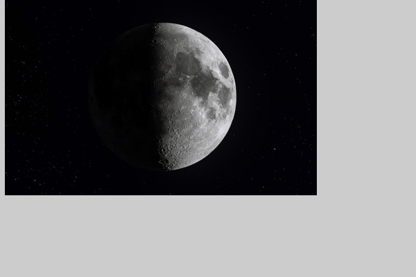  
*Imagen temblorosa*

La función *tint*, utilizada en un nuevo listado,  permite variar la intensidad de la visualización de la imagen, es la equivalente a *stroke* o *fill* para primitivas gráficas.

**Processing**
```
PImage img;

void setup(){
  size(600,400);
  img=loadImage("moon.jpg");
}

void draw(){
  tint(mouseX/2);
  image(img,random(10),random(10));
}
```

Si se cargan varias imágenes correspondientes a un ciclo, almacenándolas en una lista o vector, esposible mostrarlas de forma consecutiva, lo que permite conseguir el efecto de animación, configurando con *frameRate* la tasa de refresco deseada:


**Processing** [p6_imaanimaa](https://github.com/otsedom/CIU/tree/master/P6/p6_imaanima)
```
PImage [] img=new PImage [6];
int frame=0;

void setup(){
  size(600,400);

  img[0]=loadImage("Ciclo1.png");
  img[1]=loadImage("Ciclo2.png");
  img[2]=loadImage("Ciclo3.png");
  img[3]=loadImage("Ciclo4.png");
  img[4]=loadImage("Ciclo5.png");
  img[5]=loadImage("Ciclo6.png");
  frameRate(6);
}

void draw(){
  background(128);
  image(img[frame],0,0);
  frame=frame+1;
  if (frame==6){
    frame=0;
  }
}
```

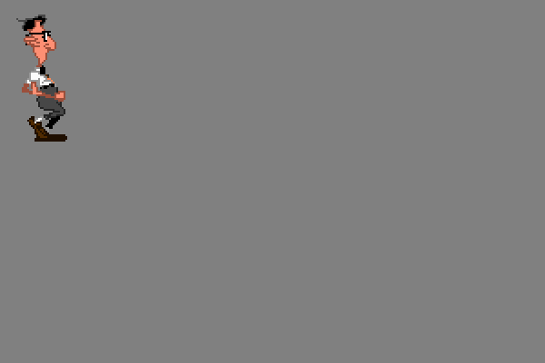  
*Ciclo de imágenes*

### 6.2 Vídeo

Por defecto la instalación de Processing no incluye las bibliotecas de vídeo, por lo que es necesario añadirlas para los ejemplos incluidos en esta sección, como ya se hacía necesario para el ejemplo de textura de vídeo de la práctica previa.
Recordar que las contribuciones o bibliotecas se añaden  a través de
*Herramientas -> Añadir herramientas -> Libraries*. En esta ocasión buscaremos *Video*, escogiendo la identificada como *Video | GStreamer based video library for Processing}*. Además de instalar la biblioteca, incorpora su correspondiente batería de ejemplos.

Un primer ejemplo de captura y visualización se incluye en siguiente listado:

**Processing** [p6_cam](https://github.com/otsedom/CIU/tree/master/P6/p6_imacam)
```
import processing.video.*;

Capture cam;

void setup() {
  size(640 , 480, P3D);
  //Cámara
  cam = new Capture(this, width , height);
  cam.start();
}

void draw() {  
  if (cam.available()) {
    background(0);
    cam.read();

    //comportamiento diferenciado si hay clic
    if (mousePressed)
      //Desplaza la imagen de forma aleatoria al mostrarla
      image(cam,random(-5,5),random(-5,5));
     else
      image(cam,0,0);
  }
}
```
En el código se introduce el uso de las variables de tipo *Capture*, para las que es necesario realizar el *import* previo correspondiente. La variable que permite crear la conexión con la cámara, se crea en el *setup* con una configuración de tamaño determinada, mientras que en el método *draw* se realiza la acción de leer y  refrescar la imagen mostrada, siempre que la cámara esté disponible. En caso de hacer clic, desplaza de forma leve y aleatoria la posición de la imagen, similar al mostrado en la sección anterior con una imagen. Como en este ejemplo, una vez capturado el fotograma, podremos hacer con él cualquier acción aplicable a una imagen.
Las siguientes secciones pretenden mostrar algunas pinceladas de procesamiento con los fotogramas de un vídeo.

### 6.3 Operaciones básicas

#### 6.3.1 Píxeles

Una imagen se compone de píxeles, en el listado a continuación se muestra el modo de acceder a dicha información, requiriendo una llamada al método *loadPixels* para habilitar el acceso, acceder propiamente a través de la variable *pixels*, y finalmente actualizar la imagen con el método *updatePixels*. En este ejemplo concreto se aplica un umbralizado. Con un bucle se recorren todos los píxeles de la mitad superior de la imagen, *i<dimensiones/2*, para cada uno se suman sus tres componentes, y si dicha suma supera el valor *255x1.5* se establece el valor del píxel a blanco, y a negro en caso contrario.


**Processing** [p6_imacamumb](https://github.com/otsedom/CIU/tree/master/P6/p6_imacamumb)
```
import processing.video.*;

Capture cam;
int dimension;

void setup(){
  size(640, 480);
  //Cámara
  cam = new Capture(this, width , height);
  cam.start();  
  //Obtiene el número de píxeles de la imagen
  dimension = cam.width * cam.height;
}

void draw(){
  if (cam.available())
  {
    background(0);
    cam.read() ;

    //Carga píxeles para poder operar con ellos
    cam.loadPixels();
    //Recorre la parte superior de la imagen
    for (int i=1;i<dimension/2;i++)
    {
        //Suma las tres componentes del píxel
        float  suma=red(cam.pixels[i])+green(cam.pixels[i])+blue(cam.pixels[i]);

        //Umbraliza, asigna blanco o negro, en base a comparar el valor intermedio
        if (suma<255*1.5)
        {
          cam.pixels[i]=color(0, 0, 0);
        }        
        else
        {
          cam.pixels[i]=color(255, 255, 255);
        }
    }
    //Actualiza pixeles
    cam.updatePixels();
  }
  //Muestra la imagen
  image( cam ,0 ,0) ;
}
```

  
*Umbralizado a pelo*

#### 6.3.2 OpenCV

<!--- Hubo un
[UTORIAL CON OPENCV FOR PROCESSING](https://t3chfest.uc3m.es/2016/programa/tratamiento-imagen-tiempo-real-processing-opencv/?lang=es)
con su código en  https://github.com/juanalonso/processing-opencv --->

De cara a poder realizar procesamiento de imágenes tanto básico como elaborado, es aconsejable hacer uso de utilidades existentes, como es el caso  de la biblioteca [OpenCV](https://opencv.org). Para los ejemplos mostrados a continuación hemos hecho uso de [CVImage](http://www.magicandlove.com/blog/2018/11/22/opencv-4-0-0-java-built-and-cvimage-library/). Indicar que a través del menú de herramientas se facilita la instalación de la adaptación realizada por Greg Borenstein para OpenCV 2.4.5; si bien al no estar actualizada para las versiones  recientes de OpenCV, optamos por
 la versión compilada para Java puesta a disposición por Bryan Chung para OpenCV 4.0.0, la mencionada [CVImage](http://www.magicandlove.com/blog/2018/11/22/opencv-4-0-0-java-built-and-cvimage-library/). Su instalación requiere descomprimir y copiar en la carpeta denominada *libraries* de nuestra instalación de Processing. No es posible mantener ambas bibliotecas (Chung y Borenstein) instaladas de forma simultánea, ya que entran en conflicto.

#### 6.3.3 Grises

Un primer ejemplo muestra el uso de la variable de tipo *CVImage* para obtener su versión en tonos de grises. Como veremos posteriormente en diversos ejemplos, la imagen capturada en color, para diversas operaciones es necesario convertirla a escala de grises, el listado recupera y muestra la imagen de grises correspondiente a la captura.

**Processing** [p6_camgray](https://github.com/otsedom/CIU/tree/master/P6/p6_camgray)
```
import java.lang.*;
import processing.video.*;
import cvimage.*;
import org.opencv.core.*;

Capture cam;
CVImage img,auximg;

void setup() {
  size(1280, 480);
  //Cámara
  cam = new Capture(this, width/2 , height);
  cam.start();

  //OpenCV
  //Carga biblioteca core de OpenCV
  System.loadLibrary(Core.NATIVE_LIBRARY_NAME);
  println(Core.VERSION);
  //Crea imágenes
  img = new CVImage(cam.width, cam.height);
  auximg=new CVImage(cam.width, cam.height);
}

void draw() {  
  if (cam.available()) {
    background(0);
    cam.read();

    //Obtiene la imagen de la cámara
    img.copy(cam, 0, 0, cam.width, cam.height,
    0, 0, img.width, img.height);
    img.copyTo();

    //Imagen de grises
    Mat gris = img.getGrey();

    //Copia de Mat a CVImage
    cpMat2CVImage(gris,auximg);

    //Visualiza ambas imágenes
    image(img,0,0);
    image(auximg,width/2,0);

    //Libera
    gris.release();
  }
}

//Copia unsigned byte Mat a color CVImage
void  cpMat2CVImage(Mat in_mat,CVImage out_img)
{    
  byte[] data8 = new byte[cam.width*cam.height];

  out_img.loadPixels();
  in_mat.get(0, 0, data8);

  // Cada columna
  for (int x = 0; x < cam.width; x++) {
    // Cada fila
    for (int y = 0; y < cam.height; y++) {
      // Posición en el vector 1D
      int loc = x + y * cam.width;
      //Conversión del valor a unsigned
      int val = data8[loc] & 0xFF;
      //Copia a CVImage
      out_img.pixels[loc] = color(val);
    }
  }
  out_img.updatePixels();
}
```

El código anterior presenta varias novedades, al hacer uso de la variable tipo *CVImage*, requerir la utilización de la biblioteca OpenCV en el *setup*, extraer una imagen si está disponible en cada paso por *draw* ,  su conversión  a grises con el método *getGrey*, que produce una variable tipo *Mat*, y su posterior copia desde la variable *Mat* con valores *unsigned byte* a otra *CVImage* con la función *cpMat2CVImage^* incluida en el listado y siempre presente en los posteriores. El resultado muestra tanto la imagen de entrada, como su conversión a escala de grises.

  
*Original y en grises*

#### 6.3.4 Umbralizado

El ejemplo de acceso a los píxeles visto anteriormente, aplicaba un umbralizado a la parte superior de la imagen capturada. El listado a continuación hace uso de las utilidades para tal fin presentes en OpenCV, en concreto la función *threshold*. El código modifica el valor del umbral aplicado según la posición en *x* del puntero. Las personas más curiosas pueden analizar las opciones de dicha función en la documentación.

**Processing** [p6_icamthreshold](https://github.com/otsedom/CIU/tree/master/P6/p6_camthreshold)
```
import java.lang.*;
import processing.video.*;
import cvimage.*;
import org.opencv.core.*;
import org.opencv.imgproc.Imgproc;

Capture cam;
CVImage img,auximg;

void setup() {
  size(1280, 480);
  //Cámara
  cam = new Capture(this, width/2 , height);
  cam.start();

  //OpenCV
  //Carga biblioteca core de OpenCV
  System.loadLibrary(Core.NATIVE_LIBRARY_NAME);
  println(Core.VERSION);
  //Crea imágenes
  img = new CVImage(cam.width, cam.height);
  auximg=new CVImage(cam.width, cam.height);
}

void draw() {  
  if (cam.available()) {
    background(0);
    cam.read();

    //Obtiene la imagen de la cámara
    img.copy(cam, 0, 0, cam.width, cam.height,
    0, 0, img.width, img.height);
    img.copyTo();

    //Imagen de grises
    Mat gris = img.getGrey();

    //Umbraliza con umbral definido por la posición del ratón
    Imgproc.threshold(gris,gris,255*mouseX/width,255,Imgproc.THRESH_BINARY);

    //Copia de Mat a CVImage
    cpMat2CVImage(gris,auximg);

    //Visualiza ambas imágenes
    image(img,0,0);
    image(auximg,width/2,0);

    //Libera
    gris.release();
  }
}

//Copia unsigned byte Mat a color CVImage
void  cpMat2CVImage(Mat in_mat,CVImage out_img)
{    
  byte[] data8 = new byte[cam.width*cam.height];

  out_img.loadPixels();
  in_mat.get(0, 0, data8);

  // Cada columna
  for (int x = 0; x < cam.width; x++) {
    // Cada fila
    for (int y = 0; y < cam.height; y++) {
      // Posición en el vector 1D
      int loc = x + y * cam.width;
      //Conversión del valor a unsigned
      int val = data8[loc] & 0xFF;
      //Copia a CVImage
      out_img.pixels[loc] = color(val);
    }
  }
  out_img.updatePixels();
}
```

  
*Original y umbralizado*

#### 6.3.5 Bordes

La detección de contornos o bordes es un proceso habitual sobre imágenes, evidenciando píxeles donde hay un gradiente alto, es decir, cambios notables entre las intensidades de sus vecinos. El resultado de la aplicación del conocido detector de  Canny se muestra en el listado. El código es bastante similar al anterior, modificando la función aplicada, dado que la imagen de la derecha muestra en blanco los contornos detectados haciendo uso de la función *Canny*.


**Processing** [p6_icamcanny(https://github.com/otsedom/CIU/tree/master/P6/p6_camcanny)
```
import processing.video.*;
import cvimage.*;
import org.opencv.core.*;
import org.opencv.imgproc.Imgproc;

Capture cam;
CVImage img,auximg;

void setup() {
  size(1280, 480);
  //Cámara
  cam = new Capture(this, width/2 , height);
  cam.start();

  //OpenCV
  //Carga biblioteca core de OpenCV
  System.loadLibrary(Core.NATIVE_LIBRARY_NAME);
  println(Core.VERSION);
  //Crea imágenes
  img = new CVImage(cam.width, cam.height);
  auximg=new CVImage(cam.width, cam.height);
}

void draw() {  
  if (cam.available()) {
    background(0);
    cam.read();

    //Obtiene la imagen de la cámara
    img.copy(cam, 0, 0, cam.width, cam.height,
    0, 0, img.width, img.height);
    img.copyTo();

    //Imagen de grises
    Mat gris = img.getGrey();

    //Aplica Canny
    Imgproc.Canny(gris,gris,20,60,3);

    //Copia de Mat a CVImage
    cpMat2CVImage(gris,auximg);

    //Visualiza ambas imágenes
    image(img,0,0);
    image(auximg,width/2,0);

    gris.release();
  }
}

//Copia unsigned byte Mat a color CVImage
void  cpMat2CVImage(Mat in_mat,CVImage out_img)
{    
  byte[] data8 = new byte[cam.width*cam.height];

  out_img.loadPixels();
  in_mat.get(0, 0, data8);

  // Cada columna
  for (int x = 0; x < cam.width; x++) {
    // Cada fila
    for (int y = 0; y < cam.height; y++) {
      // Posición en el vector 1D
      int loc = x + y * cam.width;
      //Conversión del valor a unsigned
      int val = data8[loc] & 0xFF;
      //Copia a CVImage
      out_img.pixels[loc] = color(val);
    }
  }
  out_img.updatePixels();
}
```

  
*Original y resultado con Canny*


El ejemplo anterior sólo utiliza dos tonos, negro o blanco.
Una gradación del resultado de los contornos se obtiene como resultado del código del listado que sigue, que a partir de los gradientes en *x* e *y*, obtenidos con la función *Sobel*, estima el valor total. El resultado, al ser degradado, da sensación de mayor estabilidad. Con respecto a los ejemplos previos, se modifica el procesamiento realizado, el bloque es similar.

**Processing** [p6_camsobel)w](https://github.com/otsedom/CIU/tree/master/P6/p6_camsobel))
```
import processing.video.*;
import cvimage.*;
import org.opencv.core.*;
import org.opencv.imgproc.Imgproc;

Capture cam;
CVImage img,auximg;

void setup() {
  size(1280, 480);
  //Cámara
  cam = new Capture(this, width/2 , height);
  cam.start();

  //OpenCV
  //Carga biblioteca core de OpenCV
  System.loadLibrary(Core.NATIVE_LIBRARY_NAME);
  println(Core.VERSION);
  //Crea imágenes
  img = new CVImage(cam.width, cam.height);
  auximg=new CVImage(cam.width, cam.height);
}

void draw() {  
  if (cam.available()) {
    background(0);
    cam.read();

    //Obtiene la imagen de la cámara
    img.copy(cam, 0, 0, cam.width, cam.height,
    0, 0, img.width, img.height);
    img.copyTo();

    //Imagen de grises
    Mat gris = img.getGrey();

    //Gradiente
    int scale = 1;
    int delta = 0;
    int ddepth = CvType.CV_16S;
    Mat grad_x = new Mat();
    Mat grad_y = new Mat();
    Mat abs_grad_x = new Mat();
    Mat abs_grad_y = new Mat();

    // Gradiente X
    Imgproc.Sobel(gris, grad_x, ddepth, 1, 0);
    Core.convertScaleAbs(grad_x, abs_grad_x);

    // Gradiente Y
    Imgproc.Sobel(gris, grad_y, ddepth, 0, 1);
    Core.convertScaleAbs(grad_y, abs_grad_y);

    // Gradiente total aproximado
    Core.addWeighted(abs_grad_x, 0.5, abs_grad_y, 0.5, 0, gris);

    //Copia de Mat a CVImage
    cpMat2CVImage(gris,auximg);

    //Visualiza ambas imágenes
    image(img,0,0);
    image(auximg,width/2,0);

    gris.release();
  }
}

//Copia unsigned byte Mat a color CVImage
void  cpMat2CVImage(Mat in_mat,CVImage out_img)
{    
  byte[] data8 = new byte[cam.width*cam.height];

  out_img.loadPixels();
  in_mat.get(0, 0, data8);

  // Cada columna
  for (int x = 0; x < cam.width; x++) {
    // Cada fila
    for (int y = 0; y < cam.height; y++) {
      // Posición en el vector 1D
      int loc = x + y * cam.width;
      //Conversión del valor a unsigned
      int val = data8[loc] & 0xFF;
      //Copia a CVImage
      out_img.pixels[loc] = color(val);
    }
  }
  out_img.updatePixels();
}
```

  
*Original y resultado con Sobel*

#### 6.3.6 Diferencias

Para una cámara fija, el siguiente listado utiliza la función *absdiff* para obtener la diferencia del fotograma actual con el fotograma anterior, mostrando el valor absoluto de dicha diferencia, lo que permite mostrar las zonas de la imagen donde ha existido cambio, lo cual puede deberse a movimiento,.


**Processing** [p6_icamdiff(https://github.com/otsedom/CIU/tree/master/P6/p6_camdiff)
```
import processing.video.*;
import cvimage.*;
import org.opencv.core.*;
import org.opencv.imgproc.Imgproc;

Capture cam;
CVImage img,pimg,auximg;

void setup() {
  size(1280, 480);
  //Cámara
  cam = new Capture(this, width/2 , height);
  cam.start();

  //OpenCV
  //Carga biblioteca core de OpenCV
  System.loadLibrary(Core.NATIVE_LIBRARY_NAME);
  println(Core.VERSION);
  img = new CVImage(cam.width, cam.height);
  pimg = new CVImage(cam.width, cam.height);
  auximg=new CVImage(cam.width, cam.height);
}

void draw() {  
  if (cam.available()) {
    background(0);
    cam.read();

    //Obtiene la imagen de la cámara
    img.copy(cam, 0, 0, cam.width, cam.height,
    0, 0, img.width, img.height);
    img.copyTo();

    //Imagen de grises
    Mat gris = img.getGrey();
    Mat pgris = pimg.getGrey();

    //Calcula diferencias en tre el fotograma actual y el previo
    Core.absdiff(gris, pgris, gris);

    //Copia de Mat a CVImage
    cpMat2CVImage(gris,auximg);

    //Visualiza ambas imágenes
    image(img,0,0);
    image(auximg,width/2,0);

    //Copia actual en previa para próximo fotograma
    pimg.copy(img, 0, 0, img.width, img.height,
    0, 0, img.width, img.height);
    pimg.copyTo();

    gris.release();
  }
}

//Copia unsigned byte Mat a color CVImage
void  cpMat2CVImage(Mat in_mat,CVImage out_img)
{    
  byte[] data8 = new byte[cam.width*cam.height];

  out_img.loadPixels();
  in_mat.get(0, 0, data8);

  // Cada columna
  for (int x = 0; x < cam.width; x++) {
    // Cada fila
    for (int y = 0; y < cam.height; y++) {
      // Posición en el vector 1D
      int loc = x + y * cam.width;
      //Conversión del valor a unsigned
      int val = data8[loc] & 0xFF;
      //Copia a CVImage
      out_img.pixels[loc] = color(val);
    }
  }
  out_img.updatePixels();
}
```

  
*Original y diferencia de fotogramas*

<!--- %Umbralizar la diferencia, obtenr histograma y buscar máximo
%A una visualización diferente .... --->

### 6.4 Detección

Tras mostrar un breve repertorio de operaciones básicas, recordar que la Visión por Computador ofrece mucho más, otras operaciones con imágenes se introducen en el tutorial de [Processing](https://processing.org/tutorials/pixels)), si bien para posibilidades más avanzadas, una introducción a la la Visión por Computador, con el borrador accesible online, es la de Richard Szeliski [Szeliski22]. Desde un enfoque centrado en la interacción hombre-máquina, dado que no estamos en una asignatura de Visión por Computador, entre los aspectos más avanzados incluimos varios ejemplos basados en detección de objetos, más concretamente detección de personas. Para varios de ellos los ejemplos se basan en el [blog de Bryan Chung](http://www.magicandlove.com/blog/), y como norma general requieren de detectores/clasificadores que deben estar presentes en la carpeta *data*.

### 6.4.1 Caras

La detección de caras se incorpora en OpenCV desde la implementación de Rainer Lienhart Lienhart02] del  conocido, y hoy añejo, detector de Viola y Jones [Viola04-ijcv]. En un primer listado muestra la aplicación del detector de caras, incluyendo la búsqueda de ojos en la zona donde se haya localizado el rostro, haciendo uso de los detectores de ojos desarrollados en nuestro grupo de investigación e incluidos en OpenCV desde 2009 [Castrillon11] y Matlab desde 2011. Como se ha mencionado, es necesario disponer de los modelos en la carpeta *data* del prototipo. Su carga se realiza en el *setup*, creando las instancias de *CascadeClassifier*. La función denominada *FaceDetect* realiza en primer término  la detección de la cara con *face.detectMultiScale*, buscando para cada cara detectada ojos en una región de interés concreta.

**Processing** [p6_camviola](https://github.com/otsedom/CIU/tree/master/P6/p6_camviola)
```
import java.lang.*;
import processing.video.*;
import cvimage.*;
import org.opencv.core.*;
//Detectores
import org.opencv.objdetect.CascadeClassifier;
import org.opencv.objdetect.Objdetect;

Capture cam;
CVImage img;

//Cascadas para detección
CascadeClassifier face,leye,reye;
//Nombres de modelos
String faceFile, leyeFile,reyeFile;

void setup() {
  size(640, 480);
  //Cámara
  cam = new Capture(this, width , height);
  cam.start();

  //OpenCV
  //Carga biblioteca core de OpenCV
  System.loadLibrary(Core.NATIVE_LIBRARY_NAME);
  println(Core.VERSION);
  img = new CVImage(cam.width, cam.height);

  //Detectores
  faceFile = "haarcascade_frontalface_default.xml";
  leyeFile = "haarcascade_mcs_lefteye.xml";
  reyeFile = "haarcascade_mcs_righteye.xml";
  face = new CascadeClassifier(dataPath(faceFile));
  leye = new CascadeClassifier(dataPath(leyeFile));
  reye = new CascadeClassifier(dataPath(reyeFile));
}

void draw() {  
  if (cam.available()) {
    background(0);
    cam.read();

    //Obtiene la imagen de la cámara
    img.copy(cam, 0, 0, cam.width, cam.height,
    0, 0, img.width, img.height);
    img.copyTo();

    //Imagen de grises
    Mat gris = img.getGrey();

    //Imagen de entrada
    image(img,0,0);

    //Detección y pintado de contenedores
    FaceDetect(gris);

    gris.release();
  }
}

void FaceDetect(Mat grey)
{
  Mat auxroi;

  //Detección de rostros
  MatOfRect faces = new MatOfRect();
  face.detectMultiScale(grey, faces, 1.15, 3,
    Objdetect.CASCADE_SCALE_IMAGE,
    new Size(60, 60), new Size(200, 200));
  Rect [] facesArr = faces.toArray();

   //Dibuja contenedores
  noFill();
  stroke(255,0,0);
  strokeWeight(4);
  for (Rect r : facesArr) {    
    rect(r.x, r.y, r.width, r.height);   
   }

  //Búsqueda de ojos
  MatOfRect leyes,reyes;
  for (Rect r : facesArr) {    
    //Izquierdo (en la imagen)
    leyes = new MatOfRect();
    Rect roi=new Rect(r.x,r.y,(int)(r.width*0.7),(int)(r.height*0.6));
    auxroi= new Mat(grey, roi);

    //Detecta
    leye.detectMultiScale(auxroi, leyes, 1.15, 3,
    Objdetect.CASCADE_SCALE_IMAGE,
    new Size(30, 30), new Size(200, 200));
    Rect [] leyesArr = leyes.toArray();

    //Dibuja
    stroke(0,255,0);
    for (Rect rl : leyesArr) {    
      rect(rl.x+r.x, rl.y+r.y, rl.height, rl.width);   //Strange dimenions change
    }
    leyes.release();
    auxroi.release();


    //Derecho (en la imagen)
    reyes = new MatOfRect();
    roi=new Rect(r.x+(int)(r.width*0.3),r.y,(int)(r.width*0.7),(int)(r.height*0.6));
    auxroi= new Mat(grey, roi);

    //Detecta
    reye.detectMultiScale(auxroi, reyes, 1.15, 3,
    Objdetect.CASCADE_SCALE_IMAGE,
    new Size(30, 30), new Size(200, 200));
    Rect [] reyesArr = reyes.toArray();

    //Dibuja
    stroke(0,0,255);
    for (Rect rl : reyesArr) {    
      rect(rl.x+r.x+(int)(r.width*0.3), rl.y+r.y, rl.height, rl.width);   //Strange dimenions change
    }
    reyes.release();
    auxroi.release();
  }

  faces.release();
}
```

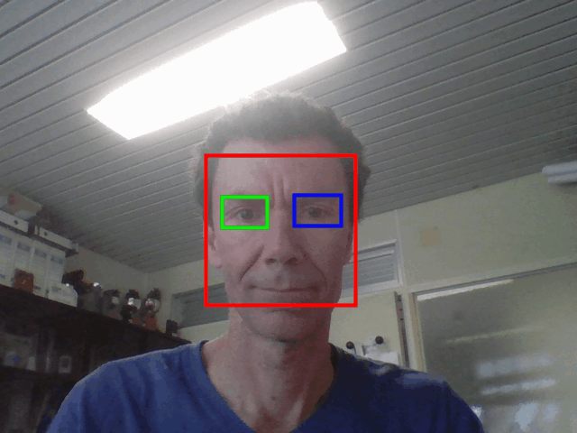  
*Detección de caras y ojos*

Una variante más costosa, tras detectar el rostro hace uso de un modelo de sus elementos para encajarlo en la imagen. El nuevo listado basado en el [ejemplo de Bryan Chung](http://www.magicandlove.com/blog/2018/08/19/face-landmark-detection-in-opencv-face-module-with-processing/) con el modelo proporcionado por [OpenCV](https://github.com/opencv/opencv_3rdparty/tree/contrib_face_alignment_20170818). Como punto de partida utiliza un detector de cascada para el rostro, como en el ejemplo anterior, intentando ajustar para cada cara detectada la máscara de puntos.
Tener presente que la ejecución fallará a menos que se haya descargado el mencionado modelo, que no se incluye en la versión de los ejemplos disponible en Github.


<!---
%https://github.com/chungbwc/Magicandlove/tree/master/ml20180818b --->

**Processing** [p6_camlandmarks](https://github.com/otsedom/CIU/tree/master/P6/p6_camlandmarks)
```
import java.lang.*;
import processing.video.*;
import cvimage.*;
import org.opencv.core.*;
//Detectores
import org.opencv.objdetect.CascadeClassifier;
//Máscara del rostro
import org.opencv.face.Face;
import org.opencv.face.Facemark;

Capture cam;
CVImage img;

//Detectores
CascadeClassifier face;
//Máscara del rostro
Facemark fm;
//Nombres
String faceFile, modelFile;

void setup() {
  size(640, 480);
  //Cámara
  cam = new Capture(this, width , height);
  cam.start();

  //OpenCV
  //Carga biblioteca core de OpenCV
  System.loadLibrary(Core.NATIVE_LIBRARY_NAME);
  println(Core.VERSION);
  img = new CVImage(cam.width, cam.height);

  //Detectores
  faceFile = "haarcascade_frontalface_default.xml";
  //Modelo de máscara
  modelFile = "face_landmark_model.dat";
  fm = Face.createFacemarkKazemi();
  fm.loadModel(dataPath(modelFile));
}

void draw() {  
  if (cam.available()) {
    background(0);
    cam.read();

    //Get image from cam
    img.copy(cam, 0, 0, cam.width, cam.height,
    0, 0, img.width, img.height);
    img.copyTo();


    //Imagen de entrada
    image(img,0,0);
    //Detección de puntos fiduciales
    ArrayList<MatOfPoint2f> shapes = detectFacemarks(cam);
    PVector origin = new PVector(0, 0);
    for (MatOfPoint2f sh : shapes) {
        Point [] pts = sh.toArray();
        drawFacemarks(pts, origin);
    }

  }
}

private ArrayList<MatOfPoint2f> detectFacemarks(PImage i) {
  ArrayList<MatOfPoint2f> shapes = new ArrayList<MatOfPoint2f>();
  CVImage im = new CVImage(i.width, i.height);
  im.copyTo(i);
  MatOfRect faces = new MatOfRect();
  Face.getFacesHAAR(im.getBGR(), faces, dataPath(faceFile));
  if (!faces.empty()) {
    fm.fit(im.getBGR(), faces, shapes);
  }
  return shapes;
}

private void drawFacemarks(Point [] p, PVector o) {
  pushStyle();
  noStroke();
  fill(255);
  for (Point pt : p) {
    ellipse((float)pt.x+o.x, (float)pt.y+o.y, 3, 3);
  }
  popStyle();
}
```

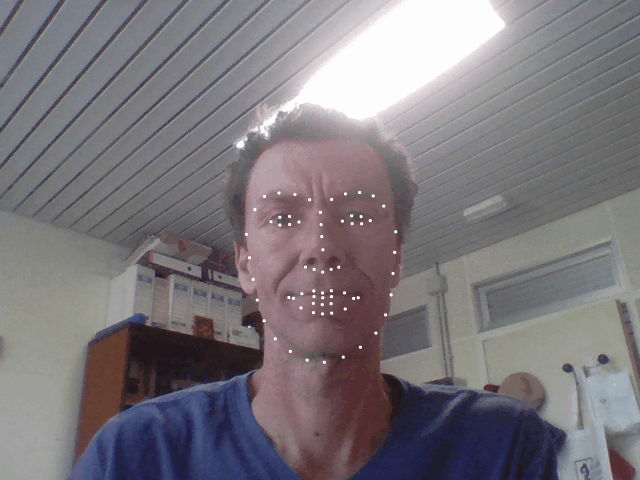  
*Detección de caras y máscara*

<!---
% Face OSC A partir de http://michaelkipp.de/interaction/camera.html --->
Una utilidad disponible basada en una malla ajustada al rostro es [FaceOSC](https://github.com/kylemcdonald/ofxFaceTracker/releases). El encaje de la malla sobre los elementos faciales, permite reconocer los movimientos de los elementos presentes en el rostro: cejas, ojos y boca. Para su utilización en Windows he realizado los siguientes pasos:

<!---
%Valores enviados
%https://github.com/kylemcdonald/ofxFaceTracker/wiki/Osc-message-specification --->

- Acceder a la página del [proyecto](https://github.com/kylemcdonald/ofxFaceTracker/releases), descargando *FaceOSC-v1.11-win.zip*.  
- Tras descomprimir, tenemos el ejecutable.  
- En Processing, acceder al menú *Herramientas -> Añadir herramientas -> Libraries*, buscar *oscP5* e instalar.  
- Acceder al proyecto *FaceOSC-Templates* a través de su enlace [Github](https://github.com/CreativeInquiry/FaceOSC-Templates) de Golan Levin, descargar y descomprimir. Para Processing, nos interesan los ejemplos incluidos en la carpeta homónima, *processing*.

Una vez que se cuenta con todos los elementos, será necesario lanzar *FaceOSC* antes de probar cualquiera de los ejemplos. Una vez lanzado *FaceOSC*, veremos una ventana con la vista de nuestra cámara, y la malla superpuesta sobre el rostro cuando sea localizada. El ejemplo *FaceOSCReceiver* (disponible en la carpeta de [processing](https://github.com/CreativeInquiry/FaceOSC-Templates/tree/master/processing) del proyecto de Golan Levin), cuyo listado se muestra más abajo, es un buen punto de partida para acceder a los datos de la malla facial, dibujando en la ventana de nuestro script de processing, los datos de los elementos faciales detectados por la aplicación *FaceOSC*.

**Processing**
```
//Código de FaceOSCReceiver
// A template for receiving face tracking osc messages from
// Kyle McDonald's FaceOSC https://github.com/kylemcdonald/ofxFaceTracker
//
// 2012 Dan Wilcox danomatika.com
// for the IACD Spring 2012 class at the CMU School of Art
//
// adapted from from Greg Borenstein's 2011 example
// http://www.gregborenstein.com/
// https://gist.github.com/1603230
//
import oscP5.*;
OscP5 oscP5;

// num faces found
int found;

// pose
float poseScale;
PVector posePosition = new PVector();
PVector poseOrientation = new PVector();

// gesture
float mouthHeight;
float mouthWidth;
float eyeLeft;
float eyeRight;
float eyebrowLeft;
float eyebrowRight;
float jaw;
float nostrils;

void setup() {
  size(640, 480);
  frameRate(30);

  oscP5 = new OscP5(this, 8338);
  oscP5.plug(this, "found", "/found");
  oscP5.plug(this, "poseScale", "/pose/scale");
  oscP5.plug(this, "posePosition", "/pose/position");
  oscP5.plug(this, "poseOrientation", "/pose/orientation");
  oscP5.plug(this, "mouthWidthReceived", "/gesture/mouth/width");
  oscP5.plug(this, "mouthHeightReceived", "/gesture/mouth/height");
  oscP5.plug(this, "eyeLeftReceived", "/gesture/eye/left");
  oscP5.plug(this, "eyeRightReceived", "/gesture/eye/right");
  oscP5.plug(this, "eyebrowLeftReceived", "/gesture/eyebrow/left");
  oscP5.plug(this, "eyebrowRightReceived", "/gesture/eyebrow/right");
  oscP5.plug(this, "jawReceived", "/gesture/jaw");
  oscP5.plug(this, "nostrilsReceived", "/gesture/nostrils");
}

void draw() {  
  background(255);
  stroke(0);

  if(found > 0) {
    translate(posePosition.x, posePosition.y);
    scale(poseScale);
    noFill();
    ellipse(-20, eyeLeft * -9, 20, 7);
    ellipse(20, eyeRight * -9, 20, 7);
    ellipse(0, 20, mouthWidth* 3, mouthHeight * 3);
    ellipse(-5, nostrils * -1, 7, 3);
    ellipse(5, nostrils * -1, 7, 3);
    rectMode(CENTER);
    fill(0);
    rect(-20, eyebrowLeft * -5, 25, 5);
    rect(20, eyebrowRight * -5, 25, 5);
  }
}

// OSC CALLBACK FUNCTIONS

public void found(int i) {
  println("found: " + i);
  found = i;
}

public void poseScale(float s) {
  println("scale: " + s);
  poseScale = s;
}

public void posePosition(float x, float y) {
  println("pose position\tX: " + x + " Y: " + y );
  posePosition.set(x, y, 0);
}

public void poseOrientation(float x, float y, float z) {
  println("pose orientation\tX: " + x + " Y: " + y + " Z: " + z);
  poseOrientation.set(x, y, z);
}

public void mouthWidthReceived(float w) {
  println("mouth Width: " + w);
  mouthWidth = w;
}

public void mouthHeightReceived(float h) {
  println("mouth height: " + h);
  mouthHeight = h;
}

public void eyeLeftReceived(float f) {
  println("eye left: " + f);
  eyeLeft = f;
}

public void eyeRightReceived(float f) {
  println("eye right: " + f);
  eyeRight = f;
}

public void eyebrowLeftReceived(float f) {
  println("eyebrow left: " + f);
  eyebrowLeft = f;
}

public void eyebrowRightReceived(float f) {
  println("eyebrow right: " + f);
  eyebrowRight = f;
}

public void jawReceived(float f) {
  println("jaw: " + f);
  jaw = f;
}

public void nostrilsReceived(float f) {
  println("nostrils: " + f);
  nostrils = f;
}

// all other OSC messages end up here
void oscEvent(OscMessage m) {
  if(m.isPlugged() == false) {
    println("UNPLUGGED: " + m);
  }
}
```

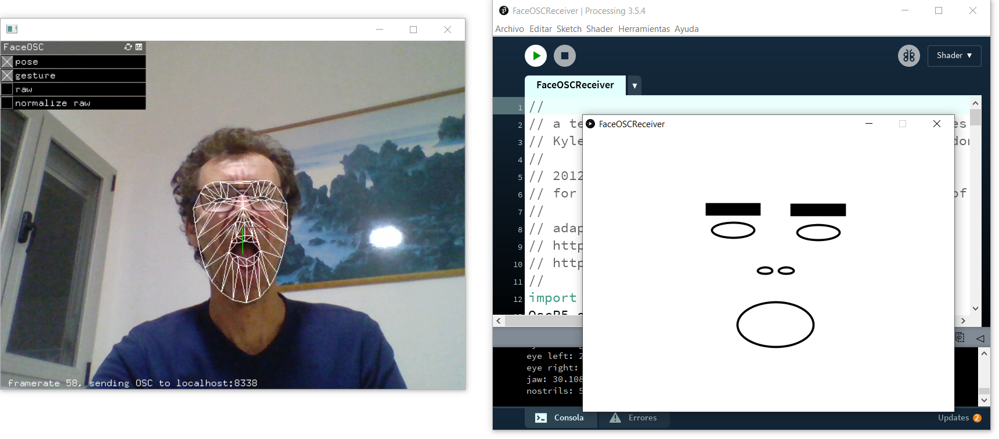  
*Ejecución de FaceOSC y FaceOSCReceiver*


<!---
%FaceOSC
%Derivan de FaceOSCReceiver demo
%Ver por ejemplo FaceOSCCursor
%Puppet
%https://youtu.be/chEUCIMaggA
%¿Cómo mostrar/capturar la imagen también en processing?
%Syphon (Mac only)
%https://gist.github.com/atduskgreg/3929016
%https://github.com/CreativeInquiry/FaceOSC-Templates/blob/master/processing/FaceOSCSyphon/FaceOSCSyphon.pde


%https://andressenn.com/processing-y-osc/ --->
Como culturilla, OSC es el acrónimo de *Open Sound Control* y si bien nace como protocolo de comunicaciones entre instrumentos musicales electrónicos, sintetizadores y  software, con el propósito de sustituir al MIDI, se ha convertido en un  protocolo genérico de comunicación entre dispositivos multimedia, como se aprecia en este contexto.


Si bien no de una forma totamente equivalente, una buena parte de las funcionalidades descritas en los ejemplos previos
está presente en el prototipo p5js disponible a través de [Glitch}(https://glitch.com/edit/#!/macaronight-test?path=README.md%3A1%3A0) para su ejecución en el navegador. El código no hace uso de las utilidades de OpenCV, al ser
operaciones básicas en su mayoría, realiza los cálculos de forma directa o en su defecto por medio de *shaders*. Además de
acceder al código con el enlace previo, es posiblesu acceso en modo [demo](https://macaronight-test.glitch.me) cuyo código QR es:

  
*QR de la demo p5js*

La mencionada demo p5js no incluye aún modelos de [MediaPipe](https://google.github.io/mediapipe/), te recomiendo echar un vistazo a un [ejemplo p5js con la máscara facial](https://editor.p5js.org/lingdong/sketches/ef6FB-uNq).

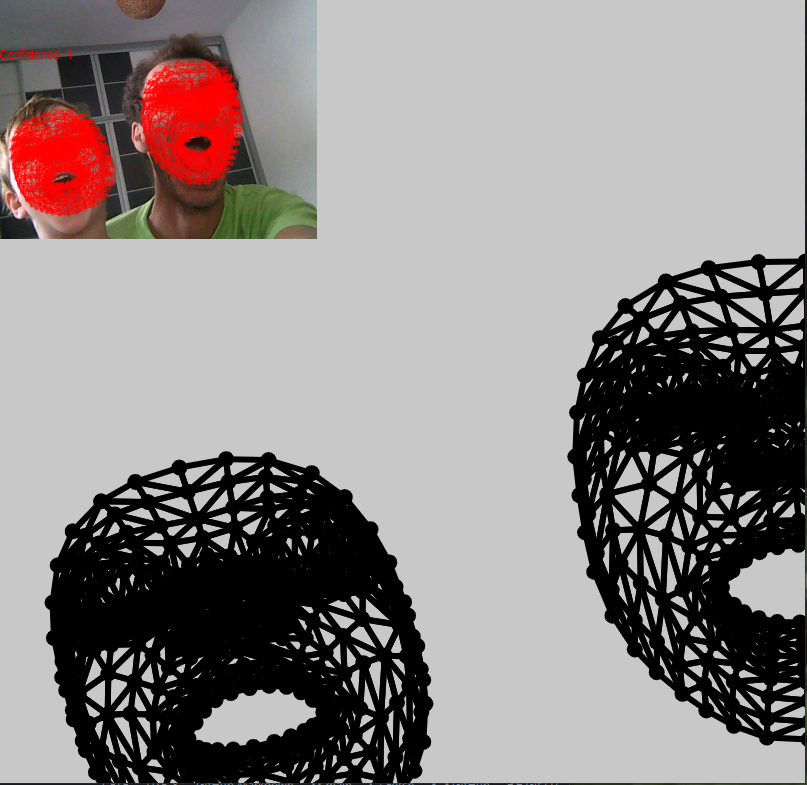  
*Demo p5js malla facial*

#### 6.4.2 Personas

##### 6.4.2.1 Kinect

Con la versión 1 del sensor (la segunda impone restricciones sobre el hardware como se indica más abajo), no hemos logrado ejecutar en un sistema operativo que no sea Windows. Asumiendoportanto un sistema operativo Windows con una Kinect v1, desde Processing ha sido necesario realizar previamente los siguientes pasos:

- Instalar el SDK para Kinect v1.8, que está disponible en este [enlace](https://www.microsoft.com/en-us/download/details.aspx?id=40278).
- Conectar el dispositivo.
- Desde Processing acceder al menú *Herramientas -> Aadir herramientas ´-> Libraries*, buscar Kinect. Instalamos *Kinect4WinSDK*.


A partir del [ejemplo base de Bryan Chung](http://www.magicandlove.com/blog/tag/kinect/), incluido en la galería de ejemplos tras instalar la biblioteca, se ha adaptado  para además de los esqueletos, modificar la forma en que se puede acceder ala información de la mano derecha, modificando su salida gráfica, ver el listado. Como es habitual, en el *setup* se crea la instancia a la variable *Kinect*, para obtener las distintas imágenes en el *draw* dibujando el esqueleto, sus articulaciones, además de un círculo en la posición de la mano derecha.


**Processing** [p6_kinectv1](https://github.com/otsedom/CIU/tree/master/P6/p6_kinectv1)
```
import kinect4WinSDK.Kinect;
import kinect4WinSDK.SkeletonData;


Kinect kinect;
ArrayList <SkeletonData> bodies;

void setup()
{
  size(640, 480);
  background(0);
  //Inicializaciones relacionadas con la Kinect
  kinect = new Kinect(this);
  smooth();
  bodies = new ArrayList<SkeletonData>();
}

void draw()
{
  background(0);
  //Pinta las imágenes de entrada, profundidad y máscara
  image(kinect.GetImage(), 320, 0, 320, 240);
  image(kinect.GetDepth(), 320, 240, 320, 240);
  image(kinect.GetMask(), 0, 240, 320, 240);
  //Dibuja esqueletos
  for (int i=0; i<bodies.size (); i++)
  {
    drawSkeleton(bodies.get(i));
    drawPosition(bodies.get(i));

    //Circunferencia mano derecha pimer esqueleto
    if (i==0)
    {
      pushStyle();
      fill(255,0,0,50);
      //Detectada
      if (bodies.get(i).skeletonPositionTrackingState[Kinect.NUI_SKELETON_POSITION_HAND_RIGHT]!=Kinect.NUI_SKELETON_POSITION_NOT_TRACKED)
      {
        ellipse(bodies.get(i).skeletonPositions[Kinect.NUI_SKELETON_POSITION_HAND_RIGHT].x*width/2,
        bodies.get(i).skeletonPositions[Kinect.NUI_SKELETON_POSITION_HAND_RIGHT].y*height/2,30,30);
      }
      popStyle();
    }
  }
}

void drawPosition(SkeletonData _s)
{
  noStroke();
  fill(0, 100, 255);
  String s1 = str(_s.dwTrackingID);
  text(s1, _s.position.x*width/2, _s.position.y*height/2);
}

//Interfaz para dibujar el esqueleto
void drawSkeleton(SkeletonData _s)
{
  // Cuerpo
  DrawBone(_s,
  Kinect.NUI_SKELETON_POSITION_HEAD,
  Kinect.NUI_SKELETON_POSITION_SHOULDER_CENTER);
  DrawBone(_s,
  Kinect.NUI_SKELETON_POSITION_SHOULDER_CENTER,
  Kinect.NUI_SKELETON_POSITION_SHOULDER_LEFT);
  DrawBone(_s,
  Kinect.NUI_SKELETON_POSITION_SHOULDER_CENTER,
  Kinect.NUI_SKELETON_POSITION_SHOULDER_RIGHT);
  DrawBone(_s,
  Kinect.NUI_SKELETON_POSITION_SHOULDER_CENTER,
  Kinect.NUI_SKELETON_POSITION_SPINE);
  DrawBone(_s,
  Kinect.NUI_SKELETON_POSITION_SHOULDER_LEFT,
  Kinect.NUI_SKELETON_POSITION_SPINE);
  DrawBone(_s,
  Kinect.NUI_SKELETON_POSITION_SHOULDER_RIGHT,
  Kinect.NUI_SKELETON_POSITION_SPINE);
  DrawBone(_s,
  Kinect.NUI_SKELETON_POSITION_SPINE,
  Kinect.NUI_SKELETON_POSITION_HIP_CENTER);
  DrawBone(_s,
  Kinect.NUI_SKELETON_POSITION_HIP_CENTER,
  Kinect.NUI_SKELETON_POSITION_HIP_LEFT);
  DrawBone(_s,
  Kinect.NUI_SKELETON_POSITION_HIP_CENTER,
  Kinect.NUI_SKELETON_POSITION_HIP_RIGHT);
  DrawBone(_s,
  Kinect.NUI_SKELETON_POSITION_HIP_LEFT,
  Kinect.NUI_SKELETON_POSITION_HIP_RIGHT);

  // Brazo izquierdo
  DrawBone(_s,
  Kinect.NUI_SKELETON_POSITION_SHOULDER_LEFT,
  Kinect.NUI_SKELETON_POSITION_ELBOW_LEFT);
  DrawBone(_s,
  Kinect.NUI_SKELETON_POSITION_ELBOW_LEFT,
  Kinect.NUI_SKELETON_POSITION_WRIST_LEFT);
  DrawBone(_s,
  Kinect.NUI_SKELETON_POSITION_WRIST_LEFT,
  Kinect.NUI_SKELETON_POSITION_HAND_LEFT);

  // Brazo derecho
  DrawBone(_s,
  Kinect.NUI_SKELETON_POSITION_SHOULDER_RIGHT,
  Kinect.NUI_SKELETON_POSITION_ELBOW_RIGHT);
  DrawBone(_s,
  Kinect.NUI_SKELETON_POSITION_ELBOW_RIGHT,
  Kinect.NUI_SKELETON_POSITION_WRIST_RIGHT);
  DrawBone(_s,
  Kinect.NUI_SKELETON_POSITION_WRIST_RIGHT,
  Kinect.NUI_SKELETON_POSITION_HAND_RIGHT);

  // Pierna izquierda
  DrawBone(_s,
  Kinect.NUI_SKELETON_POSITION_HIP_LEFT,
  Kinect.NUI_SKELETON_POSITION_KNEE_LEFT);
  DrawBone(_s,
  Kinect.NUI_SKELETON_POSITION_KNEE_LEFT,
  Kinect.NUI_SKELETON_POSITION_ANKLE_LEFT);
  DrawBone(_s,
  Kinect.NUI_SKELETON_POSITION_ANKLE_LEFT,
  Kinect.NUI_SKELETON_POSITION_FOOT_LEFT);

  // Pierna derecha
  DrawBone(_s,
  Kinect.NUI_SKELETON_POSITION_HIP_RIGHT,
  Kinect.NUI_SKELETON_POSITION_KNEE_RIGHT);
  DrawBone(_s,
  Kinect.NUI_SKELETON_POSITION_KNEE_RIGHT,
  Kinect.NUI_SKELETON_POSITION_ANKLE_RIGHT);
  DrawBone(_s,
  Kinect.NUI_SKELETON_POSITION_ANKLE_RIGHT,
  Kinect.NUI_SKELETON_POSITION_FOOT_RIGHT);
}

//Interfaz para dibuar un hueso
void DrawBone(SkeletonData _s, int _j1, int _j2)
{
  noFill();
  stroke(255, 255, 0);
  //Comprueba validez del dato
  if (_s.skeletonPositionTrackingState[_j1] != Kinect.NUI_SKELETON_POSITION_NOT_TRACKED &&
    _s.skeletonPositionTrackingState[_j2] != Kinect.NUI_SKELETON_POSITION_NOT_TRACKED) {
    line(_s.skeletonPositions[_j1].x*width/2,
    _s.skeletonPositions[_j1].y*height/2,
    _s.skeletonPositions[_j2].x*width/2,
    _s.skeletonPositions[_j2].y*height/2);
  }
}

void appearEvent(SkeletonData _s)
{
  if (_s.trackingState == Kinect.NUI_SKELETON_NOT_TRACKED)
  {
    return;
  }
  synchronized(bodies) {
    bodies.add(_s);
  }
}

void disappearEvent(SkeletonData _s)
{
  synchronized(bodies) {
    for (int i=bodies.size ()-1; i>=0; i--)
    {
      if (_s.dwTrackingID == bodies.get(i).dwTrackingID)
      {
        bodies.remove(i);
      }
    }
  }
}

void moveEvent(SkeletonData _b, SkeletonData _a)
{
  if (_a.trackingState == Kinect.NUI_SKELETON_NOT_TRACKED)
  {
    return;
  }
  synchronized(bodies) {
    for (int i=bodies.size ()-1; i>=0; i--)
    {
      if (_b.dwTrackingID == bodies.get(i).dwTrackingID)
      {
        bodies.get(i).copy(_a);
        break;
      }
    }
  }
}
```

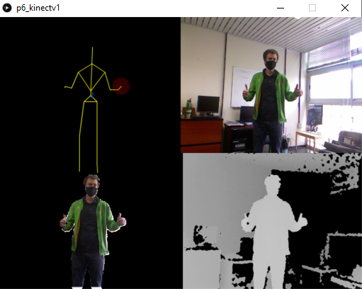  
*Salida del ejemplo p6_kinectv1*


La segunda versión del sensor proporciona mayor resolución y calidad tanto en la imagen en color, como en los datos de profundidad obtenidos. La [biblioteca para Processing](http://codigogenerativo.com/kinectpv2/) se debe a Thomas Sanchez Lengeling. Su instalación es posible a través de la opción de menú *Añadir Herramientas*, y dentro de la pestaña *Libraries* buscar la biblioteca *Kinect v2 for Processing*. Previamente es necesario instalar el [Kinect SDK v2](https://www.microsoft.com/en-us/download/details.aspx?id=44561), además de contar con un equipo con USB 3.0 y 64 bits. Con estas restricciones y disponiendo de un único sensor de estas características, no nos permite verlo, si bien se han incluido las pautas para su instalación, que posibilitan la posterior ejecución de ejemplos de la galería de ejemplos de la biblioteca instalada. Similar al de la versión previa del sensor puede ser *SkeletonMaskDepth*, y sin GPU puede ser también interesante ejecutar *PointCloudOGL*.

<!---
%Más Kinext
%Kinect
%https://forum.processing.org/two/discussion/18141/kinect-physics-example-updated-for-processing-3-and-openkinect-library
%Open Kinect y processing
%https://github.com/shiffman/OpenKinect-for-Processing --->

##### 6.4.2.2 Esqueleto

De nuevo basado en el [ejemplo de Bryan Chung para un único individuo](http://www.magicandlove.com/blog/2018/08/06/openpose-in-processing-and-opencv-dnn/), el listado siguiente aplica el detector basado en Openpose [CaoZ17] para determinar el esqueleto de una persona. En dicha referencia puedes además encontrar el enlace al modelo de *Caffe* necesario (en el listado se hace referencia al pesado *pose_iter_440000.caffemodel*), que no ha podido subirse al repositorio Github, y está disponible en el [enlace](http://posefs1.perception.cs.cmu.edu/OpenPose/models/pose/coco/pose_iter_440000.caffemodel).
Los requisitos computacionales suben significativamente, contar con GPU se nota.


**Processing** [p6_cam_openpose](https://github.com/otsedom/CIU/tree/master/P6/p6_cam_openpose)
```
//Adaptado de fuente original http://www.magicandlove.com/blog/2018/08/06/openpose-in-processing-and-opencv-dnn/
import processing.video.*;
import cvimage.*;
import org.opencv.core.*;
import org.opencv.core.Core.MinMaxLocResult;
import org.opencv.dnn.*;
import java.util.*;

final int CELL = 46;
final int W = 368, H = 368;
final float THRESH = 0.1f;
static int pairs[][] = {
  {1, 2}, // left shoulder
  {1, 5}, // right shoulder
  {2, 3}, // left arm
  {3, 4}, // left forearm
  {5, 6}, // right arm
  {6, 7}, // right forearm
  {1, 8}, // left body
  {8, 9}, // left thigh
  {9, 10}, // left calf
  {1, 11}, // right body
  {11, 12}, // right thigh
  {12, 13}, // right calf
  {1, 0}, // neck
  {0, 14}, // left nose
  {14, 16}, // left eye
  {0, 15}, // right nose
  {15, 17}  // right eye
};
private float xRatio, yRatio;
private CVImage img;
private Net net;
private Capture cam;


public void setup() {
  size(320, 240);
  //Cámara
  cam = new Capture(this, width, height);
  cam.start();

  //OpenCV
  //Carga biblioteca core de OpenCV
  System.loadLibrary(Core.NATIVE_LIBRARY_NAME);
  println(Core.VERSION);
  img = new CVImage(W, H);


  //Carga modelos
  net = Dnn.readNetFromCaffe(dataPath("openpose_pose_coco.prototxt"),
    dataPath("pose_iter_440000.caffemodel"));
  //net.setPreferableBackend(Dnn.DNN_BACKEND_DEFAULT);
  //net.setPreferableTarget(Dnn.DNN_TARGET_OPENCL);

  //Relación cámara ventana
  xRatio = (float)width / W;
  yRatio = (float)height / H;
}

public void draw() {
  if (cam.available()) {
    //Lectura del sensor
    cam.read();
    background(0);
    //Muestra imagen capturada
    image(cam, 0, 0);

    //Obtiene imagen para procesamiento
    img.copy(cam, 0, 0, cam.width, cam.height,
      0, 0, img.width, img.height);
    img.copyTo();
    //Procesa
    Mat blob = Dnn.blobFromImage(img.getBGR(), 1.0/255,
      new Size(img.width, img.height),
      new Scalar(0, 0, 0), false, false);
    net.setInput(blob);
    Mat result = net.forward().reshape(1, 19);

    ArrayList<Point> points = new ArrayList<Point>();
    for (int i=0; i<18; i++) {
      Mat heatmap = result.row(i).reshape(1, CELL);
      MinMaxLocResult mm = Core.minMaxLoc(heatmap);
      Point p = new Point();
      if (mm.maxVal > THRESH) {
        p = mm.maxLoc;
      }
      heatmap.release();
      points.add(p);
      }

    //Dibuja esqueleto
    float sx = (float)img.width*xRatio/CELL;
    float sy = (float)img.height*yRatio/CELL;
    pushStyle();
    noFill();
    strokeWeight(2);
    stroke(255, 255, 0);
    for (int n=0; n<pairs.length; n++) {
      Point a = points.get(pairs[n][0]).clone();
      Point b = points.get(pairs[n][1]).clone();
      if (a.x <= 0 ||
        a.y <= 0 ||
        b.x <= 0 ||
        b.y <= 0)
        continue;
      a.x *= sx;
      a.y *= sy;
      b.x *= sx;
      b.y *= sy;
      line((float)a.x, (float)a.y,
        (float)b.x, (float)b.y);
    }
    popStyle();
    blob.release();
    result.release();
  }
}
```
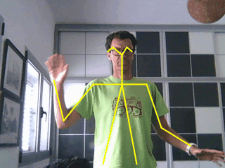  
*Detección con Openpose*

Inspirado en *FaceOSC* han surgido propuestas para acelerar el proceso, ejecutando el detector de pose externamente, y comunicando los datos de detección con OSC. No he localizado una versión de Openpose con OSC. Una opción alternativa es ejemplo para PoseNet es [PoseOSC](https://github.com/LingDong-/PoseOSC) desarrollado por Lingdong Huang. Su repositorio Github es una estupenda fuente de recursos. La versión de *PoseOSC* ejecutable en Windows está disponible en la sección *Releases* del Github, el código para Processing, en la carpeta *demos/PoseOSCProcessingReceiver*. Tras lanzar ambas aplicaciones, ver figura, la velocidad de detección es significativamente mayor, que en el ejemplo detectando directamente desde Processing. Tener en cuenta que para que el script de Processing reciba los datos, al estar configurado para xml en la aplicación *PoseOSC* debe especificarse *format XML* en lugar de *format ARR*.

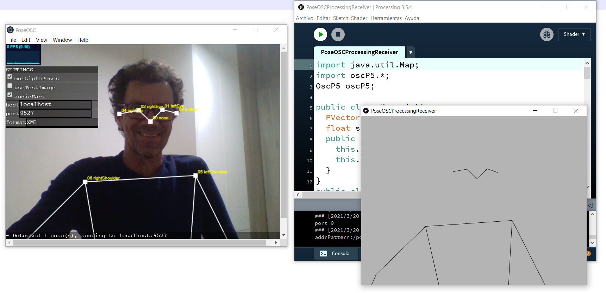  
*Ejecución de PoseOSC y PoseOSCProcessingReceiver*

<!--- %2021 Jonay Sánchez con PoseOSC no visible en github --->

<!---
%https://github.com/LingDong-/PoseOSC/releases --->

#### 6.4.3 RealSense

Como alternativa al sensor Kinect, se propone el uso de la RealSense 435i. Para su utilización se han seguido los siguientes pasos en entorno Winows:

<!--- %Ultima en portátil Intel® RealSense™ SDK 2.0 (v2.42.0) --->

- Instalar *Realsense SDK*, descargado desde este  [enlace](https://github.com/IntelRealSense/librealsense/releases).  
- Si interesara únicamente poder ejecutar la aplicación de visualización de Intel, descargar de esa misma página *Intel.RealSense.Viewer.exe*. Al lanzar, tras  aceptar, comprobar que funcionan modo 2D, 3D y RGB tras ir activando en la interfaz.  
- Si vamos directamente a  Processing, debería bastar con instalar la biblioteca *Intel RealSense for Processing* de Florian Bruggisser, que cuenta también con un repositorio [Github](https://github.com/cansik/realsense-processing).

Entre los ejemplos, *Bibliotecas->Intel RealSense for Processing*, el ejemplo *CameraAvailable* que reproducimos en el siguiente listado~ comprueba la presencia de un sensor con el método *isDeviceAvailable*.

**Processing**
```
import ch.bildspur.realsense.*;

RealSenseCamera camera = new RealSenseCamera(this);

void setup()
{
  size(640, 480);
}

void draw()
{
  background(55);

  textSize(20);
  textAlign(CENTER, CENTER);

  if (camera.isDeviceAvailable())
  {
    fill(100, 255, 100);
    text("camera available!", width / 2, height / 2);
  } else
  {
    fill(255, 100, 100);
    text("no camera available!", width / 2, height / 2);
  }
}
```

Más interesante es acceder a los flujos de datos, tanto de profundidad como color. En el listado se fusionan los ejemplos *DisplayRGBStream* y *DisplayDepthStream*, accediendo a la imagen obtenida RGB, y la de profundidad, que hace uso de una representación en color para las distintas profundidades.

**Processing** [p6_realsense_rgbdepth](https://github.com/otsedom/CIU/tree/master/P6/p6_realsense_rgbdepth)
```
import ch.bildspur.realsense.*;
import ch.bildspur.realsense.type.*;

RealSenseCamera camera = new RealSenseCamera(this);

void setup()
{
  size(1280, 480);

  // Activa entrada de color
  camera.enableColorStream(640, 480, 30);

  // Activa entrada de profundidad
  camera.enableDepthStream(640, 480);
  // Activa pseudocolor de profundidad
  camera.enableColorizer(ColorScheme.Cold);
  camera.start();
}

void draw()
{
  background(0);
  // Carga fotogramas
  camera.readFrames();

  // Muestra la imagen RGB
  image(camera.getColorImage(), 0, 0);
  // Muestra imagen de profundidad
  image(camera.getDepthImage(), width/2, 0);
}
```

Sugerir probar los ejemplos *DisplayIRStream* y *PointCloudViewer*. El primero muestra la entrada infrarrojo, mientras que el segundo permite *jugar* con la nube de puntos 3d obtenida.

Como ejemplo final, el listado siguiente muestra el uso de una variable *thresholdFilter* para delimitar una profundidad máxima a mostrar.


**Processing** [p6_realsense_rgbdepthfilter](https://github.com/otsedom/CIU/tree/master/P6/p6_realsense_rgbdepthfilter)
```
import ch.bildspur.realsense.*;
import ch.bildspur.realsense.type.*;

import ch.bildspur.realsense.processing.RSFilterBlock;
import org.intel.rs.processing.ThresholdFilter;
import org.intel.rs.types.Option;

RealSenseCamera camera = new RealSenseCamera(this);

RSFilterBlock thresholdFilter = new RSFilterBlock();

float minDistance = 0.0f;
float maxDistance = 4.0f;
float size = 1f;

void setup()
{
  size(1280, 480);

  // Activa entrada de color
  camera.enableColorStream(640, 480, 30);

  // Activa entrada de profundidad
  camera.enableDepthStream(640, 480);
  // Activa pseudocolor de profundidad
  camera.enableColorizer(ColorScheme.Cold);

  // Crea un filtro
  thresholdFilter.init(new ThresholdFilter());
  camera.addFilter(thresholdFilter);
  camera.start();
}

void draw()
{
  background(0);

  // Asocia la posición del ratón al centro de la distancia a filtrar
  float filterCenter = map(mouseX, 0, width, minDistance, maxDistance);

  //Define límites de profundidades a mostrar
  thresholdFilter.setOption(Option.MinDistance, minDistance);
  thresholdFilter.setOption(Option.MaxDistance, filterCenter);

  // Carga fotogramas
  camera.readFrames();

  // Muestra la imagen RGB
  image(camera.getColorImage(), 0, 0);
  // Muestra imagen de profundidad
  image(camera.getDepthImage(), width/2, 0);
}
```

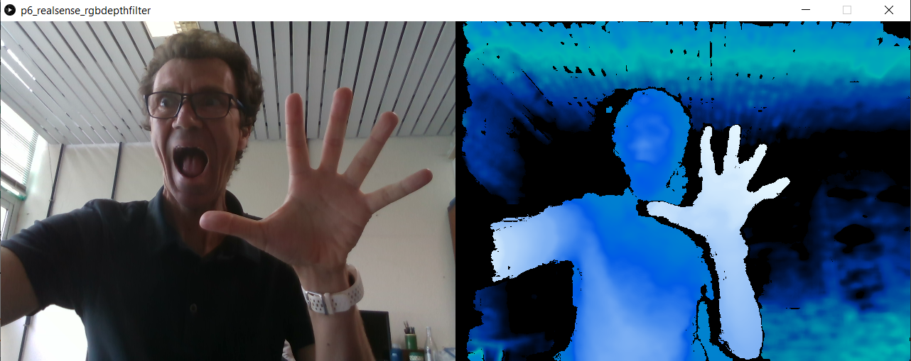  
*Ejecución de p6_realsense_rgbdepthfilter*

<!---
%Intelrealsense
%Processing https://github.com/edwinRNDR --->


#### 6.4.4 Manos

<!---
%Leapmotion y processing
%https://developer-archive.leapmotion.com/documentation/java/devguide/Leap\_Processing.html --->

Incluimos en esta subsección la experiencia con el sensor [Leap Motion](https://www.ultraleap.com/tracking/) que permite conocer la posición de todos los elementos a ambas manos, con diversas posibilidades para interacción.

Tras disponer de un dispositivo, para conseguir hacer uso del mismo bajo Windows 10 desde Processing, se han realizado los siguientes pasos:

- Descargar el *driver* desde el [enlace oficial](https://developer.leapmotion.com/setup), donde se ha optado por la versión para escritorio V2.  
- Al ser Windows 10 se ha tenido que realizar un *fix*,  más información en este [enlace](https://forums.leapmotion.com/t/resolved-windows-10-fall-creators-update-bugfix/6585
).  
- Instalar *Leap Motion for Processing* siguiendo las instrucciones disponibles en el [enlace](https://github.com/nok/leap-motion-processing).

Una vez finalizada la instalación pueden ejecutarse las aplicaciones con sus demos (*Leap Motion App Home*), así como los ejemplos básicos incluidos en Processing. El ejemplo  *LM_1_Basics* muestra la visualización de ambas manos


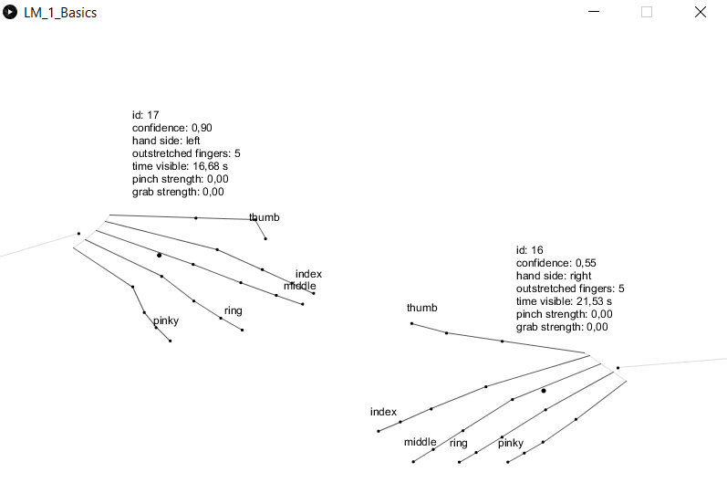  
*Ejecución de LM_1_Basics*


Por otrolado, el ejemplo *LM_2_Gestures*
aborda el reconocimiento de gestos realizados. En el  [enlace](http://michaelkipp.de/interaction/leap.html) se describen en detalle los ejemplos, incluyendo alguna propuesta adicional, disponible en [Github](https://github.com/mkipp/LeapInteraction).

<!---
%Machine Learning + AR + Music?

%https://www.linkedin.com/posts/hartwoolery_machinelearning-fingerdrum-ios-ugcPost-6595379443315937280-cCNc/ --->

[MediaPipe](https://google.github.io/mediapipe/) ofrece l aposibilidad de no necesitar un sensor específoco, mira el [ejemplo p5js con detección de mano](https://editor.p5js.org/lingdong/sketches/1viPqbRMv).

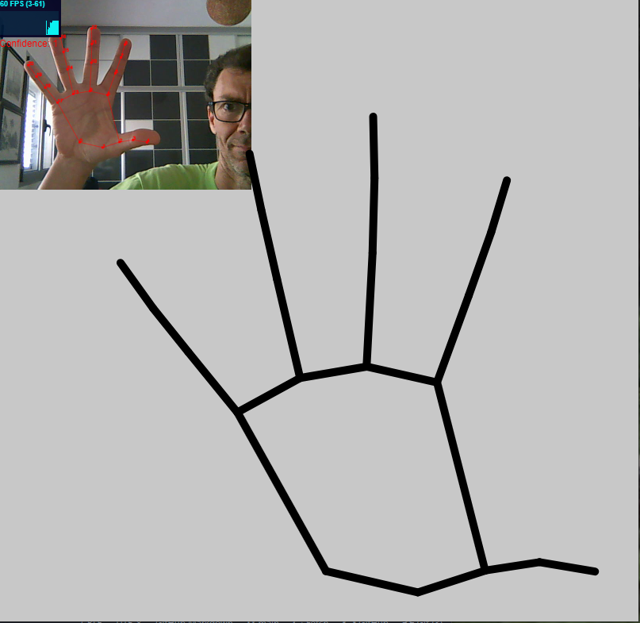  
*Demo p5js detección mano*

#### 6.5 Galería


No dejar de citar algunas referencias para integrar otros dispositivos y elementos:

- Material del curso [Interaction Engineering](http://michaelkipp.de/interaction/index.html) del profesor Michael Kipp de la Universidad de Ciencia Aplicada de Augsburg que cubre una variedfad de dispositivos y elementos de interacción (Kinect, TUIO, eye gaze, etc.) y su integración en Processing. No dejes de visitar la página de [proyectos](http://michaelkipp.de/interaction/projects/).  

- [Controlador de Xbox y Processing](http://www.lagers.org.uk/gamecontrol/index.html).  

- Sugerir la visita al repositorio que integra [OpenFace con un cliente OSC](https://github.com/yurikleb/OpenFace).  

De cursos anteriores

- La propuesta de un compañero de CIU del curso 2021 que integra algunas modelos DNN preentrenados *[Leopoldo López(https://github.com/qwerteleven/CIU_prototipo_video) demo con DNN*

  

- [Fruit Samurai](https://github.com/mariofdezzz/fruit-samurai) 20/21 integrando p5js con Mediapipe

Como cierre de este capítulo, esta sección incluye una breve selección de propuestas que utilizan de imágenes para interacción:


- [Discrete figures](https://www.agolpedeefecto.com/teatro_2018/teatro-discrete-figures.html)  <!---  %https://youtu.be/hauXQQhwbgM  --->  
- [Más que la cara](https://medium.com/@zachlieberman/más-que-la-cara-overview-48331a0202c0). Pueden interesar los filtros que muestra en su perfil de [instagram](https://www.instagram.com/zach.lieberman).  
<!---%https://medium.com/@zachlieberman/más-que-la-cara-overview-48331a0202c0
%Comenta el problema de la imagen en ambas aplicaciones
%paper.js
%https://vimeo.com/211271693 --->

- [@aoepng](https://twitter.com/aoepng/status/1119591148991811584?s=20)

<!--- %http://www.aspiremirror.com --->

- [Messa di voce](https://zkm.de/en/artwork/messa-di-voce)
<!--- %https://vimeo.com/221802940--->  

- [My little piece or privacy](https://www.niklasroy.com/project/88/my-little-piece-of-privacy)  
- [Starfield](https://www.creativeapplications.net/openframeworks/starfield-by-lab212-interactive-galaxy-the-swing-and-kinect/)  

- Más información sobre Media pipe:   
  - [Face and hand tracking in the browser with MediaPipe and TensorFlow.js](https://blog.tensorflow.org/2020/03/face-and-hand-tracking-in-browser-with-mediapipe-and-tensorflowjs.html?m=1)  

  - [Mediapipe Handpose and Facemesh Demos](https://github.com/LingDong-/handpose-demos)  

- [Funny Mirrors](https://www.learnopencv.com/funny-mirrors-using-opencv/?ck_subscriber_id=490036040)

- [Introduction to Webcam Effects with Processing (Java)](https://youtu.be/6pGEk2dQnss), bastante básico.  


<!---
%ried to do some simple emoji detection with @tensorflow.js
%https://twitter.com/bourdakos1/status/1125436388026060801
%LIBROOOOOOOOOOOOOO código Bryan Chung
%https://github.com/Apress/pro-processing-images-and-computer-vision-opencv
%A Kinect Audio Visual Installation
%https://github.com/iamterryclark/Kinect_Audio_Visualisation
%Face Morpher
%https://github.com/shiffman/Face-It/tree/master/FaceMorphing/FaceMorph
--->

#### 6.6 Tarea

Proponer un concepto y su prototipo de combinación de salida gráfica e interacción en respuesta a una captura de vídeo. Una sugerencia puede ser inspirarse en trabajos ya existentes, como los de la galería.

La entrega se debe realizar a través del campus virtual, remitiendo un enlace a un proyecto github, cuyo README sirva de memoria, por lo que se espera que el README:

- identifique al autor,
- describa el trabajo realizado,
- argumente decisiones adoptadas para la solución propuesta,
- incluya referencias y herramientas utilizadas,
- muestre el resultado con un gif animado.

### Referencias

[Cao17] Zhe Cao and Tomas Simon and Shih-En Wei and Yaser Sheik. Realtime Multi-Person 2D Pose Estimation using Part Affinity Fields. CVPR, 2017.  
[Castrillon11] Modesto Castrillón, Oscar Déniz,DanielHernández, and Javier Lorenzo. A comparison of face  and facial feature detectors based on the violajones general object detection framework. Machine Vision and Applications,2011.   
[Lienhart02] Rainer Lienhart and Jochen Maydt. An extended set of Haar-like features for rapid object detection. ICIP 2002  
[Szeliski22] Richard Szeliski. Computer Vision: Algorithms and Applications, 2nd ed., 2022  
[Viola04] Paul Viola and Michael J. Jones. Robust real-time face detection. International Journal of Computer Vision, 2004  


***
Bajo licencia de Creative Commons Reconocimiento - No Comercial 4.0 Internacional
