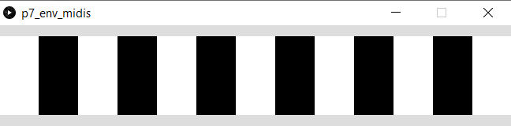
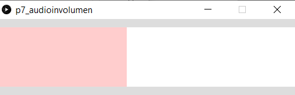
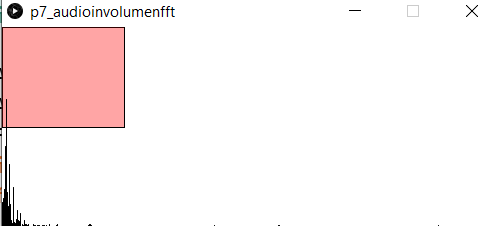
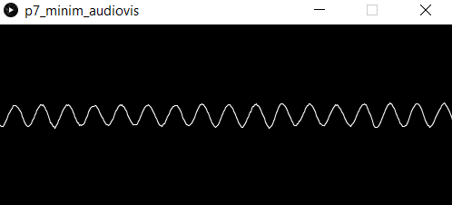
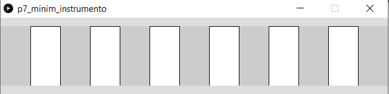

## Práctica 7. Síntesis y procesamiento de audio

### Contenidos

[Síntesis](#71-síntesis)  
[Análisis](#72-análisis)  
[Minim](#73-minim)  
[Galería](#74-galería)  
[Tarea](#75-tarea)  

<!---
%Francisco Sosa FranciscoSosa/CIU_P7 visualiza los osciladores básicos con MInim --->

Como describe el tutorial disponible en la web de [Processing](https://processing.org/tutorials/sound/), han sido significativos los avances en reproducción y transmisión de la señal de sonido desde finales del siglo XIX.
El sonido se propaga como onda a través de un medio, comprimiendo y descomprimiendo la materia que encuentra a su paso. La cantidad de desplazamiento, refleja la amplitud del sonido, que en el mundo natural se corresponde con la combinación de diversas componentes discretas. Medir dicho desplazamiento define la intensidad del sonido, percibiendo el oído humano frecuencias entre 20 y 20000 Hz. El audio es la interpretación del sonido por un sistema. El esquema de digitalización más frecuente se denomina PCM (del inglés *pulse-code modulation*), aplicando un muestreo, que determina la mayor frecuencia medible, además de una resolución numérica, un número de bits, del valor registrado.
En esta práctica se describen algunas nociones básicas para la síntesis y análisis con Processing.


### 7.1  Síntesis

La carga de ficheros de audio, tipo wav o aiff, se trató en el guion de la primera práctica, haciendo uso de la biblioteca [Sound](https://processing.org/reference/libraries/sound/index.html), que además de las posibilidades descritas a continuación, permite llevar a cabo una configuración global.

La mencionada biblioteca *Sound* cuenta con varias posibilidades de creación de osciladores simples basados en patrones de ondas sinusoidales, pulsos, etc., que permiten producir ondas de sonido *puras*.
El listado mostrado más abajo crea un oscilador por repetición de pulsos, con una variable de tipo *Pulse*. Se repite un tono constante, por la repetición continua de la onda a una determinada frecuencia. Se aconseja bajar el volumen antes de ejecutar.

**Processing** [p7_osc_pulso](https://github.com/otsedom/CIU/tree/master/P7/p7_osc_pulso)
```
//Carga biblioteca
import processing.sound.*;

Pulse pulso;

void setup() {
  size(600, 400);
  background(255);

  // Crea un oscilador de tipo pulso
  pulso = new Pulse(this);

  //Lanza el oscilador
  pulso.play();
}

void draw() {
}
```

En el código, se lanza un oscilador con la amplitud por defecto. Además de la creación y lanzamiento del oscilador, las variables de tipo *Pulse* cuentan con métodos para definir no sólo su amplitud, sino también su ancho, en el caso del tipo *Pulse*, su frecuencia, etc. Utilizando la ya conocida función *map*, que mapea el valor en un rango de una variable en otro, se muestran varios ejemplos de uso  en los listados siguientes, asociados a las coordenadas del puntero, de los métodos *amp*, *freq* y *width* asociados a variables de tipo *Pulse*:

**Processing** [p7_osc_pulsoamp](https://github.com/otsedom/CIU/tree/master/P7/p7_osc_pulsoamp)
```
import processing.sound.*;

Pulse pulso;

void setup() {
  size(600, 400);
  background(255);

  // Crea un oscilador de tipo pulso
  pulso = new Pulse(this);

  //Lanza el oscilador
  pulso.play();
}

void draw() {
   //Ajusta amplitud en función de la posición y del puntero
  pulso.amp(map(mouseY,0,height,0,1));
}
```

**Processing** [p7_osc_pulsoampfreq](https://github.com/otsedom/CIU/tree/master/P7/p7_osc_pulsoampfreq)
```
import processing.sound.*;

Pulse pulso;

void setup() {
  size(600, 400);
  background(255);

  // Crea un oscilador de tipo pulso
  pulso = new Pulse(this);

  //Lanza el oscilador
  pulso.play();
}

void draw() {
   //Ajusta amplitud en función de la posición y del puntero
  pulso.amp(map(mouseY,0,height,0,1));

  //Ajusta la frecuencia en función de la posición x del puntero
  pulso.freq(map(mouseX, 0, width, 20.0, 500.0));
}
```

**Processing** [p7_osc_pulsowidthfreq](https://github.com/otsedom/CIU/tree/master/P7/p7_osc_pulsowidthfreq)
```
import processing.sound.*;

Pulse pulso;

void setup() {
  size(600, 400);
  background(255);

  // Crea un oscilador de tipo pulso
  pulso = new Pulse(this);

  //Lanza el oscilador
  pulso.play();
}

void draw() {
  //Ajusta el ancho en función de la posición y del puntero
  pulso.width(map(mouseY,0,height,0,1));

  //Ajusta la frecuencia en función de la posición x del puntero
  pulso.freq(map(mouseX, 0, width, 20.0, 500.0));
}
```


Otros osciladores con idéntico repertorio de métodos (excepto para el ancho del pulso) son
*SawOsc*, *SqrOsc*, *TriOsc* y *SinOsc*. El listado a continuación permite alternar entre ellos con las teclas arriba y abajo del cursor, con similares alteraciones de la amplitud y frecuencia como en el ejemplo previo para el oscilador basado en pulsos.

**Processing** [p7_osciladores](https://github.com/otsedom/CIU/tree/master/P7/p7_osciladores)
```
import processing.sound.*;
Pulse pulso;
SinOsc sinu;
SawOsc sier;
SqrOsc cuad;
TriOsc tria;

int tipo=1;

void setup() {
  size(600, 400);
  background(255);

  // Crea los osciladores
  pulso = new Pulse(this);
  sinu = new SinOsc(this);
  sier = new SawOsc(this);
  cuad = new SqrOsc(this);
  tria = new TriOsc(this);

  //Inicialmente comienza con la de tipo pulso
  //Lanza el oscilador
  pulso.play();  
}

void draw() {
  background(255);

  switch (tipo)
  {
    case 1:
      //Ajusta el volumen en función de la posición y del puntero
      pulso.amp(map(mouseY,0,height,0,1));
      //Ajusta la frecuencia en función de la posición x del puntero
      pulso.freq(map(mouseX, 0, width, 20.0, 500.0));
      break;
    case 2:
      //Ajusta el volumen en función de la posición y del puntero
      sinu.amp(map(mouseY,0,height,0,1));
      //Ajusta la frecuencia en función de la posición x del puntero
      sinu.freq(map(mouseX, 0, width, 20.0, 500.0));
      break;
    case 3:
      //Ajusta el volumen en función de la posición y del puntero
      sier.amp(map(mouseY,0,height,0,1));
      //Ajusta la frecuencia en función de la posición x del puntero
      sier.freq(map(mouseX, 0, width, 20.0, 500.0));
      break;
    case 4:
      //Ajusta el volumen en función de la posición y del puntero
      cuad.amp(map(mouseY,0,height,0,1));
      //Ajusta la frecuencia en función de la posición x del puntero
      cuad.freq(map(mouseX, 0, width, 20.0, 500.0));
      break;
    case 5:
      //Ajusta el volumen en función de la posición y del puntero
      tria.amp(map(mouseY,0,height,0,1));
      //Ajusta la frecuencia en función de la posición x del puntero
      tria.freq(map(mouseX, 0, width, 20.0, 500.0));
      break;
    default:
    break;
  }
  //
  ellipse(mouseX,mouseY,map(mouseX, 0, width, 1.0, 50.0), map(mouseY,0,height,0,50));
}

void keyPressed() {
  if (key == CODED) {
    if (keyCode == UP || keyCode == DOWN)
    {
      //Detiene oscilador anteriormente activo
      switch (tipo)
      {
        case 1:
         pulso.stop();
          break;
        case 2:
         sinu.stop();
          break;
        case 3:
         sier.stop();
          break;
        case 4:
         cuad.stop();
          break;
        case 5:
         tria.stop();
          break;
        default:
        break;
      }

      if (keyCode == UP) {
        tipo=tipo+1;
        if (tipo>5) tipo=1;

      } else {
        tipo=tipo-1;
        if (tipo<1) tipo=5;
      }

       //Lanza nuevo oscilador
      switch (tipo)
      {
        case 1:
          pulso.play();
          println("PULSO");
          break;
        case 2:
          sinu.play();
          println("SINUSOIDAL");
          break;
        case 3:
          sier.play();
          println("SIERRA");
          break;
        case 4:
          cuad.play();
          println("CUADRADA");
          break;
        case 5:
          tria.play();
          println("TRIANGULAR");
          break;
        default:
        break;
      }
    }
  }
}
```

Sugerir ejecutar también el siguiente ejemplo de la biblioteca *sound*: *Ejemplos->Sound->Oscillators->OscillatorSpectrum*.

La combinación de osciladores básicos permite obtener ondas sonoras de mayor complejidad. En un nuevo listado se combinan hasta cinco osciladores sinusoidales. A partir de la primera frecuencia, mapeada con la posición en *x* del puntero, se incorporan con las teclas del cursor osciladores que doblan frecuencia, reduciendo la amplitud a la mitad.

*Processing* [p7_osciladoressenoidales](https://github.com/otsedom/CIU/tree/master/P7/p7_osciladoressenoidales)
```
import processing.sound.*;

SinOsc[] ondas;

int nondas=1;
int maxondas=5;

void setup() {
  size(500, 100);
  background(255);

  // Crea los osciladores
  ondas = new SinOsc[maxondas];

  for (int i = 0; i < maxondas; i++)
  {
    // Osciladores sinusoidales
    ondas[i] = new SinOsc(this);
    //Inicialmante lanza únicamente el primero
    if (i==0)
    {
      ondas[i].play();
      //frecuencia y volumen deel primero
      ondas[i].freq(20);
      ondas[i].amp(0.5);
    }    
  }
  //Muestra el número de osciladores
  println(nondas);
}

void draw() {
  background(255);

  //Frecuencia de la menor, relacionada con la posición del ratón
  float freq0 = map(mouseX, 0, width, 20.0, 500.0);

  for (int i = 0; i < nondas; i++)
  {
    //Frecuencia doble que la previa
    ondas[i].freq(freq0 * pow(2,i));
    //Volumen total no debe superar 1.0
    //A mayor frecuencia, asociamos menor volumen, mitad que frecuencia anterior
    ondas[i].amp((1.0 / pow(2,i+1)));
  }
}

//Incluye o elimina osciladores
void keyPressed() {
  if (key == CODED) {
    if (keyCode == UP || keyCode == DOWN)
    {    
      if (keyCode == UP) {
        //Actualiza el número de osciladores
        nondas=nondas+1;
        //Controla no salirse de los límites
        if (nondas>maxondas)
          nondas=maxondas;
        else // si no se ha salido lanza la siguiente frecuencia más alta
          ondas[nondas-1].play();


      } else {
        //Detiene la más alta activa
        if (nondas>0) ondas[nondas-1].stop();
        //Actualiza el número de osciladores
        nondas=nondas-1;
        //Controla no salirse de los límites
        if (nondas<1)
          nondas=0;
      }
      //Muestra el número de osciladores
      println(nondas);     
    }
  }
}
```


La envolvente de un señal oscilatoria se utiliza para delimitar sus valores extremos. El listado incluido más abajo lanza un oscilador con su envolvente, variable de tipo *Env*, que limitada en el tiempo reproduce un sonido al realizar clic con el ratón. Observar la diferencia si se comenta el lanzamiento de la envolvente. Se definen los tiempos de subida, sostenido y bajada, además del volumen del sostenido.

*Processing* [p7_env](https://github.com/otsedom/CIU/tree/master/P7/p7_env)
```
import processing.sound.*;

SinOsc osc;
Env env;

float tsubida = 0.001;
float tsostenido = 0.004;
float vsostenido = 0.5;
float tbajada = 0.4;

void setup() {
  size(640, 360);
  background(255);

  // Oscilador sinusoidal
  osc = new SinOsc(this);

  // Envolvente
  env  = new Env(this);  
}      

void draw() {
}

void mousePressed() {
  osc.play();
  env.play(osc, tsubida, tsostenido, vsostenido, tbajada);
}
```

En base al ejemplo precedente, el nuevo listado divide la ventana en trece zonas, ver figura:

  
*Teclado notas MIDIs*

 lanzando una envolvente asociada con un oscilador sinusoidal, asociado a  notas [MIDI](https://es.wikipedia.org/wiki/MIDI) ([tutorial MIDI](https://learn.sparkfun.com/tutorials/midi-tutorial/all)), que previamente se convierten en frecuencias con el método *midiToFreq*.


*Processing* [p7_env_midis](https://github.com/otsedom/CIU/tree/master/P7/p7_env_midis)
```
import processing.sound.*;

SinOsc osc;
Env env;

// Notas MIDI
int[] midiSequence = { 60, 61, 62, 63, 64, 65, 66, 67, 68, 69, 70, 71, 72 };

//Envolvente
float tsubida = 0.001;
float tsostenido = 0.004;
float vsostenido = 0.5;
float tbajada = 0.4;

void setup() {
  size(650, 100);
  background(255);

  // Oscilador sinusoidal
  osc = new SinOsc(this);

  // Envolvente
  env  = new Env(this);

  noStroke();
  fill(0);
}      

void draw() {
  //Dibujamos las celdas/teclas
  for (int i=0;i<6;i++){
    rect(i*100+50,0,50,100);
  }  
}

void mousePressed() {
  //Nota en función del valore de mouseX
  int tecla=(int)(mouseX/50);
  println(tecla);

  osc.play(midiToFreq(midiSequence[tecla]), 0.5);
  env.play(osc, tsubida, tsostenido, vsostenido, tbajada);  
}

// Conversor de nota MIDI A frecuencia, del ejemplo Envelopes de la biblioteca Sound
float midiToFreq(int nota) {
  return (pow(2, ((nota-69)/12.0))) * 440;
}
```


### 7.2 Análisis

Esta sección ilustra brevemente algunas de las posibilidades de análisis de la señal sonora, analizando la amplitud y frecuencias presentes en la señal capturada. Como primer paso, el listado a continuación hace uso de las utilidades de la biblioteca *Sound* para la captura de sonido, con una variable de tipo *AudioIN*, modificando el ancho del rectángulo dibujado en base a la amplitud de la señal de entrada, obtenida con el método *input* de la variable de tipo *Amplitude*. La figura muestra un instante de su ejecución.


  
*Volumen de la señal de entrada*

*Processing* [p7_audioinvolumen](https://github.com/otsedom/CIU/tree/master/P7/p7_audioinvolumen)
```
import processing.sound.*;

AudioIn IN;
Amplitude nivel;

void setup() {
  size(500, 100);
  background(255);

  // Entrada de audio, toma primer canal
  IN = new AudioIn(this, 0);

  //Lanza captura
  IN.start();

  // Analizador de amplitud
  nivel = new Amplitude(this);

  // Asocia entrada y analizador
  nivel.input(IN);

  noStroke();
  //Tono de relleno con transparencia
  fill(255,0,0,50);
}

void draw() {
  background(255);

  //Obtiene valor entre 0 y 1 en base al nivel
  float volumen = nivel.analyze();

  //Asocia ancho de rectángulo al nivel del volumen
  int ancho = int(map(volumen, 0, 1, 1, 500));
  rect(0,0,ancho,100);  
}
```

Las frecuencias presentes en una señal sonora se obtienen a partir de la Transformada rápida de Fourier (FFT). El listado a continuación muestra tanto los cambios de amplitud, de forma similar al ejemplo precedente, como de frecuencias de la señal de entrada por medio de una variable de tipo *FFT*.


  
*Análisis FFT*

*Processing* [p7_audioinvolumenfft](https://github.com/otsedom/CIU/tree/master/P7/p7_audioinvolumenfft)
```
import processing.sound.*;

AudioIn IN;
FFT fft;
Amplitude nivel;
int bandas=512;
float[] spectrum = new float[bandas];

void setup() {
  size(512, 200);
  background(255);

  // Entreda de audioo, toma primer canal
  IN = new AudioIn(this, 0);

  //Lanza captura
  IN.start();

  // Analizador de amplitud
  nivel = new Amplitude(this);

  //Analizador frecuencias
  fft = new FFT(this, bandas);

  // Asocia entrada y analizadores
  nivel.input(IN);
  fft.input(IN);


  fill(255,0,0,50);
}

void draw() {
  background(255);

  //Nivel
  //Obtiene valor entre 0 y 1 en base al nivel
  float volumen = nivel.analyze();
  //Asocia ancho de rectángulo al nivel del volumen
  int ancho = int(map(volumen, 0, 1, 1, width));

  pushStyle();
  noStroke();
  rect(0,0,ancho,height/2);
  popStyle();

  //FFT
  fft.analyze(spectrum);

  for(int i = 0; i < bandas; i++){
  // Resultado de FFT normalizado
  // Línea por banda de frecuencia, considerando amplitud hasta 5
  line( i, height, i, height - spectrum[i]*height/2*5 );
  }
}
```

### 7.3 Minim


Los ejemplos de las secciones anteriores se basan exclusivamente en la biblioteca *Sound*, que cuenta con más ejemplos disponibles a través de *Archivo->Ejemplos->Bibliotecas principales->Sound*. Sin embargo, existen otras bibliotecas de audio, entre las que destacamos las posibilidades que ofrece [Minim](http://code.compartmental.net/tools/minim/), como evidencia la extensa galería de ejemplos disponible tras su instalación.
A modo de primer ejemplo ilustrativo, visualizamos las ondas de la señal de entrada en el ejemplo del listado a continuación.


*Processing* [p7_minim_audiovis](https://github.com/otsedom/CIU/tree/master/P7/p7_minim_audiovis)
```
//Carga biblioteca
import ddf.minim.*;

Minim minim;

//Entrada
AudioInput IN;

void setup() {
  size(500, 200);
  background(255);

  minim = new Minim(this);

  // Línea estéreo de entrada, 44100 Hz 16 bits
  IN = minim.getLineIn(Minim.STEREO, 2048);
}

void draw() {
  background(0);
  stroke(255);
  // Dibuja ondas
  // Valores entre -1 y 1, se escalan y desplazan
  for(int i = 0; i < IN.left.size()-1; i++)
  {
    line(i, height/2 + IN.left.get(i)*height/2, i+1, height/2 + IN.left.get(i+1)*height/2);
    line(i, 3*height/2 + IN.right.get(i)*height/2, i+1, 3*height/2 + IN.right.get(i+1)*height/2);
  }  
}
r
void stop()
{
  //Cerrar Minim antes de finalizar
  IN.close();
  minim.stop();  
  super.stop();
}
```

  
*Onda de entrada*

*Minim* también ofrece la posibilidad de grabar la señal de entrada. El nuevo listado se basa en el ejemplo *Basics->RecordAudioInput* de la biblioteca que además de visualizar la señal, permite definir el intervalo de grabación, y salvar la señal capturada (una única vez), por medio de una variable de tipo *ÁudioRecorder*.


*Processing* [p7_minim_audiovis_record](https://github.com/otsedom/CIU/tree/master/P7/p7_minim_audiovis_record)
```
//Basado en ejemplo de Minim Basics->RecordAudioInput
import ddf.minim.*;
import ddf.minim.ugens.*;

Minim minim;

//Entrada
AudioInput IN;
//Grabación
AudioRecorder recorder;
boolean recorded;
//Reproducción
AudioOutput OUT;
FilePlayer player;

void setup() {
  size(500, 200);
  background(255);

  minim = new Minim(this);

  // Línea estéreo de entrada, 44100 Hz 16 bits
  IN = minim.getLineIn(Minim.STEREO, 2048);

  // Define el nombre del archivo a salvar
  recorder = minim.createRecorder(IN, "sonido.wav");

  // Canal de salida para la reproducción
  OUT = minim.getLineOut( Minim.STEREO );
}

void draw() {
  background(0);
  stroke(255);
  // Dibuja ondas
  // Valores entre -1 y 1, se escalan y desplazan
  for(int i = 0; i < IN.left.size()-1; i++)
  {
    line(i, height/2 + IN.left.get(i)*height/2, i+1, height/2 + IN.left.get(i+1)*height/2);
    line(i, 3*height/2 + IN.right.get(i)*height/2, i+1, 3*height/2 + IN.right.get(i+1)*height/2);
  }  

  if ( recorder.isRecording() )
  {
    text("Grabando,`pulsar r para detener", 5, 15);
  }
  else
  {
    if ( !recorded )
    {
      text("Pulsar r para grabar", 5, 15);
    }
  }  
}

void keyReleased()
{
  if ( key == 'r' && !recorded )
  {
    if ( recorder.isRecording() )
    {
      recorder.endRecord();
      recorded=true;
      //Salva y reproduce
      recorder.save();
      if ( player != null )
      {
          player.unpatch( OUT );
          player.close();
      }
      player = new FilePlayer( recorder.save() );
      player.patch( OUT );
      player.play();
     }
    else
    {
      recorder.beginRecord();
    }
  }
}


void stop()
{
  //Cerrar Minim antes de finalizar
   IN.close();
  if ( player != null )
  {
    player.close();
  }
  minim.stop();

  super.stop();
}
```

#### 7.3.1 Efectos

Como se comenta anteriormente, *Sound* ofrece algunas posibilidades de efectos y análisis, si bien *Minim* ofrece un repertorio mayor y por ende más flexibilidad. El ejemplo del listado a continuación aplica filtros paso bajo o alto, a elección del usuario, a la señal de audio previamente capturada. También la biblioteca *Sound* cuenta con ejemplos de efectos añadidos a los de filtrado de frecuencias, como son *Reverberationm* o *VariableDelay*.


*Processing* [p7_minim_audiovis_record_process](https://github.com/otsedom/CIU/tree/master/P7/p7_minim_audiovis_record_process)
```
import ddf.minim.*;
import ddf.minim.effects.*;
import ddf.minim.ugens.*;

Minim minim;

//Entrada
AudioInput IN;
//Grabación
AudioRecorder recorder;
boolean recorded;
//Reproducción
AudioOutput OUT;
FilePlayer player;

//Filtros
LowPassSP   lpf;
HighPassSP hpf;

int tipofiltro=1;
int maxfiltros=2;

void setup() {
  size(500, 200);
  background(255);

  minim = new Minim(this);

  // Línea estéreo de entrada, 44100 Hz 16 bits
  IN = minim.getLineIn(Minim.STEREO, 2048);

  // Define el nombre del archivo a salvar
  recorder = minim.createRecorder(IN, "sonido.wav");

  // Canal de salida para la reproducción
  OUT = minim.getLineOut( Minim.STEREO );
}

void draw() {
  background(0);
  stroke(255);
  // Dibuja ondas
  // Valores entre -1 y 1, se escalan y desplazan
  if (!recorded)
  {
    for(int i = 0; i < IN.left.size()-1; i++)
    {
      line(i, height/2 + IN.left.get(i)*height/2, i+1, height/2 + IN.left.get(i+1)*height/2);
      line(i, 3*height/2 + IN.right.get(i)*height/2, i+1, 3*height/2 + IN.right.get(i+1)*height/2);
    }
  }
  else
  {
    for(int i = 0; i < OUT.left.size()-1; i++)
    {
      line(i, height/2 + OUT.left.get(i)*height/2, i+1, height/2 + OUT.left.get(i+1)*height/2);
      line(i, 3*height/2 + OUT.right.get(i)*height/2, i+1, 3*height/2 + OUT.right.get(i+1)*height/2);
    }
  }

  if ( recorder.isRecording() )
  {
    text("Grabando,`pulsar r para detener", 5, 15);
  }
  else
  {
    if ( !recorded )
    {
      text("Pulsar r para grabar", 5, 15);
    }
     else
    {
      text("Mueve el ratón para filtrar, cursor para cambiar de filtro", 5, 15);
    }
  }  
}

void keyReleased()
{
  if ( key == 'r' && !recorded )
  {
    if ( recorder.isRecording() )
    {
      recorder.endRecord();
      recorded=true;
      //Salva y reproduce
      recorder.save();
      if ( player != null )
      {
          player.unpatch( OUT );
          player.close();
      }
      player = new FilePlayer( recorder.save() );

      //Creación de filtros
      lpf = new LowPassSP(100, player.sampleRate());
      hpf = new HighPassSP(1000, player.sampleRate());

      //Asocia filtro por defecto
      player.patch(lpf).patch( OUT );

      //En bucle
      player.loop();
     }
    else
    {
      recorder.beginRecord();
    }
  }

  //Escoge filtro a aplicar
  if (key == CODED) {
    if (keyCode == UP || keyCode == DOWN)
    {    
      switch (tipofiltro)
        {
          case 1:
            player.unpatch(lpf);
            break;
            case 2:
            player.unpatch(hpf);
            break;
            default:
            break;            
        }

      if (keyCode == UP) {  
        //Actualiza el filtro
        tipofiltro=tipofiltro+1;
        //Controla no salirse de los límites
        if (tipofiltro>maxfiltros)
          tipofiltro=1;

      } else {
        //Actualiza el número de osciladores
        tipofiltro=tipofiltro-1;
        //Controla no salirse de los límites
        if (tipofiltro<1)
          tipofiltro=maxfiltros;
      }

      switch (tipofiltro)
        {
          case 1:
            player.patch(lpf).patch(OUT);
            break;
            case 2:
            player.patch(hpf).patch(OUT);
            break;
            default:
            break;            
        }
      //Muestra el tipo de filtro
      println(tipofiltro);     
    }
  }
}

void mouseMoved()
{
  if (recorded)
  {
      float cutoff;

      // Mapea puntero a rango de frecuencias en base a cada filtro  
      switch (tipofiltro){
        case 1:
          cutoff = map(mouseX, 0, width, 60, 2000);
          lpf.setFreq(cutoff);
        break;
        case 2:
          cutoff = map(mouseX, 0, width, 1000, 14000);
          hpf.setFreq(cutoff);
        default:
        break;
      }
  }
}

void stop()
{
  //Cerrar Minim antes de finalizar
   IN.close();
  if ( player != null )
  {
    player.close();
  }
  minim.stop();

  super.stop();
}
```

Un nutrido número de opciones adicionales quedan cubiertas a través de la batería de ejemplos de *Minim*. Como ejemplo final se presenta una adaptación del ejemplo *Basics->CreateAnInstrument* en el listado siguiente, que reproduce notas musicales a través de un *teclado*, ver figura. La nomenclatura de especificación de las notas se ha tomado del siguiente [enlace](https://es.wikipedia.org/wiki/Frecuencias_de_afinaci%C3\%B3n_del_piano).

*Processing* [p7_minim_instrumento](https://github.com/otsedom/CIU/tree/master/P7/p7_minim_instrumento)
```
//Basado en el ejemplo de Minim CreateAnInstrument
import ddf.minim.*;
import ddf.minim.ugens.*;

Minim minim;
AudioOutput out;

//Notas musicales en notación anglosajona
String [] notas={"A3", "B3", "C4", "D4", "E4", "F4", "G4", "A4", "B4", "C5", "D5", "E5", "F5"};

// Clase que describe la interfaz del instrumento, idéntica al ejemplo
//Modifcar para nuevos instrumentos
class SineInstrument implements Instrument
{
  Oscil wave;
  Line  ampEnv;

  SineInstrument( float frequency )
  {
    // Oscilador sinusoidal con envolvente
    wave   = new Oscil( frequency, 0, Waves.SINE );
    ampEnv = new Line();
    ampEnv.patch( wave.amplitude );
  }

  // Secuenciador de notas
  void noteOn( float duration )
  {
    // Amplitud de la envolvente
    ampEnv.activate( duration, 0.5f, 0 );
    // asocia el oscilador a la salida
    wave.patch( out );
  }

  // Final de la nota
  void noteOff()
  {
    wave.unpatch( out );
  }
}

void setup()
{
  size(650, 100);

  minim = new Minim(this);

  // Línea de salida
  out = minim.getLineOut();
}

void draw() {
  //Dibujamos las celdas/teclas
  for (int i=0;i<6;i++){
    rect(i*100+50,0,50,100);
  }

}

void mousePressed() {
  //Nota en función del valor de mouseX
  int tecla=(int)(mouseX/50);
  println(tecla);

  //Primeros dos parámetros, tiempo y duración
  out.playNote( 0.0, 0.9, new SineInstrument( Frequency.ofPitch( notas[tecla] ).asHz() ) );  
}
```


  
*Instrumento Minim*


### 7.4 Galería

Algunos enlaces de interés:

<!---
%Ejemplo DrmMachine
 --->
- Otra interesante biblioteca para Processing es [SoundCipher](http://explodingart.com/soundcipher/), que requiere la descarga manual. Recomendar como primer ejemplo UnlimitedArt  
- En la práctica anterior, se utilizaba OSC (Open Sound Control) para intercambiar información entre las aplicaciones FaceOSC y PoiseOSC con Processing. Para más información sobre su uso en el intercambio de mensajes entre dispositivos en Processing sugerir este [enlace](http://artandtech.aalto.fi/?page_id=550)


- Un mezclador de pistas, [SoundMixer](https://github.com/YoneHernandezLeon/SoundMixer), fue una d elas propuestas del curso 20/21

- Diálogo sobre la conversión de [audio a color](https://forum.processing.org/two/discussion/19461/turn-audio-input-sound-into-color) utilizando Minim

<!--- Ideas de visualización de sonido, música
%https://forum.processing.org/two/discussion/18405/sound-visualization
%https://forum.processing.org/two/discussion/4050/music-visualization --->

Una breve selección de utilización de propuestas con audio más elaboradas:

- [Playtronica](https://playtronica.com/studio


- [Algo-Rhythm](https://www.youtube.com/watch?v=6fB4K5fcOzo&feature=youtu.be)  


### 7.5 Tarea

<!--- %Recuerdo una demo que grababa en el zkm y repetía bajando sonido, como un eco
%Auto-tune??
%Sampler, keyboard --->

Realizar una propuesta de prototipo integrando al menos gráficos y síntesis de sonido. Se acepta la modificación de alguna de las prácticas precedentes.

La entrega se debe realizar a través del campus virtual, remitiendo un enlace a un proyecto github, cuyo README sirva de memoria, por lo que se espera que el README:

- identifique al autor,
- describa el trabajo realizado,
- argumente decisiones adoptadas para la solución propuesta,
- incluya referencias y herramientas utilizadas,


***
Bajo licencia de Creative Commons Reconocimiento - No Comercial 4.0 Internacional
