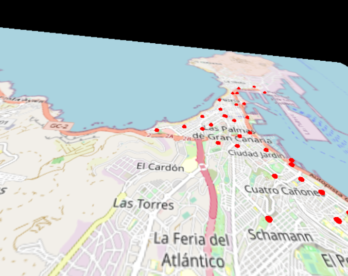
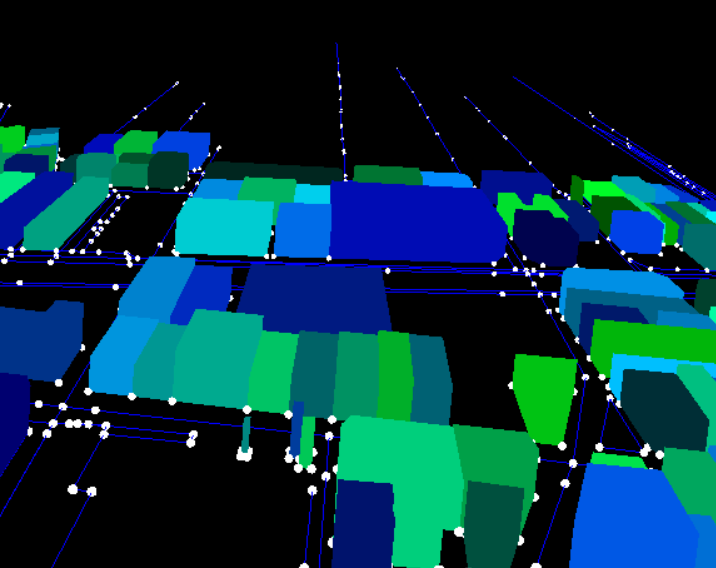

# Terrenos y mapas geográficos

[Terrenos](#terrenos)  
[Mapas](#mapas)  
[Tarea](#tarea)  
[Referencias](#referencias)

## Terrenos

En la práctica anterior, se han utilizado mapas de texturas, rugosidad, reflexión y transparencia. Ninguno de ellos modificaba la geometría del objeto. En esta nueva sesión, se hace uso del mapa de desplazamiento del material para crear de forma sencilla un terreno, permitiendo comprobar sobre la malla de vértices que la geometría resultante se ha modificado (*wireframe: true*).

En primer término interesa obtener o crear una imagen en tonos de grises que servirá de mapa de elevación/altura.
Para el ejemplo del código *script_41_terreno.js* he obtenido mapas de altura desde estas dos fuentes:

- [Tutorial sobre *.displacementMap*](https://sbcode.net/threejs/displacmentmap). El mapa descargable en formato comprimido, incluye información de batimetría (relieve zonas cubiertas por agua).
- [Repositorio de la NASA](https://visibleearth.nasa.gov/images/73934/topography). En esta caso, no incluye información de batimetría. Eso sí, la imagen de partida tiene una resolución de 21600x10800, que reduje a 5400x2700, tras apreciar problemas en la ejecución en mi portátil.

El código del ejemplo *script_41_terreno.js* no es extenso, y no tiene grandes novedades. Básicamente crea una geometría plana, asociando la textura difusa y el mapa de desplazamiento y la escala de acplicación al asignar valores a *.displacementMap* y *.displacementScale*.

Modificando el código, puede alternarse entre dos mapas de desplazamiento (*dm1* y *dm2*) modificando directamente en el código el parámetro que se proporciona a la función *Plano*. Sugerirte observar el comportamiento:

- al no asignar textura difusa,
- alternar el modo *wireframe* activado y desactivado,
- y modificar el número de divisiones del plano.

Señalar que en mis pruebas no he conseguido obtener el resultado de desplazamiento con el *MeshStandardMaterial*, pese a aparecer como propiedad en la documentación.

```
import * as THREE from "three";
import { OrbitControls } from "three/examples/jsm/controls/OrbitControls";

let scene, renderer, camera;
let camcontrols1;
let mapsx,mapsy;

init();
animate();

function init(){
  scene = new THREE.Scene();
  camera = new THREE.PerspectiveCamera(75,
          window.innerWidth / window.innerHeight,
          0.1,1000
        );
  //Posición de la cámara
  camera.position.z = 5;

  renderer = new THREE.WebGLRenderer();
  renderer.setSize(window.innerWidth, window.innerHeight);
  document.body.appendChild(renderer.domElement);

  camcontrols1 = new OrbitControls(camera, renderer.domElement);
    const light = new THREE.AmbientLight()
  scene.add(light)

  //Textura mundo
  const tx1 = new THREE.TextureLoader().load("https://cdn.glitch.global/8b114fdc-500a-4e05-b3c5-a4afa5246b07/earthmap1k.jpg?v=1666848392635");
  //Mapa de elevación 1 fuente https://visibleearth.nasa.gov/images/73934/topography
  const dm1 = new THREE.TextureLoader().load("https://cdn.glitch.global/8b114fdc-500a-4e05-b3c5-a4afa5246b07/gebco_08_rev_elev_5400x2700.png?v=1668158994801");
  //Mapa de elevación 2 Fuente https://sbcode.net/threejs/displacmentmap/
  const dm2 = new THREE.TextureLoader().load("https://cdn.glitch.global/8b114fdc-500a-4e05-b3c5-a4afa5246b07/gebco_bathy.5400x2700_8bit.jpg?v=1668108267910");

  //Objeto
  mapsx=21.6/2.5;
  mapsy=10.8/2.5;
  Plano(0.,0.,0.,mapsx,mapsy,tx1,dm2);
 }


function Plano(px,py,pz,sx,sy, txt, dismap){
  let geometry = new THREE.PlaneBufferGeometry(sx, sy,200,200);
  let material = new THREE.MeshPhongMaterial({
    wireframe: true,
  });

   //Textura
  if (txt != undefined){
    material.map = txt;
  }

  if (dismap != undefined){
    material.displacementMap = dismap;
    material.displacementScale = 0.3;
  }

  let mesh = new THREE.Mesh(geometry, material);
  mesh.position.set(px, py, pz);
  scene.add(mesh);
}

//Bucle de animación
function animate() {
  requestAnimationFrame(animate);
  renderer.render(scene, camera);
}
```

Otras fuentes de mapas de elevación o altura pueden encontrarse buscando algo como *heightmap black and white*.
También existen repositorios que permiten descargar mapas de elevación:

- [Centro de descargas del Centro Nacional de Información Geográfica](http://centrodedescargas.cnig.es/CentroDescargas/catalogo.do?Serie=MAMOV). Permite en el visor seleccionar el área para descargar.
- [Recopilatorio de fuentes de modelos de elevación](https://gisgeography.com/free-global-dem-data-sources/), destacando [ASTER](https://asterweb.jpl.nasa.gov/gdem.asp) y [Copernicus Open Access Hub](https://scihub.copernicus.eu) que requiere registro.

Sin embargo, debes tener presente que suelen proporcionar los mapas en formato geotiff,
que sin embargo no es legible para three.js. Aunque no lo he probado, este [tutorial](http://www.smartjava.org/content/threejs-render-real-world-terrain-heightmap-using-open-data/) describe
el procedimiento para su conversión en jpeg o png. Una alternativa es hacer uso de herramientas como [QGIS](https://www.qgis.org/en/site/) para dicha operación.

<!--
Perlin noise terrain
https://codepen.io/ptc24/pen/BpXbOW

IGN elevaciones
https://www.ign.es/web/seccion-elevaciones
-->


## Mapas


### OpenStreetMap

En este apartado mi objetivo es mostrar opciones para visualizar una zona geográfica real concreta.
Con la tarea descrita más abajo en mente, un primer paso consiste en localizar una fuente de mapas. Los ejemplos propuestos no abordan la descarga dinámica de los datos geográficos durante la ejecución del programa, sino la obtención del mapa previamente.
Para ambos ejemplos hago uso de material descargable desde [OpenStreetMap](https://www.openstreetmap.org/#map=8/28.312/-16.026). Al abrir el enlace te mostrará directamente una vista de las Islas Canarias. Te invito a seguir los siguientes pasos para escoger la zona a descargar:

- En la cajita de búsqueda (parte superior izquierda) teclea *las palmas de gran canaria*, esta acción te llevará al mapa de la capital de Gran Canaria, con algo parecido a la siguiente imagen:

  
*Interfaz web de OpenStreeMap para exportar mapas personalizados*


<!--- Una zona del mapa se puede secargar haciendo uso de la llamada al servidoro con algo Como http://overpass.openstreetmap.ru/cgi/xapi_meta?*[bbox=-15.446,28.08,-15.396,28.18] --->

- Sobre esta vista puede escogerse una zona concreta del mapa, además de seleccionar distintas capas (desde el menú lateral de la derecha). Al seleccionar *Exportar* (menú de la parte superior izquierda) podremos descargar el xml de la zona visible, si bien es probable que obtengas un error al haber limitaciones del número total de nodos que el servidor permite descargar, seguramente debas escoger manualmente una zona de interés más reducida (bajo el recuadro de coordenadas en la izquierda aparece *Seleccionar manualmente un área diferente*). Esta descarga, la dejaremos para el último ejemplo de código (*script_46_mapaosm.js*), conteniendo elementos geográficos en formato xml.

- Para el ejemplo *script_44_mapa.js*, descargo el mapa como imagen, sin obtener un xml con las entidades geográficas. En este caso, sólo se permite descargar la capa por defecto. La opción de descargar la imagen y el formato, se define en el menú lateral derecho dentro de *Compartir*. **Importante anotar las coordenadas de latitud y longitud escogidas**, que se encuentran en la parte superior izquierda, justo bajo *Exportar*, dado que es información que no viene incluida en la imagen descargada.


### Mapa como imagen

El código del primer ejemplo, *script_44_mapa.js*,  es bastante compacto, básicamente la imagen del mapa se utiliza como textura de un plano, que modifica su tamaño inicial, para mantener las proporciones o relación de aspecto con las del mapa. Aplicar la textura a un plano, no es una novedad. Por otro lado, se crean unas esferas en las localizaciones geográficas de las estaciones de la [Sitycleta](https://www.sitycleta.com/es/). Para ello, es necesario contar con el archivo *Geolocalización estaciones sitycleta.csv*, presente en Glitch, que contiene los datos de geolocalización de las estaciones de la [Sitycleta](https://www.sitycleta.com/es/). En el código en concreto, leo y almaceno el nombre de las estaciones además de su geolocalización con las coordenadas de latitud y longitud. Los datos desde el archivo se leen con *FileLoader* que básicamente lee el texto y procesa por líneas (separador de salto de línea), separando en cada línea con la *coma* extrayendo la información que he decidido de interés para el ejemplo.

Tras contar con la información de las estaciones, habiendo cargado la imagen del mapa, y conociendo sus límites de latitud y longitud (información no incluida en el archivo de imagen y definida directamente en el código), el código dibuja sobre el mapa las posiciones de las mencionadas estaciones de la Sitycleta, tomadas del archivo csv. Para su posicionamiento en el mapa, se realiza un ajuste de escala, dado que si se ha escogido correctamente la zona del mapa, las estaciones están en el rango de latitudes y longitudes del mapa. La función *Mapeo* se ocupa de adaptar coordenadas sobre el mapa a coordenadas del espacio 3D que se proyecta en pantalla. Cada estación se visualiza como una esfera roja como se aprecia en la imagen.

```
import * as THREE from "three";
import { OrbitControls } from "three/examples/jsm/controls/OrbitControls";

let scene, renderer, camera;
let mapa, mapsx, mapsy;

//Latitud y longitud de los extremos del mapa de la imagen
let minlon = -15.5304,  maxlon = -15.3656;
let minlat = 28.0705,  maxlat = 28.1817;
let txwidth, txheight;
let psx, psy;
let paradas = [];
let objetos = [];
let lats = [], longs = [], nest;

init();
animate();

function init() {
  scene = new THREE.Scene();
  camera = new THREE.PerspectiveCamera(
    75,
    window.innerWidth / window.innerHeight,
    0.1,
    1000
  );
  //Posición de la cámara
  camera.position.z = 5;

  renderer = new THREE.WebGLRenderer();
  renderer.setSize(window.innerWidth, window.innerHeight);
  document.body.appendChild(renderer.domElement);

  camcontrols1 = new OrbitControls(camera, renderer.domElement);

  //Objeto
  mapsx = 5;
  mapsy = 5;
  Plano(0, 0, 0, mapsx, mapsy);

  //Lectura del archivo csv
  var loader = new THREE.FileLoader();
  loader.load("Geolocalización estaciones sitycleta.csv", function (text) {
    //console.log( text );
    let lines = text.split("\n");
    //Cargo archivo con información mde estaciones
    nest = 0;
    for (let line of lines) {
      //No trata primera línea al ser la cabecera
      if (nest > 0) {
        //Separo por comas
        let values = line.split(",");
        //Almaceno nombres de paradas en array
        paradas[nest - 1] = values[1].substring(1, values[1].length - 1);
        //ALmacena localización estaciones
        lats[nest - 1] = Number(values[6].substring(1, values[6].length - 1));
        longs[nest - 1] = Number(values[7].substring(1, values[7].length - 1));
      }
      nest += 1;
    }

    //Objeto patra cada estación
    paradas.forEach(myFunction);
    function myFunction(item, index, arr) {
      //longitudes crecen hacia la derecha, como la x
      let mlon = Mapeo(longs[index], minlon, maxlon, -mapsx / 2, mapsx / 2);
      //Latitudes crecen hacia arriba, como la y
      let mlat = Mapeo(lats[index], minlat, maxlat, -mapsy / 2, mapsy / 2);
      console.log(mlon, mlat);
      Esfera(mlon, mlat, 0, 0.02, 10, 10, 0xff0000);
    }
  });

  //Textura del mapa
  const tx1 = new THREE.TextureLoader().load(
    "https://cdn.glitch.global/8b114fdc-500a-4e05-b3c5-a4afa5246b07/mapaLPGC.png?v=1664882635379",

    // Acciones a realizar tras la carga
    function (texture) {
      //dimensiones
      console.log(texture.image.width, texture.image.height);

      mapa.material.map = texture;
      mapa.material.needsUpdate = true;

      txwidth = texture.image.width;
      txheight = texture.image.height;

      //Adapta dimensiones del plano a la textura
      if (txheight > txwidth) {
        let factor = txheight / (maxlon - minlon);
        mapa.scale.set(1, factor, 1);
        mapsy *= factor;
      } else {
        let factor = txwidth / txheight;
        mapa.scale.set(factor, 1, 1);
        mapsx *= factor;
      }
    }
  );
}

//valor, rango origen, rango destino
function Mapeo(val, vmin, vmax, dmin, dmax) {
  //Normaliza valor en el rango de partida, t=0 en vmin, t=1 en vmax
  let t = 1 - (vmax - val) / (vmax - vmin);
  return dmin + t * (dmax - dmin);
}

function Esfera(px, py, pz, radio, nx, ny, col) {
  let geometry = new THREE.SphereBufferGeometry(radio, nx, ny);
  let material = new THREE.MeshBasicMaterial({
    color: col,
  });
  let mesh = new THREE.Mesh(geometry, material);
  mesh.position.set(px, py, pz);
  objetos.push(mesh);
  scene.add(mesh);
}

function Plano(px, py, pz, sx, sy) {
  let geometry = new THREE.PlaneBufferGeometry(sx, sy);
  let material = new THREE.MeshBasicMaterial({ });
  let mesh = new THREE.Mesh(geometry, material);
  mesh.position.set(px, py, pz);
  scene.add(mesh);
  mapa = mesh;
}

//Bucle de animación
function animate() {
  requestAnimationFrame(animate);
  renderer.render(scene, camera);
}

```

  
*Vista de la imagen geolocalizada*


### Cargando elementos geográficos como primitivas gráficas

Para el segundo ejemplo de mapas incluido en Glitch, se ha descargado parcialmente la zona de la Avenida de Mesa y López, dado que el número de nodos crece significativamente al seleccionar zonas de mayor área de la ciudad.
 El archivo contiene las entidades geográficas presentes en la zona del mapa escogidas. En nuestro ejemplo, dicha información está contenida en el archivo *mapLPGC_MyL.osm*.

En el código *script_46_mapaosm.js*, de forma similar al ejemplo previo, utilizo *FileLoader* para su lectura. Si bien en este caso al ser un xml, hago uso de las utilidades proporcionadas por *DOMParser*.
En primer término se obtienen los límites de latitud y longitud de la zona contenida en el archivo.
Posteriormente, una vez cargada la información de elementos de tipo *way*, se seleccionan elementos del mapa con ciertos *tags*. Más información de los [tags de OSM](https://wiki.openstreetmap.org/wiki/Tags). De esta forma en el ejemplo se filtran edificios y calles, para su visualización.

En el ejemplo propuesto, el proceso accede a los elementos de tipo *way* seleccionando aquellos que presentan el *tag* *highway* o *building* para crear sus correspondientes primitivas gráficas. Para cada elemento de interés, se obtienen las coordenadas de latitud y longitud de sus nodos, que se van almacenando en primer término en un vector de puntos, que se visualizan como pequeñas esferas, para finalmente crear la entidad gráfica.

Para cada elemento *way* se define una primitiva, en el caso de los elementos *highway* se usan para definir una polilínea que se muestra en color azul. En el caso de los edificios, *building*, he optado por una geometría de extrusión ([ExtrudeGeometry](https://threejs.org/docs/#api/en/geometries/ExtrudeGeometry)) a partir del contorno definido por los nodos. Su color es aleatorio, y para su altura se adopta un valor estándar que aleatoriamente se modifica para conseguir que los edificios no sean completamente iguales. El código del ejemplo:


```
import * as THREE from "three";
import { OrbitControls } from "three/examples/jsm/controls/OrbitControls";
import { TrackballControls } from "three/examples/jsm/controls/TrackballControls";

let scene, renderer;
let camera;
let camcontrols;
let objetos = [];
let nodes = [],  ways = [],  relations = [];
let minlat, maxlat, minlon, maxlon;
let t0

init();
animationLoop();

function init() {
  //Defino cámara
  scene = new THREE.Scene();
  camera = new THREE.PerspectiveCamera(
    20, window.innerWidth / window.innerHeight,
    0.1, 1000
  );
  camera.position.set(0, 0, 30);

  renderer = new THREE.WebGLRenderer();
  renderer.setSize(window.innerWidth, window.innerHeight);
  document.body.appendChild(renderer.domElement);

  //Lectura datos xml
  var loader = new THREE.FileLoader();
  loader.load("mapLPGC_MyL.osm", function (text) {   
    //Fuente https://www.w3schools.com/xml/xml_parser.asp
    var text, parser, xmlDoc;
    parser = new DOMParser();
    xmlDoc = parser.parseFromString(text, "text/xml");

    // Recorremos xml
    //Obtiene los límites del mapa
    var x = xmlDoc.getElementsByTagName("bounds");
    minlat = x[0].getAttribute("minlat");
    maxlat = x[0].getAttribute("maxlat");
    minlon = x[0].getAttribute("minlon");
    maxlon = x[0].getAttribute("maxlon");
    //Elementos nodes para cada referencia contyienen latitud y longitud
    let nodes = xmlDoc.getElementsByTagName("node");
    //Elementos relations (no se utilizan)
    let relations = xmlDoc.getElementsByTagName("relations");
    //Accede a los elementos ways
    x = xmlDoc.getElementsByTagName("way");
    //Recorro los elementos buscando aquellos que sean highway o building
    for (let i = 0; i < x.length; i++) {
      ways.push(x[i].getAttribute("id"));
      let tags = x[i].getElementsByTagName("tag");
      let interest = 0; //Por defecto no es elemento de interés
      //Recorro tags del elemento way
      for (let j = 0; j < tags.length; j++) {
        if (tags[j].hasAttribute("k")) {
         if (tags[j].getAttribute("k") == "highway") {
            interest = 1;break;
         }
         if (tags[j].getAttribute("k") == "building") {
            interest = 2;break;
         }
        }
      }
      //Si el elemento way es  de interés
      if (interest > 0) {

        const hmaterial = new THREE.LineBasicMaterial({ color: 0x0000ff });
        const points = [];

        //Recorre los nodos del elemento
        let nds = x[i].getElementsByTagName("nd");
        for (let k = 0; k < nds.length; k++) {
          let ref = nds[k].getAttribute("ref");

          //Probablemente hay mejores formas con xmlDoc.querySelector
          //de momento busco referencia de forma iterativa a mano para obtener coordenaas
          for (let nd = 0; nd < nodes.length; nd++) {
            if (nodes[nd].getAttribute("id") == ref) {
              let lat = Number(nodes[nd].getAttribute("lat"));
              let lon = Number(nodes[nd].getAttribute("lon"));
              //longitudes crecen hacia la derecha, como la x
              let mlon = Mapeo(lon, minlon, maxlon, -5, 5);
              //Latitudes crecen hacia arriba, como la y
              let mlat = Mapeo(lat, minlat, maxlat, -5, 5);
              //Crea esfera del nodo del elemento
              Esfera(mlon, mlat, 0, 0.02, 10, 10, 0xffffff);
              //Añade punto
              points.push(new THREE.Vector3(mlon, mlat, 0));
              //Nodo localizado, no sigue recorriendo
              break;
            }
          }
        }

        //Según elemento de interés crea objeto
        let line;
        if (interest == 1) {
          //highways
          const geometry = new THREE.BufferGeometry().setFromPoints(points);
          line = new THREE.Line(geometry, hmaterial);
          scene.add(line);
        }
        else {
          if (interest == 2) { //Buildinhgs
            const shape = new THREE.Shape();
            shape.autoClose = true;
            //Objeto por extrusión
            for (let np = 0; np < points.length; np++) {
              if (np > 0) shape.lineTo(points[np].x, points[np].y);
              else shape.moveTo(points[np].x, points[np].y);
            }

            const extrudeSettings = {
              steps: 1,
              depth: 0.2 + THREE.MathUtils.randFloat(-0.05, 0.05),
              bevelThickness: 0,
              bevelSize: 0,
            };

            const geometry = new THREE.ExtrudeGeometry(shape, extrudeSettings);

            let bmaterial = new THREE.LineBasicMaterial({ color: 0xffffff });
            let c = new THREE.Color();
            c.set(THREE.MathUtils.randInt(0, 65535));
            c.getHexString();
            bmaterial.color = c;
            const mesh = new THREE.Mesh(geometry, bmaterial);
            scene.add(mesh);
          }
        }
      }
    }

    console.log("Obtenidos " + ways.length + " elementos");
  });

  //OrbitControls
  //camcontrols = new OrbitControls(camera, renderer.domElement);
  //TrackballControls
  camcontrols = new TrackballControls(camera, renderer.domElement);

  t0 = new Date();
}

//valor, rango origen, rango destino
function Mapeo(val, vmin, vmax, dmin, dmax) {
  //Normaliza valor en el rango de partida, t=0 en vmin, t=1 en vmax
  let t = 1 - (vmax - val) / (vmax - vmin);
  return dmin + t * (dmax - dmin);
}

function Esfera(px, py, pz, radio, nx, ny, col) {
  let geometry = new THREE.SphereBufferGeometry(radio, nx, ny);
  let material = new THREE.MeshBasicMaterial({});

  let mesh = new THREE.Mesh(geometry, material);
  mesh.position.set(px, py, pz);
  scene.add(mesh);
  objetos.push(mesh);
}

//Bucle de animación
function animationLoop() {  
  requestAnimationFrame(animationLoop);

  //TrackballControls
  let t1 = new Date();
  let secs = (t1 - t0) / 1000;
  camcontrols.update(1 * secs);
  renderer.render(scene, camera);
}
```
El ejemplo permite cierta interacción con zoom y traslación por el mapa, optando en este caso por el uso de [TrackballControls](https://threejs.org/docs/#examples/en/controls/TrackballControls) que ofrece una variante para el control de cámara a las vistas en prácticas previas, con acciones diferentes para cada botón del ratón. Su uso requiere añadir el *import* correspondiente.

```
import { TrackballControls } from "three/examples/jsm/controls/TrackballControls";
```

Es una variante de *OrbitControls*, que permite combinar el uso de las teclas A, S y D con el clic de ratón para diversas operaciones.
Para su uso, en el bucle de visualización se realiza la actualización de la cámara en base al tiempo transcurrido. Su documentación permite identificar propiedades del comportamiento que son modificables según convenga.

<!--
Para OSM [OSM2World](http://osm2world.org/download/), descargar binarios ...
-->

  
*Vista del mapa OSM*


<!---
Otras cosas

MapThing 1.4
https://github.com/jreades/MapThing/blob/master/distribution/MapThing-1.5/examples/MapThing/MapThing.pde

En processing 4 la demo no va

Unbfolding maps < v4
http://unfoldingmaps.org

2014
https://forum.processing.org/two/discussion/7667/reading-gps-data-file.html

%http://learningthreejs.com/blog/2013/09/16/how-to-make-the-earth-in-webgl/

%Ejemplo processing terrain3D
%https://github.com/rogeriobego/terrain_3d_perlinNoise  --->

## Tarea

Antes de dar paso a la descripción de tareas, sugerir visitar el perfil de [Pedro Suárez 🔗 x-y.es](https://twitter.com/x_y_es) en el que junto a su [canal youtube](https://www.youtube.com/xyesz) utiliza como  escaparate para mostrar visualizaciones en 2, 3 y 4D con three.js. Muchas de ellas centradas en nuestro archipiélago. De hecho, durante la erupción de La Palma, su perfil tuvo gran repercusión.

- **Visualización OSM**:
Animarte a explorar la visualización de otros elementos contenidos en el xml de OSM, pudiendo variar la zona geográfica y la capa descargada. Propón una visualización concreta, remitiendo un enlace y una captura de pantalla del resultado.

-  **Visualización de datos de Sagulpa**:
En la web de [Sagulpa](https://www.sagulpa.com) puedes localizar en la parte inferior el enlace a su [Portal de Transparencia](https://www.sagulpa.com/portal-transparencia). Una vez en el portal, tienes acceso a una interesante colección de [datos abiertos](https://www.sagulpa.com/datos-abiertos) de aparcamientos y de la Sitycleta. En la tarea propuesta, se les invita a usar datos de varios años completados, ya sea de aparcamientos o de la Sitycleta. Por ejemplo, para el caso de la Sitycleta, e<l archivo contiene el diario de préstamos de bicicletas, incluyendo el horario y fecha, los minutos de uso, además de las estaciones de alquiler y entrega.  
La tarea a entregar consiste en hacer uso de la información contenida en dicho fichero, de forma completa o parcial (según estimen, pudiendo si así lo consideran necesario  hacer uso de información de otros años, o comparativas entre meses, trimestres, etc.), para visualizar los datos allí presentes haciendo uso de las técnicas vistas para gráficos 3D.   
La propuesta de Visualización será mostrada a todo el grupo durante la sesión de teoría del lunes 27 de noviembre, para posteriormente realizar una elección de propuestas favoritas. Para componer la presentación deben remitirme un gif animado o vídeo antes del domingo 26 de noviembre.


## Referencias

Referencias que han servido para la confección de los diversos ejemplos:

- [Documentación](https://threejs.org/docs/index.html#manual/en/introduction/Creating-a-scene)  
- [Three.js Fundamentals](Three.js Fundamentals)
- [Discover three.js](https://discoverthreejs.com)
- [Learning Three.js](https://github.com/josdirksen/learning-threejs) por [Jos Dirksen](https://github.com/josdirksen)
- [Three.js Cookbook](https://github.com/josdirksen/threejs-cookbook) por [Jos Dirksen](https://github.com/josdirksen) de 2015


***
Bajo licencia de Creative Commons Reconocimiento - No Comercial 4.0 Internacional
