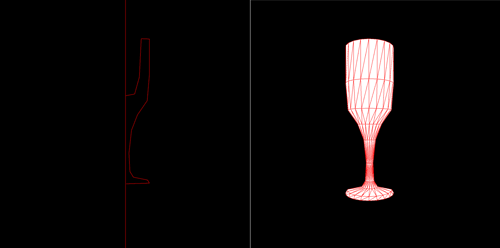

# Primeros pasos con three.js

[Introducción](#introducción)  
[Ejemplo mínimo](#ejemplo-mínimo)  
[Objetos](#objetos)  
[Modularidad](#modularidad)  
[Asistentes](#asistentes)  
[Botones y texto](#botones-y-texto)  
[Control orbital](#control-orbital)  
[Coordenadas del puntero](#coordenadas-del-puntero)  
[Referencias](#referencias)

## Introducción

[Three.js](https://threejs.org/) es una biblioteca de JavaScript, basada en WebGL, que ofrece grandes posibilidades para gráficos 3D en el navegador. Cuenta
con nutrida documentación y una comunidad activa, por lo que la hemos escogido para las prácticas de las próximas semanas en la asignatura.
Si bien se relacionan al final del documento, recomendar recursos disponibles añadidos a la [documentación oficial de three.js](https://threejs.org/docs/index.html#manual/en/introduction/Creating-a-scene), como son [Discover three.js](https://discoverthreejs.com) que cuenta con su editor integrado, y el material del libro [Learning Three.js](https://github.com/josdirksen/learning-threejs) de [Jos Dirksen](https://github.com/josdirksen).

Aunque no forme parte del proyecto docente de la asignatura, si tuvieras interés en una alternativa para la creación de experiencias gráficas (2D y 3D) e interactivas, en un sentido amplio, podría interesarte conocer  [p5.js](https://p5js.org/es/) (inspirado en el marco creativo [Processing](https://processing.org)), para la que cuentas con material de la asignatura del plan de estudios anterior [Creando interfaces de Usuario](https://github.com/otsedom/otsedom.github.io/blob/main/CIU/README.md).

## Ejemplo mínimo

Para un primer ejemplo, esta guía adopta el primer tutorial de la documentación oficial disponible en la web de three.js, [Creación de una escena](https://threejs.org/docs/#manual/en/introduction/Creating-a-scene). De inicio describe el HTML básico para incrustar el código JavaScript. En los ejemplos que se presentan a través del [repositorio Glitch](https://glitch.com/edit/#!/eii-ig-threejs2324) se hace uso del archivo *index_SX.html*, que para esta semana luce similar a:

```
<!DOCTYPE html>
<html>
  <head>
    <meta charset="utf-8">
    <title>Mi ThreeJS</title>
    <link rel="stylesheet" href="/style.css">
  </head>
  <body>

    <!--Carga de módulos, indicando release de threejs-->
    <script type="importmap">
      {
        "imports": {
          "three": "https://unpkg.com/three@0.152.1/build/three.module.js",  
          "three/": "https://cdn.skypack.dev/three@0.152.1/"
        }
      }
    </script>
    <script src="/miscript.js" type="module" ></script>
  </body>
</html>
```

En lugar de colocar el código JavaScript directamente en el archivo *index_S6.html*, tras relacionar la dependencia de una *release* concreta de *three.js*, referencia al archivo *miscript.js* que contendrá el correspondiente código JavaScript.
Sustituyendo *miscript.js* por el nombre concreto del archivo JavaScript que nos interese, tendremos la ejecución del archivo JavaScript de turno, sin tener que realizar más cambios en *index_S6.html*. Para la estructura de archivos, he adaptado este [código ejemplo de Gomix](https://glitch.com/~threejs-template-apcs236). Observa que el archivo *index_SX.html* a lanzar (pueden variar a lo largo de las semanas) se especifica en *server.js*, en el que únicamente he especificado el nombre del html para esta semana:

```
// server.js
// where your node app starts

// init project
var express = require('express');
var app = express();

// we've started you off with Express,
// but feel free to use whatever libs or frameworks you'd like through `package.json`.

// http://expressjs.com/en/starter/static-files.html
app.use(express.static('public'));

// http://expressjs.com/en/starter/basic-routing.html
app.get("/", function (request, response) {
  response.sendFile(__dirname + '/views/index_S6.html');
});

// listen for requests :)
var listener = app.listen(process.env.PORT, function () {
  console.log('Your app is listening on port ' + listener.address().port);
});
```

Tras una breve descripción de los archivos presentes, como primer ejemplo ilustrativo, de forma análoga al tutorial se presenta un ejemplo básico que dibuja un cubo verde, el archivo *script_01_cubo_minimo.js* del [repositorio Glitch](https://glitch.com/edit/#!/eii-ig-threejs2324) proporcionado:

```
import * as THREE from "three";

// Fuentes
//https://threejs.org/docs/#manual/en/introduction/Creating-a-scene -->
//Crea el grafo de escena
const scene = new THREE.Scene();
//Define la cámara (fov vertical, aspecto, planos cercano y lejano)
const camera = new THREE.PerspectiveCamera( 75,
				window.innerWidth / window.innerHeight, 0.1, 1000 );

//Reproductor WebGL
const renderer = new THREE.WebGLRenderer();
renderer.setSize( window.innerWidth, window.innerHeight );

//Añade al HTML DOM (Document Object Model)
document.body.appendChild( renderer.domElement );

//Objeto cubo con una geometría de caja
const geometry = new THREE.BoxGeometry( 1, 1, 1 );
const material = new THREE.MeshBasicMaterial( { color: 0x00ff00 } );
const cubo = new THREE.Mesh( geometry, material );
//Objeto añadido a la escena
scene.add( cubo );

//Posición de la cámara
camera.position.z = 5;

//Bucle de animación
function animate() {
	//Preparados para el próximo fotograma
	requestAnimationFrame( animate );

	//Modifica posición del cubo con traslación o rotación
	//cubo.position.x += 0.01;
	//Modifica orientación del cubo
	//cubo.rotation.x += 0.01;
	//cubo.rotation.y += 0.01;

	renderer.render( scene, camera );
}
animate();


```

Para ejemplos como este, sin elementos extras, también es posible ejecutarlo localmente abriendo el archivo html con un navegador.

De cara a la depuración del código JavaScript, recordar que durante su ejecución es posible con la opción *Inspeccionar elemento* (o similar en tu navegador concreto), permitiendo analizar la ejecución del programa, y por tanto localizar errores.

El código del ejemplo crea y configura una escena [Scene](https://threejs.org/docs/#api/en/scenes/Scene), una cámara con perspectiva ([CameraPerspective](https://threejs.org/docs/?q=PerspectiveCamera#api/en/cameras/PerspectiveCamera)) y un reproductor ([WebGLRenderer](https://threejs.org/docs/#api/en/renderers/WebGLRenderer)), todo ello antes de crear el objeto (un cubo con la geometría *box*) a partir de una geometría y un material. Tras su creación, el objeto creado (el cubo), se añade a la escena previamente creada. La escena es el lugar en que se definen los objetos, luces y cámaras. Three.js trabaja con un grafo de escena que establece las jerarquías y dependencias de los objetos presentes en ella. Por otro lado, la cámara permite definir el modo en que se verán los objetos de la escena. El reproductor muestra la escena en un *HTMLCanvasElement*, por defecto hace uso de WebGL.

La parte final del código, contiene el bucle de visualización que incluye la llamada a [*requestAnimationFrame*](https://developer.mozilla.org/en-US/docs/Web/API/window/requestAnimationFrame), que usualmente  proporcionará 60 fotogramas por segundo. En el bucle se pueden modificar el o los objetos presentes en la escena, si fuera el caso, para finalmente mostrar la escena con la cámara previamente definida. En este caso, a la escena anteriormente se le había asignado un objeto, conformando el mencionado grafo de escena (*scene graph*).

En el bucle de este ejemplo, se incluye código comentado que permite modificar propiedades del objeto *cubo*, en concreto la posición en *x* y las rotaciones sobre los ejes *x* e *y*. Todas ellas son propiedades del objeto que facilitan la modificación de su matriz de transformación. Efectivamente, alterar dichas propiedades provoca la actualización de la [matriz de transformación](https://threejs.org/docs/#manual/en/introduction/Matrix-transformations) del objeto, que ocurre de forma transparente. Si no se desea dicho comportamiento, debe modificarse la propiedad *matrixAutoUpdate* del objeto con el valor *false*.


## Objetos

Tras jugar con el ejemplo inicial, y modificar algunos de los parámetros, como primera modificación de mayor calado, a diferencia del ejemplo de la documentación de three.js, en lugar de un cubo, un nuevo ejemplo crea una esfera en rotación. El código de *script_02_esfera_minimo.js*:

```
import * as THREE from "three";

// Fuentes
//https://threejs.org/docs/#manual/en/introduction/Creating-a-scene -->
// https://r105.threejsfundamentals.org/threejs/lessons/threejs-primitives.html  -->
const scene = new THREE.Scene();
const camera = new THREE.PerspectiveCamera(75,
        window.innerWidth / window.innerHeight, 0.1, 1000);
//Posición de la cámara
camera.position.set(0, 0, 5);

const renderer = new THREE.WebGLRenderer();
renderer.setSize(window.innerWidth, window.innerHeight);
document.body.appendChild(renderer.domElement);

//Objeto esfera (radio, eltos ancho, eltos alto)
const geometry = new THREE.SphereBufferGeometry(1, 30, 10);
//Material relleno (z-buffer) o alambres
const material = new THREE.MeshBasicMaterial({
        color: 0xffff00,
        wireframe: true, //Descomentar para activar modelo de alambres
      });

//Malla resultante
const esfera = new THREE.Mesh(geometry, material);
//Se añade al grafo de escena
scene.add(esfera);

//Coloca la esfera en el espacio
//esfera.position.set(2,3,0);


//Bucle de animación
function animate() {
  requestAnimationFrame(animate);

  //Modifica rotación de la esfera
  esfera.rotation.x += 0.01;
  //esfera.rotation.z += 0.01;

  renderer.render(scene, camera);
}

animate();
```

La principal diferencia con el código anterior, es el tipo de *geometría* creada, la mencionada esfera, teniendo los parámetros de la llamada distinto significado al cubo. Para conocer otras geometrías disponibles,
además de la [documentación sobre geometrías de threejs](https://threejs.org/docs/index.html#api/en/geometries/BoxGeometry), recomendar el [tutorial](https://r105.threejsfundamentals.org/threejs/lessons/threejs-primitives.html) de una *release* de Three.js previa sobre primitivas.

En este caso en el bucle de visualización se modifica la rotación en *x* de la esfera. Rota sobre el origen localizado en el centro de la ventana. Observa que al crear el material se añade la propiedad *wireframe* a verdadero.

**Ejecuta con la propiedad *wireframe* del material a *true* y *false*.**

**Modifica en el bucle de visualización las propiedades de posición y orientación de la esfera.**

**Crea una segunda esfera, prueba con el mismo y distinto material, que toque parcialmente a la ya existente. Ejecuta visualizando en modo alambre y relleno (propiedad *wireframe*).**

Mencionar entre las formas geométricas disponibles las de caja ([*Box*](https://threejs.org/docs/#api/en/geometries/BoxGeometry)), plano ([*Plane*](https://threejs.org/docs/#api/en/geometries/PlaneGeometry)), cono ([*Cone*](https://threejs.org/docs/#api/en/geometries/ConeGeometry)), objeto de revolución ([LatheGeometry](https://threejs.org/docs/#api/en/geometries/LatheGeometry), ojo que los puntos proporcionados deben tener la componente *x* mayor que 0) o paramétrica ([*ParametricGeometry*](https://threejs.org/docs/#examples/en/geometries/ParametricGeometry)).

Son todos ellos objetos tipo malla [*Mesh*](https://threejs.org/docs/#api/en/objects/Mesh), que básicamente significa que se describen como una colección de caras triangulares.
Para objetos que no sean una malla, como por ejemplo una línea, se hace uso de la geometría estándar como ilustra el [ejemplo básico de dibujo de línea](https://threejs.org/docs/#manual/en/introduction/Drawing-lines)

Mayoritariamente las geometrías ofrecen dos variantes *Geometry* o [*BufferGeometry*](https://threejs.org/docs/#api/en/core/BufferGeometry). La primera es obsoleta, no formando parte del *core* de la biblioteca desde la [r125](https://discourse.threejs.org/t/three-geometry-will-be-removed-from-core-with-r125/22401) aunque aún esté presente por compatibilidad con ejemplos, proporcionándose utilidades de conversión a *BufferGeometry*.

Las propiedades de los objetos 3D están descritas en la clase [Object3D](https://threejs.org/docs/#api/en/core/Object3D.matrix). Como ya se ha mencionado, las transformaciones del objeto se definen a través de matrices. Con la propiedad:

- *.position*: Indica la posición en coordenadas locales, por defecto es *(0,0,0)*
- *.rotation*: Especifica la rotación del objeto utilizando la notación de ángulos de Euler
- *.matrix* : Matriz de transformación local
- *.matrixWorld* : Matriz de transformación global, idéntica a la local si no hay ancestros.
- *.userData* : Posibilita asociar datos propios al objeto.
- *.matrixAutoUpdate*: Por defecto activada, para recalcular la matriz local en cada iteración del bucle.
- *.matrixWorldAutoUpdate* : Como el anterior para la matriz global (incluye la de sus herederos).
- *.modelViewMatrix* : Proporcionada al *shader* para calcular la posición del objeto.
- *.name* : Nombre del objeto, por defecto vacío.
- *.normalMatrix* : Proporcionada al *shader* para el cálculo de la iluminación


## Modularidad

De cara a crear escenas con mayor número de objetos, sabes que estructurar el código facilita el trabajo. El código *script_03_esfera_modular.js*, pretende dar  un pasito para crear múltiples esferas, además de incluir otras novedades de interacción:

```
import * as THREE from "three";
import { OrbitControls } from 'three/examples/jsm/controls/OrbitControls'

// Fuentes
//https://threejs.org/docs/#manual/en/introduction/Creating-a-scene -->
//https://r105.threejsfundamentals.org/threejs/lessons/threejs-primitives.html  -->
let scene;
let camera;
let renderer;
let objetos = [];
let grid;

init()
animationLoop()

function init() {

  //Integrando un título
  var info = document.createElement('div');
			info.style.position = 'absolute';
			info.style.top = '30px';
			info.style.width = '100%';
			info.style.textAlign = 'center';
			info.style.color = '#fff';
			info.style.fontWeight = 'bold';
			info.style.backgroundColor = 'transparent';
			info.style.zIndex = '1';
			info.style.fontFamily = 'Monospace';
			info.innerHTML = "three.js - hola, mi título aquí";
			document.body.appendChild(info);

  scene = new THREE.Scene();
  camera = new THREE.PerspectiveCamera( 75, window.innerWidth / window.innerHeight, 0.1, 1000 );
  camera.position.set(0, 0, 10);

	renderer = new THREE.WebGLRenderer();
	renderer.setSize( window.innerWidth, window.innerHeight );
	document.body.appendChild( renderer.domElement );

  //Objetos
  Esfera(0,0,0,1,10,10, 0xffff00);
  Esfera(1,0,0,1,10,10, 0xff00ff);

  var controls = new OrbitControls(camera, renderer.domElement);

  //Rejilla de referencia indicando tamaño y divisiones
  grid = new THREE.GridHelper(20, 40);
  //Mostrarla en vertical
  grid.geometry.rotateX( Math.PI / 2 );
  grid.position.set(0, 0, .05);
  grid.visible = false;
  scene.add(grid);

  //Manejador de evento del botón de ratón
  document.getElementById("onoff").addEventListener("click",
			function(){
				grid.visible = !grid.visible;
			});

}


function Esfera(px,py,pz, radio, nx, ny, col) {
  let geometry = new THREE.SphereBufferGeometry(radio, nx, ny)
  //Material con o sin relleno
  let material = new THREE.MeshBasicMaterial({
        color: col,
        //wireframe: true, //Descomenta para activar modelo de alambres
      });

  let mesh = new THREE.Mesh(geometry, material)
  mesh.position.set(px,py,pz);
  scene.add(mesh)
  objetos.push(mesh)
}


//Bucle de animación
function animationLoop() {
  requestAnimationFrame(animationLoop);

  //Modifica rotación de todos los objetos
  for(let object of objetos) {
    object.rotation.x += 0.01;
  }

  renderer.render(scene, camera);
}
```

Observar que cada esfera creada se añade también en un vector de objetos, para posteriormente poder realizar acciones sobre ellos.

Con estos elementos sería posible crear con un bucle una colección de esferas en posiciones y con colores aleatorios. Antes es necesario conocer las utilidades que ofrece *MathUtils* podemos obtener tanto valores aleatorios enteros como reales:

```
//Valor entre -1 y 10
THREE.MathUtils.randFloat(-10, 10)

//Obteniendo el color aleatorio en hexadecimal
var c = new THREE.Color();
c.set( THREE.MathUtils.randInt(0, 65535) );
c.getHexString();
```

**Modifica *script_03_esfera_modular.js* para crear un número *n* esferas. ¿Hasta qué valor de *n* consigues llegar sin que se deteriore el bucle de visualizacion?**

## Asistentes

Para situarnos mejor en el escenario 3D, una rejilla aporta referencia. Three.js dispone de varios tipos de asistentes, en el código, presente en el ejemplo previo, se añade un [GridHelper](https://threejs.org/docs/#api/en/helpers/GridHelper) que visualiza una rejilla por defecto sobre el plano *xz*. El código a continuación que coloca en vertical, es decir paralela al plano *xy*.

```
//Rejilla de referencia indicando tamaño y divisiones
var grid = new THREE.GridHelper(20, 40);
//Mostrarla en vertical
grid.geometry.rotateX( Math.PI / 2 );
grid.position.set(0, 0, .05);
scene.add(grid);
```

## Botones y texto

Una vez integrado en la escena el asistente *GridHelper*, esta sección adopta como excusa poder activar o desactivar su visualización por medio de un botón definido en el HTML. En nuestro caso, se introduce en *index_S6.html* en el *body* la siguiente definición HTML de un botón con identificador *onoff*:

```
<button type="button" style="z-index: 12345;position: absolute;margin-left: 0%;" id="onoff">Rejilla on/off</button>
```


Por otro lado, en el código JavaScript se define el comportamiento asociado con el manejador de eventos para el identificador  *onoff*, en este caso cambiar la visibilidad de la rejilla:

```
//Manejador de evento del botón
document.getElementById("onoff").addEventListener("click",
			function(){
				grid.visible = !grid.visible;
			});
```

Para especificar elementos de estilo del botón, será necesario trabajar el archivo CSS, quedando fuera del objetivo de estas prácticas.

En caso de crecer el número de opciones y vistas, es recomendable trabajar con secciones de HTML:

```
var contenedor = document.createElement( 'div' );
document.body.appendChild( contenedor );
```
<!-- https://discourse.threejs.org/t/how-we-create-a-button-in-scene/36318/6
Botón insertado en la escena https://codepen.io/trusktr/pen/oNXpMgX -->

También puede ser interesante introducir texto plano en nuestra ejecución. El siguiente código integrado en la función *init* muestra un mensaje con determinadas características de estilo en la parte central superior, a modo de título del *script*:

```
var info = document.createElement('div');
			info.style.position = 'absolute';
			info.style.top = '30px';
			info.style.width = '100%';
			info.style.textAlign = 'center';
			info.style.color = '#fff';
			info.style.fontWeight = 'bold';
			info.style.backgroundColor = 'transparent';
			info.style.zIndex = '1';
			info.style.fontFamily = 'Monospace';
			info.innerHTML = "three.js - mi texto aquí";
			document.body.appendChild(info);
```

Es un texto definido en el DOM, si bien existen otras opciones que puedes consultar en la [documentación](https://threejs.org/docs/#manual/en/introduction/Creating-text).


## Control orbital

El asistente *GridHelper* favorece la interpretación del espacio tridimensional, pero se agradecería poder mirar la escena a nuestro antojo de forma interactiva. Para controlar la órbita de la cámara alrededor del punto de atención, se ofrece la utilidad ([OrbitControls](https://threejs.org/docs/#examples/en/controls/OrbitControls)).
Para su integración, además del *import* en el archivo Javascript, ha sido necesario incluir la segunda línea en el bloque *importmap* del
 *index.html*:

```
<script type="importmap">
      {
        "imports": {
          "three": "https://unpkg.com/three@0.152.1/build/three.module.js",  
          "three/": "https://cdn.skypack.dev/three@0.152.1/"
        }
      }
    </script>
```


En el código basta con añadir al inicio

```
import { OrbitControls } from 'three/examples/jsm/controls/OrbitControls'
```

y en la función *init* algo como:

```
//Controles órbita
var controls = new OrbitControls(camera, renderer.domElement);
```

Tras su definición teóricamente es posible activarlo o desactivarlo con la propiedad *.enabled*. Sin embargo, hasta este momento no he conseguido apreciar el efecto.


## Coordenadas del puntero

En un aparado previo se menciona el uso de un botón HTML para modificar la visualización del *GridHelper*. Además de poder hacer clic en un botón, para distintas acciones es interesante hacer uso de la posición del puntero sobre la escena 3D. En esta línea, en este apartado se ilustra la forma en que se puede hacer uso de la información del puntero del ratón para dibujar una polilínea sobre el plano *z=0*.


Al necesitar crear una polilínea cuyo número de puntos se va modificando, no existe la posibilidad de ir aumentando el tamaño de la *BufferGeometry* según nos interese. Es por ello que se adopta prealojar un número de puntos, siguiendo las indicaciones de la documentación sobre cómo [*How to update things*](https://threejs.org/docs/#manual/en/introduction/How-to-update-things).


Para definir con el puntero las coordenadas sobre el plano *z=0*, en el código a continuación se define como referencia un *GridHelper* sobre el plano *xy*, haciendo uso de la clase [Raycaster](https://threejs.org/docs/#api/en/core/Raycaster) para determinar la intersección del puntero con mi escena. En mi caso no he tenido buena respuesta al hacer intersectar con el asistente *GridHelper*, es por ello que hago uso de un plano, no visible, para realizar la intersección con el rayo.
Incluyo completo el código ejemplo del archivo *script_04_polilinea*:


```
import * as THREE from "three";

// Fuentes
//https://threejs.org/docs/#manual/en/introduction/Creating-a-scene -->
//https://r105.threejsfundamentals.org/threejs/lessons/threejs-primitives.html  -->
let scene;
let camera;
let renderer;
let objetos = [];

let grid, perfil, plano;
const MAX_POINTS = 500;
let raycaster;
let npuntos;

init();
animate();

function init() {
  scene = new THREE.Scene();
  camera = new THREE.PerspectiveCamera(
    75,
    window.innerWidth / window.innerHeight,
    0.1,
    1000
  );
  camera.position.set(0, 0, 5);

  renderer = new THREE.WebGLRenderer();
  renderer.setSize(window.innerWidth, window.innerHeight);
  document.body.appendChild(renderer.domElement);

  //Asistente GridHelper
  grid = new THREE.GridHelper(10, 10);
  grid.position.set(0, 0, 0);
  grid.geometry.rotateX(Math.PI / 2);
  //Desplaza levemente hacia la cámara
  grid.position.set(0, 0, 0.05);

  scene.add(grid);

  //Creo un plano en z=0 que no muestro para la intersección
  let geometryp = new THREE.PlaneGeometry(20, 20);
  let materialp = new THREE.MeshBasicMaterial({
    color: 0xffffff,
    side: THREE.DoubleSide,
  });
  plano = new THREE.Mesh(geometryp, materialp);
  plano.visible = false;
  scene.add(plano);

  //Rayo para intersección
  raycaster = new THREE.Raycaster();

  //Polilínea dinámica prealojada ver https://threejs.org/docs/#manual/en/introduction/How-to-update-things
  let geometry = new THREE.BufferGeometry();
  // Tres valores por vértice
  let positions = new Float32Array(MAX_POINTS * 3);
  geometry.setAttribute("position", new THREE.BufferAttribute(positions, 3));

  //Rango a dibujar
  npuntos = 0;
  geometry.setDrawRange(0, npuntos);
  let material = new THREE.LineBasicMaterial({ color: 0xff0000 });
  perfil = new THREE.Line(geometry, material);
  //Añade al grafo de escena
  scene.add(perfil);

  //Manejador de eventos
  document.addEventListener("mousedown", onDocumentMouseDown);
}
function onDocumentMouseDown(event) {
  //Conversión coordenadas del puntero
  const mouse = {
    x: (event.clientX / renderer.domElement.clientWidth) * 2 - 1,
    y: -(event.clientY / renderer.domElement.clientHeight) * 2 + 1,
  };

  //Intersección, define rayo
  raycaster.setFromCamera(mouse, camera);

  // Intersecta
  const intersects = raycaster.intersectObject(plano);
  // ¿Hay alguna intersección?
  if (intersects.length > 0) {
    //Añade vértice a la pòlilínea
    const vertices = perfil.geometry.attributes.position.array;

    vertices[npuntos * 3] = intersects[0].point.x;
    vertices[npuntos * 3 + 1] = intersects[0].point.y;
    vertices[npuntos * 3 + 2] = intersects[0].point.z;
    npuntos++;
    //Muestra el valor de la intersección
    console.log(intersects[0].point);

    Esfera(
      intersects[0].point.x,
      intersects[0].point.y,
      intersects[0].point.z,
      0.2,
      10,
      10,
      0xff00ff
    );
  }
}

function Esfera(px, py, pz, radio, nx, ny, col) {
  let geometry = new THREE.SphereBufferGeometry(radio, nx, ny);
  //Material con o sin relleno
  let material = new THREE.MeshBasicMaterial({
    color: col,
    //wireframe: true, //Descomenta para activar modelo de alambres
  });

  let mesh = new THREE.Mesh(geometry, material);
  //Posición de la esfera
  mesh.position.set(px, py, pz);
  scene.add(mesh);
  objetos.push(mesh);
}

//Bucle de animación
function animate() {
  requestAnimationFrame(animate);

  //Polilínea, define el número de vértices y actualiza posiciones
  perfil.geometry.setDrawRange(0, npuntos);
  perfil.geometry.attributes.position.needsUpdate = true;

  renderer.render(scene, camera);
}
```

La documentación de three.js de [Raycaster](https://threejs.org/docs/#api/en/core/Raycaster) incluye varios ejemplos de utilización con variedad de primitivas.

**¿Te atreves a aplicar Raycaster sobre tu ejemplo con *n* esferas y modificar el color de la esfera seleccionada? Necesitarás intersectar no con un objeto concreto sino con el vector de objetos. Los ejemplos de la documentación de [Raycaster](https://threejs.org/docs/#api/en/core/Raycaster) son muy ilustrativos.**

## TAREA

**El código ejemplo del apartado anterior crea una polilínea. Como tarea para la entrega semanal, se pide hacer uso de las funciones para la generación de curvas, como por ejemplo [CatmullRomCurve3](https://threejs.org/docs/#api/en/extras/curves/CatmullRomCurve3), para crear una curva a partir de los puntos proporcionados con el ratón (ojo, requiere un array Vector3). Posteriormente, al dar por finalizada la introducción de puntos, extraer de la curva resultante la serie de puntos a través de una llamada a *getPoints* y que sean utilizados como entrada para crear una superficie de revolución (*LatheGeometry*). Tener presente las restricciones de *LatheGeometry* sobre los puntos proporcionados.
Recomendar que en el material del objeto, la propiedad *side* se fije a *THREE.DoubleSide*.**

Un posible extra interesante sería hacer uso del control de transformación sobre los vértices creados [TransformControls](https://threejs.org/docs/#examples/en/controls/TransformControls). La documentación incluye ejemplos de uso, y existe también un [ejemplo específico](https://threejs.org/docs/#api/en/extras/curves/SplineCurve) que permite editar los puntos de una curva spline tridimensional.

Si quisieras exportar la malla resultante, tienes a tu disposición [GLTFExporter](https://threejs.org/docs/#examples/en/exporters/GLTFExporter).

  
*Ejemplo ilustrativo de perfil y sólido de revolución resultante*

## Referencias

Referencias que han servido para la confección de esta guía:

- [Documentación](https://threejs.org/docs/index.html#manual/en/introduction/Creating-a-scene)  
- [Discover three.js](https://discoverthreejs.com)
- [Learning Three.js](https://github.com/josdirksen/learning-threejs) por [Jos Dirksen](https://github.com/josdirksen)


***
Bajo licencia de Creative Commons Reconocimiento - No Comercial 4.0 Internacional
