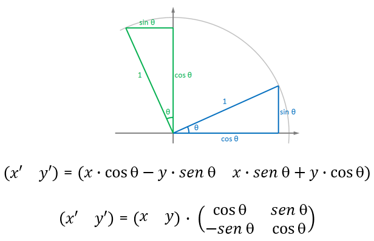

# Primeros pasos con three.js

[Introducción](#introducción)  
[Ejemplo mínimo](#ejemplo-mínimo)  
[Objetos](#objetos)  
[Modularidad](#modularidad)  
[Asistentes](#asistentes)  
[Botones y texto](#botones-y-texto)  
[Control orbital](#control-orbital)  
[Coordenadas del puntero](#coordenadas-del-puntero)  
[Rotaciones arbitrarias](#rotaciones-arbitrarias)   
[Tarea](#tarea-sistema-solar)   
[Referencias](#referencias)

## Introducción

[Three.js](https://threejs.org/) es una biblioteca de JavaScript, basada en WebGL, que ofrece numerosas posibilidades para gráficos 3D en el navegador. Cuenta con nutrida documentación y una comunidad activa, por lo que la hemos escogido para las prácticas de las próximas semanas en la asignatura.
Si bien se relacionan al final del documento, recomendar recursos disponibles añadidos a la [documentación oficial de three.js](https://threejs.org/docs/index.html#manual/en/introduction/Creating-a-scene), como son [Discover three.js](https://discoverthreejs.com) que cuenta con su editor integrado, y el material del libro [Learning Three.js](https://github.com/josdirksen/learning-threejs) de [Jos Dirksen](https://github.com/josdirksen).

Aunque no forme parte del proyecto docente de la asignatura, si tuvieras interés en una alternativa para la creación de experiencias gráficas (2D y 3D) e interactivas, en un sentido amplio, podría interesarte conocer  [p5.js](https://p5js.org/es/) (inspirado en el marco creativo [Processing](https://processing.org)), para la que cuentas con material de la asignatura del plan de estudios anterior [Creando interfaces de Usuario](https://github.com/otsedom/otsedom.github.io/blob/main/CIU/README.md).

## Ejemplo mínimo

Para un primer ejemplo, esta guía adopta el primer tutorial de la documentación oficial disponible en la web de three.js, [Creación de una escena](https://threejs.org/docs/#manual/en/introduction/Creating-a-scene). De inicio describe el HTML básico para incrustar el código JavaScript. En los ejemplos que se presentan a través del [repositorio Glitch](https://glitch.com/edit/#!/eii-ig-threejs2425) se hace uso del archivo *index_SX.html*, que para esta semana el correspondiente *index_S6.html* luce una estructura similar a:

```
<!DOCTYPE html>
<html>
  <head>
    <meta charset="utf-8">
    <title>Mi ThreeJS</title>
    <link rel="stylesheet" href="/style.css">
  </head>
  <body>

    <!--Carga de módulos, indicando release de threejs-->
    <script type="importmap">
      {
        "imports": {
          "three": "https://unpkg.com/three@0.152.1/build/three.module.js",  
          "three/": "https://cdn.skypack.dev/three@0.152.1/"
        }
      }
    </script>
    <script src="/miscript.js" type="module" ></script>
  </body>
</html>
```

En lugar de colocar el código JavaScript directamente en el archivo *index_S6.html*, tras relacionar la dependencia de una *release* concreta de *three.js*, referencia al archivo *miscript.js* que contendrá el correspondiente código JavaScript.
Sustituyendo *miscript.js* por el nombre concreto del archivo JavaScript que nos interese, tendremos la ejecución del archivo JavaScript de turno, sin tener que realizar más cambios en *index_S6.html*. Para la estructura de archivos, he adaptado el [código ejemplo de Gomix](https://glitch.com/~threejs-template-apcs236). Observa que el archivo *index_SX.html* a lanzar cada semana, se especifica en *server.js*. Para esta semana concreta:

```
// server.js
// where your node app starts

// init project
var express = require('express');
var app = express();

// we've started you off with Express,
// but feel free to use whatever libs or frameworks you'd like through `package.json`.

// http://expressjs.com/en/starter/static-files.html
app.use(express.static('public'));

// http://expressjs.com/en/starter/basic-routing.html
app.get("/", function (request, response) {
  response.sendFile(__dirname + '/views/index_S6.html');
});

// listen for requests :)
var listener = app.listen(process.env.PORT, function () {
  console.log('Your app is listening on port ' + listener.address().port);
});
```

Tras la breve descripción de los archivos presentes, de forma análoga al tutorial se presenta en primer término un ejemplo básico que dibuja un cubo verde, el archivo [*script_01_cubo_minimo.js*](https://github.com/otsedom/otsedom.github.io/blob/main/IG/S6/code/script_01_cubomin.js) del [repositorio Glitch](https://glitch.com/edit/#!/eii-ig-threejs2425) proporcionado:

```
import * as THREE from "three";

// Fuentes
//https://threejs.org/docs/#manual/en/introduction/Creating-a-scene -->
//Crea el grafo de escena
const scene = new THREE.Scene();
//Define la cámara (fov vertical, aspecto, planos cercano y lejano)
const camera = new THREE.PerspectiveCamera( 75,
				window.innerWidth / window.innerHeight, 0.1, 1000 );

//Reproductor WebGL
const renderer = new THREE.WebGLRenderer();
renderer.setSize( window.innerWidth, window.innerHeight );

//Añade al HTML DOM (Document Object Model)
document.body.appendChild( renderer.domElement );

//Objeto cubo con una geometría de caja
const geometry = new THREE.BoxGeometry( 1, 1, 1 );
const material = new THREE.MeshBasicMaterial( { color: 0x00ff00 } );
const cubo = new THREE.Mesh( geometry, material );
//Objeto añadido a la escena
scene.add( cubo );

//Posición de la cámara
camera.position.z = 5;

//Bucle de animación
function animate() {
	//Preparados para el próximo fotograma
	requestAnimationFrame( animate );

	//Modifica posición del cubo con traslación o rotación
	//cubo.position.x += 0.01;
	//Modifica orientación del cubo
	//cubo.rotation.x += 0.01;
	//cubo.rotation.y += 0.01;

	renderer.render( scene, camera );
}
animate();
```

Ejemplos básicos como este, sin elementos extras, es posible ejecutarlos localmente abriendo el archivo html con un navegador.

De cara a la depuración del código JavaScript, recordar que durante su ejecución es posible con la opción *Inspeccionar elemento* (o similar en tu navegador concreto), analizar la ejecución del programa, y por tanto localizar errores.

El código del ejemplo crea y configura una escena [Scene](https://threejs.org/docs/#api/en/scenes/Scene), una cámara con perspectiva ([CameraPerspective](https://threejs.org/docs/?q=PerspectiveCamera#api/en/cameras/PerspectiveCamera)) y un reproductor ([WebGLRenderer](https://threejs.org/docs/#api/en/renderers/WebGLRenderer)); todo ello antes de crear el objeto (un cubo con la geometría *box*) a partir de una geometría y un material. Tras su creación, el objeto creado (el cubo), se añade a la escena previamente creada. La escena es el lugar en que se definen los objetos, luces y cámaras. Three.js trabaja con un grafo de escena que establece las jerarquías y dependencias de los objetos presentes en ella. Por otro lado, la cámara permite definir el modo en que se verán los objetos de la escena. El reproductor muestra la escena en un *HTMLCanvasElement*, por defecto hace uso de WebGL.

La parte final del código, contiene el bucle de visualización que incluye la llamada a [*requestAnimationFrame*](https://developer.mozilla.org/en-US/docs/Web/API/window/requestAnimationFrame), que usualmente  proporcionará 60 fotogramas por segundo. En el bucle se pueden modificar el o los objetos presentes en la escena, si fuera el caso, para finalmente mostrar la escena con la cámara previamente definida. En este caso, a la escena anteriormente se le había asignado un objeto, conformando el mencionado grafo de escena (*scene graph*).

En el bucle de este ejemplo, se incluye código comentado que permite modificar propiedades del objeto *cubo*, en concreto la posición en *x* y las rotaciones sobre los ejes *x* e *y*. Todas ellas son propiedades del objeto que facilitan la modificación de su matriz de transformación. Efectivamente, alterar dichas propiedades provoca la actualización de la [matriz de transformación](https://threejs.org/docs/#manual/en/introduction/Matrix-transformations) del objeto, que ocurre de forma transparente. Si no se desea dicho comportamiento, debe modificarse la propiedad *matrixAutoUpdate* del objeto con el valor *false*.

**¿Sabrías modificar el color del cubo?**

## Objetos

Tras comprender el ejemplo inicial, y modificar de varias formas el cubo, como primera modificación en lugar de un cubo, un nuevo ejemplo crea una esfera en rotación. Es el momento de observar el código [*script_02_esfera_minimo.js*](https://github.com/otsedom/otsedom.github.io/blob/main/IG/S6/code/script_02_esfera_minimo.js). Desde este punto dejaré de incluir códigos completos.


La principal diferencia con el código anterior, es el tipo de *geometría* creada, la mencionada esfera, teniendo los parámetros de la llamada distinto significado al cubo. Para conocer otras geometrías disponibles,
además de la [documentación sobre geometrías de threejs](https://threejs.org/docs/index.html#api/en/geometries/BoxGeometry), recomendar el [tutorial](https://r105.threejsfundamentals.org/threejs/lessons/threejs-primitives.html) de una *release* de Three.js previa sobre primitivas.

En este caso en el bucle de visualización se modifica la rotación en *x* de la esfera. Rota sobre el origen localizado en el centro de la ventana. Observa que al crear el material se añade la propiedad *wireframe* a verdadero.

**¿Qué cambia al ejecutar con la propiedad *wireframe* del material a *true* y *false*?**

**¿Sabrías modificar en el bucle de visualización las propiedades de posición y orientación de la esfera?**

**Añade una segunda esfera a la escena, prueba con el mismo y distinto material, que toque (o no) parcialmente a la ya existente. Ejecuta visualizando en modo alambre y relleno (propiedad *wireframe*). ¿Qué observas?**

Mencionar entre las formas geométricas disponibles las de caja ([*Box*](https://threejs.org/docs/#api/en/geometries/BoxGeometry)), plano ([*Plane*](https://threejs.org/docs/#api/en/geometries/PlaneGeometry)), cono ([*Cone*](https://threejs.org/docs/#api/en/geometries/ConeGeometry)), objeto de revolución ([LatheGeometry](https://threejs.org/docs/#api/en/geometries/LatheGeometry), ojo que los puntos proporcionados deben tener la componente *x* mayor que 0) o paramétrica ([*ParametricGeometry*](https://threejs.org/docs/#examples/en/geometries/ParametricGeometry)).

Son todos ellos objetos tipo malla [*Mesh*](https://threejs.org/docs/#api/en/objects/Mesh), que básicamente significa que se describen como una colección de caras triangulares.
Para objetos que no sean una malla, como por ejemplo una línea, se hace uso de la geometría estándar como ilustra el [ejemplo básico de dibujo de línea](https://threejs.org/docs/#manual/en/introduction/Drawing-lines)

Mayoritariamente las geometrías ofrecen dos variantes *Geometry* o [*BufferGeometry*](https://threejs.org/docs/#api/en/core/BufferGeometry). La primera es obsoleta, no formando parte del *core* de la biblioteca desde la [r125](https://discourse.threejs.org/t/three-geometry-will-be-removed-from-core-with-r125/22401) aunque aún esté presente por compatibilidad con ejemplos, proporcionándose utilidades de conversión a *BufferGeometry*.

Las propiedades de los objetos 3D están descritas en la clase [Object3D](https://threejs.org/docs/#api/en/core/Object3D.matrix). Como ya se ha mencionado, las transformaciones del objeto se definen a través de matrices. Con la propiedad:

- *.position*: Indica la posición en coordenadas locales, por defecto es *(0,0,0)*
- *.rotation*: Especifica la rotación del objeto utilizando la notación de ángulos de Euler
- *.matrix* : Matriz de transformación local
- *.matrixWorld* : Matriz de transformación global, idéntica a la local si no hay ancestros.
- *.userData* : Posibilita asociar datos propios al objeto.
- *.matrixAutoUpdate*: Por defecto activada, para recalcular la matriz local en cada iteración del bucle.
- *.matrixWorldAutoUpdate* : Como el anterior para la matriz global (incluye la de sus herederos).
- *.modelViewMatrix* : Proporcionada al *shader* para calcular la posición del objeto.
- *.name* : Nombre del objeto, por defecto vacío.
- *.normalMatrix* : Proporcionada al *shader* para el cálculo de la iluminación


## Modularidad

De cara a crear escenas con mayor número de objetos, sabes que estructurar el código facilita el trabajo. El código [*script_03_esfera_modular.js*](https://github.com/otsedom/otsedom.github.io/blob/main/IG/S6/code/script_03_esfera_modular.js), da un pasito para facilitar crear múltiples esferas, además de incluir otras novedades de interacción.


Observar que cada esfera creada también se añade a un vector de objetos, permitiendo posteriormente realizar acciones sobre los objetos según nos interese.

Con estos elementos sería posible crear con un bucle una colección de esferas en posiciones y con colores aleatorios. Antes es necesario conocer las utilidades que ofrece *MathUtils* podemos obtener tanto valores aleatorios enteros como reales:

```
//Valor entre -1 y 10
THREE.MathUtils.randFloat(-10, 10)

//Obteniendo el color aleatorio en hexadecimal
var c = new THREE.Color();
c.set( THREE.MathUtils.randInt(0, 65535) );
c.getHexString();
```

**Modifica [*script_03_esfera_modular.js*](https://github.com/otsedom/otsedom.github.io/blob/main/IG/S6/code/script_03_esfera_modular.js) para crear un número *n* de esferas. ¿Hasta qué valor de *n* consigues llegar sin que se deteriore el bucle de visualización?**

## Asistentes

Para situarnos mejor en el escenario 3D, una rejilla aporta referencia. Three.js dispone de varios tipos de asistentes, en el código, presente en el ejemplo previo, se añade un [GridHelper](https://threejs.org/docs/#api/en/helpers/GridHelper) que visualiza una rejilla por defecto sobre el plano *xz*. El código a continuación, presente en [*script_03_esfera_modular.js*](https://github.com/otsedom/otsedom.github.io/blob/main/IG/S6/code/script_03_esfera_modular.js), coloca la rejilla en vertical, es decir paralela al plano *xy*.

```
//Rejilla de referencia indicando tamaño y divisiones
var grid = new THREE.GridHelper(20, 40);
//Mostrarla en vertical
grid.geometry.rotateX( Math.PI / 2 );
grid.position.set(0, 0, .05);
scene.add(grid);
```

## Botones y texto

Una vez integrado en la escena el asistente *GridHelper*, esta sección adopta como excusa poder activar o desactivar la presencia de la rejilla por medio de un botón definido en el HTML. En nuestro caso, se introduce en *index_S6.html* en el *body* la siguiente definición HTML de un botón con identificador *onoff*:

```
<button type="button" style="z-index: 12345;position: absolute;margin-left: 0%;" id="onoff">Rejilla on/off</button>
```


Por otro lado, en el código JavaScript se define el comportamiento asociado con el manejador de eventos para el identificador *onoff*, en este caso cambiar la visibilidad de la rejilla:

```
//Manejador de evento del botón
document.getElementById("onoff").addEventListener("click",
			function(){
				grid.visible = !grid.visible;
			});
```

Para especificar elementos de estilo del botón, será necesario trabajar el archivo CSS, quedando fuera del objetivo de estas prácticas.

En caso de crecer el número de opciones y vistas, es recomendable trabajar con secciones de HTML:

```
var contenedor = document.createElement( 'div' );
document.body.appendChild( contenedor );
```
<!-- https://discourse.threejs.org/t/how-we-create-a-button-in-scene/36318/6
Botón insertado en la escena https://codepen.io/trusktr/pen/oNXpMgX -->

También puede ser interesante introducir texto plano en nuestra ejecución. El siguiente código integrado en la función *init* muestra un mensaje con determinadas características de estilo en la parte central superior, a modo de título del *script*:

```
var info = document.createElement('div');
			info.style.position = 'absolute';
			info.style.top = '30px';
			info.style.width = '100%';
			info.style.textAlign = 'center';
			info.style.color = '#fff';
			info.style.fontWeight = 'bold';
			info.style.backgroundColor = 'transparent';
			info.style.zIndex = '1';
			info.style.fontFamily = 'Monospace';
			info.innerHTML = "three.js - mi texto aquí";
			document.body.appendChild(info);
```

Es un texto definido en el DOM, si bien existen otras opciones que puedes consultar en la [documentación](https://threejs.org/docs/#manual/en/introduction/Creating-text).

Los cambios introducidos los tienes integrados en el ejemplo  [*script_04_esfera_boton_rejilla.js*](https://github.com/otsedom/otsedom.github.io/blob/main/IG/S6/code/script_04_esfera_boton_rejilla.js)


## Control orbital

El asistente *GridHelper* favorece la interpretación del espacio tridimensional, pero se agradecería poder mirar la escena a nuestro antojo de forma interactiva. Para controlar la órbita de la cámara alrededor del punto de atención, se ofrece la utilidad ([OrbitControls](https://threejs.org/docs/#examples/en/controls/OrbitControls)).
Para su integración, además del *import* en el archivo Javascript, ha sido necesario incluir la segunda línea en el bloque *importmap* del
 *index.html*:

```
<script type="importmap">
      {
        "imports": {
          "three": "https://unpkg.com/three@0.152.1/build/three.module.js",  
          "three/": "https://cdn.skypack.dev/three@0.152.1/"
        }
      }
    </script>
```

En el código basta con añadir al inicio

```
import { OrbitControls } from 'three/examples/jsm/controls/OrbitControls'
```

y en la función *init* algo como:

```
//Controles órbita
var controls = new OrbitControls(camera, renderer.domElement);
```

Tras su definición teóricamente es posible activarlo o desactivarlo con la propiedad *.enabled*. Sin embargo, hasta este momento no he conseguido apreciar el efecto.


## Rotaciones


Como punto de partida de la sesión, el código del archivo [*script_05_estrellayplanetas.js*](https://github.com/otsedom/otsedom.github.io/blob/main/IG/S6/code/script_05_estrellayplanetas.js) integra varios de los elementos de ejemplos previos, reduciendo los parámetros de entrada y renombrando la función de creación de esferas, que ahora se denomina *Estrella*.

El resultado es una esfera amarilla, nuestra *estrella*, en el centro de la escena.
Para crear *planetas* alrededor de la estrella, adopto una nueva función: *Planeta*, haciendo uso de un array *Planetas*. En
la función de inicialización creo uno o varios planetas.

```
//En init()
//Objetos
Estrella(1.8, 0xffff00);
Planeta(-4,0,0,0.8,10,10, 0xff0ff0);
Planeta(3,0,0,0.4,10,10, 0x00ffff);

...

function Planeta(px, py, pz, radio, nx, ny, col) {
  let geometry = new THREE.SphereBufferGeometry(radio, nx, ny)
  //Material con o sin relleno
  let material = new THREE.MeshBasicMaterial({
        color: col,
        //wireframe: true, //Descomenta para activar modelo de alambres
      });

  let mesh = new THREE.Mesh(geometry, material)
  mesh.position.set(px,py,pz);
  scene.add(mesh)
  Planetas.push(mesh)
}
```

En el bucle de visualización, se aplica una rotación a cada objeto presente en el vector *Planetas*.

```
for(let object of Planetas) {
      object.rotation.y += 0.01;
}
```

¿Hay rotación delos planetas? ¿Sobre qué punto?

**¿Cómo conseguir que las nuevas esferas roten alrededor de la primera, como si fueran una estrella y el planeta en su órbita?**

Una primera propuesta consiste en crear una nueva función *PlanetaChild* donde la nueva malla no se asocia directamente a la escena sino a la malla suministrada como parámetro (en mi caso, la *estrella*). Con esta acción hago uso del grafo de escena, y ocurre que todas las transformaciones aplicadas sobre el ancestro, el padre, se aplican también a la matriz de transformación de sus herederos.

La información sobre el padre de un objeto se conoce a través de la propiedad *.parent*. Tener presente que un objeto únicamente puede tener un padre. En el contexto del [grafo de escena](https://r105.threejsfundamentals.org/threejs/lessons/threejs-scenegraph.html) se establecen dependencias en una estructura jerárquica entre objetos.

```
//Modifico en la función init
//sol
Estrella(0,0,0,0.8,10,10, 0xffff00);
//planeta
PlanetaChild(objetos[0],2.5,0,0,0.4,10,10, 0x0000ff);

...

//Defino la nueva función que recibe al padre como argumento de entrada
function PlanetaChild(padre,px,py,pz, radio, nx, ny, col) {
	let geometry = new THREE.SphereBufferGeometry(radio, nx, ny)
	let material = new THREE.MeshBasicMaterial({
					color: col,
					wireframe: true, //Descomenta para activar modelo de alambres
				  });

	let mesh = new THREE.Mesh(geometry, material)
	mesh.position.set(px,py,pz);
	padre.add(mesh)// Se define el padre
	Planetas.push(mesh)
}
```				

Si la estrella rota, el resultado obtenido con esta propuesta para la segunda esfera es una rotación alrededor del padre, añadida a la autorrotación. Sin embargo, **el planeta no se desliga de la rotación de la *estrella***. Actúa como un satélite artificial geoestacionario que rota solidariamente con la rotación aplicada al padre, en este caso nuestro *sol*.

Una solución para desligar ambas rotaciones es calcular *a pelo* la rotación del planeta en función del tiempo, y consecuentemente actualizar la posición de la esfera. Opto por trabajar en rotación sobre *z* para los ejemplos, que modifica las coordenadas *x* e *y*. Recordando la rotación en 2D como muestra la imagen para determinar el cambio de las coordenadas, integro información temporal.

  
*Rotación 2D*

Tras resumir los cambios en [*script_06_estrellasyplanetas.js*](https://github.com/otsedom/otsedom.github.io/blob/main/IG/S6/code/script_06_estrellayplanetas.js) la función *Planeta* admite como parámetros la distancia a la estrella, tamaño y velocidad de rotación alrededor de su estrella, que se asocian al objeto a través de *userData*. Mi planeta inicialmente estará en la posición *(dist,0,0)* por lo que la transformación *a pelo* es sencilla, dado que al rotar sobre *z* el valor de *y* de partida es nulo. Asumiendo un ángulo inicial de rotación nulo, *&theta;=0*
, creciente en función del tiempo, *x = dist * cos &theta;* e *y = dist * sen &theta;*, para lo se hace uso de *Date* para definir un *timestamp*.

Tras estas acciones se obtienen planetas que rotan alrededor de una estrella, sin que los movimientos de ambos objetos estén acoplados. Dado que no necesariamente las órbitas son circulares, añado en la creación del planeta como parámetros *f1* y *f2* que me permitirán definir una órbita elíptica, quedando de nuevo almacenado a través de *userData*. Su presencia se tiene en cuenta al realizar la rotación en el bucle de visualización.


```
//En init
//Objetos
Estrella(1.8, 0xffff00);
Planeta(0.5, 4.0, 1.0, 0x00ff00,1.0,1.0);//con f1 y f2 para una órbita circular
Planeta(0.8, 5.8, 1.2, 0xffff0f,1.0,1.0);
...
function Planeta(radio, dist, vel, col,f1,f2) {
  let geom = new THREE.SphereGeometry(radio, 10, 10);
  let mat = new THREE.MeshBasicMaterial({ color: col });
  let planeta = new THREE.Mesh(geom, mat);
  planeta.userData.dist = dist;
  planeta.userData.speed = vel;
  planeta.userData.f1 = f1;
	planeta.userData.f2 = f2;

  Planetas.push(planeta);
  scene.add(planeta);
}


//Bucle de animación
function animationLoop() {
  timestamp = (Date.now() - t0) * accglobal;

  requestAnimationFrame(animationLoop);

  //Modifica rotación de todos los objetos
  Planetas.forEach(function (planeta) {
    planeta.position.x =
      Math.cos(timestamp * planeta.userData.speed) * planeta.userData.dist*planeta.userData.f1;
    planeta.position.y =
      Math.sin(timestamp * planeta.userData.speed) * planeta.userData.dist*planeta.userData.f2;
  });

  renderer.render(scene, camera);
}
```

Si coinciden con el valor 1.0, tenemos la misma situación anterior, si presentan valores diferentes, tendremos una órbita elíptica.

Como sería interesante mostrar la órbita, para dibujar la trayectoria del planeta propongo hacer uso de la curva elíptica (*EllipseCurve*) en la propia función de creación del planeta. De tal forma que simplemente se define con los parámetros asociados al planeta en la función *Planeta* y se añade el objeto a la escena.
En este ejemplo se asume que la trayectoria elíptica es alrededor del origen, viniendo los radios de la elipse definidos por la distancia y peso de cada uno.

```
function Planeta(radio, dist, vel, col,f1,f2) {
  let geom = new THREE.SphereGeometry(radio, 10, 10);
  let mat = new THREE.MeshBasicMaterial({ color: col });
  let planeta = new THREE.Mesh(geom, mat);
  planeta.userData.dist = dist;
  planeta.userData.speed = vel;
  planeta.userData.f1 = f1;
	planeta.userData.f2 = f2;

  Planetas.push(planeta);
  scene.add(planeta);

 //Trayectoria elíptica
	let curve = new THREE.EllipseCurve(
		0,  0,            		// centro
		dist*f1, dist*f2        // radios elipse
		);
		//Crea geometría
		let points = curve.getPoints( 50 );
		let geome = new THREE.BufferGeometry().setFromPoints( points );
		let mate = new THREE.LineBasicMaterial( { color: 0xffffff } );
		// Objeto
		let orbita = new THREE.Line( geome, mate );
		scene.add(orbita);
}
```

Si interesara añadir satélites a los planetas, realizar el cálculo de las posiciones es posible, pero engorroso, aprovecho en este caso el grafo de escena, asociando cada satélite o luna a su planeta en la función *Luna*. Les aplicamos rotaciones según los parámetros asignados.

```
//Objetos
  Estrella(1.8, 0xffff00);
  Planeta(0.5, 4.0, 1.0, 0x00ff00,1.0,1.5);
  Planeta(0.8, 5.8, -1.2, 0xffff0f,1.0,1.0);

  Luna(Planetas[0],0.15,0.5,-3.5,0xffff00);
  Luna(Planetas[0],0.04,0.7,1.5,0xff0f00);

...

function Luna(planeta, radio, dist, vel, col) {				
	var geom = new THREE.SphereGeometry(radio, 10, 10);
	var mat = new THREE.MeshBasicMaterial({ color: col});
	var luna = new THREE.Mesh(geom, mat);
	luna.userData.dist = dist;
	luna.userData.speed = vel;

	Lunas.push(luna);
	planeta.add(luna);
};


//Bucle de animación
function animationLoop() {
  timestamp = (Date.now() - t0) * accglobal;

  requestAnimationFrame(animationLoop);

  //Modifica rotación de todos los objetos
  Planetas.forEach(function (planeta) {
    planeta.position.x =
      Math.cos(timestamp * planeta.userData.speed) * planeta.userData.dist*planeta.userData.f1;
    planeta.position.y =
      Math.sin(timestamp * planeta.userData.speed) * planeta.userData.dist*planeta.userData.f2;
  });

  for(let object of Lunas) {
			object.position.x = Math.cos(timestamp * object.userData.speed) * object.userData.dist;
      object.position.y = Math.sin(timestamp * object.userData.speed) * object.userData.dist;
		}


  renderer.render(scene, camera);
}

```

El uso de un pivote intermedio en el grafo de escena aportará mayor flexibilidad,
permitiendo por ejemplo que la órbita lunar esté en un plano distinto. Un extracto del archivo [*script_07_estrellasyplanetasylunas.js*](https://github.com/otsedom/otsedom.github.io/blob/main/IG/S6/code/script_07_estrellayplanetasylunas.js).

```
//En init
Planeta(0.2,3,2,0x0000ff, 1.0, 1.2);
Planeta(0.15,5,1.4,0xff0ff0, 1.9, 1.1);

Luna(Planetas[0], 0.05, 0.5, -3.5, 0xffff00, 0.0);
Luna(Planetas[0], 0.04, 0.7, 1.5, 0xff0f00, Math.PI / 6);
...

function Luna(planeta, radio, dist, vel, col, angle) {				
	var pivote = new THREE.Object3D();
	pivote.rotation.x = angle;
	planeta.add(pivote);
	var geom = new THREE.SphereGeometry(radio, 10, 10);
	var mat = new THREE.MeshBasicMaterial({ color: col});
	var luna = new THREE.Mesh(geom, mat);
	luna.userData.dist = dist;
	luna.userData.speed = vel;

	Lunas.push(luna);
	pivote.add(luna);
};
```


## Coordenadas del puntero

En un apartado previo se menciona el uso de un botón HTML para modificar la visualización del *GridHelper*. Además de poder hacer clic en un botón, para distintas acciones puwede ser interesante hacer uso de la posición del puntero sobre la escena 3D. En esta línea, en este apartado se ilustra la forma en que se puede hacer uso de la información del puntero del ratón para dibujar una polilínea sobre el plano *z=0*.

Al necesitar crear una polilínea cuyo número de puntos se va modificando, no existe (o no la conozco) la posibilidad de ir aumentando el tamaño de la *BufferGeometry* según nos interese. Es por ello que se adopta prealojar un número de puntos, siguiendo las indicaciones de la documentación sobre cómo hacerlo en [*How to update things*](https://threejs.org/docs/#manual/en/introduction/How-to-update-things).

Para definir con el puntero las coordenadas sobre el plano *z=0*, en el código a continuación se define como referencia un *GridHelper* sobre el plano *xy*, haciendo uso de la clase [Raycaster](https://threejs.org/docs/#api/en/core/Raycaster) para determinar la intersección del puntero con la escena. En mi caso no he tenido buena respuesta al hacer intersectar con el asistente *GridHelper*, es por ello que hago uso de un plano, no visible, para realizar la intersección con el rayo.
Incluyo completo el código ejemplo del archivo [*script_08_polilinea*](https://github.com/otsedom/otsedom.github.io/blob/main/IG/S6/code/script_08_polilinea.js):


La documentación de three.js de [Raycaster](https://threejs.org/docs/#api/en/core/Raycaster) incluye varios ejemplos de utilización con variedad de primitivas.

**¿Te atreves a aplicar Raycaster sobre tu ejemplo con *n* esferas y modificar el color de la esfera seleccionada? Necesitarás intersectar no con un objeto concreto sino con el vector de objetos. Los ejemplos de la documentación de [Raycaster](https://threejs.org/docs/#api/en/core/Raycaster) son ilustrativos.**


## Tarea sistema planetario

De cara a la tarea a entregar en la semana del 31 de octubre, sobre la creación de un sistema planetario, en esta primera semana la sugerencia es que lleven a cabo una primera versión, en la que tras definir una estrella, añadan de forma interactiva con clics de ratón, planetas que orbitan alrededor de la estrella.

Como ejemplos de compañeros de cursos previos, que pueden mostrarles objetivos a alcanzar:

- Una propuesta de sistema solar, no realizado con three.js sino con [Processing](https://processing.org), es el [prototipo de Gabriel García Buey](https://github.com/CaptainChameleon/PocketPlanetarium/teaser2.gif)
- Un extracto del trabajo realizado por [Agustín Vizcaíno González](https://alumnosulpgc-my.sharepoint.com/:v:/g/personal/mcastrillon_iusiani_ulpgc_es/EdQU5_NpmjhEoHO9I_fOc54BADWzRxdLTeohHFeaLA8sVA?e=k5g3Dw)

## Referencias

Referencias que han servido para la confección de esta guía:

- [Documentación](https://threejs.org/docs/index.html#manual/en/introduction/Creating-a-scene)  
- [Discover three.js](https://discoverthreejs.com)
- [Learning Three.js](https://github.com/josdirksen/learning-threejs) por [Jos Dirksen](https://github.com/josdirksen)


***
Bajo licencia de Creative Commons Reconocimiento - No Comercial 4.0 Internacional
