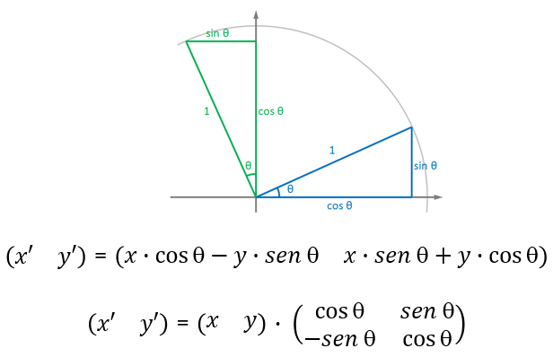

# Un sistema planetario

[Rotaciones arbitrarias](#rotaciones-arbitrarias)  
[Luces](#luces)  
[Sombras](#sombras)  
[Tarea](#tarea)  
[Referencias](#referencias)


## Rotaciones arbitrarias

Tras la sesión anterior que introducía aspectos básicos de three.js, en esta sesión práctica utilizaremos el archivo *index_S7.html*. Señalar que para poder hacer uso en el último ejemplo de *dat.gui*, he hecho uso de una versión previa de three.js.

Como punto de partida de la sesión, el código del archivo *script_11_estrella* integra varios de los elementos abordados en la semana anterior para dibujar una esfera, básicamente es el de *script_03_esfera_modular.js* reduciendo los parámetros de entrada y renombrando la función de creación de esferas, que ahora se denomina *Estrella*.

```
import * as THREE from "three";
import { OrbitControls } from 'three/examples/jsm/controls/OrbitControls'


let scene, renderer;
let camera;
let info;
let grid;
let estrella;

init()
animationLoop()

function init() {
	info = document.createElement('div');
	info.style.position = 'absolute';
	info.style.top = '30px';
	info.style.width = '100%';
	info.style.textAlign = 'center';
	info.style.color = '#fff';
	info.style.fontWeight = 'bold';
	info.style.backgroundColor = 'transparent';
	info.style.zIndex = '1';
	info.style.fontFamily = 'Monospace';
	info.innerHTML = "three.js - sol y planetas";
	document.body.appendChild(info);

	//Defino cámara
	scene = new THREE.Scene();
	camera = new THREE.PerspectiveCamera( 75, window.innerWidth / window.innerHeight, 0.1, 1000 );
	camera.position.set(0, 0, 10);

	renderer = new THREE.WebGLRenderer();
	renderer.setSize( window.innerWidth, window.innerHeight );
	document.body.appendChild( renderer.domElement );

	let camcontrols = new OrbitControls(camera, renderer.domElement);

	//Rejilla de referencia indicando tamaño y divisiones
	grid = new THREE.GridHelper(20, 40);
	//Mostrarla en vertical
	grid.geometry.rotateX( Math.PI / 2 );
	grid.position.set(0, 0, .05);
	scene.add(grid);

  //Objetos
	Estrella(1.8, 0xffff00);

}

function Estrella(rad,col) {
	let geometry = new THREE.SphereGeometry( rad, 10, 10 );
	let material = new THREE.MeshBasicMaterial( { color: col } );
	estrella = new THREE.Mesh( geometry, material );
	scene.add( estrella );
}


	//Bucle de animación
	function animationLoop() {
    requestAnimationFrame(animationLoop);

		renderer.render( scene, camera );
}
```

El resultado es una esfera amarilla, nuestra *estrella*, en el centro de la escena.
Para crear *planetas*, propongo reusar la función *Esfera* de la semana pasada, si bien con otro nombre: *Planeta*, y haciendo uso de un array *Planetas*. En
la función de inicialización creo uno o varios planetas.

```
//En init()
//Objetos
Planeta(0,0,0,0.8,10,10, 0xffff00);
Planeta(3,0,0,0.4,10,10, 0x00ffff);

...

function Planeta(px, py, pz, radio, nx, ny, col) {
  let geometry = new THREE.SphereBufferGeometry(radio, nx, ny)
  //Material con o sin relleno
  let material = new THREE.MeshBasicMaterial({
        color: col,
        //wireframe: true, //Descomenta para activar modelo de alambres
      });

  let mesh = new THREE.Mesh(geometry, material)
  mesh.position.set(px,py,pz);
  scene.add(mesh)
  Planetas.push(mesh)
}
```

En el bucle de visualización, se aplica una rotación a cada objeto presente en el vector *Planetas*.

```
for(let object of Planetas) {
      object.rotation.y += 0.01;
}
```

¿Hay rotación delos planetas? ¿Sobre qué punto?

**¿Cómo conseguir que las nuevas esferas roten alrededor de la primera, como si fueran una estrella y el planeta en su órbita?**

Mi primera propuesta consiste en crear una nueva función *PlanetaChild* donde la nueva malla no se asocia directamente a la escena sino a la malla suministrada como parámetro (en mi caso, la *estrella*). Con esta acción hago uso del grafo de escena, y ocurre que todas las transformaciones aplicadas sobre el ancestro, el padre, se aplican también a la matriz de transformación de sus herederos.

La información sobre el padre de un objeto se conoce a través de la propiedad *.parent*. Tener presente que un objeto únicamente puede tener un padre. En el contexto del [grafo de escena](https://r105.threejsfundamentals.org/threejs/lessons/threejs-scenegraph.html) se establecen dependencias en una estructura jerárquica entre objetos.

```
//Modifico en la función init
//sol
Estrella(0,0,0,0.8,10,10, 0xffff00);
//planeta
PlanetaChild(objetos[0],2.5,0,0,0.4,10,10, 0x0000ff);

...

//Defino la nueva función que recibe al padre como argumento de entrada
function PlanetaChild(padre,px,py,pz, radio, nx, ny, col) {
	let geometry = new THREE.SphereBufferGeometry(radio, nx, ny)
	let material = new THREE.MeshBasicMaterial({
					color: col,
					wireframe: true, //Descomenta para activar modelo de alambres
				  });

	let mesh = new THREE.Mesh(geometry, material)
	mesh.position.set(px,py,pz);
	padre.add(mesh)// Se define el padre
	Planetas.push(mesh)
}
```				

Si la estrella rota, el resultado obtenido con esta propuesta para la segunda esfera es una rotación alrededor del padre, añadida a la autorrotación. Sin embargo, el planeta no se desliga de la rotación de la *estrella*. Actúa como un satélite artificial geoestacionario que rota solidariamente con la rotación aplicada al padre, en este caso nuestro *sol*.

Una solución para desligar ambas rotaciones es calcular *a pelo* la rotación del planeta en función del tiempo, y consecuentemente actualizar la posición de la esfera. Opto por trabajar en rotación sobre *z* para los ejemplos, que modifica las coordenadas *x* e *y*. Recordando la rotación en 2D como muestra la imagen para determinar el cambio de las coordenadas, integro información temporal.

  
*Rotación 2D*

Tras resumir los cambios en *script_13_estrellasyplanetas.js* la función *Planeta* admite como parámetros la distancia a la estrella, tamaño y velocidad de rotación alrededor de su estrella, que se asocian al objeto a través de *userData*. Mi planeta inicialmente estará en la posición *(dist,0,0)* por lo que la transformación *a pelo* es sencilla, dado que al rotar sobre *z* el valor de *y* de partida es nulo. Asumiendo un ángulo inicial de rotación nulo, &theta;=0
, creciente en función del tiempo, *x=dist * cos &theta;* e *y = dist * sen &theta;*, para lo se hace uso de *Date* para definir un *timestamp*.

```
import * as THREE from "three";
import { OrbitControls } from "three/examples/jsm/controls/OrbitControls";

let scene, renderer;
let camera;
let info;
let grid;
let estrella,
  Planetas = [],
  Lunas = [];
let t0 = 0;
let accglobal = 0.001;
let timestamp;

init();
animationLoop();

function init() {
  info = document.createElement("div");
  info.style.position = "absolute";
  info.style.top = "30px";
  info.style.width = "100%";
  info.style.textAlign = "center";
  info.style.color = "#fff";
  info.style.fontWeight = "bold";
  info.style.backgroundColor = "transparent";
  info.style.zIndex = "1";
  info.style.fontFamily = "Monospace";
  info.innerHTML = "three.js - sol y planetas";
  document.body.appendChild(info);

  //Defino cámara
  scene = new THREE.Scene();
  camera = new THREE.PerspectiveCamera(
    75,
    window.innerWidth / window.innerHeight,
    0.1,
    1000
  );
  camera.position.set(0, 0, 10);

  renderer = new THREE.WebGLRenderer();
  renderer.setSize(window.innerWidth, window.innerHeight);
  document.body.appendChild(renderer.domElement);

  let camcontrols = new OrbitControls(camera, renderer.domElement);

  //Rejilla de referencia indicando tamaño y divisiones
  grid = new THREE.GridHelper(20, 40);
  //Mostrarla en vertical
  grid.geometry.rotateX(Math.PI / 2);
  grid.position.set(0, 0, 0.05);
  scene.add(grid);

  //Objetos
  Estrella(1.8, 0xffff00);
  Planeta(0.5, 4.0, 1.0, 0x00ff00);
  Planeta(0.8, 5.8, 1.2, 0xffff0f);

  //Inicio tiempo
  t0 = Date.now();
  //EsferaChild(objetos[0],3.0,0,0,0.8,10,10, 0x00ff00);
}

function Estrella(rad, col) {
  let geometry = new THREE.SphereGeometry(rad, 10, 10);
  let material = new THREE.MeshBasicMaterial({ color: col });
  estrella = new THREE.Mesh(geometry, material);
  scene.add(estrella);
}

function Planeta(radio, dist, vel, col) {
  let geom = new THREE.SphereGeometry(radio, 10, 10);
  let mat = new THREE.MeshBasicMaterial({ color: col });
  let planeta = new THREE.Mesh(geom, mat);
  planeta.userData.dist = dist;
  planeta.userData.speed = vel;

  Planetas.push(planeta);
  scene.add(planeta);
}


//Bucle de animación
function animationLoop() {
  timestamp = (Date.now() - t0) * accglobal;

  requestAnimationFrame(animationLoop);

  //Modifica rotación de todos los objetos
  Planetas.forEach(function (planeta) {
    planeta.position.x =
      Math.cos(timestamp * planeta.userData.speed) * planeta.userData.dist;
    planeta.position.y =
      Math.sin(timestamp * planeta.userData.speed) * planeta.userData.dist;
  });

  renderer.render(scene, camera);
}
```

Tras estas acciones se obtienen planetas que rotan alrededor de una estrella, sin que los movimientos de ambos objetos estén acoplados. Dado que no necesariamente las órbitas son circulares, añado en la creación del planeta como parámetros *f1* y *f2* que me permitirán definir una órbita elíptica, quedando almacenado a través de *userData*. Su presencia se tiene en cuenta al realizar la rotación en el bucle de visualización.


```
//En init
//Objetos
Estrella(1.8, 0xffff00);
Planeta(0.5, 4.0, 1.0, 0x00ff00,1.0,1.0);//con f1 y f2 para una órbita circular
Planeta(0.8, 5.8, 1.2, 0xffff0f,1.0,1.0);
...
function Planeta(radio, dist, vel, col,f1,f2) {
  let geom = new THREE.SphereGeometry(radio, 10, 10);
  let mat = new THREE.MeshBasicMaterial({ color: col });
  let planeta = new THREE.Mesh(geom, mat);
  planeta.userData.dist = dist;
  planeta.userData.speed = vel;
  planeta.userData.f1 = f1;
	planeta.userData.f2 = f2;

  Planetas.push(planeta);
  scene.add(planeta);
}


//Bucle de animación
function animationLoop() {
  timestamp = (Date.now() - t0) * accglobal;

  requestAnimationFrame(animationLoop);

  //Modifica rotación de todos los objetos
  Planetas.forEach(function (planeta) {
    planeta.position.x =
      Math.cos(timestamp * planeta.userData.speed) * planeta.userData.dist*planeta.userData.f1;
    planeta.position.y =
      Math.sin(timestamp * planeta.userData.speed) * planeta.userData.dist*planeta.userData.f2;
  });

  renderer.render(scene, camera);
}
```

Si coinciden con el valor 1.0, tenemos la misma situación anterior, si presentan valores diferentes, tendremos una órbita elíptica.

Como sería interesante mostrar la órbita, para dibujar la trayectoria del planeta propongo hacer uso de la curva elíptica (*EllipseCurve*) en la propia función de creación del planeta. De tal forma que simplemente se define con los parámetros asociados al planeta en la función *Planeta* y se añade el objeto a la escena.
En este ejemplo se asume que la trayectoria elíptica es alrededor del origen, viniendo los radios de la elipse definidos por la distancia y peso de cada uno.

```
function Planeta(radio, dist, vel, col,f1,f2) {
  let geom = new THREE.SphereGeometry(radio, 10, 10);
  let mat = new THREE.MeshBasicMaterial({ color: col });
  let planeta = new THREE.Mesh(geom, mat);
  planeta.userData.dist = dist;
  planeta.userData.speed = vel;
  planeta.userData.f1 = f1;
	planeta.userData.f2 = f2;

  Planetas.push(planeta);
  scene.add(planeta);

 //Trayectoria elíptica
	let curve = new THREE.EllipseCurve(
		0,  0,            		// centro
		dist*f1, dist*f2        // radios elipse
		);
		//Crea geometría
		let points = curve.getPoints( 50 );
		let geome = new THREE.BufferGeometry().setFromPoints( points );
		let mate = new THREE.LineBasicMaterial( { color: 0xffffff } );
		// Objeto
		let orbita = new THREE.Line( geome, mate );
		scene.add(orbita);
}
```

Si interesara añadir satélites a los planetas, realizar el cálculo de las posiciones es posible, pero engorroso, aprovecho en este caso el grafo de escena, asociando cada satélite o luna a su planeta en la función *Luna*. Les aplicamos rotaciones según los parámetros asignados.

```
//Objetos
  Estrella(1.8, 0xffff00);
  Planeta(0.5, 4.0, 1.0, 0x00ff00,1.0,1.5);
  Planeta(0.8, 5.8, -1.2, 0xffff0f,1.0,1.0);

  Luna(Planetas[0],0.15,0.5,-3.5,0xffff00);
  Luna(Planetas[0],0.04,0.7,1.5,0xff0f00);

...

function Luna(planeta, radio, dist, vel, col) {				
	var geom = new THREE.SphereGeometry(radio, 10, 10);
	var mat = new THREE.MeshBasicMaterial({ color: col});
	var luna = new THREE.Mesh(geom, mat);
	luna.userData.dist = dist;
	luna.userData.speed = vel;

	Lunas.push(luna);
	planeta.add(luna);
};


//Bucle de animación
function animationLoop() {
  timestamp = (Date.now() - t0) * accglobal;

  requestAnimationFrame(animationLoop);

  //Modifica rotación de todos los objetos
  Planetas.forEach(function (planeta) {
    planeta.position.x =
      Math.cos(timestamp * planeta.userData.speed) * planeta.userData.dist*planeta.userData.f1;
    planeta.position.y =
      Math.sin(timestamp * planeta.userData.speed) * planeta.userData.dist*planeta.userData.f2;
  });

  for(let object of Lunas) {
			object.position.x = Math.cos(timestamp * object.userData.speed) * object.userData.dist;
      object.position.y = Math.sin(timestamp * object.userData.speed) * object.userData.dist;
		}


  renderer.render(scene, camera);
}

```

El uso de un pivote intermedio en el grafo de escena aportará mayor flexibilidad,
permitiendo por ejemplo que la órbita lunar esté en un plano distinto. Un extracto del archivo *script_14_estrellasyplanetasylunas.js*

```
//En init
Planeta(0.2,3,2,0x0000ff, 1.0, 1.2);
Planeta(0.15,5,1.4,0xff0ff0, 1.9, 1.1);

Luna(Planetas[0], 0.05, 0.5, -3.5, 0xffff00, 0.0);
Luna(Planetas[0], 0.04, 0.7, 1.5, 0xff0f00, Math.PI / 6);
...

function Luna(planeta, radio, dist, vel, col, angle) {				
	var pivote = new THREE.Object3D();
	pivote.rotation.x = angle;
	planeta.add(pivote);
	var geom = new THREE.SphereGeometry(radio, 10, 10);
	var mat = new THREE.MeshBasicMaterial({ color: col});
	var luna = new THREE.Mesh(geom, mat);
	luna.userData.dist = dist;
	luna.userData.speed = vel;

	Lunas.push(luna);
	pivote.add(luna);
};
```


## Luces

Para introducir los aspectos básicos de iluminación, hago uso del código del ejemplo *script_15_luces.js*. Dado que hace uso de *dat.gui*, como se comenta anteriormente, he tenido que incluir en *index_S7.html* la referencia a una versión anterior de three.js.

El código tiene distintos elementos comentados, por defecto muestra tres esferas con los colores rojo, verde y azul creando los objetos con la función *Esfera*, que básicamente las define como hasta ahora con *MeshBasicMaterial*.
De cara a la integración de la iliuminación, threejs ofrece:

- *MeshLambertMaterial*: El modelo de Lambert, que básicamente considera reflexión difusa. Efectivo cuando no se quiere iluminación modelada físicamente.

- *MeshPhongMaterial*: Adopta el modelo Phong-Blinn para el cálculo de la reflexión. De nuevo es un modelo que no es físicamente real.

- *MeshPhysicalMaterial*: Proporciona posibilidades avanzadas con mayor realismo físico. No se trata en esta sesión.

Para este ejemplo se adopta el *MeshPhongMaterial*, del que se hace uso en la función *EsferaPhong*. Te animo a comentar las referencias a *Esfera* y descomentar las referencias a  *EsferaPhong*.

 **¿Qué se ve?**

¿Unos círculos negros? La razón es que no hay iluminación definida. Descomentando el bloque de código desde el comentario *//Luz ambiente* se activa una luz ambiente ([AmbientLight](https://threejs.org/docs/#api/en/lights/AmbientLight)) y su interfaz para modificar sus parámetros de color e intensidad. La iluminación de ambiente no tiene definida dirección, e intenta simular la luz que llega a la superficie de los objetos por reflexión difusa de la luz tras rebotar en todos los elementos de la escena, aspecto no contemplado en los modelos de iluminación/reflexión local.

Si no ha habido ningún percance, el siguiente paso sugerido es descomentar el bloque de la luz direccional *//Luz direccional y asistente* que crea una luz direccional ([DirectionalLight](https://threejs.org/docs/#api/en/lights/DirectionalLight)) definiendo su color e intensidad. Las luces direccionales se definen localizadas en el infinito, y emiten en una dirección específica.
Por defecto emiten hacia el *(0, 0, 0)*, punto que puede modificarse con la propiedad *target*.
En el código, se crea un asistente *DirectionalLightHelper* que facilita interpretar su dirección de emisión. Como cualquier luz, que no sea de ambiente, afectará a la superficie dependiendo del ángulo entre la normal a la superficie del objeto y la dirección de la fuente de luz.


El siguiente bloque a descomentar (*//Luz focal y asistente*) define una luz focal ([SpotLight](https://threejs.org/docs/#api/en/lights/SpotLight)) estableciendo una determinada configuración, y fijando a continuación su posición con *.position.set(2, 2, 2);*. Los argumentos descritos en la documentación:

- color: por defecto 0xffffff
- intensidad: fuerza de la luz, por defecto 1
- distancia: rango máximo de la luz. Por defecto 0, no hay límite
- ángulo: ángulo máximo de dispersión de la luz, teniendo como límite máximo &pi;/2.
- penumbra: porcentaje del cono atenuado por penumbra, siendo por defecto 0
- decaimiento: atenuación debida a la distancia

El último bloque comentado *//Luz puntual y asistente* define una luz puntual ([PointLight](https://threejs.org/docs/#api/en/lights/PointLight)), que cuenta con un subconjunto de los parámetros que la focal, en concreto:

- color
- intensidad
- distancia
- decaimiento

Tras descomentar todos los bloques, la correspondiente GUI permite modificar algunos de sus parámetros de configuración.

Mencionar, sin ir más allá, otros dos tipos de luces presentes en three.js.
Por un lado [HemisphereLight](https://threejs.org/docs/#api/en/lights/HemisphereLight) que define una luz en la parte superior de la escena. Concebida para dar aspecto más natural a escenas exteriores donde hay gran dispersión de la luz, sin embargo no puede provocar sombras. Cierto es que aún no las hemos visto para el resto de los tipos de luces (será la próxima semana, pero no hay obstáculo para que curioseen). El [ejemplo del flamenco](https://threejs.org/examples/#webgl_lights_hemisphere) da una visión sobre lo que aportan este tipo de luces.

Por otro lado, están las fuentes de emisión de área rectangular ([RectAreaLight](https://threejs.org/docs/#api/en/lights/RectAreaLight)), que a diferencia de todas las anteriores no son puntuales. Señalar que tampoco tienen soporte para sombras, y que sólo actúan con *MeshStandardMaterial* y *MeshPhysicalMaterial*, además de requerir *THREE.WebGLDeferredRenderer* por temas de eficiencia. Un [ejemplo ilustrativo](https://threejs.org/examples/#webgl_lights_rectarealight) de sus posibilidades.

Finalmente indicar que three.js también ofrece cierto soporte para sondas luminosas ([LightProbe](https://threejs.org/docs/#api/en/lights/LightProbe)) que permiten añadir luz a la escena 3D, si bien no emitiendo sino almacenando luz que atraviesa el espacio 3D. Se asocian normalmente a mapas de brillo del entorno. La documentación incluye varios ejemplos.

## Sombras

Three.js proporciona soporte para sombras. Al no estar activo por defecto, debe indicarse al definir un objeto si proyecta sombras, propiedad *.castShadow*, y/o si las recibe, propiedad *.receiveShadow*. Sugiero duplicar el código *script_15_luces.js* y renombrar (por ejemplo a *script_16_lucesysombras*), tras esto en el nuevo archivo modifico la función *EsferaPhong* añadiendo un parámetro de entrada, *sombra*, que permite definir si el objeto produce o no sombras.


```
function EsferaPhong(px,py,pz, radio, nx, ny, col, sombra = false) {
  let geometry = new THREE.SphereBufferGeometry(radio, nx, ny)
  //Material con o sin relleno
  let material = new THREE.MeshPhongMaterial({
    color: col
    });

    let mesh = new THREE.Mesh(geometry, material);
    if (sombra) mesh.castShadow = true;
    mesh.position.set(px,py,pz);
    scene.add(mesh)
    objetos.push(mesh)
  }
```

Además de activar la propiedad correspondiente del objeto productor de sombras, también se debe indicar en el *renderer* el cálculo de los mapas de sombras
por medio de la propiedad [*.shadowMap*](https://threejs.org/docs/#api/en/renderers/WebGLRenderer.shadowMap). En la documentación puedes comparar entre los distintos tipos existentes.

```
renderer = new THREE.WebGLRenderer();
renderer.setSize( window.innerWidth, window.innerHeight );
//Se activan las sombras
renderer.shadowMap.enabled = true;
//renderer.shadowMap.type = THREE.PCFSoftShadowMap; // por defecto THREE.PCFShadowMap
document.body.appendChild( renderer.domElement );
```

Para la escena del ejemplo con tres esferas, interesa definir al menos un objeto que reciba las sombras, es decir, sobre el que se proyecten las mencionadas sombras. Opto por una
caja que haga de suelo, a la que activo dicha característica con la propiedad *.receiveShadow*.

```
//Suelo, para recibir sombras
const SueloGeometry = new THREE.BoxGeometry(10, 0.5, 8);
const SueloMaterial = new THREE.MeshStandardMaterial({ color: 0xfafafa });
const Suelo = new THREE.Mesh(SueloGeometry, SueloMaterial);
Suelo.receiveShadow = true;
Suelo.position.y = -5;
scene.add(Suelo);
```

Faltaría activar la luz o luces que producen sombras, por medio de la propiedad *.castShadow*. El código de la luz direccional y que pueda activarse o no en la interfaz podría quedar algo como:

```
...

//Luz direccional y asistente
const Ldir = new THREE.DirectionalLight(0xffffff, 0.5);
Ldir.position.set(0, 2, 0);
//Sombras
Ldir.castShadow = true;
const LdirHelper = new THREE.DirectionalLightHelper(Ldir, 3);
scene.add(Ldir);
scene.add(LdirHelper);

// Luz direccional GUI
const Ldir_Params = {
  visible: true,
  color: Ldir.color.getHex(),
};
const Ldir_Info = gui.addFolder('luz direccional');
Ldir_Info.add(Ldir_Params, 'visible').onChange((value) => {
  Ldir.visible = value;
  LdirHelper.visible = value;
  });
  Ldir_Info.add(Ldir, 'intensity', 0, 1, 0.25);
  Ldir_Info.add(Ldir.position, 'y', 1, 4, 0.5);
  Ldir_Info.add(Ldir, 'castShadow');
  Ldir_Info
  .addColor(Ldir_Params, 'color')
  .onChange((value) => Ldir.color.set(value));
  Ldir_Info.open();

...
```

Three.js utiliza mapas de sombras, que requieren visualizar la escena desde el punto de vista de cada fuente de luz, suponiendo su utilización por ello un coste importante. Una alternativa podría ser el uso de *sombras falsas*, básicamente texturas. Para mayor información puede serte de interés este [tutorial](https://r105.threejsfundamentals.org/threejs/lessons/threejs-shadows.html).

En mis pruebas con la luz [direccional](https://threejs.org/docs/#api/en/lights/shadows/DirectionalLightShadow) ha sido inmediato el resultado, pero no me se han mostrado evidentes las sombras producidas por luces [focales](https://threejs.org/docs/#api/en/lights/shadows/SpotLightShadow) y [puntuales](https://threejs.org/docs/#api/en/lights/shadows/PointLightShadow), a pesar de estar documentadas.


## Tarea

Crear un primer prototipo que muestre un sistema planetario en movimiento que incluya una estrella, al menos cinco planetas y no menos de dos lunas, y que puedan existir sombras. Valorar que exista algún tipo de interacción, como por ejemplo la velocidad del tiempo, el modo de visualización, etc.

Señalar que al menos durante una semana más se seguirá trabajando en el prototipo, se valora la versión final entregada en la semana 9, por lo que si tienen tiempo y curiosidad pueden explorar las propiedades del material [MeshPhongMaterial](https://threejs.org/docs/#api/en/materials/MeshPhongMaterial).

Aunque no haya sido realizado con three.js sino con [Processing](https://processing.org) el [prototipo de Gabriel García Buey](https://github.com/CaptainChameleon/PocketPlanetarium) puede dar inspiración.


## Referencias

Referencias que han servido para la confección de los diversos ejemplos:

- [Documentación](https://threejs.org/docs/index.html#manual/en/introduction/Creating-a-scene)  
- [Discover three.js](https://discoverthreejs.com)
- [Learning Three.js](https://github.com/josdirksen/learning-threejs) por [Jos Dirksen](https://github.com/josdirksen)
- [Three.js Cookbook](https://github.com/josdirksen/threejs-cookbook) por [Jos Dirksen](https://github.com/josdirksen) de 2015


***
Bajo licencia de Creative Commons Reconocimiento - No Comercial 4.0 Internacional
