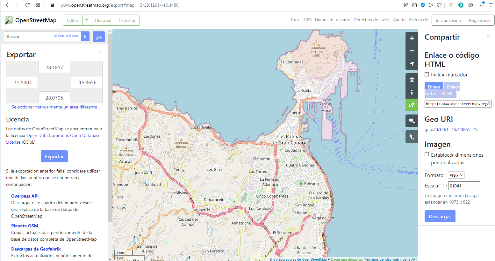
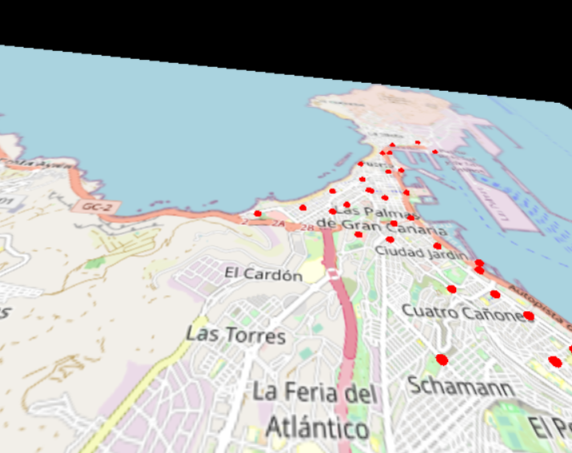
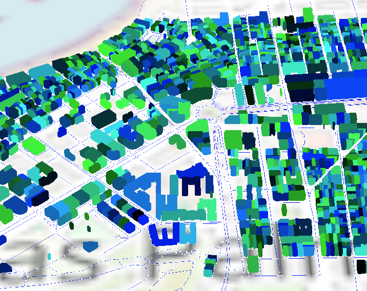

# Terrenos y mapas geográficos

[Terrenos](#terrenos)  
[Mapas](#mapas)  
[Tarea](#tarea)  
[Referencias](#referencias)

#https://x.com/CiudadCanaria/status/1780708905267667341

## Terrenos

En la práctica anterior, se han utilizado mapas de texturas, rugosidad, reflexión y transparencia. Ninguno de dichos mapas modifica la geometría del objeto. En esta nueva sesión, se hace uso del mapa de desplazamiento del material para crear de forma sencilla un terreno, permitiendo comprobar sobre la malla de vértices que la geometría resultante se ha modificado (*wireframe: true*).

En primer término interesa obtener o crear una imagen en tonos de grises que servirá de mapa de elevación/altura.
Para el ejemplo del código [*script_21_terreno.js*](https://github.com/otsedom/otsedom.github.io/blob/main/IG/S8/code/script_21_terreno.js) he obtenido mapas de altura desde estas dos fuentes:

- [Tutorial sobre *.displacementMap*](https://sbcode.net/threejs/displacmentmap). El mapa descargable en formato comprimido, incluye información de batimetría (relieve zonas cubiertas por agua).
- [Repositorio de la NASA](https://visibleearth.nasa.gov/images/73934/topography). En esta caso, no incluye información de batimetría. Eso sí, la imagen de partida tiene una resolución de 21600x10800, que reduje a 5400x2700, tras apreciar problemas en la ejecución en mi portátil.

El código del ejemplo [*script_21_terreno.js*](https://github.com/otsedom/otsedom.github.io/blob/main/IG/S8/code/script_21_terreno.js) no es extenso, y no tiene grandes novedades. Básicamente crea una geometría plana, asociando la textura difusa y el mapa de desplazamiento y la escala de acplicación al asignar valores a *.displacementMap* y *.displacementScale*.

Modificando el código, puede alternarse entre dos mapas de desplazamiento (*dm1* y *dm2*) modificando directamente en el código el parámetro que se proporciona a la función *Plano*. Sugerir **observar el comportamiento**:

- al no asignar textura difusa,
- alternar el modo *wireframe* activado y desactivado,
- y modificar el número de divisiones de la geometría del plano.

Señalar que en mis pruebas no he conseguido obtener el resultado de desplazamiento con el *MeshStandardMaterial*, pese a aparecer como propiedad en la documentación.

```
...
  if (dismap != undefined){
    material.displacementMap = dismap;
    material.displacementScale = 0.3;
  }
...
```

Otras fuentes de mapas de elevación o altura pueden encontrarse buscando algo como *heightmap black and white*.
También existen repositorios que permiten descargar mapas de elevación:

- [Centro de descargas del Centro Nacional de Información Geográfica](http://centrodedescargas.cnig.es/CentroDescargas/catalogo.do?Serie=MAMOV). Permite en el visor seleccionar el área para descargar.
- [Recopilatorio de fuentes de modelos de elevación](https://gisgeography.com/free-global-dem-data-sources/), destacando [ASTER](https://asterweb.jpl.nasa.gov/gdem.asp) y [Copernicus Open Access Hub](https://scihub.copernicus.eu) que requiere registro.

Sin embargo, debes tener presente que algunas fuentes proporcionan los mapas en formato geotiff,
que no es legible para three.js. Aunque no lo he probado, este [tutorial](http://www.smartjava.org/content/threejs-render-real-world-terrain-heightmap-using-open-data/) describe
el procedimiento para su conversión en jpeg o png. Una alternativa es hacer uso de herramientas como [QGIS](https://www.qgis.org/en/site/) para dicha operación.

<!--
Perlin noise terrain
https://codepen.io/ptc24/pen/BpXbOW

IGN elevaciones
https://www.ign.es/web/seccion-elevaciones
-->


## Mapas


### OpenStreetMap

En este apartado el objetivo es mostrar opciones para visualizar una zona geográfica real concreta.
Con la tarea descrita más abajo en mente, un primer paso consiste en localizar una fuente de mapas. Los ejemplos propuestos no abordan la descarga dinámica de los datos geográficos durante la ejecución del programa, sino la obtención del mapa previamente.
Para ambos ejemplos hago uso de material descargable desde [OpenStreetMap](https://www.openstreetmap.org/#map=8/28.312/-16.026). Al abrir el enlace te mostrará directamente una vista de las Islas Canarias. Te invito a seguir los siguientes pasos para escoger la zona a descargar:

- En la cajita de búsqueda (parte superior izquierda) teclea *las palmas de gran canaria*, esta acción te llevará al mapa de la capital de Gran Canaria, con algo parecido a la siguiente imagen:

  
*Interfaz web de OpenStreeMap para exportar mapas personalizados*


<!--- Una zona del mapa se puede secargar haciendo uso de la llamada al servidoro con algo Como http://overpass.openstreetmap.ru/cgi/xapi_meta?*[bbox=-15.446,28.08,-15.396,28.18] --->

- Sobre esta vista puede escogerse una zona concreta del mapa, además de seleccionar distintas capas (desde el menú lateral de la derecha). Al seleccionar *Exportar* (menú de la parte superior izquierda) se puede descargar el xml de la zona visible, si bien **es probable que obtengas un error al haber limitaciones del número total de nodos que el servidor permite descargar**. En ese caso, deberás escoger manualmente una zona de interés más reducida (bajo el recuadro de coordenadas en la izquierda aparece *Seleccionar manualmente un área diferente*). Esta descarga, la guardaremos para el último ejemplo de esta sesión, ([*script_26_mapaosm.js*](https://github.com/otsedom/otsedom.github.io/blob/main/IG/S8/code/script_26_mapaosm.js)), conteniendo elementos geográficos en formato xml.

- Para los ejemplos [*script_24_mapasitycleta.js*](https://github.com/otsedom/otsedom.github.io/blob/main/IG/S8/code/script_24_mapasitycleta.js) y [*script_25_mapasitycleta2.js*](https://github.com/otsedom/otsedom.github.io/blob/main/IG/S8/code/script_25_mapasitycleta2.js), se descarga el mapa como imagen, sin obtener un xml con las entidades geográficas. En este caso, sólo se permite descargar la capa por defecto. La opción de descargar la imagen y el formato, se define en el menú lateral derecho dentro de *Compartir*. **Importante anotar las coordenadas de latitud y longitud escogidas**, que se encuentran en la parte superior izquierda, justo bajo *Exportar*, dado que es información que no viene incluida en la imagen descargada.


### Mapa como imagen

El código del primer ejemplo, [*script_24_mapasitycleta.js*](https://github.com/otsedom/otsedom.github.io/blob/main/IG/S8/code/script_24_mapasitycleta.js), es bastante compacto, básicamente la imagen del mapa se utiliza como textura de un plano, que modifica su tamaño inicial definido, para mantener las proporciones o relación de aspecto con las del mapa. Aplicar la textura a un plano, no es una novedad. Por otro lado, se crean unas esferas en las localizaciones geográficas de las estaciones de la [Sitycleta](https://www.sitycleta.com/es/). Para ello, es necesario contar con el archivo *Geolocalización estaciones sitycleta.csv*, presente en Glitch, que contiene los datos de geolocalización de las estaciones de la [Sitycleta](https://www.sitycleta.com/es/). En el código en concreto, se leen y almacenan el identificador y nombre de las estaciones además de su geolocalización con las coordenadas de latitud y longitud. Los datos desde el archivo se leen procesando por líneas (separador de salto de línea), separando en cada línea con el *punto y coma* extrayendo la información que de interés para el ejemplo.

Tras contar con la información de las estaciones, habiendo cargado la imagen del mapa, y conociendo sus límites de latitud y longitud (información no incluida en el archivo de imagen y definida directamente en el código), el código dibuja sobre el mapa las posiciones de las mencionadas estaciones de la Sitycleta, tomadas del archivo csv. Para su posicionamiento en el mapa, se realiza un ajuste de escala, dado que si se ha escogido correctamente la zona del mapa, las estaciones están en el rango de latitudes y longitudes del mapa. La función *Mapeo* se ocupa de adaptar coordenadas sobre el mapa a coordenadas del espacio 3D que se proyecta en pantalla. Cada estación se visualiza como una esfera roja como se aprecia en la imagen.


  
*Vista de la imagen geolocalizada*


En el siguiente ejemplo, [*script_25_mapasitycleta2.js*](https://github.com/otsedom/otsedom.github.io/blob/main/IG/S8/code/script_25_mapasitycleta2.js), además de los datos de la localización de estaciones, se cargan [datos de acceso abierto de Sagulpa](https://www.sagulpa.com/datos-abiertos). En concreto carga datos de préstamos en 2028, que se almacenan an la variable *datosSitycleta*. Observando el csv, puedes comprobar que se incluye datos como la hora de inicio y fin del préstamo, así como las estaciones involucradas. Para mostrar un ejemplo mínimo de la evolución temporal de los datos cargados, se define una fecha de inicio, que se modifica en el bucle de visualización, mostrándose en la parte superior de la ventana. A contituación, con ese dato de *fecha actual* se filtran los préstamos activos, modificando el color y tamaño de las estaciones afectadas por dichos préstamos. **¿Se te ocurren otras propuestas de visualización?**


### Cargando elementos geográficos como primitivas gráficas

Para el último ejemplo ilustrativo, se ha descargado parcialmente la zona de la Avenida de Mesa y López, dado que el número de nodos crece significativamente al seleccionar zonas de mayor área de la ciudad.
 El archivo contiene las entidades geográficas presentes en la zona del mapa escogidas. En nuestro ejemplo, dicha información está contenida en el archivo *mapLPGC_MyL.osm*.

En el código [*script_26_mapaosm.js*](https://github.com/otsedom/otsedom.github.io/blob/main/IG/S8/code/script_26_mapaosm.js), se utiliza *FileLoader* para la lectura del arhivo xml, haciendo uso de las utilidades proporcionadas por *DOMParser*.
En primer término se obtienen los límites de latitud y longitud de la zona contenida en el archivo.
Posteriormente, una vez cargada la información de elementos de tipo *way*, se seleccionan elementos del mapa con ciertos *tags*. Más información de los [tags de OSM](https://wiki.openstreetmap.org/wiki/Tags). De esta forma en el ejemplo se filtran edificios y calles, para su visualización.

En el ejemplo propuesto, el proceso accede a los elementos de tipo *way* seleccionando aquellos que presentan el *tag* *highway* o *building* para crear sus correspondientes primitivas gráficas. Para cada elemento de interés, se obtienen las coordenadas de latitud y longitud de sus nodos, que se van almacenando en primer término en un vector de puntos, que se visualizan como pequeñas esferas, para finalmente crear la entidad gráfica.

Para cada elemento *way* se define una primitiva, en el caso de los elementos *highway* se usan para definir una polilínea que se muestra en color azul. En el caso de los edificios, *building*, he optado por una geometría de extrusión ([ExtrudeGeometry](https://threejs.org/docs/#api/en/geometries/ExtrudeGeometry)) a partir del contorno definido por los nodos. Su color es aleatorio, y para su altura se adopta un valor estándar que aleatoriamente se modifica para conseguir que los edificios no sean exactamente iguales en altura. 

El ejemplo permite cierta interacción con zoom y traslación por el mapa, optando en este caso por el uso de [TrackballControls](https://threejs.org/docs/#examples/en/controls/TrackballControls) que ofrece una variante para el control de cámara a las vistas en prácticas previas, con acciones diferentes para cada botón del ratón. Su uso requiere añadir el *import* correspondiente.

```
import { TrackballControls } from "three/examples/jsm/controls/TrackballControls";
```

Es básicamente una variante de *OrbitControls*, que permite combinar el uso de las teclas *A*, *S* y *D* con el clic de ratón, produciendo un comportamiento diferente en cada caso de la cámara.
Para su uso, en el bucle de visualización se realiza la actualización de la cámara en base al tiempo transcurrido. Su documentación permite identificar propiedades de comportamiento que son modificables según convenga.

<!--
Para OSM [OSM2World](http://osm2world.org/download/), descargar binarios ...
-->

  
*Vista del mapa OSM*


<!---
Otras cosas

MapThing 1.4
https://github.com/jreades/MapThing/blob/master/distribution/MapThing-1.5/examples/MapThing/MapThing.pde

En processing 4 la demo no va

Unbfolding maps < v4
http://unfoldingmaps.org

2014
https://forum.processing.org/two/discussion/7667/reading-gps-data-file.html

%http://learningthreejs.com/blog/2013/09/16/how-to-make-the-earth-in-webgl/

%Ejemplo processing terrain3D
%https://github.com/rogeriobego/terrain_3d_perlinNoise  --->

## Tarea

SOLO UNA TAREA; ENTREGAR UN GIF ANIMADO PARA LA PRESENTACIÖN, mÄXIMO 30 ''

La tarea consistirá en proponer una visualización de datos de acceso abierto que contengan información geográfica en threejs, con las habilidades adquiridas en las sesiones previas. Podrás optar bien por adoptar 
**datos integrando información OSM** o **datos sobre mapas**. En ambos casos será necesario acceder a datos de acceso abierto, si bien en el primero podrás 
explorar otros elementos contenidos en el xml de OSM.

Si decides explorar los los datos de acceso abierto de Sagulpa, en su [web](https://www.sagulpa.com) puedes localizar en la parte inferior el enlace a su [Portal de Transparencia](https://www.sagulpa.com/portal-transparencia). Una vez en el portal, tienes acceso a una interesante colección de [datos abiertos](https://www.sagulpa.com/datos-abiertos) de aparcamientos y de la Sitycleta. En la tarea propuesta, se les invita a usar datos de varios años completados, ya sea de aparcamientos o de la Sitycleta. Por ejemplo, para el caso de la Sitycleta, el archivo contiene el diario de préstamos de bicicletas, incluyendo el horario y fecha, los minutos de uso, además de las estaciones de alquiler y entrega. En ambos casos, debes proponer y llevar a cabo un prototipo de visualización concreta, remitiendo un enlace, una captura de pantalla del resultado, además de un enlace a un vídeo (gif o mp4) con una duración no superior a 30 segundos y un vídea captura de pantalla del resultado.
La propuesta de visualización será mostrada a todo el grupo durante la sesión de teoría del lunes 18 de noviembre, para posteriormente realizar una elección de propuestas favoritas. Para componer la presentación deben remitirme un gif animado o vídeo antes del sábado 16 de noviembre.

Si decides tratar datos de Sagulpa, a través de su [web](https://www.sagulpa.com) puedes localizar en la parte inferior el enlace a su [Portal de Transparencia](https://www.sagulpa.com/portal-transparencia). Una vez en el portal, tienes acceso a una interesante colección de [Datos abiertos](https://www.sagulpa.com/datos-abiertos) (seleccionar en el menú en la izquierda) de aparcamientos y de la Sitycleta (seleccionando arriba a la derecha entre unos y otros). 
Si quisieras seguir tratando los datos de Sitycleta, puedes contemplar la comparativa por meses, trimestres años, años, 
<!--En la tarea propuesta, se les invita a usar datos de varios años completados, ya sea de aparcamientos o de la Sitycleta. Por ejemplo, para el caso de la Sitycleta, el archivo contiene el diario de préstamos de bicicletas, incluyendo el horario y fecha, los minutos de uso, además de las estaciones de alquiler y entrega.  
La tarea a entregar en ambos casos consiste en hacer uso de información disponible, de forma completa o parcial (según estimen, pudiendo si así lo consideran necesario hacer uso de información de otros años, o comparativas entre meses, trimestres, etc.), para visualizar los datos allí presentes haciendo uso de las técnicas vistas para gráficos 3D.   -->

Por si pudiera servir de ilustración, como añadido a lo incluido en las dispositivas de clase:

- El perfil de [Pedro Suárez 🔗 x-y.es](https://twitter.com/x_y_es) en el que junto a su [canal youtube](https://www.youtube.com/xyesz) utiliza como  escaparate para mostrar visualizaciones en 2, 3 y 4D con three.js. Muchas de ellas centradas en nuestro archipiélago. De hecho, durante la erupción de La Palma, su perfil tuvo gran repercusión.
Pedro Suárez https://x.com/x_y_es/status/1438589144901603329?s=20
- Propuestas más votadas del curso pasado:
  - [Juan Pereiro](https://costa-norte-surf.glitch.me/)
  - [Alejandro Ortega y Joaquín Villamonte](https://dataviz-joaquinalejandro-2324.glitch.me/) <!-- https://glitch.com/edit/#!/jvp-pr10 -->
  - [Agustín Vizcaíno](https://verdant-jazzy-keeper.glitch.me)
<!--2223, creo que Kenai https://glitch.com/edit/#!/mejora-sitycleta-kenai https://glitch.com/edit/#!/kenai-sitycleta-2223?path=README.md%3A1%3A0 Falla algo-->

## Referencias

Referencias que han servido para la confección de los diversos ejemplos:

- [Documentación](https://threejs.org/docs/index.html#manual/en/introduction/Creating-a-scene)  
- [Three.js Fundamentals](Three.js Fundamentals)
- [Discover three.js](https://discoverthreejs.com)
- [Learning Three.js](https://github.com/josdirksen/learning-threejs) por [Jos Dirksen](https://github.com/josdirksen)
- [Three.js Cookbook](https://github.com/josdirksen/threejs-cookbook) por [Jos Dirksen](https://github.com/josdirksen) de 2015


***
Bajo licencia de Creative Commons Reconocimiento - No Comercial 4.0 Internacional
