# Shaders

[Introducción](#introducción)  
[Shaders de fragmentos](#shaders-de-fragmentos)  
[Generativos](#generativos)  
[Aleatoriedad](#aleatoriedad)  
[Texturas](#texturas-en-el-shader)  
[Galería](#galería)  
[Tarea](#tarea)  
[Referencias](#referencias)
<!--[Imágenes](#imágenes)  -->

### Introducción

Un *shader* se define como una pieza de código que se ejecuta sobre un conjunto de píxeles de forma simultánea, e independiente para cada píxel. En muchos casos dicha ejecución aprovecha las capacidades de la GPU. Un *shader* ofrece la posibilidad de manipular la imagen de salida antes de mostrarla en pantalla, permitiendo aplicar efectos de reproducción (*rendering*), modificando la imagen resultante según las intenciones de quien programa.
En [The Book of Shaders](https://thebookofshaders.com) [Gon21], se sugiere la analogía con la invención de la imprenta moderna, que supuso un extraordinario incremento de velocidad a la hora de producir documentos.

En un primer momento, los *shaders* fueron concebidos para desarrollar modelos de iluminación y  sombreado, por ello su nombre *shader*, si bien en la actualidad se aplican sobre todas las etapas de reproducción, distinguiéndose, los siguientes tipos:


- Fragmento (OpenGL) / Píxel (DirectX): Combinación de textura y color por píxel. El objetivo original.  
-  Vértice: Modifica la posición del vértice, color,  coordenadas de textura, e incidencia de la luz. No añade vértices. <!--- %T\&L transformación e iluminación. --->
- Geometría: Geometría generada procedimentalmente.


<!---
%Lucasfilm y programadores para FX en los 80
%Pixar y Renderman en 1995
%Aplicaciones
%Algoritmos iluminación
%Render volumétrico
%Terrenos
%Tessellation --->


Entre los diversos lenguajes  utilizados para el desarrollo de *shaders* (HLSL, GLSL, Cg) este guion se limita a GLSL por su vinculación con OpenGL.
Three.js cuenta con el material
[ShaderMaterial](https://threejs.org/docs/#api/en/materials/ShaderMaterial), cuya documentación incluye una batería de ejemplos. También existe el  [RawShaderMaterial](https://threejs.org/docs/#api/en/materials/RawShaderMaterial). Se diferencian en que el primer material automáticamente adjunta *uniforms* y atributos.

<!--
https://medium.com/@leannewerner/shadermaterial-vs-rawshadermaterial-f1f0def5722
Vertex Uniforms
1) uniform mat4 modelMatrix;
2) uniform mat4 modelViewMatrix;
3) uniform mat4 projectionMatrix;
4) uniform mat4 viewMatrix;
5) uniform mat3 normalMatrix;
6) uniform vec3 cameraPosition;
Vertex Attributes
1) attribute vec3 position;
2) attribute vec3 normal;
3) attribute vec2 uv;
 -->


Las secciones a continuación se basan en el material de referencia desarrollado por Patricio Gonzalez Vivo y Jen Lowe, [*The Book of Shaders*](https://thebookofshaders.com) [Gon21]. Este documento declara ser *una guía paso a paso a través del abstracto y complejo universo de los Fragment Shaders* con pautas para Three.js, Processing u openFrameworks.
Se incluyen en este guion un recorrido por los *shaders* de fragmentos, quedando fuera del alcance de las prácticas este curso la introducción a los *shaders* de vértices.

### *Shaders* de fragmentos

Este guion centra la atención en el *shader* de fragmentos, siguiendo el esquema propuesto en [The Book of Shaders](https://thebookofshaders.com), adoptando un shader de vértices mínimo. <!--, con excepción de una leve mención en la sección dedicada a imágenes.-->

Un *shader* se ejecuta como una función que recibe una localización, y devuelve un color. Para ejecutarse en paralelo, cada hilo o *thread* es independiente de todos los demás, va *ciego* sin saber lo que hace el resto, no habiendo comunicación posible entre ellos, evitando de esta forma poner en riesgo la integridad de los datos.

#### Hola mundo y formas básicas

Para mostrar un ejemplo mínimo de *shader*, partimos de un código sencillo *script_31_shadermin.js*
que crea dos esferas de color amarillo, pero el material de la segunda de ellas es de tipo *ShaderMaterial* y el resultado final no es una esfera amarilla.

**script_31_shadermin.js**
```
import * as THREE from "three";
import { OrbitControls } from 'three/examples/jsm/controls/OrbitControls'

let scene, renderer;
let camera;
let info;
let grid;
let camcontrols1, camcontrols2;
let objetos = [];
let uniforms = {};

init();
animationLoop();

function init() {
  //Defino cámara
  scene = new THREE.Scene();
  camera = new THREE.PerspectiveCamera(
    45,
    window.innerWidth / window.innerHeight,
    0.1,
    1000
  );
  camera.position.set(0, 0, 5);

  renderer = new THREE.WebGLRenderer();
  renderer.setSize(window.innerWidth, window.innerHeight);
  document.body.appendChild(renderer.domElement);

  //Objetos
  Esfera(-1.5, 0, 0, 0.8, 10, 10, 0xffff00);
  EsferaShader(1.5, 0, 0, 0.8, 10, 10);

  //Orbit control y rejilla
  camcontrols1 = new OrbitControls(camera, renderer.domElement);
  grid = new THREE.GridHelper(20, 40);
  grid.geometry.rotateX(Math.PI / 2);
  grid.position.set(0, 0, 0.05);
  scene.add(grid);
}

function Esfera(px, py, pz, radio, nx, ny, col) {
  let geometry = new THREE.SphereBufferGeometry(radio, nx, ny);
  let material = new THREE.MeshBasicMaterial({
    color: col,
  });

  let mesh = new THREE.Mesh(geometry, material);
  mesh.position.set(px, py, pz);
  scene.add(mesh);
  objetos.push(mesh);
}

function vertexShader() {
  return `
				varying vec3 vUv;
				varying vec4 modelViewPosition;

				void main() {
				  vUv = position;
				  vec4 modelViewPosition = modelViewMatrix * vec4(position, 1.0);
				  gl_Position = projectionMatrix * modelViewPosition;
				}
			  `;
}

function fragmentShader() {
  return `
				  void main() {
					  gl_FragColor = vec4(0.031,0.567,1.000,0.500);
				  }
			  `;
}

function EsferaShader(px, py, pz, radio, nx, ny) {
  let geometry = new THREE.SphereGeometry(radio, nx, ny);
  let material = new THREE.ShaderMaterial({
    fragmentShader: fragmentShader(),
    vertexShader: vertexShader(),
  });

  let mesh = new THREE.Mesh(geometry, material);
  mesh.position.set(px, py, pz);
  scene.add(mesh);
  objetos.push(mesh);
}

//Bucle de animación
function animationLoop() {
  requestAnimationFrame(animationLoop);

  //Modifica rotación de todos los objetos
  for (let object of objetos) {
    object.rotation.y += 0.01;
  }

  renderer.render(scene, camera);
}
```

Para el material de la segunda esfera se definen un *shader* de vértices mínimo, y un *shader* de fragmentos que básicamente asigna
 el mismo color a todos los píxeles del objeto, modificando la propiedad de color del objeto.
Básicamente el *shader* de fragmentos tiene una línea de código en la que asigna un vector de cuatro valores, tipo *vec4*, a la variable reservada ([*built-in*](https://www.khronos.org/opengl/wiki/Built-in_Variable_(GLSL))) *gl_FragColor*. El código del *shader*, listado anterior evidencia diversos aspectos:


- Recuerda a C. Todo *shader* tiene un *main*, un *shader* de fragmento además devuelve al final el color del píxel en la variable global reservada *gl_FragColor* ya mencionada.

- Dicha variable *gl_FragColor* es de tipo *vec4*, al ser un color se refiere respectivamente a los canales rojo, verde, azul y alfa. Sus valores están normalizados entre 0.0 y 1.0.

-  *vec2*, *vec3* y *vec4* son tipos añadidos de variables con respectivamente 2, 3 y 4 valores *float*.

- Se pueden incluir macros para el preprocesador (con *#*). Pueden definirse variables globales (con *#define*) y establecer condicionales (con *#ifdef* y *#endif*). El ejemplo mostrado verifica si *GL_ES* está definida, que suele estarlo para móviles y navegadores, de cara a bajar el nivel de precisión. Menor precisión, implica más velocidad, pero peor calidad. En este ejemplo concreto, la línea (*precision mediump float;*) ajusta todos los valores flotantes a una precisión media. Los otros niveles posibles son: *low* (*precision lowp float;*) y *high* (*precision highp float;*).

- Las especificaciones de GLSL no garantizan (depende del fabricante de la placa de vídeo) una conversión automática, por lo que es aconsejable usar de forma explícita el punto decimal "." para los *flotantes*; evita *gl_FragColor = vec4(1,0,0,1);* o correrás el riesgo de tener un error complejo de localizar.

<!--- %Basado en https://thebookofshaders.com/03/?lan=es --->

Si bien cada hilo no conoce lo que ocurre en el resto, es posible enviar valores de entrada desde la CPU. Estos valores serán iguales o constantes para todos los hilos, siendo variables denominadas *uniform*, pudiendo tener distintos tipos: *float*, *vec2*, *vec3*, *vec4*, *mat2*, *mat3*, *mat4*, *sampler2D* y *samplerCube*. Este tipo de variables no pueden modificarse en el *shader*.

Con un esqueleto mínimo para establecer el *shader*, en un nuevo código ejemplo *script_32_shader_mousetime.js*, se envía desde el código JavaScript las dimensiones de la ventana, las coordenadas del puntero, y el tiempo transcurrido desde el inicio de la ejecución. En este caso además he añadido como parámetro de entrada en la función *EsferaShader* la función concreta que se asocia al *shader* de fragmentos, con el objetivo de poder crear esferas con distinto *shader*.

**script_32_shader_mousetime.js**
```
import * as THREE from "three";
import { OrbitControls } from 'three/examples/jsm/controls/OrbitControls'

let scene, renderer;
let camera;
let info;
let grid;
let camcontrols;
let uniforms;
let objetos = [];

init();
animationLoop();

function init() {
  camera = new THREE.PerspectiveCamera(
    45,
    window.innerWidth / window.innerHeight,
    0.1,
    1000
  );
  camera.position.set(0, 0, 15);

  scene = new THREE.Scene();
  renderer = new THREE.WebGLRenderer();
  renderer.setPixelRatio(window.devicePixelRatio);

  document.body.appendChild(renderer.domElement);

  //Objetos
  uniforms = {
    u_time: {
      type: "f",
      value: 1.0,
    },
    u_resolution: {
      type: "v2",
      value: new THREE.Vector2(),
    },
    u_mouse: {
      type: "v2",
      value: new THREE.Vector2(),
    },
  };

  //Con color sólido
  EsferaShader(-3.0, 0, 0, 1, 10, 10, fragmentShader_01());
  //Color dependiente del píxel
  EsferaShader(-1, 0, 0, 1, 10, 10, fragmentShader_02());
  //Color dependiente del puntero
  EsferaShader(1, 0, 0, 1, 10, 10, fragmentShader_03());
  //Color dependiente del puntero y tiempo
  EsferaShader(3.0, 0, 0, 1, 10, 10, fragmentShader_04());

  camcontrols = new OrbitControls(camera, renderer.domElement);

  //Rejilla de referencia indicando tamaño y divisiones
  grid = new THREE.GridHelper(20, 40);
  //Mostrarla en vertical
  grid.geometry.rotateX(Math.PI / 2);
  grid.position.set(0, 0, 0.05);
  scene.add(grid);

  //Dmensiones iniciales
  onWindowResize();
  window.addEventListener("resize", onWindowResize, false);
}

//Redimensionado de la ventana
function onWindowResize(e) {
  renderer.setSize(window.innerWidth, window.innerHeight);
  uniforms.u_resolution.value.x = renderer.domElement.width;
  uniforms.u_resolution.value.y = renderer.domElement.height;
}

//Evento de ratón
document.onmousemove = function (e) {
  uniforms.u_mouse.value.x = e.pageX / window.innerWidth;
  uniforms.u_mouse.value.y = e.pageY / window.innerHeight;
};

function EsferaShader(px, py, pz, radio, nx, ny, fragsh) {
  let geometry = new THREE.SphereBufferGeometry(radio, nx, ny);
  let material = new THREE.ShaderMaterial({
    uniforms: uniforms,
    //Color sólido
    fragmentShader: fragsh,
    vertexShader: vertexShader(),
  });

  let mesh = new THREE.Mesh(geometry, material);
  mesh.position.set(px, py, pz);
  scene.add(mesh);
  objetos.push(mesh);
}

//Bucle de visualización
function animationLoop() {
  requestAnimationFrame(animationLoop);

  //Incrementa tiempo
  uniforms.u_time.value += 0.05;

  //Modifica rotación de todos los objetos presentes
  for (let object of objetos) {
    object.rotation.y += 0.01;
  }

  renderer.render(scene, camera);
}

function vertexShader() {
  return `
				varying vec3 vUv;
				varying vec4 modelViewPosition;

				void main() {
				  vUv = position;
				  vec4 modelViewPosition = modelViewMatrix * vec4(position, 1.0);
				  gl_Position = projectionMatrix * modelViewPosition;
				}
			  `;
}

function fragmentShader_01() {
  return `
				  void main() {
					gl_FragColor = vec4(0.831,0.567,1.000,1.000);
				  }
			  `;
}

function fragmentShader_02() {
  return `
				uniform vec2 u_resolution;

				void main() {
					vec2 st = gl_FragCoord.xy/u_resolution;
					gl_FragColor = 		vec4(st.x,st.y,0.0,1.0);
          }
			  `;
}

function fragmentShader_03() {
  return `
				uniform vec2 u_resolution;
				uniform vec2 u_mouse;
				uniform float u_time;

				void main() {
					vec2 mouse = u_mouse/u_resolution;
					gl_FragColor = vec4(u_mouse.x,u_mouse.y,0.0,1.000);
				}
			  `;
}

function fragmentShader_04() {
  return `
				uniform vec2 u_resolution;
				uniform vec2 u_mouse;
				uniform float u_time;

				void main() {
					vec2 mouse = u_mouse/u_resolution;
					gl_FragColor = vec4(u_mouse.x,u_mouse.y,abs(sin(u_time)),1.000);
				}
			  `;
}

```

El código crea esferas con distinto *shader* de fragmentos. También define la estructura *uniforms* que se utiliza para proporcionar datos desde programa al *shader*. La primera versión es como en ejemplo anterior, asigna un color a todo el objeto.

```
void main() {
  gl_FragColor = vec4(0.831,0.567,1.000,1.000);
}
```

El segundo *shader* modifica el color en función de la posición del píxel en pantalla, normalizando por las dimensiones de la ventana. La esfera se verá con distintos tonos según donde esté en la ventana, prueba a mover la cámara. Ten presenta que no hay luces definidas.

```
void main() {
  vec2 st = gl_FragCoord.xy/u_resolution;
  gl_FragColor = 		vec4(st.x,st.y,0.0,1.0);
}
```

En el tercer *shader*, el color de la esfera viene dado por la posición en la ventana del puntero.

```
void main() {
  vec2 mouse = u_mouse/u_resolution;
  gl_FragColor = vec4(u_mouse.x,u_mouse.y,0.0,1.000);}
}
```

El último shader añade el la componente azul el tiempo transcurrido

```
void main() {
  vec2 mouse = u_mouse/u_resolution;
  gl_FragColor = vec4(u_mouse.x,u_mouse.y,abs(sin(u_time)),1.000);
}
```

El código del *shader* incluye una llamada a la función *abs*.
Es una de las funciones disponibles en GLSL, mencionar otras como por ejemplo: *sin*, *cos*, *tan*, *asin*, *acos*, *atan*, *pow*, *exp*, *log}*, *sqrt*, *abs*, *sign*, *floor*, *ceil*, *fract*, *mod*, *min*, *max* y *clamp*. Para una descripción exhaustiva, hacer uso de la [documentación de referencia](https://www.khronos.org/opengles/sdk/docs/manglsl/docbook4/). Las funciones del repertorio están diseñadas para aprovechar la potencia de la GPU.


Otra variable *vec4* reservada es *gl_FragCoord*, que para cada hilo contiene la coordenada del píxel.
Si las variables globales a todos los píxeles son  *uniform*, variables como *gl_FragCoord*, aquellas que para cada hilo contienen el valor particular del píxel, son de tipo *varying*.


#### Dibujando con algoritmos

El lenguaje GLSL, no dispone de funciones específicas de dibujado de primitivas gráficas. Esto quiere decir que no cuenta con funciones para dibujar puntos, líneas, circunferencias, etc. Por este motivo, será necesario utilizar técnicas procedimentales (*procedural*)  para *dibujar*. En esta sección, se introducen algunas *recetas* simples con dicho propósito. El recetario crecerá con la experiencia individual y apoyado por la de la comunidad.

Como base sobre la que trabajar, en el código ejemplo **script_33_shader_dibuja.js** hago uso de una geometría *PlaneBufferGeometry*, aplicando dimensiones para que ocupe toda la ventana. Las dimensiones pueden variar según la configuración de cámara y resolución de pantalla.

```
PlaneShader(5,2, fragmentShader());

...

function PlaneShader(sx, sy, fragsh) {
  let geometry = new THREE.PlaneBufferGeometry(sx, sy)
  let material =  new THREE.ShaderMaterial({
    uniforms: uniforms,
    //Color sólido
    fragmentShader: fragsh,
    vertexShader: vertexShader(),
    })

    let mesh = new THREE.Mesh(geometry, material)
    scene.add(mesh)
    objetos.push(mesh)
  }
```

La carga del *shader* de cada ejemplo mostrado a lo largo de esta sección requiere modificar la función *fragmentShader* o crear varias y pasar en la llamada a
*PlaneShader* la que interese.
 Una alternativa es hacer uso de un editor GLSL en línea como por ejemplo el proporcionado por [The Book of Shaders](https://thebookofshaders.com) disponible a través del [enlace](http://editor.thebookofshaders.com), que permite *cacharrear* de forma interactiva con el código del *shader* y ver su ejecución de forma inmediata, e integrarlo en nuestro código threejs posteriormente.

Una primera propuesta establece un color en base a la coordenada *x* del fragmento, igualando las tres componentes de color.

**GLSL**
```
uniform vec2 u_resolution;
uniform vec2 u_mouse;
uniform float u_time;

void main() {
  //Normalizamos coordenadas del píxel en base a la resolución
  vec2 st = gl_FragCoord.xy/u_resolution;

  //Escala de grises izquierda a derecha
  gl_FragColor = vec4(vec3(st.x),1.0);
}
```

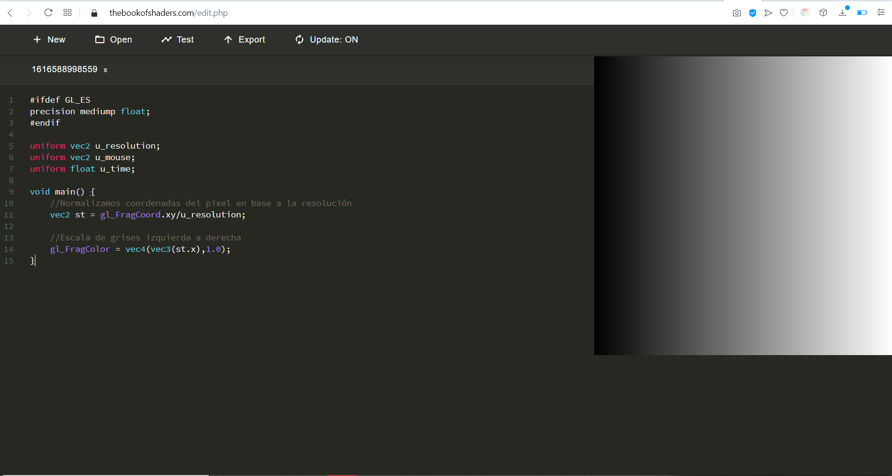  
*Resultado del editor en línea*

Se establece una relación entre el valor de *st.x*, la proporción de la coordenada x del píxel en la ventana, con el nivel de gris utilizado para pintar. En el código puede observarse la flexibilidad en el manejo de variables tipo *vec*, *gl_FragCoord.xy* hace referencia a los dos primeros valores, con *vec4(vec3(st.x),1.0)* se entiende que los tres primeros valores serán idénticos. El resultado es que muestra una escala de grises de izquierda (negro) a derecha (blanco)

El *shader* del listado a continuación, modifica el anterior, pintando en verde cuando *st.x* y *st.y* tienen valores próximos, es decir en la diagonal. La condición de proximidad viene definida por el valor de la variable *grosor*.


**GLSL**
```
uniform vec2 u_resolution;
uniform vec2 u_mouse;
uniform float u_time;

float grosor=0.1;

void main() {
  vec2 st = gl_FragCoord.xy/u_resolution.xy;

  vec3 color = vec3(st.x);	//Escala de grises izquierda a derecha;
  // Línea    
  if (st.y-grosor<st.x && st.x<st.y+grosor)
    color = vec3(0.0,1.0,0.0);	//Verde

  gl_FragColor = vec4(color,1.0);
}
```

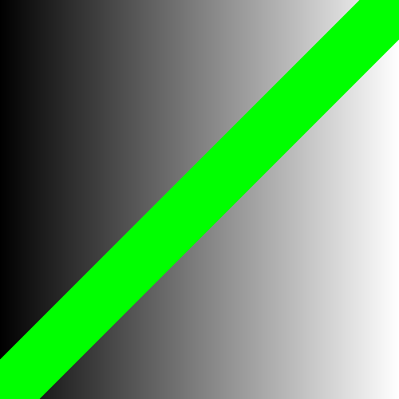  
*Línea resultante*

El resultado es una línea, una salida gráfica, eso sí, sin efecto de escalera (*aliasing*) en su borde, pero ciertamente con un  borde duro o abrupto. Para evitarlo, un nuevo *shader*, basado en los ejemplos de [The Book of Shaders](https://thebookofshaders.com), suaviza la transición de los bordes de la línea haciendo uso de [*smoothstep*](https://thebookofshaders.com/glossary/?search=smoothstep). La salida de la función *plot* proporciona un valor suavizado entre 0 y 1, dependiendo del valor de *grosor*. Dicha salida permite decidir en qué porcentaje cada píxel se pinta promediando el correspondiente valor de la escala de grises y el verde. La transición entre la salida gráfica y el fondo se suaviza.


**GLSL**
  ```
  uniform vec2 u_resolution;
  uniform vec2 u_mouse;
  uniform float u_time;

  float grosor=0.1;

  float plot(vec2 st, float pct){
    //smoothstep da salida suave entre dos valores (Hermite)
    //Combina dos para crear el chichón
    return  smoothstep( pct-grosor, pct, st.y) -
    smoothstep( pct, pct+grosor, st.y);
  }

  void main() {
    vec2 st = gl_FragCoord.xy/u_resolution.xy;

    vec3 color = vec3(st.x);	//Escala de grises izquierda a derecha;

    //Valor a tomar como referencia para bordes suaves
    float val = st.x;

    //Combina escala con línea según el valor de pct
    float pct = plot(st,val);
    // Valores altos verde, bajos escala de grises
    color = (1.0-pct)*color+pct*vec3(0.0,1.0,0.0);

    gl_FragColor = vec4(color,1.0);
  }
```

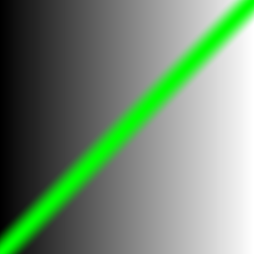  
*Línea suavizada resultante*

Para dibujar una línea, se busca en los ejemplos previos proximidad entre los valores de *st.x* y *st.y*. Si antes de verificar dicha proximidad, se altera uno de ellos, el resultado será una salida diferente a una línea. El siguiente *shader*, antes de comparar *st.x* y *st.y*,  modifica el valor de la primera combinando la función *pow* y la posición en *x* del puntero.

  **GLSL**
  ```
  uniform vec2 u_resolution;
  uniform vec2 u_mouse;
  uniform float u_time;

  float grosor=0.1;

  float plot(vec2 st, float pct){
    //smoothstep da salida suave entre dos valores (Hermite)
    return  smoothstep( pct-grosor, pct, st.y) -
    smoothstep( pct, pct+grosor, st.y);
  }

  void main() {
    vec2 st = gl_FragCoord.xy/u_resolution.xy;
    vec2 mouse= u_mouse/u_resolution.xy;

    vec3 color = vec3(st.x);	//Escala de grises izquierda a derecha;

    //Valor a tomar como referencia para bordes suaves
    float val = pow(st.x,1.0+mouse.x*10.0);

    //Combina escala con línea según el valor de pct
    float pct = plot(st,val);
    // Valores altos verde, bajos escala de grises
    color = (1.0-pct)*color+pct*vec3(0.0,1.0,0.0);

    gl_FragColor = vec4(color,1.0);
  }
  ```

  La forma resultante dependerá lógicamente del puntero, obteniendo una mayor variedad de formas.


  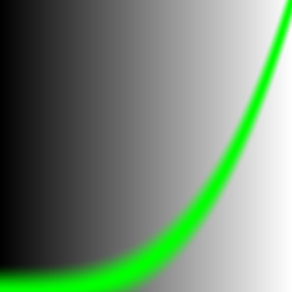  
  *Efecto del uso de pow*

  En un nuevo *shader*, además de la alteración producida por la componente *x* del puntero, se añade un comportamiento dinámico al grosor de la forma, afectado por una sinusoidal dependiente del tiempo transcurrido.

  **GLSL**
  ```
  uniform vec2 u_resolution;
  uniform vec2 u_mouse;
  uniform float u_time;

  float grosor=0.1;

  float plot(vec2 st, float pct){
    //smoothstep da salida suave entre dos valores (Hermite)
    return  smoothstep( pct-grosor, pct, st.y) -
    smoothstep( pct, pct+grosor, st.y);
  }

  void main() {
    vec2 st = gl_FragCoord.xy/u_resolution.xy;
    vec2 mouse= u_mouse/u_resolution.xy;

    //Grosors cambiante con el tiempo
    grosor=abs(sin(u_time));

    vec3 color = vec3(st.x);	//Escala de grises izquierda a derecha;

    //Valor a tomar como referencia para bordes suaves
    float val = pow(st.x,1.0+mouse.x*10.0);

    //Combina escala con verde según el valor de pct
    float pct = plot(st,val);
    // Valores altos verde, bajos escala de grises
    color = (1.0-pct)*color+pct*vec3(0.0,1.0,0.0);

    gl_FragColor = vec4(color,1.0);
  }
```

Los últimos dos ejemplos han utilizado la función *pow*, para obtener salidas gráficas distintas a una línea.
El repertorio de funciones con las que jugar es más amplio. En el siguiente código GLSL, se muestra un abanico de ellas, basta comentar y descomentar la línea de código escogida para obtener distintos resultados en la forma dibujada durante la ejecución.

**GLSL**
```
uniform vec2 u_resolution;
uniform vec2 u_mouse;
uniform float u_time;

float grosor=0.1;

float plot(vec2 st, float pct){
  //smoothstep da salida suave entre dos valores (Hermite)
  return  smoothstep( pct-grosor, pct, st.y) -
  smoothstep( pct, pct+grosor, st.y);
}

void main() {
  vec2 st = gl_FragCoord.xy/u_resolution.xy;
  vec2 mouse= u_mouse/u_resolution.xy;

  vec3 color = vec3(st.x);	//Escala de grises izquierda a derecha;

  //Valor a tomar como referencia para bordes suaves
  float val = smoothstep(0.1,0.9,st.x);// interpolación Hermite
  //float val = mod(st.x,0.5); // Módulo de 0.5
  //float val = fract(st.x); // Parte fraccionaria
  //float val = ceil(st.x);  // Entero más cercano mayor o igual
  //float val = floor(st.x); // Entero más cercano menor o igual
  //float val = sign(st.x);  // Signo
  //float val = abs(st.x);   // Valor absoluto
  //float val = clamp(st.x,0.0,1.0); // Limitado entre 0 y 1
  //float val = min(0.0,st.x);   // Valor mínimo
  //float val = max(0.0,st.x);   // Valor máximo

  //Combina escala con línea según el valor de pct
  float pct = plot(st,val);
  // Valores altos verde, bajos escala de grises
  color = (1.0-pct)*color+pct*vec3(0.0,1.0,0.0);

  gl_FragColor = vec4(color,1.0);
}
```


La creación de transiciones con formas complejas a partir de funciones es campo de trabajo de la comunidad, en [The Book of Shaders](https://thebookofshaders.com) se sugiere revisar las propuestas de [Golan Levin](http://www.flong.com/) e [Iñigo Quiles](https://thebookofshaders.com/05/?lan=es).

Como el mundo no se limita a los grises, el *shader* a continuación muestra una escala entre dos colores, utilizando *st.x* como porcentaje de combinación entre ellos a través de la función *mix*.

  **GLSL**
  ```
  #ifdef GL_ES
  precision mediump float;
  #endif

  uniform vec2 u_resolution;
  uniform vec2 u_mouse;
  uniform float u_time;

  float grosor=0.02;

  vec3 colorA = vec3(0.149,0.141,0.912);
  vec3 colorB = vec3(1.000,0.833,0.224);

  float plot(vec2 st, float pct){
    //smoothstep da salida suave entre dos valores (Hermite)
    return  smoothstep( pct-grosor, pct, st.y) -
    smoothstep( pct, pct+grosor, st.y);
  }

  void main() {
    vec2 st = gl_FragCoord.xy/u_resolution.xy;
    vec2 mouse= u_mouse/u_resolution.xy;

    //Valor a tomar como referencia para bordes suaves
    float val = st.x;

    vec3 color = mix(colorA, colorB, val);	//Escala entre dos colores

    //Combina escala con línea según el valor de pct
    float pct = plot(st,val);
    // Mezcla en función val
    color = mix(color,vec3(0.0,1.0,0.0),pct);

    gl_FragColor = vec4(color,1.0);
  }
  ```

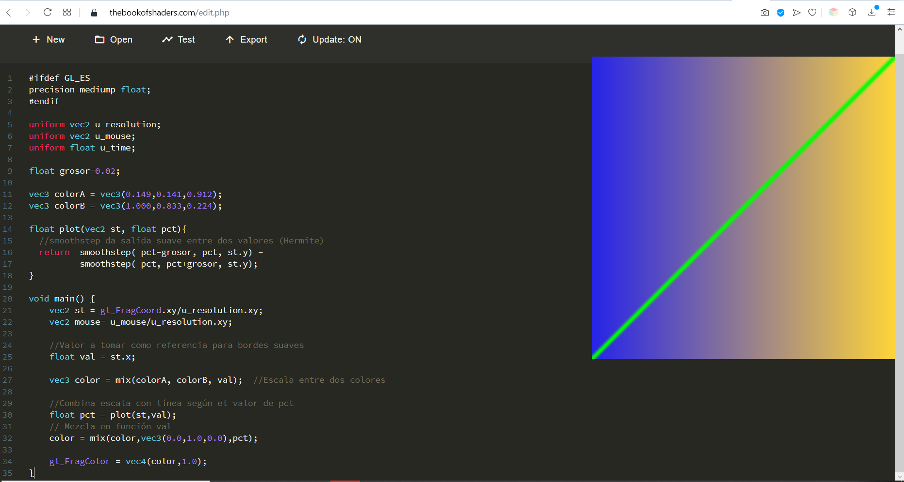  
*Salida del shader*

Concluimos esta serie con el *shader*  que combina el uso de funciones, para obtener una salida no limitada a líneas, y la escala de colores.

**GLSL**
```
#ifdef GL_ES
precision mediump float;
#endif

#define PI 3.14159265359

uniform vec2 u_resolution;
uniform vec2 u_mouse;
uniform float u_time;

float grosor=0.02;

vec3 colorA = vec3(0.149,0.141,0.912);
vec3 colorB = vec3(1.000,0.833,0.224);

float plot(vec2 st, float pct){
  //smoothstep da salida suave entre dos valores (Hermite)
  return  smoothstep( pct-grosor, pct, st.y) -
          smoothstep( pct, pct+grosor, st.y);
}

void main() {
    vec2 st = gl_FragCoord.xy/u_resolution.xy;
	vec2 mouse= u_mouse/u_resolution.xy;

    //Valor a tomar como referencia para bordes suaves
	vec3 pct = vec3(st.x);

	//Funciones por canal
    pct.r = smoothstep(0.0,1.0, st.x);
    pct.g = sin(st.x*PI);
    pct.b = pow(st.x,0.5);

	vec3 color = mix(colorA, colorB, pct);	//Escala entre dos colores

	//Combina por cada canal
	color = mix(color,vec3(1.0,0.0,0.0),plot(st,pct.r));
    color = mix(color,vec3(0.0,1.0,0.0),plot(st,pct.g));
    color = mix(color,vec3(0.0,0.0,1.0),plot(st,pct.b));

	gl_FragColor = vec4(color,1.0);
}
```

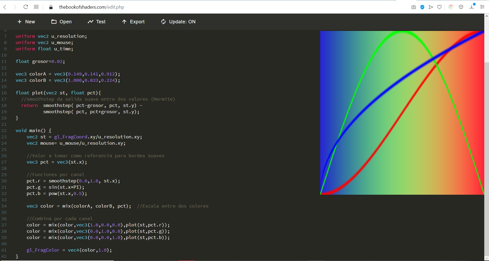  
*Resultado del shader*

El acceso a vectores en los ejemplos previos sugiere su uso como estructuras, p.e. *st.x*, con algunas particularidades *gl_FragCoord.xy*. Realmente es posible acceder a los valores como índice de un vector, además de alternativas para los nombres de los campos, de cara a facilitar la comprensión del código por conveniencia si trabajamos con posiciones, color o texturas como se muestra en el listado.

  **GLSL**
  ```
vec4 vector;
vector[0] = vector.r = vector.x = vector.s;
vector[1] = vector.g = vector.y = vector.t;
vector[2] = vector.b = vector.z = vector.p;
vector[3] = vector.a = vector.w = vector.q;
```

<!--- %Acceder desde bucle, como punto, como color, o como textura --->

Estas posibilidades permiten flexibilidad a la hora de manipular valores, el trozo de código mostrado en el siguiente listado juega con las asignaciones de los planos de color.

**GLSL**
```
vec3 yellow, magenta, green;

// Define yellow
yellow.rg = vec2(1.0);  // Asigna 1. a los canales rojo y verde
yellow[2] = 0.0;        // Asigna 0 al canal azul

// Define magenta
magenta = yellow.rbg;   // Asigna
intercambiando los canales verde y azul

// Define green
green.rgb = yellow.bgb; // Asigna el canal azul de yellow a los canales rojo y azul
```


Para dibujar formas más complejas, dada la carencia de funciones de dibujado, la única opción es la mencionado enfoque procedimental. La función *step(th,val)* retorna 0 o 1  según si *val* es menor que *th* o no. El siguiente *shader* la aprovecha para crear un recuadro relleno jugando con las distancias por componentes, ver figura a continuación.

  **GLSL**
  ```
#ifdef GL_ES
precision mediump float;
#endif

uniform vec2 u_resolution;
uniform vec2 u_mouse;
uniform float u_time;


void main() {
	//Normalizamos coordenadas con la resolución
	vec2 st = gl_FragCoord.xy/u_resolution;
	vec3 color = vec3(0.0);

    // step devuelve 1.0 (blanco) 0.0 (negro).
    float left = step(0.1,st.x);   // st.x>0.1
    float bottom = step(0.1,st.y); // st.y>0.1

    float right = step(0.1,1.0-st.x);   // st.x<0.9
    float top = step(0.1,1.0-st.y); // st.y<0.9

    // Multiplicar equivale a AND
    color = vec3( left * bottom * top * right );

    gl_FragColor = vec4(color,1.0);
}
```

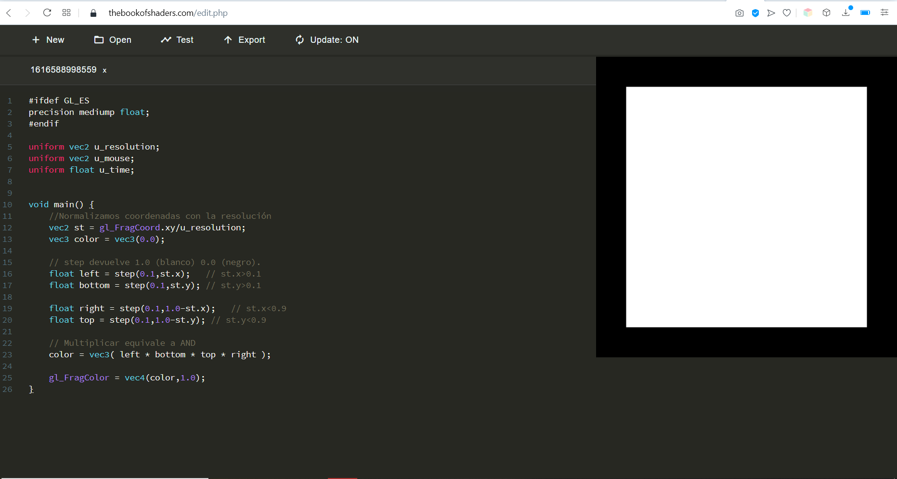  
*Salida del shader*

Para círculos, la propuesta  calcula la distancia de cada píxel al centro de la ventana. En el siguiente *shader*,  se hace uso de la función *distance* combinada con *step*. No utilizar *step* mostraría un campo de distancias como escala de grises, ver figura.


  **GLSL**
  ```
#ifdef GL_ES
precision mediump float;
#endif

uniform vec2 u_resolution;
uniform vec2 u_mouse;
uniform float u_time;

void main() {
	//Normalizamos coordenadas con la resolución
	vec2 st = gl_FragCoord.xy/u_resolution;
	float pct = 0.0;

    // Distancia del píxel al centro
    pct = distance(st,vec2(0.5));

    // Blanco para píxeles con distancia menor que 0.4
    float circ = step(0.2,0.5-pct);

    vec3 color = vec3(circ);

	gl_FragColor = vec4( color, 1.0 );
}
```

  
*Salida del shader*


#### Transformaciones

Las transformaciones sobre las primitivas gráficas se consiguen modificando las coordenadas del píxel, es decir *st*, de forma apropiada. La traslación de un círculo en función del tiempo, pintado no en blanco sino degradado, se muestra en el siguiente *shader*, que aplica una función sinusoidal en función del tiempo, el resultado del movimiento es circular.

**GLSL**
```
#ifdef GL_ES
precision mediump float;
#endif

uniform vec2 u_resolution;
uniform vec2 u_mouse;
uniform float u_time;

void main() {
	//Normalizamos coordenadas con la resolución
	vec2 st = gl_FragCoord.xy/u_resolution;
	float pct = 0.0;

    // Mover la forma
    vec2 translate = vec2(cos(u_time),sin(u_time));
    st += translate*0.35;

    // Distancia del píxel al centro
    pct = distance(st,vec2(0.5));

    // Blanco para píxeles con distancia menor que 0.4
    float circ = step(0.3,0.5-pct)*st.x;       

    vec3 color = vec3(circ);

	gl_FragColor = vec4( color, 1.0 );
}
```

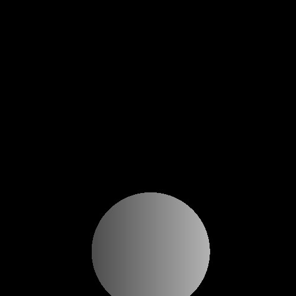  
*Círculo en movimiento*

En el ejemplo anterior el degradado de la esfera no cambia de orientación. En el siguiente ejemplo. el degradado permite ver el efecto de la rotación del círculo, que como ya sabemos se basa en cálculo matricial. Se aplica una rotación 2D, dependiente del tiempo, haciendo uso de la función *rotate2d* para el cálculo de la matriz de rotación.

**GLSL**
```
#ifdef GL_ES
precision mediump float;
#endif

#define PI 3.14159265359

uniform vec2 u_resolution;
uniform vec2 u_mouse;
uniform float u_time;

mat2 rotate2d(float _angle){
    return mat2(cos(_angle),-sin(_angle),
                sin(_angle),cos(_angle));
}

void main() {
	//Normalizamos coordenadas con la resolución
	vec2 st = gl_FragCoord.xy/u_resolution;
	float pct = 0.0;

    // Mueve espacio al vec2(0.0)
    st -= vec2(0.5);
    // Rota el espacio, variando el ángulo en función del tiempo
    st = rotate2d( sin(u_time)*PI ) * st;
    // Recoloca el espacio
    st += vec2(0.5);

    // Círculo
    pct = distance(st,vec2(0.5));
    float circ = step(0.3,0.5-pct)*st.x;       

    vec3 color = vec3(circ);

	gl_FragColor = vec4( color, 1.0 );
}
```

El escalado requiere,  de forma similar, la multiplicación de *st* por un valor, un ejemplo sencillo, nuevamente afectado por el tiempo, se presenta en el siguiente *shader*:

**GLSL**
```
#ifdef GL_ES
precision mediump float;
#endif

#define PI 3.14159265359

uniform vec2 u_resolution;
uniform vec2 u_mouse;
uniform float u_time;

mat2 scale(vec2 _scale){
    return mat2(_scale.x,0.0,
                0.0,_scale.y);
}

void main() {
	//Normalizamos coordenadas con la resolución
	vec2 st = gl_FragCoord.xy/u_resolution;
	float pct = 0.0;

    // Mueve espacio al vec2(0.0)
    st -= vec2(0.5);
    // Escala el espacio, variando el ángulo en función del tiempo
    st = scale( vec2(sin(u_time)+1.0) ) * st;
    // Recoloca el espacio
    st += vec2(0.5);

    // Círculo
    pct = distance(st,vec2(0.5));
    float circ = step(0.3,0.5-pct)*st.x;       

    vec3 color = vec3(circ);

	gl_FragColor = vec4( color, 1.0 );
}
```

#### Otras formas geométricas

Para dibujar otras formas se requiere concebir su generación procedimental, en el *shader* a continuación se propone la creación de una cruz, combinando dos recuadros, de forma análoga al ejemplo previo de dibujado de un recuadro con la función *step*, ver figura.


  **GLSL**
  ```
#ifdef GL_ES
precision mediump float;
#endif

uniform vec2 u_resolution;
uniform vec2 u_mouse;
uniform float u_time;

float cuadro(vec2 _st,float th_w,float th_h){
    // step devuelve 1.0 (blanco) 0.0 (negro).
    float left = step(th_w,_st.x);   // st.x>0.1
    float bottom = step(th_h,_st.y); // st.y>0.1

    float right = step(th_w,1.0-_st.x);   // st.x<0.9
    float top = step(th_h,1.0-_st.y); // st.y<0.9

    return left*bottom*right*top;
}

void main() {
	//Normalizamos coordenadas con la resolución
	vec2 st = gl_FragCoord.xy/u_resolution;
	vec3 color = vec3(0.0);

    // Multiplicar equivale a AND
    color = vec3( cuadro(st,0.4,0.1) + cuadro(st,0.1,0.4) );

    gl_FragColor = vec4(color,1.0);
}
```

  
*Cruz resultante*

En [The Book of Shaders](https://thebookofshaders.com) se propone el uso de las coordenadas angulares/polares para la creación del diversas formas. El código del siguiente *shader* se debe a [Andrew Baldwin](http://thndl.com/square-shaped-shaders.html) y crea polígonos regulares definido *N*.


  **GLSL**
  ```
#ifdef GL_ES
precision mediump float;
#endif

#define PI 3.14159265359
#define TWO_PI 6.28318530718

uniform vec2 u_resolution;
uniform vec2 u_mouse;
uniform float u_time;

// Reference to
// http://thndl.com/square-shaped-shaders.html

void main(){
  vec2 st = gl_FragCoord.xy/u_resolution.xy;
  st.x *= u_resolution.x/u_resolution.y;
  vec3 color = vec3(0.0);
  float d = 0.0;

  // Remap the space to -1. to 1.
  st = st *2.-1.;

  // Number of sides of your shape
  int N = 3;

  // Angle and radius from the current pixel
  float a = atan(st.x,st.y)+PI;
  float r = TWO_PI/float(N);

  // Shaping function that modulate the distance
  d = cos(floor(.5+a/r)*r-a)*length(st);

  color = vec3(1.0-smoothstep(.4,.41,d));
  // color = vec3(d);

  gl_FragColor = vec4(color,1.0);
}
```

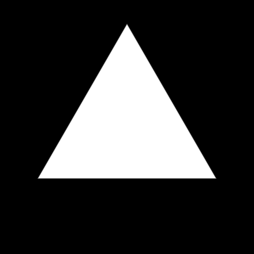  
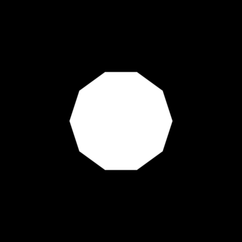  
*Polígonos regulares*

El código anterior, sirve de punto de partida para experimentar. Se sugiere probar las propuestas de los tres listados a continuación:

-  sectores angulares degradados con rotación dinámica:


**GLSL**
```
#ifdef GL_ES
precision mediump float;
#endif

#define PI 3.14159265359
#define TWO_PI 6.28318530718

uniform vec2 u_resolution;
uniform vec2 u_mouse;
uniform float u_time;

mat2 rotate2d(float _angle){
    return mat2(cos(_angle),-sin(_angle),
                sin(_angle),cos(_angle));
}

void main(){
  vec2 st = gl_FragCoord.xy/u_resolution.xy;
  st.x *= u_resolution.x/u_resolution.y;
  vec3 color = vec3(0.0);
  float d = 0.0;

  // Redimensiona al espacio -1,1
  st = st *2.-1.;

  // Rota el espacio, variando el ángulo en función del tiempo
  st = rotate2d( sin(u_time)*PI ) * st;

  // Número de sectores
  int N = 12;

  // Ángulo y radio del píxel actual
  float a = atan(st.x,st.y)+PI;
  float r = TWO_PI/float(N);

  // Color basado en módulo
  color = vec3(mod(a,r));

  gl_FragColor = vec4(color,1.0);
}
```

-  estrella con semipétalos en rotación dinámica:


**GLSL**
```
#ifdef GL_ES
precision mediump float;
#endif

#define PI 3.14159265359
#define TWO_PI 6.28318530718

uniform vec2 u_resolution;
uniform vec2 u_mouse;
uniform float u_time;

mat2 rotate2d(float _angle){
    return mat2(cos(_angle),-sin(_angle),
                sin(_angle),cos(_angle));
}

void main(){
  vec2 st = gl_FragCoord.xy/u_resolution.xy;
  st.x *= u_resolution.x/u_resolution.y;
  vec3 color = vec3(0.0);
  float d = 0.0;

  // Redimensiona al espacio -1,1
  st = st *2.-1.;

  // Rota el espacio, variando el ángulo en función del tiempo
  st = rotate2d( sin(u_time)*PI ) * st;

  // Número de sectores
  int N = 12;

  // ÁNgulo y radio del píxel actual
  float a = atan(st.x,st.y)+PI;
  float r = TWO_PI/float(N);

  // Distancia afectada por el módulo del sector
  d = cos(floor(.5+a/r)*r-a)*(length(st)+mod(a,r));

  color = vec3(1.0-smoothstep(.4,.41,d));

  gl_FragColor = vec4(color,1.0);
}
```

- y forma poligonal con distintos radios en rotación dinámica

**GLSL**
```
#ifdef GL_ES
precision mediump float;
#endif

#define PI 3.14159265359
#define TWO_PI 6.28318530718

uniform vec2 u_resolution;
uniform vec2 u_mouse;
uniform float u_time;

mat2 rotate2d(float _angle){
    return mat2(cos(_angle),-sin(_angle),
                sin(_angle),cos(_angle));
}

void main(){
  vec2 st = gl_FragCoord.xy/u_resolution.xy;
  st.x *= u_resolution.x/u_resolution.y;
  vec3 color = vec3(0.0);
  float d = 0.0;

  // Redimensiona al espacio -1,1
  st = st *2.-1.;

  // Rota el espacio, variando el ángulo en función del tiempo
  st = rotate2d( sin(u_time)*PI ) * st;

  // Número de sectores
  int N = 12;

  // Ángulo y radio del píxel actual
  float a = atan(st.x,st.y)+PI;
  float r = TWO_PI/float(N);

  // Afectamos de forma diferente sectores pares e impares
  if (floor( mod(a,2.))>=1.)
  		d = cos(floor(.5+a/r)*r-a)*length(st);
  else
        d = cos(floor(.5+a/r)*r-a)*length(st)*2.;

  color = vec3(1.0-smoothstep(.4,.41,d));

  gl_FragColor = vec4(color,1.0);
}
```

### Generativos

Al ejecutarse en paralelo para cada píxel en una GPU, el número de repeticiones no influye en el coste, siendo una potente herramienta para crear patrones. Tras la breve muestra de dibujo de formas gráficas con técnicas procedimentales del apartado anterior, el *shader* mostrado a continuación, basado en [este ejemplo](https://thebookofshaders.com/09/?lan=es) de The Book of Shaders], aprovecha el escalado para replicar nueve veces un círculo (número de repeticiones configurable modificando el valor de *scale*). La función [*fract*](https://thebookofshaders.com/glossary/?search=fract) se queda con la parte fraccionaria, permitiendo *moverse* entre celdas de la rejilla resultante. La función utilizada para dibujar el círculo, se basa en la propuesta en [The Book of Shaders](https://thebookofshaders.com) que evita el uso de la costosa *sqrt* en el cálculo de distancias, utilizando *dot*, y una transición suave con *smoothstep*.

**GLSL**
```
#ifdef GL_ES
precision mediump float;
#endif

uniform vec2 u_resolution;
uniform float u_time;

float scale = 3.0;

float circle(in vec2 _st, in float _radius){
    vec2 l = _st-vec2(0.5);
    return 1.-smoothstep(_radius-(_radius*0.01),
                         _radius+(_radius*0.01),
                         dot(l,l)*4.0);
}

void main() {
	vec2 st = gl_FragCoord.xy/u_resolution;
    vec3 color = vec3(0.0);

    //Escala en función de la escala adoptada
    st = fract(st*scale);

    // Dibuja un círculo en cada "celda"
    color = vec3(circle(st,0.5));

	gl_FragColor = vec4(color,1.0);
}
```

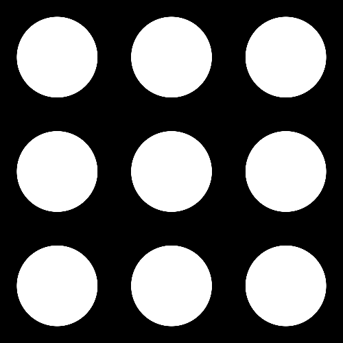  
*Nueve círculos*

A partir de este ejemplo básico, se abre un nuevo abanico de posibilidades, ya que se dispone de mecanismos para diferenciar cada copia o celda, pudiendo aplicar transformaciones, o animaciones de su forma, color y posición. Una posibilidad es desplazar la posición de la forma en cada fila como se hace en un nuevo *shader*, que hace uso de la función *mod* para determinar si la fila es par o no, además de animar el tamaño de cada círculo, con la sinusoidal dependiente del tiempo utilizada anteriormente.

  **GLSL**
  ```
#ifdef GL_ES
precision mediump float;
#endif

uniform vec2 u_resolution;
uniform float u_time;

float scale = 3.0;

float circle(in vec2 _st, in float _radius){
    vec2 l = _st-vec2(0.5);
    return 1.-smoothstep(_radius-(_radius*0.01),
                         _radius+(_radius*0.01),
                         dot(l,l)*4.0);
}

void main() {
	vec2 st = gl_FragCoord.xy/u_resolution;
    vec3 color = vec3(0.0);

    // Traslación dependiente de st.y
   if (floor(mod(st.y*scale,2.0)) == 1. )
        st.x += 0.5;

    //Tamaño en función de la escala adoptada
    st = fract(st*scale);

    // Dibuja un círculo en cada "celda"
    float pct = max(-sin(u_time),sin(u_time));
    color = vec3(circle(st,0.5*pct));

	gl_FragColor = vec4(color,1.0);
}
```

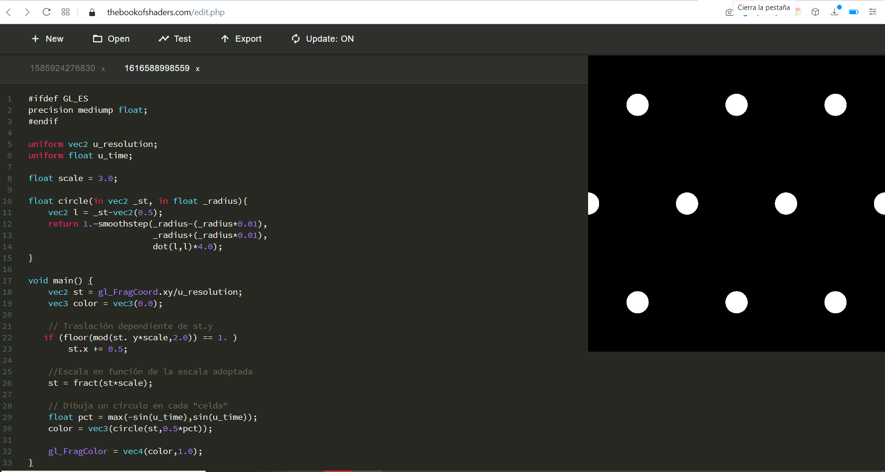  
*Captura de un instante de la salida*

En el siguiente *shader*, se introduce un efecto de traslación que afecta únicamente a las filas o columnas pares, se alterna entre ellas, añadido al escalado dinámico de cada forma circular en función del tiempo.

**GLSL**
```
#ifdef GL_ES
precision mediump float;
#endif

uniform vec2 u_resolution;
uniform float u_time;

float scale = 5.0;

float circle(in vec2 _st, in float _radius){
    vec2 l = _st-vec2(0.5);
    return 1.-smoothstep(_radius-(_radius*0.01),
                         _radius+(_radius*0.01),
                         dot(l,l)*4.0);
}

void main() {
	vec2 st = gl_FragCoord.xy/u_resolution;
    vec3 color = vec3(0.0);

	// Traslación de filas pares
    float off = sin(u_time);
    if (sign(off)>0.)
    {
        if ( floor(mod(st.y*scale,2.0)) == 1.)
    		st.x += off;
    }
    else
    {
        if ( floor(mod(st.x*scale,2.0)) == 1.)
    		st.y += off;
    }


    //Escala en función de la escala adoptada
    st = fract(st*scale);

    // Dibuja un círculo en cada "celda"
    float pct = max(-sin(u_time),sin(u_time));
    color = vec3(circle(st,0.5*pct));

	gl_FragColor = vec4(color,1.0);
}
```

Simplificamos en un uevo *shader*, moviendo el patrón a lo largo de los ejes *x* e *y* en función del tiempo.

**GLSL**
```
#ifdef GL_ES
precision mediump float;
#endif

#define PI 3.141592

uniform vec2 u_resolution;
uniform float u_time;

float scale = 3.0;

float circle(in vec2 _st, in float _radius){
    vec2 l = _st-vec2(0.5);
    return 1.-smoothstep(_radius-(_radius*0.01),
                         _radius+(_radius*0.01),
                         dot(l,l)*4.0);
}

void main() {
	vec2 st = gl_FragCoord.xy/u_resolution;
    vec3 color = vec3(0.0);

    st.x +=max(0.,sin(u_time));
    st.y -=max(0.,-sin(u_time));

    //Escala en función de la escala adoptada
    st = fract(st*scale);

    // Dibuja un círculo en cada "celda"
    float pct = max(-sin(u_time),sin(u_time));
    color = vec3(circle(st,0.5*pct));

	gl_FragColor = vec4(color,1.0);
}
```

Finaliza esta serie con el siguiente *shader*, que modifica el tamaño del círculo en función de la columna, además de mantener la modificación de su tamaño en función del tiempo.


  **GLSL**
  ```

#ifdef GL_ES
precision mediump float;
#endif

uniform vec2 u_resolution;
uniform float u_time;

float scale = 3.0;

float circle(in vec2 _st, in float _radius){
    vec2 l = _st-vec2(0.5);
    return 1.-smoothstep(_radius-(_radius*0.01),
                         _radius+(_radius*0.01),
                         dot(l,l)*4.0);
}

void main() {
	vec2 st = gl_FragCoord.xy/u_resolution;
    vec3 color = vec3(0.0);

    float off = floor(st.x*scale);

    //Escala en función de la escala adoptada
    st = fract(st*scale*(scale-off));

    // Dibuja un círculo en cada "celda"
    float pct = max(-sin(u_time),sin(u_time));
    color = vec3(circle(st,0.5*pct));

	gl_FragColor = vec4(color,1.0);
}
```

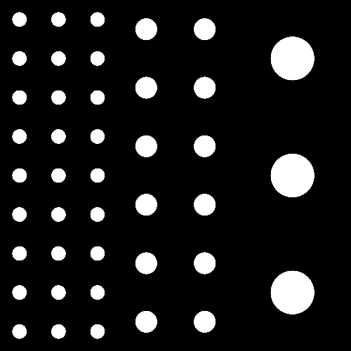  
*Captura del resultado*


### Aleatoriedad


Una interesante posibilidad es el uso de aleatoriedad a distintos niveles en la creación del contenido gráfico. En el *shader* a continuación, basado en [este](https://thebookofshaders.com/10/?lan=es), se replica la propuesta de  [The Book of Shaders](https://thebookofshaders.com) para el uso de valores aleatorios en 2D, dada la ausencia de funciones en GLSL.

  **GLSL**
  ```
#ifdef GL_ES
precision mediump float;
#endif

uniform vec2 u_resolution;
uniform vec2 u_mouse;
uniform float u_time;

float random (vec2 st) {
    return fract(sin(dot(st.xy,
                         vec2(12.9898,78.233)))*
        43758.5453123);
}

float res = 10.0;

void main() {
    vec2 st = gl_FragCoord.xy/u_resolution.xy;

    st *= res; // Escalado
    vec2 ipos = floor(st);  // Parte entera
    vec2 fpos = fract(st);  // Parte fraccionaria

    // Aleatorio basado en parte entera
    vec3 color = vec3(random( ipos ));

    gl_FragColor = vec4(color,1.0);
}
```

Las posibilidades de aplicación de la aleatoriedad  es amplia. El siguiente *shader*, tomado de la misma fuente, se crea un patrón con cuatro variantes de orientaciones posibles.


  **GLSL**
  ```
#ifdef GL_ES
precision mediump float;
#endif

uniform vec2 u_resolution;
uniform vec2 u_mouse;
uniform float u_time;

float random (vec2 st) {
    return fract(sin(dot(st.xy,
                         vec2(12.9898,78.233)))*
        43758.5453123);
}

vec2 truchetPattern(in vec2 _st, in float _index){
    _index = fract(((_index-0.5)*2.0));
    if (_index > 0.75) {
        _st = vec2(1.0) - _st;
    } else if (_index > 0.5) {
        _st = vec2(1.0-_st.x,_st.y);
    } else if (_index > 0.25) {
        _st = 1.0-vec2(1.0-_st.x,_st.y);
    }
    return _st;
}

float res = 10.0;

void main() {
    vec2 st = gl_FragCoord.xy/u_resolution.xy;

    st *= res; // Escalado
    vec2 ipos = floor(st);  // Parte entera
    vec2 fpos = fract(st);  // Parte fraccionaria

    // Patrón aleatorio, cuatro opciones
    vec2 tile = truchetPattern(fpos, random( ipos ));

    // Triángulo según tipo
    float color = 0.0;
	color = step(tile.x,tile.y);

    gl_FragColor = vec4(vec3(color),1.0);
}
```

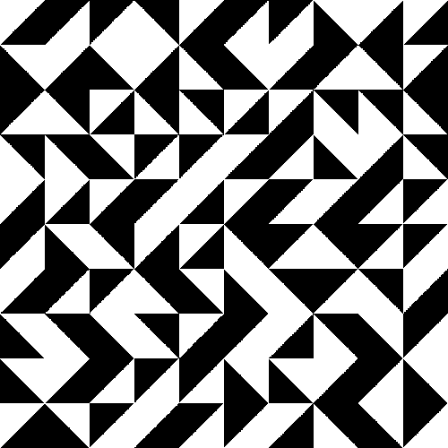  
*Captura del resultado*


Los valores aleatorios presentan una frecuencia muy alta, siendo excesiva en determinadas situaciones. Las funciones de ruido se adaptan mejor al suavizar las frecuencias presentes en la salida resultante. Destacar en primer lugar el ruido de Perlin aplicado en el *shader* a continuacion, basado en [este ejemplo](https://thebookofshaders.com/11/?lan=es), una vez disponible una rejilla, se interpola en posiciones intermedias

  **GLSL**
  ```

#ifdef GL_ES
precision mediump float;
#endif

uniform vec2 u_resolution;
uniform vec2 u_mouse;
uniform float u_time;

// Valor aleatorio en 2D
float random (in vec2 st) {
    return fract(sin(dot(st.xy,
                         vec2(12.9898,78.233)))
                 * 43758.5453123);
}

// 2D Noise based on Morgan McGuire (morgan3d)
// https://www.shadertoy.com/view/4dS3Wd
float noise (in vec2 st) {
    vec2 i = floor(st);
    vec2 f = fract(st);

    // Cuatro esquinas de cada mosaico
    float a = random(i);
    float b = random(i + vec2(1.0, 0.0));
    float c = random(i + vec2(0.0, 1.0));
    float d = random(i + vec2(1.0, 1.0));

    // Interpolación con Hemite cúbico
    vec2 u = smoothstep(0.,1.,f);

    // Combina esquinas ponderadas
    return mix(a, b, u.x) +
            (c - a)* u.y * (1.0 - u.x) +
            (d - b) * u.x * u.y;
}

void main() {
    vec2 st = gl_FragCoord.xy/u_resolution.xy;

    // Escalado
    vec2 pos = vec2(st*5.0);

    // Función de ruido
    float n = noise(pos);

    gl_FragColor = vec4(vec3(n), 1.0);
}
```

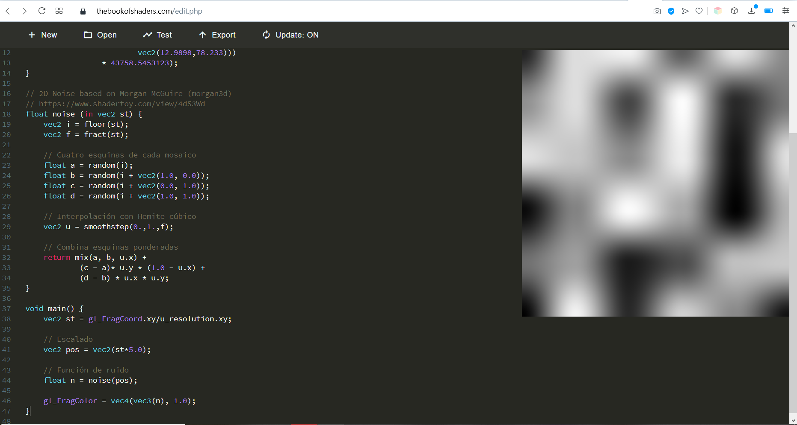  
*Resultado del ruido de Perlin*


El previo es un ejemplo de ruido por valor, cuyo resultado sugiere la presencia de una rejilla. Una nueva versión del *shader*, mejora el resultado al utilizar ruido por gradiente.

  **GLSL**
  ```
#ifdef GL_ES
precision mediump float;
#endif

uniform vec2 u_resolution;
uniform vec2 u_mouse;
uniform float u_time;


// Valor aleatorio en 2D
vec2 random2(vec2 st){
    st = vec2( dot(st,vec2(127.1,311.7)),
              dot(st,vec2(269.5,183.3)) );
    return -1.0 + 2.0*fract(sin(st)*43758.5453123);
}

// Gradient Noise by Inigo Quilez - iq/2013
// https://www.shadertoy.com/view/XdXGW8
float noise(vec2 st) {
    vec2 i = floor(st);
    vec2 f = fract(st);

    // Interpolación con Hemite cúbico
    //vec2 u = smoothstep(0.,1.,f); // Equivalente
    vec2 u = f*f*(3.0-2.0*f);

    return mix( mix( dot( random2(i + vec2(0.0,0.0) ), f - vec2(0.0,0.0) ),
                     dot( random2(i + vec2(1.0,0.0) ), f - vec2(1.0,0.0) ), u.x),
                mix( dot( random2(i + vec2(0.0,1.0) ), f - vec2(0.0,1.0) ),
                     dot( random2(i + vec2(1.0,1.0) ), f - vec2(1.0,1.0) ), u.x), u.y);
}

void main() {
    vec2 st = gl_FragCoord.xy/u_resolution.xy;
    vec3 color = vec3(0.0);

    // Escalado
    vec2 pos = vec2(st*5.0);

    // Función de ruido
    color = vec3( noise(pos)*.5+.5 );

    gl_FragColor = vec4(color, 1.0);
}
```
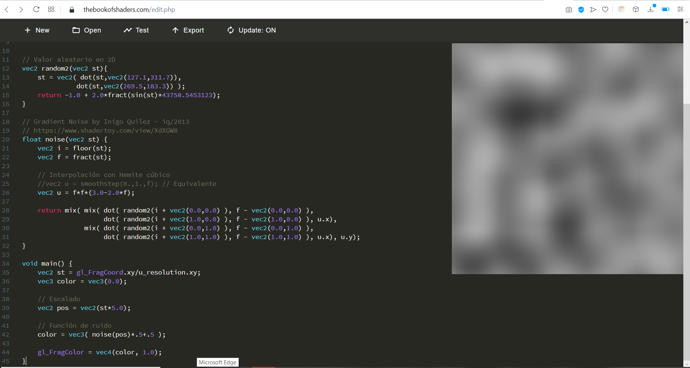  
*Resultado de ruido por gradiente*


Propuestas de funciones de ruido más recientes son el ruido celular (Steven Worley) y el simplex (Ken Perlin), ver para más detalles [The Book of Shaders](https://thebookofshaders.com). Para fractales sugerir este [enlace](https://github.com/patriciogonzalezvivo/thebookofshaders/tree/master/14) de la misma fuente.


### Texturas en el *shader*

Como muestra final, el código ejemplo *script_35_shader_texturas.js* incluye un muestrario de *shader* de fragmentos que contemplan el paso de textura como variable de tipo *uniform*, para ser tenidas en cuenta en el cálculo del color del fragmento.

La primera variante simplemente mapea la textura

```
uniform sampler2D texture1;
varying vec2 vUv;

void main() {
  gl_FragColor = texture2D(texture1, vUv);
}
```

Las segunda y tercera replican el juego realizado con los patrones creados procedimentalmente en secciones previas, para duplicar la textura, y hacerle alguna travesura

```
uniform sampler2D texture1;
uniform float u_time;
varying vec2 vUv;

float scale = 5.0;

void main() {
  vec2 st = fract(vUv.st*scale);
  gl_FragColor = texture2D(texture1, st);
}  
```

```
uniform sampler2D texture1;
uniform vec2 u_resolution;
uniform float u_time;
varying vec2 vUv;

float scale = 5.0;

void main() {
  vec2 stc = gl_FragCoord.xy/u_resolution;
  vec2 st = fract(vUv.st*scale);

  float off = sin(u_time);
  if (sign(off)>0.)
  {
      if ( floor(mod(stc.y*scale,2.0)) == 1.)
      st.x += off;
    }
    else
    {
      if ( floor(mod(stc.x*scale,2.0)) == 1.)
      st.y += off;
    }

    gl_FragColor = texture2D(texture1, st);
  }  
}
```

En las tres últimas, aplicamos en primer término una inversión sobre el valor del píxeles

```
uniform sampler2D texture2;
varying vec2 vUv;

void main() {
  gl_FragColor = vec4( 1.0 - texture2D(texture2, vUv).rgb, 1.0 );
}
```

Alternamos la textura original con su inversión

```
uniform sampler2D texture2;
varying vec2 vUv;
uniform vec2 u_resolution;

float scale = 1.0;
float step = 0.025;

void main() {
  vec2 stc = gl_FragCoord.xy/u_resolution;

  //Distingue filas pares e impares
  if ( mod(stc.y*scale,2.0*step) <= step){
    if ( mod(stc.x*scale,2.0*step) <= step)
        gl_FragColor = vec4( texture2D(texture2, vUv).rgb, 1.0 );
      else
        gl_FragColor = vec4( 1.0 - texture2D(texture2, vUv).rgb, 1.0 );
      }
  else{
    if ( mod(stc.x*scale,2.0*step) <= step)
      gl_FragColor = vec4( 1.0 - texture2D(texture2, vUv).rgb, 1.0 );
    else
      gl_FragColor = vec4( texture2D(texture2, vUv).rgb, 1.0 );
    }
}
```

Finalizo con un ejemplo de aplicación de filtros, una gaussiana o la  máscara de Sobel, requiriendo conocer la dimensión de la textura.


```
uniform sampler2D texture2;
varying vec2 vUv;

float scale = 1.0;
float step = 0.025;

void main() {
  //Dimensiones de la textura
  ivec2 tex_size = textureSize(texture2, 0);
  //Desplazamiento según dimensión tetxura
  vec2 texOffset = vec2(1.0/float( tex_size.x ), 1.0/float( tex_size.y ));

  // Vecinos del píxel actual según desplazamiento de la textura
  vec2 tc0 = vUv.st + vec2(-texOffset.s, -texOffset.t);
  vec2 tc1 = vUv.st + vec2(         0.0, -texOffset.t);
  vec2 tc2 = vUv.st + vec2(+texOffset.s, -texOffset.t);
  vec2 tc3 = vUv.st + vec2(-texOffset.s,          0.0);
  vec2 tc4 = vUv.st + vec2(         0.0,          0.0);
  vec2 tc5 = vUv.st + vec2(+texOffset.s,          0.0);
  vec2 tc6 = vUv.st + vec2(-texOffset.s, +texOffset.t);
  vec2 tc7 = vUv.st + vec2(         0.0, +texOffset.t);
  vec2 tc8 = vUv.st + vec2(+texOffset.s, +texOffset.t);

  //Color de cada vecino
  vec4 col0 = texture2D(texture2, tc0);
  vec4 col1 = texture2D(texture2, tc1);
  vec4 col2 = texture2D(texture2, tc2);
  vec4 col3 = texture2D(texture2, tc3);
  vec4 col4 = texture2D(texture2, tc4);
  vec4 col5 = texture2D(texture2, tc5);
  vec4 col6 = texture2D(texture2, tc6);
  vec4 col7 = texture2D(texture2, tc7);
  vec4 col8 = texture2D(texture2, tc8);

  //Aplicamos filtros
  //Gaussiana
  vec4 sum = (1.0 * col0 + 2.0 * col1 + 1.0 * col2 +  
                        2.0 * col3 + 4.0 * col4 + 2.0 * col5 +
                        1.0 * col6 + 2.0 * col7 + 1.0 * col8) / 16.0;

  //Sobel
  vec4 sum2 = abs((1.0 * col0 + 2.0 * col1 + 1.0 * col2) - (1.0 * col6 + 2.0 * col7 + 1.0 * col8)) * 10.0;

  gl_FragColor = vec4(sum2.rgb, 1.0);
}
```

<!--
### 10.5 Imágenes

Para la modificación de imágenes por medio de un *shader* se hace uso de texturas, que se reciben desde la CPU como variables *uniform sampler2D*, permitiendo acceder por coordenadas al color. En esta sección se presentan en primer término varios ejemplos de los incluidos en Processing para mostrar posibles alteraciones sobre imágenes.

Un primer ejemplo *Ejemplos->Topics->Shaders->Blurfilter*, aplica un filtro de desenfoque (*blur*) combinando en la operación los valores del propio píxel y los 8 vecinos en coordenadas de texturas. El código Processing:


  **Processing** [p9_blur](https://github.com/otsedom/CIU/tree/master/P9/p9_blur)
  ```
/**
 * Blur Filter
 *
 * Change the default shader to apply a simple, custom blur filter.
 *
 * Press the mouse to switch between the custom and default shader.
 */

PShader blur;

void setup() {
  size(640, 360, P2D);
  blur = loadShader("blur.glsl");
  stroke(255, 0, 0);
  rectMode(CENTER);
}

void draw() {º
  filter(blur);  
  rect(mouseX, mouseY, 150, 150);
  ellipse(mouseX, mouseY, 100, 100);
}
```

  
*Editor en línea con salida de p9_blur.pde*

Destaca la utilización de la función *filter* que se aplica sobre la ventana de visualización haciendo uso de filtros predefinidos o *shaders* como en este caso. Al ejecutar, el resultado es que se emborronan recuadros previos, mostrando el último de forma nítida.

Antes de analizar el código del *shader*, se debe recordar que al igual que en ejemplos previos únicamente se define el *shader* de fragmentos, en dicha situación Processing adopta un *shader* de vértices por detecto de tipo textura (sin luces), debiendo el *shader* de fragmentos seguir los nombres de las variables *varying* definidas en dicho *shader* de vértices por defecto para el color del vértice y la coordenada de textura: respectivamente *vertColor* y *vertTexCoord*. Las variables de tipo *varying* permiten el paso de información entra *shaders*.

Tras esta aclaración, es el momento de observar el *shader* de fragmentos *blur.glsl*:

**GLSL**
```
#ifdef GL_ES
precision mediump float;
precision mediump int;
#endif

#define PROCESSING_TEXTURE_SHADER

uniform sampler2D texture;
uniform vec2 texOffset;

varying vec4 vertColor;
varying vec4 vertTexCoord;

void main(void) {
  // Grouping texcoord variables in order to make it work in the GMA 950. See post #13
  // in this thread:
  // http://www.idevgames.com/forums/thread-3467.html
  vec2 tc0 = vertTexCoord.st + vec2(-texOffset.s, -texOffset.t);
  vec2 tc1 = vertTexCoord.st + vec2(         0.0, -texOffset.t);
  vec2 tc2 = vertTexCoord.st + vec2(+texOffset.s, -texOffset.t);
  vec2 tc3 = vertTexCoord.st + vec2(-texOffset.s,          0.0);
  vec2 tc4 = vertTexCoord.st + vec2(         0.0,          0.0);
  vec2 tc5 = vertTexCoord.st + vec2(+texOffset.s,          0.0);
  vec2 tc6 = vertTexCoord.st + vec2(-texOffset.s, +texOffset.t);
  vec2 tc7 = vertTexCoord.st + vec2(         0.0, +texOffset.t);
  vec2 tc8 = vertTexCoord.st + vec2(+texOffset.s, +texOffset.t);

  vec4 col0 = texture2D(texture, tc0);
  vec4 col1 = texture2D(texture, tc1);
  vec4 col2 = texture2D(texture, tc2);
  vec4 col3 = texture2D(texture, tc3);
  vec4 col4 = texture2D(texture, tc4);
  vec4 col5 = texture2D(texture, tc5);
  vec4 col6 = texture2D(texture, tc6);
  vec4 col7 = texture2D(texture, tc7);
  vec4 col8 = texture2D(texture, tc8);

  vec4 sum = (1.0 * col0 + 2.0 * col1 + 1.0 * col2 +  
              2.0 * col3 + 4.0 * col4 + 2.0 * col5 +
              1.0 * col6 + 2.0 * col7 + 1.0 * col8) / 16.0;            
  gl_FragColor = vec4(sum.rgb, 1.0) * vertColor;  
}

```

En este código, conocidas las coordenadas de textura de un fragmento *vertTexCoord*, se muestrean los vecinos (o texels) haciendo uso de la variable *uniform texOffset*, que especifica el desplazamiento para moverse entre vecinos en el mapa de textura. Es una variable fijada por Processing, con valores *(1/width,1/height)* siendo *width* y *height* la resolución de la textura. De esta forma
*vertTexCoord.st + vec2(texOffset.s, 0)* se refiere al texel colocado una posición a la derecha. En este ejemplo concreto, el color del fragmento se calcula a partir de la ponderación del kernel *3x3*:


  
*Kernel del shadere blur.glsl*


que incluye al propio fragmento y sus 8 vecinos. Primeramente se obtienen las coordenadas para cada fragmento en la textura, y posteriormente se recupera el color en cada una de ellas, para finalmente aplicar el kernel.

En un nuevo listado, basado en el ejemplo *Ejemplos->Topics->Shaders->EdgeDetect*:

**Processing**  [p9_bordes](https://github.com/otsedom/CIU/tree/master/P9/p9_bordes)
```
/**
* Edge Detection
*
* Change the default shader to apply a simple, custom edge detection filter.
*
* Press the mouse to switch between the custom and default shader.
*/

PShader edges;  
import processing.video.*;

Capture cam;
PImage img;
boolean enabled = true;

void setup() {
 size(640, 480, P2D);
 //Cámara
 cam = new Capture(this, width , height);
 cam.start();

 edges = loadShader("edges.glsl");
}

void draw() {
 if (enabled == true) {
   shader(edges);
 }

  if (cam.available()) {
   background(0);
   cam.read();
   image(cam, 0, 0);
  }
}

void mousePressed() {
 enabled = !enabled;
 if (!enabled == true) {
   resetShader();
 }
}
```

El código procesa la imagen captada por la webcam, aplicando en este caso una operación que muestra los bordes o contornos presentes en la imagen.
 En este caso no aplica la función *filter*, sino que activa el *shader*. Para utilizar la función *filter*, se lanzaría tras mostrar la imagen en la ventana.


La estructura del *shader* de fragmentos *edges.glsl* es similar al ejemplo previo, alterando básicamente el kernel aplicado

**GLSL**
```
#ifdef GL_ES
precision mediump float;
precision mediump int;
#endif

#define PROCESSING_TEXTURE_SHADER

uniform sampler2D texture;
uniform vec2 texOffset;

varying vec4 vertColor;
varying vec4 vertTexCoord;

void main(void) {
  // Grouping texcoord variables in order to make it work in the GMA 950. See post #13
  // in this thread:
  // http://www.idevgames.com/forums/thread-3467.html
  vec2 tc0 = vertTexCoord.st + vec2(-texOffset.s, -texOffset.t);
  vec2 tc1 = vertTexCoord.st + vec2(         0.0, -texOffset.t);
  vec2 tc2 = vertTexCoord.st + vec2(+texOffset.s, -texOffset.t);
  vec2 tc3 = vertTexCoord.st + vec2(-texOffset.s,          0.0);
  vec2 tc4 = vertTexCoord.st + vec2(         0.0,          0.0);
  vec2 tc5 = vertTexCoord.st + vec2(+texOffset.s,          0.0);
  vec2 tc6 = vertTexCoord.st + vec2(-texOffset.s, +texOffset.t);
  vec2 tc7 = vertTexCoord.st + vec2(         0.0, +texOffset.t);
  vec2 tc8 = vertTexCoord.st + vec2(+texOffset.s, +texOffset.t);

  vec4 col0 = texture2D(texture, tc0);
  vec4 col1 = texture2D(texture, tc1);
  vec4 col2 = texture2D(texture, tc2);
  vec4 col3 = texture2D(texture, tc3);
  vec4 col4 = texture2D(texture, tc4);
  vec4 col5 = texture2D(texture, tc5);
  vec4 col6 = texture2D(texture, tc6);
  vec4 col7 = texture2D(texture, tc7);
  vec4 col8 = texture2D(texture, tc8);

  vec4 sum = 8.0 * col4 - (col0 + col1 + col2 + col3 + col5 + col6 + col7 + col8);
  gl_FragColor = vec4(sum.rgb, 1.0) * vertColor;
}

```

  
*Kernel del shadere edges.glsl*

Si está seleccionado modo *Shader* en el entorno de programación de Processing, recordar que hay de momento incompatibilidad en la versión 4, al abrir la ventana de ejemplos, hay disponible un repertorio de ejemplos. Por señalar uno en concreto,
 el ejemplo  *Advanced->TextureShaders* recorre un variado repertorio de *shaders* de texturas. Para la versión 4, puedes acceder al ejemplo navegando por el explorador de archivos *Processing->modes->ShaderModes->examples->Advanced->TextureShaders*.

-->

<!---

%OTROS
%Edgefilter trs ver los de imagen

%Sepblur parece un filtro de blur que se configura co teclado. Fish eye puede que sea similar --->

<!--
Finalizamos con un par de ejemplos partir de la entrada de la cámara web. El primero de ellos,  tras activar la cámara remite al *shader* los datos de tamaño de ventana, tiempo transcurrido, además de colocar la imagen en la ventana, de cara a ser utilizada como textura en el *shader*.

  **Processing** [p9_webcam_pattern](https://github.com/otsedom/CIU/tree/master/P9/p9_webcam_pattern)
  ```
PShader sh;  
import processing.video.*;

Capture cam;
PImage img;
boolean enabled = true;

void setup() {
  size(640, 480, P2D);
  //Cámara
  cam = new Capture(this, width , height);
  cam.start();

  sh = loadShader("mosaic.glsl");
}

void draw() {
  if (enabled)
   shader(sh);

   if (cam.available()) {
    sh.set("u_resolution", float(width), float(height));
    sh.set("u_time", millis() / 1000.0);
    background(0);
    cam.read();
    image(cam, 0, 0);
   }
}

void mousePressed() {
  enabled = !enabled;
  if (!enabled == true) {
    resetShader();
  }
}
```

El *shader* utilizado, *mosaic.glsl*, aplica transformaciones que recuerdan a las utilizadas en los ejemplos generativos con la forma circular.

**GLSL**
```

#ifdef GL_ES
precision mediump float;
precision mediump int;
#endif

#define PROCESSING_TEXTURE_SHADER

uniform sampler2D texture;
uniform vec2 texOffset;
uniform vec2 u_resolution;
uniform float u_time;

varying vec4 vertColor;
varying vec4 vertTexCoord;

float scale = 5.0;

void main(void) {
  vec2 stc = gl_FragCoord.xy/u_resolution;
  vec2 st = fract(vertTexCoord.st*scale);

  // Traslación de filas pares
    float off = sin(u_time);
    if (sign(off)>0.)
    {
        if ( floor(mod(stc.y*scale,2.0)) == 1.)
    		st.x += off;
    }
    else
    {
        if ( floor(mod(stc.x*scale,2.0)) == 1.)
    		st.y += off;
    }

  vec4 sum = texture2D(texture, st);
  gl_FragColor = vec4(sum.rgb, 1.0) * vertColor;
}
```
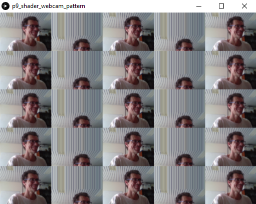  
*Editor en línea con salida de p9_webcam_pattern.pde*

Cerramos con un ejemplo que proporciona al *shader* las coordenadas de la detección del rostro,  que simplifica una de las versiones de la práctica de Viusi´pon ??????

En el ejemplo de cierre, se le proporcionan al *shader* las coordenadas de la detección del rostro que ha sido detectado con OpenCV, para desde el *shader* *almahaser.glsl* aplicar un mosaico sobre la zona del rostro inspirado en alguno de los retratos del proyecto *I Always Have To Repeat Myself* de [Alma Haser](http://www.haser.org):


  **Processing**
  ```
import java.lang.*;
import processing.video.*;
import cvimage.*;
import org.opencv.core.*;
//Detectores
import org.opencv.objdetect.CascadeClassifier;
import org.opencv.objdetect.Objdetect;

Capture cam;
CVImage img;

PShader sh;  
boolean enabled = true;

int bestFacex,bestFacey,bestsy;

//Cascadas para detección
CascadeClassifier face;
//Nombres de modelos
String faceFile;

void setup() {
  size(640, 480, P3D);
  //Cámara
  cam = new Capture(this, width , height);
  cam.start();

  //OpenCV
  //Carga biblioteca core de OpenCV
  System.loadLibrary(Core.NATIVE_LIBRARY_NAME);
  println(Core.VERSION);
  img = new CVImage(cam.width, cam.height);

  //Detectores
  faceFile = "haarcascade_frontalface_default.xml";
  face = new CascadeClassifier(dataPath(faceFile));

  sh = loadShader("haser.glsl");
  bestFacex=-1;
  bestFacey=-1;
  bestsy=-1;
}

void draw() {  
  if (cam.available()) {
    shader(sh);
    background(0);
    cam.read();

     //Obtiene la imagen de la cámara
    img.copy(cam, 0, 0, cam.width, cam.height,
    0, 0, img.width, img.height);
    img.copyTo();

    //Imagen de grises
    Mat gris = img.getGrey();

    //Detección y pintado de contenedores
    FaceDetect(gris, false);    

    gris.release();

    sh.set("u_resolution", float(width), float(height));
    sh.set("u_face", float(bestFacex), float(bestFacey));
    sh.set("u_facesy", float(bestsy));
    println(bestFacex,bestFacey);
    image(cam, 0, 0);    

  }
}

void FaceDetect(Mat grey, boolean drawBBs)
{
  //Detección de rostros
  MatOfRect faces = new MatOfRect();
  face.detectMultiScale(grey, faces, 1.15, 3,
    Objdetect.CASCADE_SCALE_IMAGE,
    new Size(60, 60), new Size(200, 200));
  Rect [] facesArr = faces.toArray();

   //Dibuja contenedores
  noFill();
  stroke(255,0,0);
  strokeWeight(4);
  if (drawBBs){
    for (Rect r : facesArr) {    
      rect(r.x, r.y, r.width, r.height);   
     }
  }

  //Mayor cara
  bestFacex=-1;
  bestFacey=-1;
  bestsy=-1;
  long largestface=0;
  for (Rect r : facesArr) {    
    //Gets largets face upper left corner
    if (r.width*r.height>largestface){
      largestface=r.width*r.height;
      bestFacex=r.x;
      bestFacey=r.y;
      bestsy=r.height;
    }    
  }

  faces.release();
}

void mousePressed() {
  enabled = !enabled;
  if (!enabled == true) {
    resetShader();
  }
}
```

**GLSL**
```
\begin{lstlisting}[frame=single,caption={Código del *shader almahaser.glsl}},label=code:processing-glsl-almahasersh]
// Inspirado en Alma Haser
#ifdef GL_ES
precision mediump float;
precision mediump int;
#endif

#define PROCESSING_TEXTURE_SHADER

uniform sampler2D texture;
uniform vec2 texOffset;
uniform vec2 u_resolution;
uniform vec2 u_face;
uniform float u_facesy;
//uniform float u_time;

varying vec4 vertColor;
varying vec4 vertTexCoord;

float scale = 1.0;
float step = 0.05;

void main(void) {
  vec2 stc = gl_FragCoord.xy/u_resolution;
  vec2 face = u_face/u_resolution.xy;
  vec2 st = vertTexCoord.st*scale;   
  //sectores múltiplos de step
  int aux = int(float(u_facesy/u_resolution.y)/step)+1;

  if (face.x>=0 && face.y>=0){
    // Alterna columnas
    // Cierto rango
    if (stc.x>face.x && stc.y<1.0-face.y && stc.y>1.0-(face.y+float(aux*step))){// && stc.y<1.0-face.y){
      // Alterna filas
      if ( mod(stc.y*scale,2.0*step) <= step){
        // Desplaza en positivo con salto step
        if ( mod(stc.x*scale,2.0*step) <= step)
          st.x += (u_resolution.x*step)*texOffset.s;
        else // Desplaza en negativo
          st.x -= (u_resolution.x*step)*texOffset.s;
      }
    }    
  }

  vec4 sum = texture2D(texture, st);
  gl_FragColor = vec4(sum.rgb, 1.0) * vertColor;
}
```

El p5.js existe la clase *Shder* y comando análogos como *loadShader*, *shader* y *resetShsder*. Si están interesados, pueden echar un ojo a la [demo](https://glitch.com/edit/#!/macaronight-test) que mostramnos a futuros estudiantes del grado alojada en Glitch.

-->

### Galería

Esta práctica pretende mostrar una visión superficial sobre los *shaders*, no habiendo cubierto otras posibilidades. Se incluyen en este apartado referencias a ejemplos, información y lugares de encuentro de la comunidad:


- [Codeanticode shader experiments](https://github.com/codeanticode/pshader-experiments)
- [Shadertoy](https://www.shadertoy.com) y [Three.js and Shadertoy](https://r105.threejsfundamentals.org/threejs/lessons/threejs-shadertoy.html)
- [GLSL Sandbox](http://glslsandbox.com)
- Galería CIU:   
  - [Marcelo Fernando](https://github.com/Refesh/Shaders)
  - [Gabriel García SP5rals](https://github.com/CaptainChameleon/SP5rals)
- [Shaderific App](https://shaderific.com)
- [OpenGL ES Shading Language Reference](http://shaderific.com/glsl/)
- [TyphoonLabs' OpenGL Shading Language tutorials](https://www.opengl.org/sdk/docs/tutorials/TyphoonLabs/)


<!--
https://codingxr.com/articles/shaders-in-threejs/

Tutorial threejs y shaders
https://youtu.be/EntBBM6nqQA
https://youtu.be/dRo7SnOJlEM
-->

<!---
% https://forum.processing.org/two/discussion/24702/resources-for-learning-glsl-shaders --->


### Tarea

Realizar una propuesta de prototipo que haga uso al menos de un *shader* de fragmentos, sugiriendo como posibilidades la creación de texturas y/o diseños generativos, y su posible integración en prácticas precedentes.


### Referencias

- [Gon21] Patricio Gonzalez Vivo and Jen Lowe. [The Book of Shaders](https://thebookofshaders.com)

- [Documentación](https://threejs.org/docs/index.html#manual/en/introduction/Creating-a-scene)  
- [Three.js Fundamentals](Three.js Fundamentals)
- [Discover three.js](https://discoverthreejs.com)
- [Learning Three.js](https://github.com/josdirksen/learning-threejs) por [Jos Dirksen](https://github.com/josdirksen)
- [Three.js Cookbook](https://github.com/josdirksen/threejs-cookbook) por [Jos Dirksen](https://github.com/josdirksen) de 2015


***
Bajo licencia de Creative Commons Reconocimiento - No Comercial 4.0 Internacional
