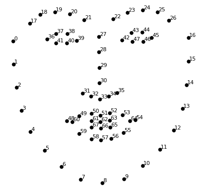
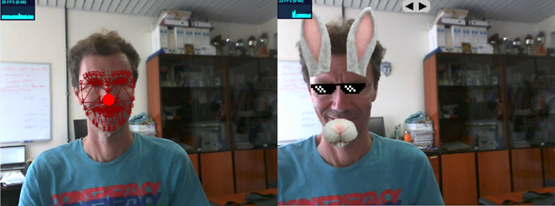

## Práctica 4. Detección de caras

### Contenidos

[Aspectos cubiertos](#41-aspectos-cubiertos)

### 4.1. Aspectos cubiertos

Para esta práctica he preparado dos demostradores (*VC_P4.ipynb* y *VC_P4_deepface.ipynb*) que integran varios detectores faciales.
El primero de ellos, *VC_P4*, integra cuatro variantes que buscan el rostro mayor de la imagen intentando localizar sus ojos para aplicar en su caso una normalización de tamaño y orientación:

- Detector de Viola y Jones [Viola04-ijcv]. La detección de caras se incorpora en OpenCV desde la implementación de Rainer Lienhart [Lienhart02] del conocido, y hoy añejo, detector.
- Detector de Kazemi et al. [Kazemi14]
- Detector basado en Convolutional Neural Networks (CNNs) [Feng21]
- Detector Multi-task Cascaded Convolutional Networks (MTCNN) [Zhang16]

Como primer paso, son necesarias algunas instalaciones de paquetes. Partiendo del *environment* *VC_P1* creado en la primera práctica, para ejecutar *VC_P4* he necesitado instalar los siguientes paquetes:

```
conda activate VC_P1

pip install imutils
pip install dlib
pip install mtcnn
pip install tensorflow
```

Si no hay contratiempos, la ejecución de *VC_P4.ipynb* debería ser posible, todas las dependencias están instaladas, pero falta asegurar que todos los clasificadores están presentes en el directorio local. Al ejecutar debería aparecer un error por un archivo no encontrado. En el repositorio [github](https://github.com/otsedom/otsedom.github.io/blob/main/VC/README.md), se incluyen todos los modelos necesarios con excepción de los modelos de máscaras faciales, más pesados, motivo por el cual se produce error al no disponer de los archivos *shape_predictor_5_face_landmarks.dat* y *shape_predictor_68_face_landmarks.dat*. Por su mencionado tamaño no se han incluido en el repositorio. Para poder ejecutar la demo, deben descargarse desde el enlace proporcionado en el campus virtual (opción aconsejada), o
desde el [repositorio de archivos de dlib](http://dlib.net/files/).

En primer término la implementación en OpenCV del detector de Viola y Jones [Viola04][Lienhart02] busca caras, en cuyo contenedor intenta localizar los ojos, aplicando la misma arquitectura de detector, pero adaptada al patrón ocular, por medio de los detectores entrenados años atrás en nuestro laboratorio [Castrillon11].
Detectores faciales más recientes, tras detectar el rostro hacen uso de un modelo de sus elementos para encajarlo en la imagen utilizando como punto de partida un detector del rostro, intentando ajustar para cada cara detectada la máscara de puntos.
Pulsando la tecla *d* cambias de detector, y para determinados detectores la tecla *e* permite alternar entre dos máscaras de puntos del rostro. Para este grupo de detectores, de mejor o peor forma se dibujan elementos faciales, desde cinco elementos, o en el caso mayor 68, correspondiendo a la indexación mostrada en la imagen a continuación.

  
*Máscara facial de 68 puntos con numeración*

Dado que las máscaras tienen una numeración que permite el acceso a posiciones concretas, esta información se utiliza para normalizar la imagen (tamaño y orientación) en este ejemplo, pero puede utilizarse para otros fines como muestran las siguientes imágenes.

  
*Máscara sobre el rostro detectado*


Para la demo con RetinaFace tengo problemillas de capacidad de cómputo en mi portátil. Sí he podido ejecutarla de forma fluida en el PC tras crear otro *environment* siguiendo la instrucciones de instalación de [deepface](https://github.com/serengil/deepface), y una vez con el entorno activo instalar deepface. Para un nuevo *environment* algo como:

```
conda create --name deepface python==3.11.5
conda activate deepface

pip install deepface
```


Recordar que para ejecutar en VS Code en este nuevo *environment* se requiere como es habitual el paquete *ipykernel*.

Deepface contiene *wrappers* de varios detectores, sin embargo en el ejemplo he optado por limitarlo a mostrar el resultado con RetinaFace con detección de todas las caras presentes. Si consigues ejecutarlo apreciarás robustez, pero también una mayor carga de procesamiento.

Para usuarios linux y Mac, la retroalimentación de éxito que me ha llegado hasta ahora ha siso al instalar CUDA. <!--Algunos compañeros también necesitaron instalar tensorflow en Windows.-->

## Tarea

Diseñar y codificar un prototipo que haga uso de la información facial para un determinado fin de temática libre. Los detectores proporcionan información del rostro, y de sus elementos faciales. Ideas inmediatas pueden ser filtros, aunque no hay limitaciones en este sentido.

La instalación debida a Zach Lieberman titulada [Más Que la Cara](https://zachlieberman.medium.com/más-que-la-cara-overview-48331a0202c0) puede dar otra fuente de inspiración.

Tampoco hay limitación sobre el detector concreto a utilizar, acepto la utilización de otras herramientas. En este sentido puede interesarles echar un vistazo a [Mediapipe](https://google.github.io/mediapipe/).


## Referencias

[Castrillon11] Modesto Castrillón, Oscar Déniz,DanielHernández, and Javier Lorenzo. A comparison of face  and facial feature detectors based on the violajones general object detection framework. Machine Vision and Applications,2011.  
[Feng21] Yuantao Feng and Shiqi Yu and Hanyang Peng and Yan-ran Li and Jianguo Zhang. Detect Faces Efficiently: A Survey and Evaluations. IEEE Transactions on Biometrics, Behavior, and Identity Science, 2021
[Kazemi14] Vahid Kazemi and Josephine Sullivan. One Millisecond Face Alignment with an Ensemble of Regression Trees. In IEEE Conference on Computer Vision and Pattern Recognition, 2014
[Lienhart02] Rainer Lienhart and Jochen Maydt. An extended set of Haar-like features for rapid object detection. ICIP 2002  
[Viola04] Paul Viola and Michael J. Jones. Robust real-time face detection. International Journal of Computer Vision, 2004  
[Zhang16] Zhang, K., Zhang, Z., Li, Z., and Qiao, Y. Joint face detection and alignment using multitask cascaded convolutional networks. IEEE Signal Processing Letters, 2016


<!---Momentos en trabajo de Nayar sobre Binary images https://cave.cs.columbia.edu/Statics/monographs/Binary%20Images%20FPCV-1-3.pdf -->


***
Bajo licencia de Creative Commons Reconocimiento - No Comercial 4.0 Internacional
