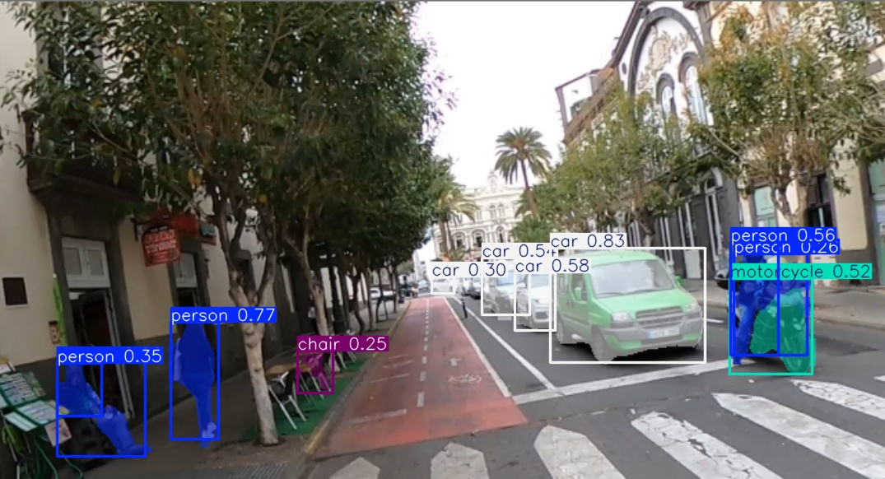
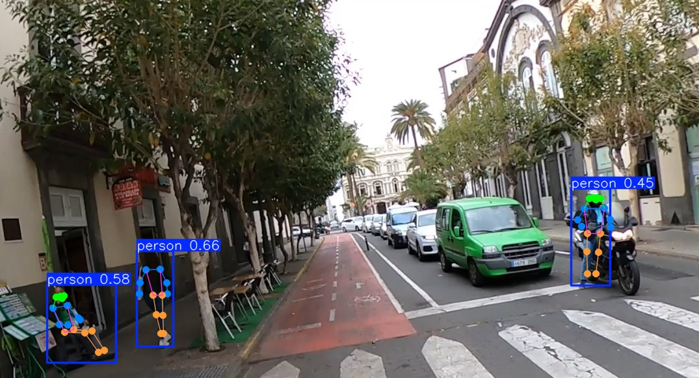
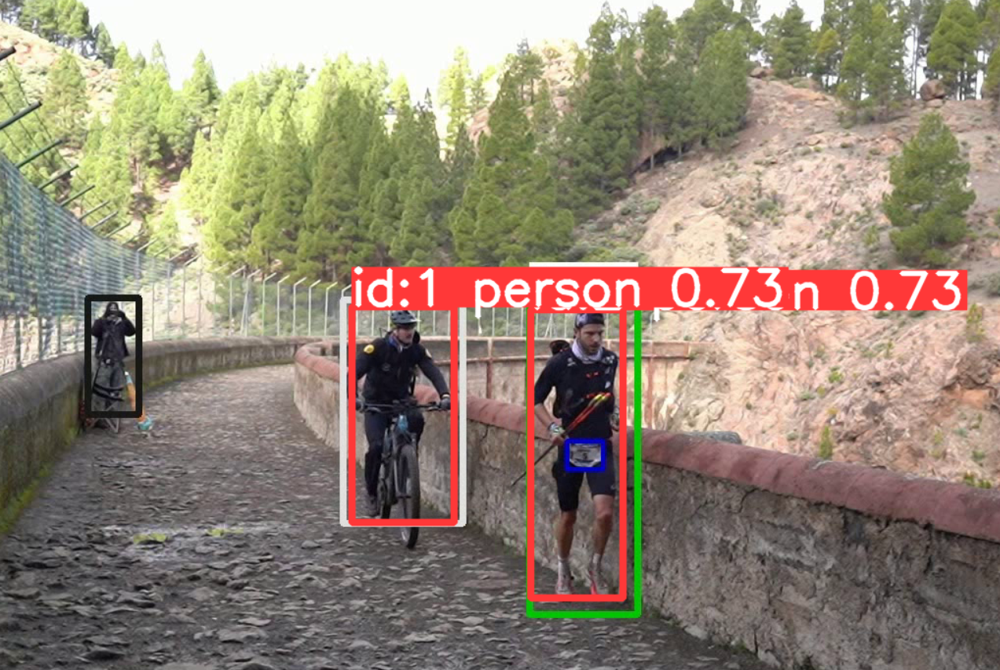
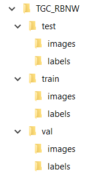

## Práctica 4. Reconocimiento de matrículas

### Contenidos

[Tarea](#41-aspectos-cubiertos)  
[YOLO](#42-yolo)  
[OCRs](#43-ocrs)  
[Detectando](#44-detectando-desde-muestro-codigo)  
[Entrenando YOLO](#45-entrenando-yolo)  
[Entrega](#46-entrega)

<!--[YOLOv7](#52-yolov7)  -->


## 4.1 Aspectos cubiertos

En esta práctica se aborda el uso de modelos existentes para la detección de objetos y reconocimiento de texto. En concreto, el objetivo de la única tarea que se propone es **desarrollar un prototipo, que procese vídeo para la detección y seguimiento de vehículos y personas, además deberá aplicar reconocimiento de caracteres sobre las matrículas visibles**. Si bien cuentan con libertad a la hora de escoger los módulos que integren en el prototipo, les proponemos los siguientes:

- un detector de objetos, que permita localizar vehículos y personas,
- un localizador de matrículas,
- y un reconocedor de texto

Como modelo de partida para la detección de objetos sugerimos hacer uso de la familia de modelos basados en YOLO proporcionada por [Ultralytics](https://github.com/ultralytics/ultralytics). Por otro lado, para el reconocimiento de texto, se incluyen en el cuaderno dos OCRs diferentes. De cara a localizar las matrículas, son dos las posibilidades a evaluar:

- Tras detectar un coche, las zonas probables de la matrícula estarán en su parte inferior, y además se asume que se corresponde a una zona rectangular (su contorno lo es)
- En una segunda fase, se plantea realizar un entrenamiento de YOLO para detectar el objeto de interés: matrículas

Evaluar ambas opciones se considerará un extra en la evaluación de la tarea. Otros aspectos a valorar, se recogen al final de este documento.

<!--
[YOLO-NAS](https://github.com/Deci-AI/super-gradients/blob/master/documentation/source/YoloNASQuickstart.md) para mejorar con objetos pequeños y pocos recursos ...
-->


## 4.2 YOLO

<!-- environment VC_P1 e portátil -->

Tras la presentación en 2023 de yolov8, en septiembre de 2024 Ultralytics ha puesto a disposición yolo11. A lo largo del texto, al mencionar YOLO, hacemos referencia al modelo reciente YOLO11. Para su instalación en un nuevo  *environment*, *VC_P4*, seguir los pasos del [tutorial de instalación de Ultralytics](https://docs.ultralytics.com/quickstart/#install-ultralytics). Por incompatibilidades con uno de los OCR vistos posteriormente, hemos hecho uso de la versión 3.9.5 y creado un nuevo *environment*.

```
conda create --name VC_P4 python=3.9.5
conda activate VC_P4
pip install ultralytics
pip install lap
```

Si cuentas con GPU, para hacer uso de su potencia de cálculo en el *environment*, necesitas contar con CUDA instalado, y seguir las instrucciones para instalar todos los paquetes compatibles necesarios. Para la instalación, cuentas con esta [guía](https://pytorch.org/get-started/locally/) que te prepara la línea de comando a lanzar. Un ejemplo de la utilizada en mi equipo con CUDAv11.6:

```
conda install pytorch==1.12.1 torchvision==0.13.1 torchaudio==0.12.1 cudatoolkit=11.6 -c pytorch -c conda-forge
```


<!-- lap para usar el tracker desde código-->

Una vez instalada, puede ejecutarse desde línea de comandos con algo como:


<!-- yolo detect predict model=yolo11n.pt source="C:/Users/otsed/Desktop/RUNNERS_ILUSOS/Multimedia/Bibs/TGC23_PdH_C0056_resultado.mp4"  -->
```
yolo detect predict model=yolo11n.pt source="rutaimg_video"
```

Con el parámetro *model* se define el modelo preentrenado a utilizar, los resultados los almacena en la carpeta *runs/detect/predict*. Los distintos parámetros
de la ejecución se describen en la documentación del modo [*predict*](https://docs.ultralytics.com/modes/predict/). El modelo escogido detecta contenedores, para la segmentación semántica (proporciona la máscara del objeto)
aplicar por ejemplo el modelo *yolov11n-seg.pt*, con un resultado similar al de la imagen.

```
yolo detect predict model=yolo11n-seg.pt source="rutaimg_video"
```
<!-- yolo detect predict model=yolo11n-seg.pt source="C:/Users/otsed/Desktop/RUNNERS_ILUSOS/Multimedia/Bibs/TGC23_PdH_C0056_resultado.mp4"  -->

  
*Resultado del modelo yolo11n-seg.pt con la imagen test.jpg*

Otro interesante modelo disponible es el detector de pose, que obtiene un resultado como el de la imagen.


```
yolo pose predict model=yolo11n-pose.pt source="rutaimg_video"
```

  
*Resultado del modelo yolo11n-pose.pt con la imagen test.jpg*

<!-- yolo pose predict model=yolo11n-pose.pt source="C:/Users/otsed/Desktop/RUNNERS_ILUSOS/Multimedia/Bibs/TGC23_PdH_C0056_resultado.mp4"  -->

<!--A este segundo también le añadí la opción "device" para decirle qué tarjetas tiene que usar.-->

La versión de yolo de Ultralytics integra la posibilidad de realizar [seguimiento (tracking)](https://docs.ultralytics.com/modes/track/#features-at-a-glance),
de momento con los modelos **BoT-SORT** (por defecto) y **ByteTrack**.


<!-- C:\Users\otsed\Desktop\RUNNERS_ILUSOS\Multimedia\Bibs\TGC23_PdH_C0056.mp4 -->
```
yolo track model=yolo11n-pose.pt source="ruta_video"
```

En todos los casos, el resultado se alacena en la carpeta *runs*.


### 4.3. OCRs

Como reconocedores de caracteres, proponemos dos opciones: Tesseract y easyOCR. Para ambos , el cuaderno proporcionado esta semana incluye demostradores mínimos. Otra posibilidad es [KERAS-OCR](https://github.com/faustomorales/keras-ocr), que no hemos probado.
<!-- Al ser un nuevo *environment* no olvidar  que es necesario instalar el paquete para ejecutar cuadernos, desde consola-->

Por un lado, el conocido [Tesseract](https://github.com/tesseract-ocr/tesseract), requiere desde python un *wrapper*, previa instalación.
La documentación de [Tesseract](https://tesseract-ocr.github.io/tessdoc/Installation.html) dispone de **información para su instalación en distintas plataformas**.
Para entorno WIdnows:

- Decargar los binarios desde el repositorio para tal fin de la [Universidad Manheim](https://github.com/UB-Mannheim/tesseract/wiki).
- Ejecutar el archivo descargado para lsu instalación
- Durante la instalación, he indicado que incluya datos de otros lenguajes, en mi caso español
- Anotar la ruta donde se instala, dado que debe especificarse en el código python. O añadir al *PATH*.
- Instalar el *wrapper* [pytesseract](https://pypi.org/project/pytesseract/) ven el *environment* *VC_P4*:

```
pip install pytesseract
```

Por otro lado, [easyOCR](https://github.com/JaidedAI/EasyOCR) ofrece soporte para más de 80 lenguas. Su instalación es a priori más simple, basta con:

```
pip install easyocr

```

Pero surge una **incidencia** con OpenCV, dado que funciones de visualización, como *imshow*, dejan de estar presentes. Observando la incompatibilidad entre la instalación de YOLO y easyOCR,
puedes llegar a un punto en que la instalación de OpenCV no sea completa para nuestro cuaderno. Lo hemos conseguido resolver con:

```
pip uninstall opencv-python
pip install opencv-python --upgrade
```

### 4.4 Detectando desde código

En la sección [YOLO](#42-yolo), se presentan varios ejemplos de uso desde línea de comando.
Para tener más control, interesa manejar el detector de nuestro propio código, en las primeras celdas del cuaderno ejemplo, *VC_P4.ipynb*, se incluyen ejemplos
de procesamiento y dibujado de las cajas contenedoras haciendo uso del modelo *yolo11n.pt* desde código python procesando la entrada de la webcam, tanto para detección, como para detección y seguimiento.
En el primer caso, se consideran todas las clases sin realizar ningún tipo de filtrado, mientras que para seguimiento se restringen las clases de interés.
( También se incluye una celda preparada para procesar un vídeo en disco pudiendo escoger el modelo.

  
*Resultado del BoT-SORT*

Si quieres acceder a vídeos utilizados para evaluar las técnicas de seguimiento, prueba este [enlace](https://motchallenge.net/data/MOT15/).


### 4.5 Entrenando YOLO

Tras hacer uso de YOLO como detector, esta sección aborda el entrenamiento personalizado para detectar objetos de nuestro interés, a partir de cajas contenedoras. De cara a la tarea propuesta, los modelos de YOLO no incluyen la detección de matrículas, por lo que se hace necesario realizar entrenar un modelo propio. El vídeo de test proporcionado incluirá principalmente matrículas españolas, siendo una primera subtarea recopilar o capturar imágenes o vídeos que contengan vehículos con su matrícula visible. Si necesitan cámaras, trípode, etc. hablen conmigo.

#### Anotación de imágenes

Son dos los elementos necesarios, por un lado obtener imágenes con muestras del objeto de interés, y por otro lado, herramientas de anotación para posteriormente proporcionarlas en el entrenamiento.

La recopilación de imágenes puede realizarse de distintas maneras

- accediendo a algún conjunto de datos ya existente
- creando el conjunto de datos

En el segundo caso será necesario recopilar imágenes, pudiendo ser de forma manual, o utilizando utilidades que permitan descargar imágenes realizando búsquedas. Un ejemplo de utilidad, es la proporcionada por [google_images_download](https://pypi.org/project/google_images_download/) que facilita la descarga de un número de imágenes obtenidas realizando búsquedas a través de google.

Tras esta recopilación será necesario en primer término limpiar y filtrar las imágenes, para posteriormente anotar las muestras de nuestro objeto de interés. Asumo una anotación en base a contenedores rectangulares, si bien las herramientas de anotación permiten más variantes.

Si bien existen numerosas herramientas de anotación, las más frecuentes en el grupo han sido:

- [VoTT (Visual Object Tagging Tool)](https://github.com/microsoft/VoTT)
- [labelme](https://github.com/wkentaro/labelme)


La primera de ellas ya no está mantenida. La segunda puede instalarse a través de anaconda, permitiendo distintos tipos de anotación. Para nuestro propósito optaremos por un esquema rectangular. Tras almacenar las anotaciones puede ser necesaria alguna adaptación dependiendo de la red que se use para entrenar.

```
conda create --name=labelme python=3.9
conda activate labelme
pip install labelme
```

Una vez instalado *labelme*, el proceso desde *Anaconda Prompt*:

- Teclear *labelme*
- Una vez abierta la interfaz, seleccionar la carpeta con imágenes a anotar
- En nuestro caso, que anotaremos zonas rectangulares, escoger *Edit->Create Rectangle*

La anotación genera un *json* para cada imagen. Sugerir en cualquier caso echar un vistazo a la [documentación sobre el uso](https://github.com/wkentaro/labelme#usage).

No es obligatorio utilizar esta herramienta en concreto, hay numerosas y podrás encontrar comparativas.
Existen también numerosos servicios en la nube, como por ejemplo [Roboflow](https://app.roboflow.com/login) que requieren crearse una cuenta para acceder a las utilidades, [CVAT](https://www.cvat.ai) o [TigTag](https://www.tictag.io) que permite anotar desde el móvil. Te invito a explorar y escoger la herramienta que más te atraiga para el proceso de anotación.

Lo importante es que sea cómoda y fácil de usar, y se agradece que permita exportar a varios formatos, incluyendo YOLO, que es el que será necesario para realizar el entrenamiento con YOLO.

<!---Momentos en trabajo de Nayar sobre Binary images https://cave.cs.columbia.edu/Statics/monographs/Binary%20Images%20FPCV-1-3.pdf -->

<!-- Guías CVAT
https://www.simonwenkel.com/lists/software/list-of-annotation-tools-for-machine-learning-research.html
https://www.v7labs.com/blog/cvat-guide
-->


#### Entrenamiento

Tras utilizar uno o varios modelos preentrenados de YOLO para detección, el propósito de este apartado es aportar las pautas para entrenar un detector basado en YOLO del objeto u objetos que nos sea de interés.

Una vez recopiladas las imágenes y realizadas las anotaciones, antes de proceder a entrenar con YOLO, es necesario disponer las imágenes de determinada forma, y posteriormente especificar las rutas en la llamada. La siguiente imagen
muestra la estructura de directorios creadas para un conjunto de datos denominado *TGCRBNW*.



Contiene tres subcarpetas:

- *test*
- *train*
- *val*

Cada una de ellas a su vez contiene dos subcarpetas:

- *images*
- *labels*

La primera de ellas contiene las imágenes que se han anotado, mientras que la segunda carpeta contiene para cada imagen anotada su archivo *.txt* homónimo con las correspondientes anotaciones de la imagen. Recordar que el formato esperado por YOLO debe ser algo como:

```
<object-class-id> <x> <y> <width> <height>
```

Los datos de cada línea se refieren a:

- *object-class-id*: identificador numérico de la clase del objeto anotado
- *x*: coordenada *x* del centro de la ventana
- *y*: coordenada *y* del centro de la ventana
- *width*: ancho del contenedor
- *height*: alto del contenedor

Las coordenadas del centro y dimensiones del contenedor estarán normalizadas, es decir, divididas por las dimensiones de la imagen.

Para distribuir las imágenes en las tres subcarpetas, debemos llevar a cabo un reparto. Lo habitual es realizar una división aleatoria, donde por ejemplo podemos hacer uso de un 80% para entrenamiento y validación, y un 20% para test. Dentro del primer grupo, puedes optar de nuevo a una división 80/20 o 90/10.

Una vez conformada la estructura de directorios y distribuidas las imágenes, he procedido a crear, en mi caso dentro de la carpeta *data*, un archivo *.yaml* que permite especificar las rutas de las imágenes que se proporcionan para entrenamiento, validación y test, además del número de clases a considerar, y sus nombres. En mi caso con una única clase:

```
# TGCRBNW

# train and val data as 1) directory: path/images/, 2) file: path/images.txt, or 3) list: [path1/images/, path2/images/]
train: C:/Users/otsed/Desktop/RUNNERS/Datasets/TGC_RBNW/train/
val: C:/Users/otsed/Desktop/RUNNERS/Datasets/TGC_RBNW/val/  
test: C:/Users/otsed/Desktop/RUNNERS/Datasets/TGC_RBNW/test/  

# number of classes
nc: 1

# class names
names: [ 'bib' ]
```

A partir de este punto es posible lanzar el entrenamiento. Un par de variantes especificando o no el número de épocas, indicando el tamaño de las imágenes a considerar (por defecto 640), y los pesos tomados como punto de partida:


El código para entrenar YOLO desde CPU:

```
yolo detect train model=yolo11n.pt data=data/miarchivo.yml imgsz=416 batch=4 device=CPU epochs=40
```

Si disponemos de GPU:

```
yolo detect train model=yolo11n.pt data=data/miarchivo.yml imgsz=416 batch=4 device=0[,1,2,3] epochs=40
```

Para entrenar con GPU, puede serte útil acceder a las instrucciones para [instalar pytorch local](https://pytorch.org/get-started/locally/) de cara a conocer el comando necesario para instalarlo en tu *environment*. Chequea la versión de CUDA en tu equipo, puede que tengas que buscar en el enlace para versiones previas de pytorch.


<!--En mi equipo de despacho, donde ya tenía CUDA presente

```
pip install torch torchvision torchaudio --index-url https://download.pytorch.org/whl/cu118

No fue

conda install pytorch torchvision torchaudio pytorch-cuda=11.8 -c pytorch -c nvidia

se queja de openssl

Con yolov7 usé
conda install pytorch==1.12.1 torchvision==0.13.1 torchaudio==0.12.1 cudatoolkit=11.6 -c pytorch -c conda-forge

```


 Error OpenSSL https://github.com/conda/conda/issues/11982
go to location where you've install anaconda anaconda3>Library>bin. search and copy following dll files

libcrypto-1_1-x64.dll
libssl-1_1-x64.dll

and paste to anaconda3>DLLs.

then restart your pc.

issue will get resolved. This will solve the issue. Thank you Mahesh2519
-->

El entrenamiento puede llevarse a cabo en CPU, siendo sensiblemente más lento que si contamos con GPU. También es posible hacer uso de Colab ( [tutorial para ejecutar en Colab](https://machinelearningprojects.net/train-yolov7-on-the-custom-dataset/) ).
Finalizado el entreno localmente, en la carpeta *runs/detect/trainX* se encuentra el resultado. Ya estarías en disposición de probarlo, desde línea de comando o en tu propio código.


### 4.6. Entrega

Para la entrega de esta práctica, la tarea consiste en desarrollar un prototipo que procese uno ([vídeo ejemplo proporcionado](https://alumnosulpgc-my.sharepoint.com/:v:/g/personal/mcastrillon_iusiani_ulpgc_es/EXRsnr4YuQ9CrhcekTPAD8YBMHgn16KwlunFg32iZM0xVQ?e=kzuw4l)) o varios vídeos (incluyendo vídeos de cosecha propia)):

- detecte y siga las personas y vehículos presentes
- detecte y lea las matrículas de los vehículos presentes
- cuente el total de cada clase
- vuelque a disco un vídeo que visualice los resultados
- genere un archivo csv con el resultado de la detección y seguimiento. Se sugiere un formato con al menos los siguientes campos:

```
fotograma, tipo_objeto, confianza, identificador_tracking, x1, y1, x2, y2, matrícula_en_su_caso, confianza, mx1,my1,mx2,my2, texto_matricula
```

La **entrega del cuaderno o cuadernos** se hace efectiva a través del campus virtual por medio de un **enlace github**. Además del **archivo README**, debe incluirse el resultado del vídeo proporcionado como test (o enlace al mismo), y el correspondiente archivo *csv*. En el caso de entrenarse algún detector, por ejemplo de matrículas, debe proporcionarse acceso al conjunto de datos.


Se considerarán extras:

- Determine el flujo de personas y vehículos en el vídeo de test en distintas direcciones (vehículos que dejan la imagen por la derecha, por la izquierda, etc.)
- Participar en
- Evaluar dos alternativas para la detección de matrículas: basada en YOLO, y basada en contornos.
- Anonimizar a las personas y vehículos presentes en un vídeo.
- En el caso de haberse apuntado al [Autumn Campus Makeathon InnovAction Canarias](https://www.ulpgc.es/agenda/2024/10/24/autumn-campus-makeathon2), se valorará la aplicación de habilidades adquiridas en esta práctica.


***
Bajo licencia de Creative Commons Reconocimiento - No Comercial 4.0 Internacional
