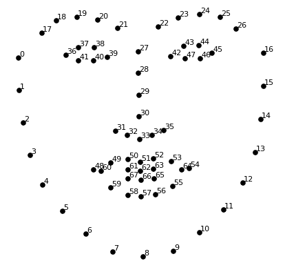
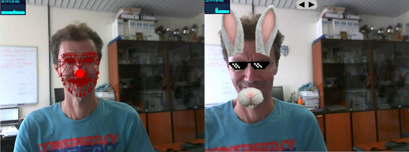
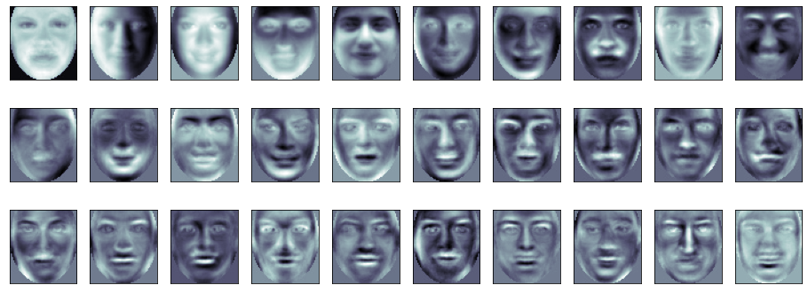

## Práctica 5. Detección y caracterización de caras

### Contenidos

[Aspectos cubiertos](#51-aspectos-cubiertos)
[Conjunto de datos](#conjunto-de-datos)  
[Análisis facial](#análisis-facial)  
[Tarea](#tarea)


### Detección de caras

Para esta práctica he preparado varios demostradores de detectores faciales. El primero de ellos, [*VC_P5_detectores.ipynb*](VC_P5_detectores.ipynb), integra cuatro variantes que buscan el rostro mayor de la imagen intentando localizar sus ojos para aplicar en su caso una normalización de tamaño y orientación:

- Detector de Viola y Jones [Viola04-ijcv]. La detección de caras se incorpora en OpenCV desde la implementación de Rainer Lienhart [Lienhart02] del conocido, y hoy añejo, detector.
- Detector de Kazemi et al. [Kazemi14]
- Detector basado en Convolutional Neural Networks (CNNs) [Feng21]
- Detector Multi-task Cascaded Convolutional Networks (MTCNN) [Zhang16]

Como primer paso, son necesarias algunas instalaciones de paquetes. Partiendo del *environment* *VC_P1* creado en la primera práctica, para ejecutar *VC_P5.ipynb* he necesitado instalar los siguientes paquetes:


<!-- Problemas con ejemplo deepface_kfold tensorflow 2.5.0?-->  
```
conda create --name VC_P5 python=3.11.5
conda activate VC_P5
pip install opencv-python
pip install matplotlib
pip install imutils
pip install mtcnn
pip install tensorflow   
pip install deepface
pip install tf-keras
pip install cmake
pip install dlib
```

Por la experiencia previa, el **paquete dlib suele ser el más problemático**, en ocasiones requiere que se instale la versión *Comunidad* de [*Microsoft C++ Build Tools*](https://visualstudio.microsoft.com/downloads/?q=build+tools). En el **caso de no resolverlo en poco tiempo, sugerir no instalar dlib**, y evitar el ejemplo [*VC_P5_detectores.ipynb*](VC_P5_detectores.ipynb), donde se alterna entre distintos detectores de caras y elementos faciales, y usar lso demostradores que no incorpora el detector de dlib: [*VC_P5_VJs.ipynb*](VC_P5_VJs.ipynb) (combinación de detectores de Viola y Jones) y [*VC_P5_VJ_DNN_MTCNN.ipynb*](VC_P5_VJ_DNN_MTCNN.ipynb) (varios detectores, sin los disponbibles en dlib).


Si no hay contratiempos, la ejecución de [*VC_P5_detectores.ipynb*](VC_P5_detectores.ipynb) debería ser posible, todas las dependencias están instaladas, pero falta asegurar que todos los clasificadores están presentes en el directorio local. Al ejecutar debería aparecer un error por un archivo no encontrado. En el repositorio [github](https://github.com/otsedom/otsedom.github.io/blob/main/VC/README.md), se incluyen todos los modelos necesarios con excepción de los modelos de máscaras faciales, más pesados, motivo por el cual se produce error al no disponer de los archivos *shape_predictor_5_face_landmarks.dat* y *shape_predictor_68_face_landmarks.dat*. Por su mencionado tamaño no se han incluido en el repositorio. Para poder ejecutar la demo, deben descargarse desde el enlace proporcionado en el campus virtual (opción aconsejada), o desde el [repositorio de archivos de dlib](http://dlib.net/files/).

En primer término la implementación en OpenCV del detector de Viola y Jones [Viola04][Lienhart02] busca caras, en cuyo contenedor intenta localizar los ojos, aplicando la misma arquitectura de detector, pero adaptada al patrón ocular, por medio de los detectores entrenados años atrás en nuestro laboratorio [Castrillon11].
Detectores faciales más recientes, tras detectar el rostro hacen uso de un modelo de sus elementos para encajarlo en la imagen utilizando como punto de partida un detector del rostro, intentando ajustar para cada cara detectada la máscara de puntos.
Pulsando la tecla *d* cambias de detector, y para determinados detectores la tecla *e* permite alternar entre dos máscaras de puntos del rostro. Para este grupo de detectores, de mejor o peor forma se dibujan elementos faciales, desde cinco elementos, o en el caso mayor 68, correspondiendo a la indexación mostrada en la imagen a continuación.

  
*Máscara facial de 68 puntos con numeración*

Dado que las máscaras tienen una numeración que permite el acceso a posiciones concretas, esta información se utiliza para normalizar la imagen (tamaño y orientación) en este ejemplo, pero puede utilizarse para otros fines como muestran las siguientes imágenes.

  
*Máscara sobre el rostro detectado*


Un ejemplo final ilustra el uso de [deepface](https://github.com/serengil/deepface) como *wrapper* de distintos detectores. Si bien probablemenmte no optimiza los métodos, permite acceder a disntintas propuestas, tanto para detectar, como para analizar rostros (que veremoes en al siguiente sección). El cuaderno [*VC_P5_detectores_deepface.ipynb*](VC_P5_detectores_deepface.ipynb), contiene una celda para detecTar con RetinaFace, y otra que permite alternanr entre varios. Un detector como RetinaFace, requiere mayores recursos, contar con GPU e instalar lo neecsario par ausar CUDA, se notará.

<!-- Para usuarios linux y Mac, la retroalimentación de éxito que me ha llegado hasta ahora ha siso al instalar CUDA.--> 


## Análisis facial

Esta sección muestra opciones de clasificación supervisada del rostro detectaro. Como ejemplo ilustrativo, se hace uso de un conjunto de datos para varias de las demos descritas a continuación, en concreto **DatabaseGender59x65**, que puede **descargarse desde el campus virtual**. Tras descomprimir, observarás que contiene dos
carpetas, dado que se asume un problema de dos clases: femenino y masculino.


### Autocaras

La primera de las demos está contenida en el archivo [*VC_P5_eigenfaces.ipynb*](VC_P5_eigenfaces.ipynb). ANtes de lanzarla, debes modificar la ruta del conjunto de datos, para ajustarla a tu máquina. Al landzarlo,  a modo de resumen realiza las siguientes acciones:

- Antes de nada, modifica la ruta especificada en el código en la variable *folder* para adaptarla a tu equipo
- Carga el conjunto de datos sin aplicar ningún tipo de recorte, cada imagen se recompone como vector, obteniendo la matriz *X* con todas las muestras, y la matriz *Y* con sus etiquetas numéricas
- Visualiza la primera muestra de cada clase y estadísticas del conjunto de datos
- De forma aleatoria se divide en conjunto de datos en entrenamiento y test usando *train_test_split*, es un *hold-out* 70/30.
- A continuación se realizan varios experimentos de clasificación:
  - Utiliza el valor de los píxeles como vector de características, clasificando por mayoría entre los k vecinos más cercanos (k=5 en el código)
  - Realiza el análisis de componentes principales del conjunto de entrenamiento, tomando las 150 primeras como vector de características, probando dos esquemas de clasificación:
    - por mayoría entre los k vecinos más cercanos (k=5 en el código)
    - utilizando una máquina de vectores soporte (SVM)
  - Realiza el análisis de componentes principales del conjunto de entrenamiento, tomando las componentes que cubran el 95%de la varianza del conjunto. De nuevo prueba dos esquemas de clasificación:
    - por mayoría entre los k vecinos más cercanos (k=5 en el código)
    - utilizando una máquina de vectores soporte (SVM)


  
*Caras principales*

Antes de la ejecución, es probable que requieras añadir algún paquete adicional al *environment*.

```
pip install scikit-learn
pip install scikit-image
```

Tras la ejecución, para todas las variantes se muestran métricas y matriz de confusión. ¿Qué esquema consideras que es mejor?

¿Qué ocurriría si se realiza el mismo proceso sobre una zona recortada de la imagen, por ejemplo te centras en la zona ocular. Comentar que las imágenes tienen un tamaño 59x65, habiendo sido normalizadas para que los ojos anotados/detectados estén en las posiciones (16,17) y (42,17).


### Descriptores locales

El segundo demostrador [*VC_P5_eigenfaces_handcrafted_kfold.ipynb*](VC_P5_eigenfaces_handcrafted_kfold.ipynb) diseña un experimento kfold, comparando el uso de autocaras con un par de configuraciones basadas en LBP y HOG.
A modo de resumen realiza las siguientes acciones:

- De nuevo, recuerda en primer lugar modificar la ruta especificada en el código en la variable *folder* para adaptarla a tu equipo
- Carga el conjunto de datos sin aplicar ningún tipo de recorte, cada imagen se recompone como vector, obteniendo la matriz *X* con todas las muestras, y la matriz *Y* con sus etiquetas numéricas
- Se visualizan varias muestras de cada clase y estadísticas del conjunto de datos
- De forma aleatoria se divide en conjunto de datos en varios subconjuntos usando *StratifiedKFold* para diseñar el kfold
- Realiza el análisis de componentes principales del conjunto de entrenamiento, tomando las componentes que cubran el 95%de la varianza del conjunto
- Posteriormente aplica los siguientes esquemas de clasificación:
  - Clasifica con píxeles como características y KNN
  - Clasifica con componentes PCA como características con KNN
  - Clasifica con componentes PCA como características con SVM
  - Clasifica con LBP como características con SVM
  - Clasifica con HOG como características con SVM
  - Clasificador aplicado (*stacked*) combinando los respectivos clasificadores SVM

Además de la zona de interés del rostro, como en el ejemplo de la sección previa,, la división en celdas para el cálculo de los histogramas HOG y LBP es configurable. Es por ello posible mejorar tasas de rendimiento, en particular si mejoramos los datos proporcionados al clasificador apilado.

¿Te aventuras a probar otras combinaciones de región de interés y descriptores locales?


### deepface

La demo contenida en [*VC_P5_deepface_kfold.ipynb*](VC_P5_deepface_kfold.ipynb) es similar a la del apartado previo, plantea un experimento kfold, tomando en este caso como características los *embeddings* proporcionados por uno de los modelos presentes en deepface. En concreto he tomado FaceNet, si bien el código está preparado para escoger otro modelo antes de realizar la carga de datos. Al cargar los datos se obtiene el correspondiente *embedding* que se almacena en *X*, siendo por ello el proceso de carga más lento. En la primera ejecución se descargará el modelo si fuera necesario, siendo almacenado en la carpeta *.deepface*. Tenlo presente si vas justo de disco.

Posteriormente se lanza el experimento kfold. ¿Qué te parecen los resultados?
¿Qué ocurre con otros modelos?

<!-- Sin embargo, quiero mostrar una demo, [*Demo_BuscaParecidos.py*](Demo_BuscaParecidos.py), que busca parecidos en un conjunto de caras a partir de distancias obtenidas con *embeddings* de FaceNet. Advierto que es una demo compuesta en ratos libres durante sesiones de actividades de divulgación bajo alguna carpa en una plaza, por lo que pueden existir errores.
Un proceso similar es el que está detrás de [Art selfie](https://artsandculture.google.com/camera/selfie).-->

Deepface además de detectar caras, dispone de utilidades para reconocimiento, descripción y estimación de la expresión facial, que puedes ver en su web.
mencionar utilizades para verificación y reconocimiento de identidad. En ambos casos se le proporciona dos parámetros:

- Para verificar, se proporcionan dos imágenes
- Para reconocer una imagen y la ruta  a la carpeta con la base de datos de identidades registradas.

En el último ejemplo, se ilustra brevemente la utilidad de descripción facial a través de la función *analyze* que permite estimar:

- identidad
- sexo
- raza
- emoción

En los dos últimos casos proporciona probabilidades de cada clase considerada, además de la ganadora. Un pequeño ejemplo es el incluido en [*VC_P5_deepface_analyze.ipynb*](VC_P6_deepface_analyze.ipynb). Tener presente, que cada modalidad requiere la descarga de modelos en su primera ejecución. 


## Tarea

Tras mostrar opciones para la detección y extracción de información de caras humanas con deepface, la tarea a entregar consiste en proponer un escenario de aplicación y desarrollar un prototipo de temática libreque provoque *reacciones* a partir de la información extraida del rostro. Los detectores proporcionan información del rostro, y de sus elementos faciales. Ideas inmediatas pueden ser filtros, aunque no hay limitaciones en este sentido. La entrega debe venir acompañada de un gif animado o vídeo de un máximo de 30 segundos con momentos seleccionados de la propuesta. Se utilizará para una posterior votación y elección de las mejores entre el grupo. El podio del curso pasado:

  
*Alejandro y Joaquín*

  
*Daniel e Iván*

  
*Daniel y Jorge*

Recomendar también propuestas como:

<!--Además de la demo mostrada de parecidos,
recomendar la lectura de [Working with Faces](https://kcimc.medium.com/working-with-faces-e63a86391a93) por [Kyle McDonald](https://kylemcdonald.net), y ver propuestas como:-->

- [Sharing Faces](https://vimeo.com/96549043) de [Kyle McDonald](https://kylemcdonald.net)
- [Más Que la Cara](https://zachlieberman.medium.com/más-que-la-cara-overview-48331a0202c0) de Zach Lieberman
- [Art selfie](https://artsandculture.google.com/camera/selfie)


<!--

La instalación debida a Zach Lieberman titulada [Más Que la Cara](https://zachlieberman.medium.com/más-que-la-cara-overview-48331a0202c0) puede dar otra fuente de inspiración. La utilidad [FaceOSC de Kyle McDonald](https://vimeo.com/26098366) también sugiere usos.

Tampoco hay limitación sobre el detector concreto a utilizar, acepto la utilización de otras herramientas. En este sentido puede interesarles echar un vistazo a [Mediapipe](https://google.github.io/mediapipe/).-->


## Referencias

[Castrillon11] Modesto Castrillón, Oscar Déniz, Daniel Hernández, and Javier Lorenzo. A comparison of face  and facial feature detectors based on the violajones general object detection framework. Machine Vision and Applications,2011.  
[Feng21] Yuantao Feng and Shiqi Yu and Hanyang Peng and Yan-ran Li and Jianguo Zhang. Detect Faces Efficiently: A Survey and Evaluations. IEEE Transactions on Biometrics, Behavior, and Identity Science, 2021
[Kazemi14] Vahid Kazemi and Josephine Sullivan. One Millisecond Face Alignment with an Ensemble of Regression Trees. In IEEE Conference on Computer Vision and Pattern Recognition, 2014
[Lienhart02] Rainer Lienhart and Jochen Maydt. An extended set of Haar-like features for rapid object detection. ICIP 2002  
[Viola04] Paul Viola and Michael J. Jones. Robust real-time face detection. International Journal of Computer Vision, 2004  
[Zhang16] Zhang, K., Zhang, Z., Li, Z., and Qiao, Y. Joint face detection and alignment using multitask cascaded convolutional networks. IEEE Signal Processing Letters, 2016


***
Bajo licencia de Creative Commons Reconocimiento - No Comercial 4.0 Internacional
