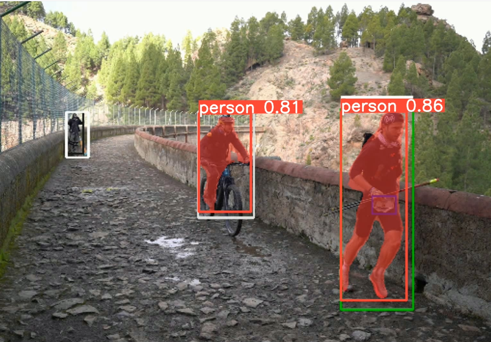
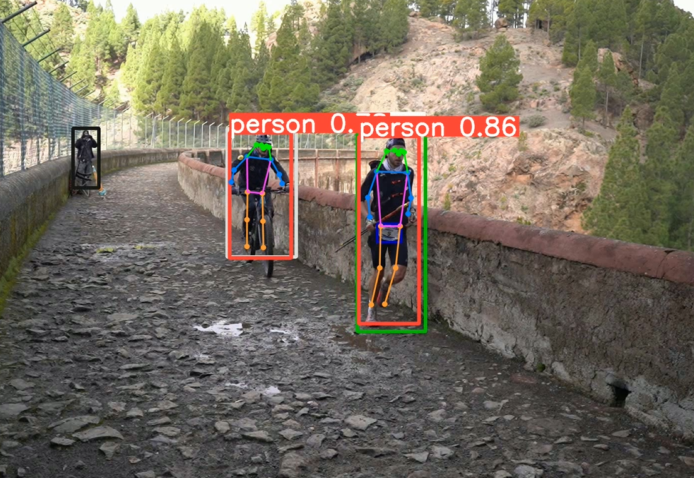

## Práctica 5. Reconocimiento de matrículas

### Contenidos

[Tarea](#51-tarea)  
[YOLOv8](#52-yolov8)  
[OCRs](#53-ocrs)  
[Entrenando YOLOv8](#54-entrenando-yolov8)

<!--[YOLOv7](#52-yolov7)  -->


## 5.1 Tarea

En esta práctica describo en primer término la tarea:  **El objetivo es desarrollar un prototipo de sistema que identifique la matrícula de un vehículo, bien desde una imagen o desde un vídeo**. Como alternativa, será admisible un escenario donde se combine el uso de detectores de objetos, y reconocimiento de texto.

Nos centraremos en matrículas españolas, siendo una primera subtarea recopilar o capturar imágenes o vídeos que contengan vehículos con su matrícula visible. Si necesitan cámaras, trípode, etc. hablen conmigo.

Si bien cuentan con libertad a la hora de escoger los módulos que integren en el prototipo, les propongo los siguientes apartados:

- un detector de objetos, que permita localizar vehículos
- un localizador de matrículas
- y un reconocedor de texto

Para la detección, les propongo hacer uso de YOLOv8, para el reconocimiento de texto, les muestro dos OCRs diferentes. De cara a localizar las matrículas, les sugiero dos fases:

- En una primera fase, tras detectar un coche, las zonas probables de la matrícula estarán en su parte inferior, y además se asume que se corresponde a una zona rectangular (su contorno lo es)
- En una segunda fase, se plantea realizar un entrenamiento de YOLOv8 para detectar el objeto de interés: matrículas


<!--
## 5.2 YOLOv7

La familia de detectores de YOLO cuenta con mucho tirón en años recientes dada su velicidad y calidad de detección. En esta línea la reciente propuesta de
[YOLOv7](https://github.com/WongKinYiu/yolov7) declara [batir los registros](https://amalaj7.medium.com/yolov7-now-outperforms-all-known-object-detectors-fd7170e8542d) de versiones previas.

En los dos enlaces previos se incluyen instrucciones de instalación. En mi experiencia para su instalación en Windows, en primer lugar me he colocado en la carpeta en la que quiero descargar y tecleado los siguientes comandos:

```
git clone https://github.com/WongKinYiu/yolov7.git
cd yolov7
conda create -n yolov7 python=3.9 -y   
conda activate yolov7
pip install -r requirements.txt
```

Una vez finalizados, no he tenido problemas en ejecutar procesando con la CPU. Les muestro un resumen
de llamadas al demostrados *detect.py* procesando una carpeta de imágenes, un vídeo o directamente desde la cámara web:

```
#Inferencia
python detect.py --weights yolov7.pt --conf 0.25 --img-size 640 --source rutaalacarpetaconimágenes\ --view-img --device cpu

#De vídeo almacenado
python detect.py --weights yolov7.pt --conf 0.25 --img-size 640 --source inference/bird.mp4 --view-img --device cpu

#webcam
python detect.py --weights yolov7.pt --conf 0.25 --img-size 640 --source 0 --device cpu

#webcam GPU
python detect.py --weights yolov7.pt --conf 0.25 --img-size 640 --source 0 --device 0
```

Creo que apreciarán que no va muy lento. Como en el PC del despacho tengo una GPU, he intentado configurar el
*environment* para poder usarla con el demostrador. Sin embargo hasta ahora no he tenido fortuna, pese a tener instalado CUDA y considerar haber seguido la documentación de [pytorch](https://pytorch.org/get-started/locally/),
para instalar la combinación de
CUDA, pytorch, torchvision y cudatoolkit con el supuesto comando:

```
conda install pytorch==1.12.1 torchvision==0.13.1 cudatoolkit=11.4 -c pytorch
```

Pese a ello, CUDA sigue mostrándose no disponible. Lo he comprobado al teclear

```
import torch
print(torch.cuda.is_available())
```

Me sigue devolviendo *false*. En cualquier caso, me va con CPU con aceptable tasa de fotogramas por segundo con la webcam, por lo que parece viable u uso aún sin GPU. Ustedes aportarán más visiones y experiencias.
-->

## 5.2 YOLOv8

<!-- environment VC_P1 e portátil -->

Durante este año 2023, Ultralytics presenta yolov8. Para su instalación en el environment *VC_P1* he seguido los pasos del  [tutorial de instalación de Ultralytics] (https://docs.ultralytics.com/quickstart/#install-ultralytics). No dejes de lado la [documentación](https://docs.ultralytics.com)

```
pip install ultralytics

```

Ha sido muy poco engorroso en mi experiencia. Una vez instalada, puede ejecutarse desde línea decomandos con algo como:


<!-- yolo detect predict model=yolov8n.pt source="C:/Users/otsed/Desktop/RUNNERS_ILUSOS/Multimedia/Bibs/TGC23_PdH_C0056_resultado.mp4"  -->
```
yolo detect predict model=yolov8n.pt source="rutavideo"
```

Con el parámetro model se define el modelo preentrenado a utilizar, los resultados los almacena en una carpeta *runs/detect/predict*. Los distintos parámetros de la ejecución se describen en la documentación del modo [*predict*](https://docs.ultralytics.com/modes/predict/). El modelo escogido detecta contenedores, para la segmentación semántica sugerir por ejemplo el modelo *yolov8n-seg.pt*, con un resultado similar al de la imagen.

```
yolo detect predict model=yolov8n-seg.pt source="rutavideo"
```
<!-- yolo detect predict model=yolov8n-seg.pt source="C:/Users/otsed/Desktop/RUNNERS_ILUSOS/Multimedia/Bibs/TGC23_PdH_C0056_resultado.mp4"  -->

  
*Resultado del modelo yolov8n-seg.pt*

Otro interesante modelo ya presente es el detector de pose, que obtiene un resultado como el de la imagen


```
yolo pose predict model=yolov8n-pose.pt source="rutavideo"
```

  
*Resultado del modelo yolov8n-pose.pt*

<!-- yolo pose predict model=yolov8n-pose.pt source="C:/Users/otsed/Desktop/RUNNERS_ILUSOS/Multimedia/Bibs/TGC23_PdH_C0056_resultado.mp4"  -->

<!--A este segundo también le añadí la opción "device" para decirle qué tarjetas tiene que usar.-->

En las primeras celdas del cuaderno ejemplo, *VC_P5.ipynb*, se incluye un ejemplo de procesamiento y dibujado de las cajas contenedoras haciendo uso del modelo *yolov8n.pt* desde código python. Se presentan todas las clases sin realizar ningún tipo de filtrado. También se incluye una celda preparada para procesar un vídeo en disco pudiendo escoger el modelo.


<!--

https://stackoverflow.com/questions/75714505/how-to-only-detect-person-class-from-yolov8


[YOLO-NAS](https://github.com/Deci-AI/super-gradients/blob/master/documentation/source/YoloNASQuickstart.md) para mejorar con objetos pequeños y pocos recursos ...


-->

### 5.3. OCRs

Como reconocedores de caracteres, les propongo dos opciones disponibles.
Para ambos se incluyen demostradores mínimos en el cuaderno proporcionado esta semana.
<!-- Al ser un nuevo *environment* no olvidar  que es necesario instalar el paquete para ejecutar cuadernos, desde consola-->


Por un lado, el conocido [Tesseract](https://github.com/tesseract-ocr/tesseract), para el que desde python será necesario un wrapper, además de instalarlo previamente.
La documentación de [Tesseract](https://tesseract-ocr.github.io/tessdoc/Installation.html) dispone de información para su instalación en distintos sistemas operativos
Para entorno Windows, siguiendo las instrucciones de la mencionada documentación, me he descargado los binarios desde el repositorio para tal fin de la [Universidad Manheim](https://github.com/UB-Mannheim/tesseract/wiki). Al instalar he indicado que incluya datos de otros lenguajes, en mi caso español. Además he anotado la carpeta donde se instala.

El *wrapper* es [pytesseract](https://pypi.org/project/pytesseract/) se instala cómodamente en el *environment* creado en el paso anterior con:

```
pip install pytesseract
```


Por otro lado, [easyOCR](https://github.com/JaidedAI/EasyOCR) que ofrece un cómodo soporte para más de 80 lenguas, cuya instalación es aún más simple, basta con:

```
pip install easyocr
```


***

### 5.4 Entrenando YOLOv8


En la sesión de la semana anterior, se introducía el uso de YOLOv8 como detector, esta práctica aborda el entrenamiento personalizado para detectar objetos de nuestro interés, a partir de cajas contenedoras.

#### Anotación de imágenes

Son dos los elementos necesarios, por un lado obtener imágenes con muestras del objeto de interés, y por otro lado, herramientas de anotación para posteriormente proporcionarlas en el entrenamiento.

La recopilación de imágenes puede realizarse de distintas maneras

- accediendo a algún conjunto de datos ya existente
- creando el conjunto de datos

En el segundo caso será necesario recopilar imágenes, pudiendo ser de forma manual, o utilizando utilidades que permitan descargar imágenes realizando búsquedas. Un ejemplo de utilidad, es la proporcionada por [google_images_download](https://pypi.org/project/google_images_download/) que facilita la descarga de un número de imágenes obtenidas realizando búsquedas a través de google.

Tras esta recopilación será necesario en primer término limpiar y filtrar las imágenes, para posteriormente anotar las muestras de nuestro objeto de interés. Asumo una anotación en base a contenedores rectangulares, si bien las herramientas de anotación permiten más variantes.

Si bien existen numerosas herramientas de anotación, las más frecuentes en el grupo han sido:

- [VoTT (Visual Object Tagging Tool)](https://github.com/microsoft/VoTT)
- [labelme](https://github.com/wkentaro/labelme)


La primera de ellas ya no está mantenida. La segunda puede instalarse a través de anaconda, permitiendo distintos tipos de anotación. Para nuestro propósito optaremos por un esquema rectangular. Tras almacenar las anotaciones puede ser necesaria alguna adaptación dependiendo de la red que se use para entrenar.

```
conda create --name=labelme python=3.9
conda activate labelme
pip install labelme
```

Una vez instalado *labelme*, el proceso desde *Anaconda Prompt*:

- Teclear *labelme*
- Una vez abierta la interfaz, seleccionar la carpeta con imágenes a anotar
- En nuestro caso, que anotaremos zonas rectangulares, escoger *Edit->Create Rectangle*

La anotación genera un *json* para cada imagen. Sugerir en cualquier caso echar un vistazo a la [documentación sobre el uso](https://github.com/wkentaro/labelme#usage).

No es obligatorio utilizar esta herramienta en concreto, hay numerosas y podrás encontrar comparativas.
Existen también numerosos servicios en la nube, como por ejemplo [Roboflow](https://app.roboflow.com/login) que requieren crearse una cuenta para acceder a las utilidades, [CVAT](https://www.cvat.ai) o [TigTag](https://www.tictag.io) que permite anotar desde el móvil. Te invito a explorar y escoger la herramienta que más te atraiga para el proceso de anotación.

Lo importante es que sea cómoda y fácil de usar, y se agradece que permita exportar a varios formatos, incluyendo YOLO, que es el que será necesario para realizar el entrenamiento con YOLOv8.

<!---Momentos en trabajo de Nayar sobre Binary images https://cave.cs.columbia.edu/Statics/monographs/Binary%20Images%20FPCV-1-3.pdf -->

<!-- Guías CVAT
https://www.simonwenkel.com/lists/software/list-of-annotation-tools-for-machine-learning-research.html
https://www.v7labs.com/blog/cvat-guide
-->


#### Entrenamiento

Tras utilizar uno o varios modelos preentrenados de YOLOv8 para detección, el propósito de este apartado es aportar las pautas para entrenar un detector basado en YOLOv8 del objeto u objetos que nos sea de interés.

Una vez recopiladas las imágenes y realizadas las anotaciones, antes de proceder a entrenar con YOLOv8, es necesario disponer las imágenes de determinada forma, y posteriormente especificar las rutas en la llamada. La siguiente imagen
muestra la estructura de directorios creadas para un conjunto de datos denominado *TGCRBNW*.


Contiene tres subcarpetas:

- *test*
- *train*
- *val*

Cada una de ellas a su vez contiene dos subcarpetas:

- *images*
- *labels*

La primera de ellas contiene las imágenes que se han anotado, mientras que la segunda carpeta contiene para cada imagen anotada su archivo *.txt* homónimo con las correspondientes anotaciones de la imagen. Recordar que el formato esperado por YOLOv8 debe ser algo como:

```
<object-class-id> <x> <y> <width> <height>
```

Los datos de cada línea se refieren a:

- *object-class-id*: identificador numérico de la clase del objeto anotado
- *x*: coordenada *x* del centro de la ventana
- *y*: coordenada *y* del centro de la ventana
- *width*: ancho del contenedor
- *height*: alto del contenedor

Las coordenadas del centro y dimensiones del contenedor estarán normalizadas, es decir, divididas por las dimensiones de la imagen.

Para distribuir las imágenes en las tres subcarpetas, debemos llevar a cabo un reparto. Lo habitual es realizar una división aleatoria, donde por ejemplo podemos hacer uso de un 80% para entrenamiento y validación, y un 20% para test. Dentro del primer grupo, puedes optar de nuevo a una división 80/20 o 90/10.

Una vez conformada la estructura de directorios y distribuidas las imágenes, he procedido a crear, en mi caso dentro de la carpeta *data*, un archivo *.yaml* que permite especificar las rutas de las imágenes que se proporcionan para entrenamiento, validación y test, además del número de clases a considerar, y sus nombres. En mi caso con una única clase:

```
# TGCRBNW

# train and val data as 1) directory: path/images/, 2) file: path/images.txt, or 3) list: [path1/images/, path2/images/]
train: C:/Users/otsed/Desktop/RUNNERS/Datasets/TGC_RBNW/train/
val: C:/Users/otsed/Desktop/RUNNERS/Datasets/TGC_RBNW/val/  
test: C:/Users/otsed/Desktop/RUNNERS/Datasets/TGC_RBNW/test/  

# number of classes
nc: 1

# class names
names: [ 'bib' ]
```

A partir de este punto es posible lanzar el entrenamiento. Un par de variantes especificando o no el número de épocas, indicando el tamaño de las imágenes a considerar (por defecto 640), y los pesos tomados como punto de partida:


El código para entrenar YOLOv8 desde CPU:

```
yolo detect train model=yolov8n.pt data=data/miarchivo.yml imgsz=416 batch=4 device=CPU epochs=40
```

Si disponemos de GPU:

```
yolo detect train model=yolov8n.pt data=data/miarchivo.yml imgsz=416 batch=4 device=0[,1,2,3] epochs=40
```

Para entrenar con GPU, puede serte útil acceder a las instrucciones para [instalar pytorch local](https://pytorch.org/get-started/locally/) de cara a conocer el comando necesario para instalarlo en tu *environment*. Chequea la versión de CUDA en tu equipo, puede que tengas que buscar en el enlace para versiones previas de pytorch.


<!--En mi equipo de despacho, donde ya tenía CUDA presente

```
pip install torch torchvision torchaudio --index-url https://download.pytorch.org/whl/cu118

No fue

conda install pytorch torchvision torchaudio pytorch-cuda=11.8 -c pytorch -c nvidia

se queja de openssl

Con yolov7 usé
conda install pytorch==1.12.1 torchvision==0.13.1 torchaudio==0.12.1 cudatoolkit=11.6 -c pytorch -c conda-forge

```


 Error OpenSSL https://github.com/conda/conda/issues/11982
go to location where you've install anaconda anaconda3>Library>bin. search and copy following dll files

libcrypto-1_1-x64.dll
libssl-1_1-x64.dll

and paste to anaconda3>DLLs.

then restart your pc.

issue will get resolved. This will solve the issue. Thank you Mahesh2519
-->

El entrenamiento puede llevarse a cabo en CPU, siendo sensiblemente más lento que si contamos con GPU. También es posible hacer uso de Colab ( [tutorial para ejecutar en Colab](https://machinelearningprojects.net/train-yolov7-on-the-custom-dataset/) ).
Finalizado el entreno localmente, en la carpeta *runs/detect/trainX* se encuentra el resultado. Ya estarías en disposición de probarlo, desde línea de comando o en tu propio código.


<!-- en el despacho  


Llegado a este punto:
¡¡A jugarrrr!!-->


***
Bajo licencia de Creative Commons Reconocimiento - No Comercial 4.0 Internacional
