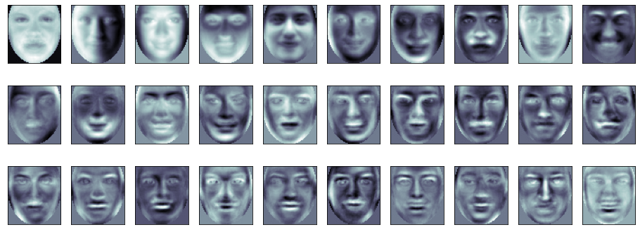

## Práctica 6. Análisis facial

### Contenidos

[Tarea](#71-tarea)


## Conjunto de datos

Como conjunto de datos para varias de las demos descritas a continuación se utiliza **DatabaseGender59x65**,  que puede descargarse desde el campus virtual. Tras descomprimir, observarás que contiene dos
carpetas, asumiendo un problema de dos clases.

Para las primeras demos, será necesario hacer uso del *environment* utilizado en las primeras prácticas, mientras que para aquellas que hacen uso de deepface, es necesario utilizar un *environment* con deepface instalado.


## Autocaras

La primera de las demos está contenida en el archivo *VC_P6_eigenfaces* que a modo de resumen realiza las siguientes acciones:

- Recuerda antes modificar la rute especificada en el código en la variable *folder* para adaptarla a tu equipo.
- Carga el conjunto de datos sin aplicar ningún tipo de recorte, cada imagen se recompone como vector, obteniendo la matriz *X* con todas las muestras, y la matriz *Y* con sus etiquetas numéricas
- Se visualiza la primera muestra de cada clase y estadísticas del conjunto de datos
- De forma aleatoria se divide en conjunto de datos en entrenamiento y test usando *train_test_split*, es un *hold-out* 70/30.
- A continuación se realizan varios experimentos de clasificación:
  - Utiliza el valor de los píxeles como vector de características, clasificando por mayoría entre los k vecinos más cercanos (k=5 en el código)
  - Realiza el análisis de componentes principales del conjunto de entrenamiento, tomando las 150 primeras como vector de características, probando dos esquemas de clasificación:
    - por mayoría entre los k vecinos más cercanos (k=5 en el código)
    - utilizando una máquina de vectores soporte (SVM)
  - Realiza el análisis de componentes principales del conjunto de entrenamiento, tomando las componentes que cubran el 95%de la varianza del conjunto. De nuevo prueba dos esquemas de clasificación:
    - por mayoría entre los k vecinos más cercanos (k=5 en el código)
    - utilizando una máquina de vectores soporte (SVM)


      
    *Caras principales*

Para todas las variantes se muestran métricas y matriz de confusión. ¿Qué esquema consideras que es mejor?

¿Qué ocurriría si se realiza el mismo proceso sobre una zona recortada de la imagen, por ejemplo te centras en la zona ocular. Comentar que las imágenes tienen un tamaño 59x65, habiendo sido normalizadas para que los ojos anotados/detectados estén en las posiciones (16,17) y (42,17).


## Descriptores locales

El segundo demostrador *VC_P6_eigenfaces_handcrafted_kfold* diseña un experimento kfold, comparando el uso de autocaras con un par de configuraciones basadas en LBP y HOG. Para su ejecución puede que necesites instalar algún paquete adicional en el *environment*:

```
pip install scikit-image
```

A modo de resumen realiza las siguientes acciones:

- Recuerda antes modificar la rute especificada en el código en la variable *folder* para adaptarla a tu equipo.
- Carga el conjunto de datos sin aplicar ningún tipo de recorte, cada imagen se recompone como vector, obteniendo la matriz *X* con todas las muestras, y la matriz *Y* con sus etiquetas numéricas
- Se visualizan varias muestras de cada clase y estadísticas del conjunto de datos
- De forma aleatoria se divide en conjunto de datos en varios subconjuntos usando *StratifiedKFold* para diseñar el kfold.
- Realiza el análisis de componentes principales del conjunto de entrenamiento, tomando las componentes que cubran el 95%de la varianza del conjunto
- Posteriormente aplica los siguientes esquemas de clasificación:
  - Clasifica con píxeles como características y KNN
  - Clasifica con componentes PCA como características con KNN
  - Clasifica con componentes PCA como características con SVM
  - Clasifica con LBP como características con SVM
  - Clasifica con HOG como características con SVM
  - Clasificador aplicado (*stacked*) combinando los respectivos clasificadores SVM

Además de la zona de interés del rostro, como en el ejemplo de la sección previa,, la división en celdas para el cálculo de los histogramas HOG y LBP es configurable. Es por ello posible mejorar tasas de rendimiento, en particular si mejoramos los datos proporcionados al clasificador apilado.

¿Te aventuras a probar otras combinaciones de región de interés y descriptores locales?


## deepface

Recuerdo los pasos que necesité en la práctica 4 para instalar [deepface](https://github.com/serengil/deepface):

```
conda create --name deepface python==3.9
conda activate deepface

pip install deepface
```

Para estos ejemplos necesitarás instalar también

```
pip install scikit-learn
```

La demo contenida en *VC_P6_deepface_kfold* es similar a la del apartado previo, plantea un experimento kfold, tomando en este caso como características los *embeddings* proporcionados por uno de los modelos presentes en deepface. En concreto he tomado FaceNet, si bien el código está preparado para escoger otro modelo antes de realizar la carga de datos. Al cargar los datos se obtiene el correspondiente *embedding* que se almacena en *X*, siendo por ello el proceso de carga más lento. En la primera ejecución se descargará el modelo si fuera necesario, siendo almacenado en la carpeta *.deepface*. Tenlo presente si vas justo de disco.

Posteriormente se lanza el experimento kfold. ¿Qué te parecen los resultados?
¿Qué ocurre con otros modelos?


En la cuarta práctica se mostró la posibilidad de usar deepface para detectar caras, también dispone de utilidades para reconocimiento, descripción y estimación de la expresión facial, que puedes ver en su web.

Sin embargo, quiero mostrar una demo, *Demo_BuscaParecidos*,  que busca parecidos en un conjunto de caras a partir de distancias obtenidas con *embeddings* de FaceNet. Advierto que es una demo compuesta en ratos libres durante sesiones de actividades de divulgación bajo alguna carpa en una plaza, por lo que pueden existir errores.
Un proceso similar es el que está detrás de [Art selfie](https://artsandculture.google.com/camera/selfie).


***
Bajo licencia de Creative Commons Reconocimiento - No Comercial 4.0 Internacional
