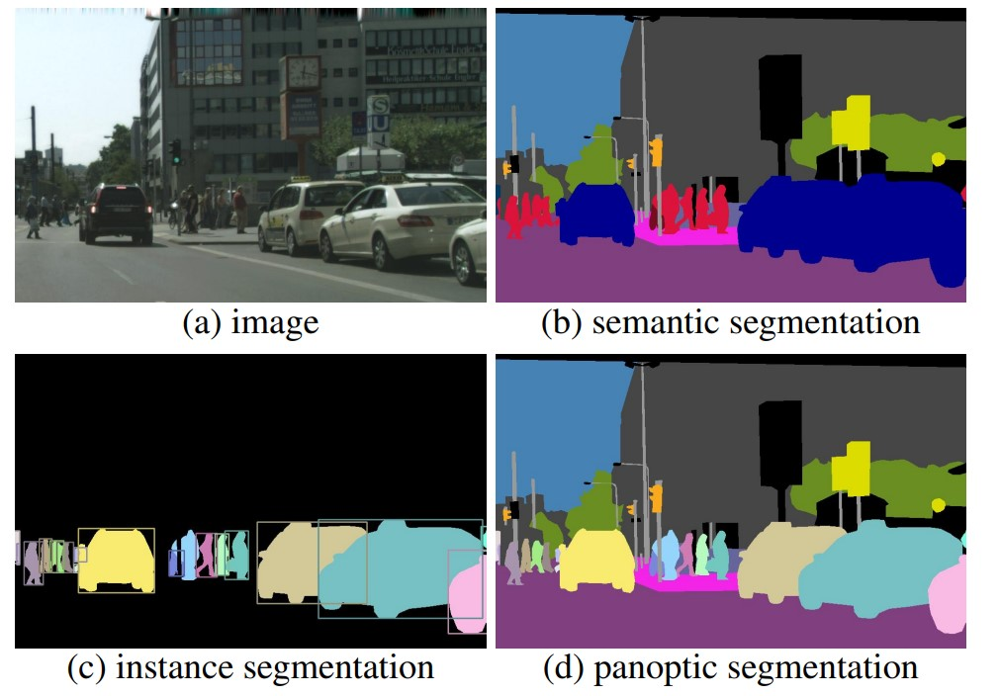

## Práctica 6. Tecnologías emergentes 

### Contenidos

[Mediapipe](#mediapipe)  
[VLM](#modelos-de-visión-y-lenguaje)  

<!--[360](#imagen-y-v-ideo-360)   -->

<!--Ver algunos ejemplos cvzone https://github.com/cvzone/cvzone https://www.computervision.zone
PyGame para pistas de sonido
PYO (https://pypi.org/project/pyo/) para sonidos, MUSIC21 para pasar a notas https://pypi.org/project/music21/
teachable machines -->

## Mediapipe

[Mediapipe](https://pypi.org/project/mediapipe/) proporciona acceso a diversas soluciones de aprendizaje automático, siendo un proyecto *open source*, y concebido para entorno móvil, web y de limitados recursos.
Te será de utilidad la [documentación](ttps://ai.google.dev/edge/mediapipe/solutions/guide). En cualquier caso, para su instalación he seguido los siguientes pasos:

```
conda create --name=VC_P6 python=3.11.5
conda activate VC_P6
pip install mediapipe
```

En la página de [Mediapipe](https://developers.google.com/mediapipe), además de contar con varios vídeo-tutoriales en la parte inferior, verás en al parte superior el botón [See demos]([Mediapipe](https://mediapipe-studio.webapps.google.com/home) desde el que podrás lanzar varias demos desde el navegador. Para todas ellas se ofrece ejemplo de código para distintas plataformas. 

Para el cuaderno he adaptado dos de ellas: 1) [Face Landmark Detection](https://mediapipe-studio.webapps.google.com/studio/demo/face_landmarker) y 2) [Hand Landmark Detection](https://mediapipe-studio.webapps.google.com/studio/demo/hand_landmarker). En **ambos casos deberás descargar el modelo**:

- El modelo de la malla de la cara lo he descargado desde [esta página](https://developers.google.com/mediapipe/solutions/vision/face_landmarker/index#models), observarás que es muchísimo más denso que los vistos anteriormente. 

- En el caso de la mano, usé este [otro enlace](https://developers.google.com/mediapipe/solutions/vision/hand_landmarker).


Como experiencia personal, la demo web de las manos funciona con ambas, el cuaderno me detecta una sola, y no de forma tan robusta.


Mejor con cvzone

```
pip install cvzone
```

## Modelos de visión y lenguaje

[BLIP-2](https://github.com/salesforce/LAVIS/tree/main/projects/blip2) (Bootstrapped Language-Image Pretraining 2) es un modelo de visión y lenguaje desarrollado por [Salesforce](https://github.com/salesforce), concebido para tareas como generar descripciones de imágenes, responder a preguntas visuales y buscar información en imágenes a través de lenguaje natural.

Como demostradores, les proponemos hacer uso de un modelo de *visual question answering* (VQA), para ello, es necesario instalar
el paquete necesario para usar [LAVIS](https://github.com/salesforce/LAVIS) (A Library for Language-Vision Intelligence) en el *environment* de trabajo:

```
pip install salesforce-lavis
```

Tras la instalación, puedes lanzar un primer demostrador que nos permite preguntar a la imagen, en concreto  *Demo_image_VQAOPT_interactive.py*

```
python Demo_image_VQAOPT_interactive.py
```

Ten presente que se ejecuta en CPU, dado que no hemos instalado pytorch para GPU en el laboratorio. Se carga una imagen por defecto, 
editando el código, tienes libertad para escoger la imagen de entrada. Las preguntas debes introducirlas en la consola en inglés, deteniendo la ejecución al teclear *exit* como pregunta. Observarás que no solo responde a aspectos visibles en la imagen. Algunos ejemplos de preguntas para la imagen ejemplo:

```
What color is the person's shirt?
Do you see the person's legs?
How old is the person?
Where is the person from?
What is the person's name?
```

Se incluye también el desmostrador utilizado usamos en la Jornadas de Puertas Abiertas, que requiere instalar YOLO, y contar con una webcam.

```
pip install ultralytics
```

Para lanzarlo, teclea:

```
python Demo_yolo_VQAOPT_2425.py
```

Ahora sí que se notará la ausencia de GPU presente o habilitada. Pese a ello, se obtienen *al golpito* descripciones de las personas que se acerquen a la cámara.

<!--


Instalar Ollama
conda create -n ollama python=3.11.5
conda activate ollama
pip install opencv-python
pip install ollama

ollama pull llama3.2-vision
 
python demo.py
-->

## Tipos de Segmentación

Generalmente se habla de segmentación de imagen a las técncas que consisten en asignar una clase a cada píxel de una imagen. Generalmente se distinguen tres tipos de segmentación:
- **Segmentación semántica**: Se trata de una segmentación que asigna una clase a cada píxel de la imagen, donde todos los píxeles de un objeto pertenecen a la misma clase.
- **Segmentación por instancias**: Una segmentación donde se distingue entre las diferentes apareciones de entidades de una misma clase.
- **Segmentación panóptica**: Una combinación de las dos anteriores.


  
*Imagen extraída de [Kirilov2019]*

### SAM

[Segment Anything Model](https://segment-anything.com) (SAM) es un modelo creado por Meta que produce máscaras a partir de unos puntos o *bounding boxes* dados. Divide la imagen en objetos sin asignar una clase concreta a las máscaras generadas. Esta pensado para ser un modelo *zero-shot*, es decir, que no necesite entrenamiento extra para su aplicación.

Hemos preparado una demo *demo_SAM*, para ejecutarla habrá que realizar algunas instalaciones. Como en otras prácticas, se recomienda usar CUDA para utilizar la gráfica (si se tiene). En caso de querer, instalar torch desde aqui: [Link](https://pytorch.org/get-started/locally/)

```
conda create --name VC_P7
conda activate VC_P7
pip install opencv-python
pip install matplotlib
pip3 install torch torchvision torchaudio
pip install git+https://github.com/facebookresearch/segment-anything.git
pip install jupyter_bbox_widget
```

Comentar que si tienes ultralytics instalado en un *environment*, dicha instalación incluye modelos de SAM (puede ser necesario actualizar *pip install -U ultralytics*), hemos probado con éxito el siguiente código sin instalación adicional:

```
from ultralytics import SAM

# Modelo SAM (De momento los modelos 2.1 dan error)
model = SAM("sam2_s.pt")

# Información del modelo
# print(model.info())

# Segmenta proporcionando punto  en points (Pueden proporcionarse varios puntos, en labels se indica si es muestra positiva (1) o negativa (0))
results = model("imagen.png", points=[369, 169], labels=[1], device="cpu", show=True)
```

### U-Net y otros modelos

En cuanto a modelos más clásicos de segmentación, el más usado es U-Net. Un modelo que, aunque está próximo a cumplir 10 años tras ser creado para el campo de la medicina, sigue dando buenos y robustos resultados en muchas aplicaciones. Hemos preparado *Demo_UNET* para descargar un modelo y probarlo en torch. 

Algunos repositorios con modelos de segmentación ya implementados pueden ser: 
- [MMsegmentacion](https://github.com/open-mmlab/mmsegmentation?tab=readme-ov-file)
- [Segmentation Models Torch](https://segmentation-modelspytorch.readthedocs.io/en/latest/)


### SAMURAI

Tras la aparición de [SAMURAI](https://github.com/yangchris11/samurai?tab=readme-ov-file) reclamando tener mejores resultados para segmentación en vídeo, hemos tenido una primera toma de contacto, siguiendo los siguientes pasos:

- Decargar desde el [repositorio](https://github.com/yangchris11/samurai?tab=readme-ov-file), descromprimir y situarse en la subcarpeta *sam2*
- Crear el un *environment* específico, con lo necesario para usar CUDA según la instalación existente

```
conda create -n SAMURAI python=3.11.5
conda activate SAMURAI
pip install torch torchvision torchaudio --index-url https://download.pytorch.org/whl/cu118
```
- Preparar lo necesario para usar Sam 2, desde la subcarpeta correspondiente
```
pip install -e .
```
- Añadir algunos paquetes para SAMURAI
```
pip install matplotlib==3.7 tikzplotlib jpeg4py opencv-python lmdb pandas scipy
pip install decord
```
- Descargar los modelos de SAM 2, instrucciones en el repositorio
- Desde la carpeta donde se ha descomprimido SAMURAI, modifica la ruta del modelo en *scripts/demo.py*
- Ya deberías poder lanzar

```
python scripts/demo.py --video_path TGC23_PdH_C0056cut.mp4 --txt_path TGC23_PdH_C0056cut.txt
```
El vídeo es el utilizado en la P4, el txt correspondiente contiene el contenedor que indica en el primer fotograma el objeto a seguir, en formato esquina superior, ancho y alto separado por comas. En el ejemplo usado fue:
```
412,240,15,48
```

## Homografías

Tomando como escenario ilustrativo un contexto deportivo, las dos últimas celdas del cuaderno *VC_P6.ipynb* muestran en primer término la aplicación de homografías dadas dos imágenes de un estadio, una la teral y otra cenital, para tras anotar en cada uno cuatro puntos de correspondencia, obtener la matriz de homografía con [*scikit-image*](https://scikit-image.org), y mostrar tanto la imagen lateral transformada, como la transformación corre4spondiente para cualquier punto sobre ella.

La última celda, da los primeros pasos para ilustrar una posible automatización de la localización de los puntos de interés sobre una imagen arbitraria de un campo de fútbol, asumiendo un cesèd verde y la presencia clara de las líneas de campo. Esta celda requiere un *environment* con ultralytics instalado.

<!--
## Segmentación

MMSegmentation tensorflow

DINO+SAM

SAM2
Instalo sam2 https://github.com/facebookresearch/sam2?tab=readme-ov-file
* git clone https://github.com/facebookresearch/sam2.git && cd sam2
* conda create -n SAMURAI python=3.11.5
* conda activate SAMURAI
* pip install torch torchvision torchaudio --index-url https://download.pytorch.org/whl/cu118
* pip install -e .

Descargar checkpoints, probé 
notebooks/video_predictor_example.ipynb 
y me funciona

SAMURAI
Descargar
 https://github.com/yangchris11/samurai?tab=readme-ov-file
* pip install matplotlib==3.7 tikzplotlib jpeg4py opencv-python lmdb pandas scipy

Y antes de ejecutar, sobreescribir la subcarpeta sam2, con la usada para instalar SAM2 antes

pip install decord


Background removal https://github.com/chenxwh/cog-RMBG
https://github.com/naver-ai/ZIM


## YOLO-World

Integrado en el paquete de ultralitycs, permite detectar objetos en una imagen proporcionando una descripción de texto

## Supervision

Pretende ser independiente del modelo. ¿Pide licencia?

https://roboflow.github.io/cheatsheet-supervision/

```
pip install supervision
```

https://pypi.org/project/supervision/

## Imagen y vídeo 360

Mi experiencia con imagen y vídeo 360 se centra en la Gopro MAX.
Para trabajar con material capturado con la Gopro MAX en el PC, tuve que instalar [Gopro Player](https://gopro.com/es/es/info/gopro-player). Realmente con el enlace anterior siempre obtengo como respuesta *"Ha habido un problema"*, por lo que acabé con un enlace a una [beta](https://install.appcenter.ms/orgs/sw-team-devops-rimo/apps/gopro-player-for-windows-beta/distribution_groups/public?fbclid=IwAR2AVN9jQSLJETcmC57ILYKT1_B4JxVPa8MOYhg3mRvdSDQYh2sCVvuZ6VI). No me hago responsable.

Gopro utiliza el códec HEVC, según mis notas tuve que instalar el códec, y aparentemente lo obtuve a través de este [enlace](https://apps.microsoft.com/detail/9MW2BVRCG0B2?rtc=1&hl=es-es&gl=ES), en cualquier caso, he dejado un enlace en el campus.

De cara a verlo en las gafas de RV, conecté con cable USB (puerto USB-3), y aparece como una unidad USB. Si no es conexión USB-3 y no del frontal de la torre, no he conseguido acceder. Tengo dudas si además he tenido que tener instalada la [aplicación de Quest](https://www.meta.com/es/quest/setup/) para el PC. En algún equipo tuve que dar permiso para que se pudiera acceder a las gafas. Una vez que el contenido haya sido copiado en las gafas, he probado en la carpeta *Movies*, lo he visualizado en 360 utilizando la aplicación *Meta Quest TV* como aplicación en las gafas accediendo a *Tu contenido*.
-->
<!--

https://storage.googleapis.com/mediapipe-models/face_landmarker/face_landmarker/float16/1/face_landmarker.task

[Repositorio de  modelos](https://developers.google.com/mediapipe/solutions/vision/hand_landmarker/index#models)
-->


<!--

Setup
https://www.youtube.com/watch?v=VicWnzy-O5Y

Balance

Cable, Sony Multi


Arrancar

App, calibración
-->

## Referencias

[Kirillov2019] Kirillov, A., He, K., Girshick, R., Rother, C., Dollar, P., 2019. Panoptic segmentation, in: Proceedings of the IEEE/CVF Conference on Computer
Vision and Pattern Recognition (CVPR).

[Ronneberger2015] O. Ronneberger, P. Fischer, and T. Brox. U-net: Convolutional networks for biomedical
image segmentation, 2015.

***
Bajo licencia de Creative Commons Reconocimiento - No Comercial 4.0 Internacional

