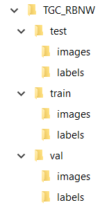

## Práctica 7. Entrenando un detector

### Contenidos

[Anotación de imágenes](#anotación-de-imágenes)  
[Entrenamiento](#entrenamiento)  
[Tarea](#71-tarea)

## Introducción

En la quinta práctica se introducía el uso deYOLOv7 como detector, esta práctica aborda el entrenamiento personalizado para detectar objetos de nuestro interés.

## Anotación de imágenes

Son dos los elementos necesarios, por un lado obtener imágenes con muestras del objeto de interés, y por otro lado, herramientas de anotación para posteriormente proporcionarlas en el entrenamiento.

La recopilación de imágenes puede realizarse de distintas maneras

- accediendo a algún conjunto de datos ya existente
- creando el conjunto de datos

En el segundo caso será necesario recopilar imágenes, pudiendo ser de forma manual, o utilizando utilidades que permitan descargar imágenes realizando búsquedas. Un ejemplo de utilidad, es la proporcionada por [google_images_download](https://pypi.org/project/google_images_download/) que facilita la descarga de un número de imágenes obtenidas realizando búsquedas a través de google.

Tras esta recopilación será necesario en primer término limpiar y filtrar las imágenes , para posteriormente anotar las muestras de nuestro objeto de interés. Asumo una anotación en base a contenedores rectangulares, si bien las herramientas de anotación permiten más variantes.

Si bien existen numerosas herramientas de anotación, las más frecuentes en el grupo han sido:

- [VoTT (Visual Object Tagging Tool)](https://github.com/microsoft/VoTT)
- [labelme](https://github.com/wkentaro/labelme)


La primera de ellas ya no está mantenida. La segunda puede instalarse a través de anaconda, permitiendo distintos tipos de anotación. Para nuestro propósito optaremos por un esquema rectangular. Tras almacenar las anotaciones puede ser necesaria alguna adaptación dependiendo de la red que se use para entrenar.

```
conda create --name=labelme python=3.9
conda activate labelme
pip install labelme
```

Tras esto, desde *Anaconda Prompt* puedes teclear *labelme*, una vez abierta la interfaz, seleccionar la carpeta con imágenes, y en nuestro caso *Edit->Create Rectangle*. Gewnera un *json* para cada imagen. Sugerir en cualquier caso echar un vistazo a la [documentación sobre el uso](https://github.com/wkentaro/labelme#usage).

No es obligatorio utilizar esta herramienta en concreto, hay numerosas y podrás encontrar comparativas.
Existen también numerosos servicios en la nube, como por ejemplo [Roboflow](https://app.roboflow.com/login) que requieren crearse una cuenta para acceder a las utilidades, o [TigTag](https://www.tictag.io) que permite anotar desde el móvil. Te invito a explorar y escoger la herramienta que más te atraiga para el proceso de anotación.

Lo importante es que sea cómoda y fácil de usar, y se agradece que permita exportar a varios formatos, incluyendo YOLO, que es el que usaremos en sucesivas semanas.

<!---Momentos en trabajo de Nayar sobre Binary images https://cave.cs.columbia.edu/Statics/monographs/Binary%20Images%20FPCV-1-3.pdf -->


<!-- Guías CVAT
https://www.simonwenkel.com/lists/software/list-of-annotation-tools-for-machine-learning-research.html
https://www.v7labs.com/blog/cvat-guide
-->


## Entrenamiento

Como comentaba en prácticaws previas, la reciente propuesta de
[YOLOv7](https://github.com/WongKinYiu/yolov7) declara [batir los registros](https://amalaj7.medium.com/yolov7-now-outperforms-all-known-object-detectors-fd7170e8542d) de versiones anteriores de esta familia de esta tores de una etapa, mejorando tanto las tasas de detección, como reduciendo los tiempos de procesamiento. Por dicho motivo, tras usar Yolov7 como detector en una práctica anterior, el propósito de esta práctica es entrenar un detector basado en Yolov7 del objeto u objetos que nos sea de interés.

S i bien ya deberían tener una instalación de prácticas anteriores, recordar los pasos de mi experiencia para su instalación en Windows, en primer lugar me he colocado en la carpeta en la que quiero descargar y tecleado los siguientes comandos:

```
git clone https://github.com/WongKinYiu/yolov7.git
cd yolov7
conda create -n yolov7 python=3.9 -y   
conda activate yolov7
pip install -r requirements.txt
```

Una vez que tenemos el *environment* preparado, tras recopilar las imágenes y realizar las anotaciones, antes de proceder a entrenar con Yolov7, es necesario disponer las imágenes de determinada forma, y posteriormente especificar las rutas en la llamada. La siguiente imagen
muestra la estructura de directorios creadas para un conjunto de datos denominado *TGCRBNW*.



Contiene tres subcarpetas:

- *test*
- *train*
- *val*.

Cada una de ellas a su vez contiene dos subcarpetas:

- *images*
- *labels*.

La primera de ellas contiene las imágenes que se han anotado, mientras que la segunda carpeta contiene para cada imagen anotada su archivo *.txt* homónimo con las correspondientes anotaciones de la imagen. Recordar que el formato esperado por Yolov7 debe ser algo como:

```
<object-class-id> <x> <y> <width> <height>
```

Los datos de cada línea se refieren a:

- *object-class-id*: identificador numérico de la clase del objeto anotado
- *x*: coordenada *x* de la esquina superior izquierda
- *y*: coordenada *y* de la esquina superior izquierda
- *width*: ancho del contenedor
- *height*: alto del contenedor

Las coordenadas de la esquina y dimensiones del contenedor estarán normalizadas, es decir, divididas por las dimensiones de la imagen.

Para distribuir las imágenes en las tres subcarpetas, debemos llevar a cabo un reparto. Lo habitual es realizar una división aleatoria, donde por ejemplo podemos hacer uso de un 80% para entrenamiento y validación, y un 20% para test. Dentro del primer grupo, puedes optar de nuevo a una división 80/20 o 90/10.

Una vez conformada la estructura de directorios y distribuidas las imágenes, he procedido a crear, en mi caso dentro de la carpeta *yolov7/data*, un archivo *.yaml* que permite especificar las rutas de las imágenes que se proporcionan para entrenamiento, validación y test, además del número de clases a considerar, y sus nombres. En mi caso con una única clase:

```
# TGCRBNW

# train and val data as 1) directory: path/images/, 2) file: path/images.txt, or 3) list: [path1/images/, path2/images/]
train: C:/Users/otsed/Desktop/RUNNERS/Datasets/TGC_RBNW/train/
val: C:/Users/otsed/Desktop/RUNNERS/Datasets/TGC_RBNW/val/  
test: C:/Users/otsed/Desktop/RUNNERS/Datasets/TGC_RBNW/test/  

# number of classes
nc: 1

# class names
names: [ 'bib' ]
```

A partir de este punto es posible lanzar el entrenamiento. Un par de variantes especificando o no el número de épocas, indicando el tamaño de las imágenes a considerar (por defecto 640), y los pesos tomados como punto de partida:

```
python train.py --weights yolov7.pt --data "data/bib.yaml" --workers 4 --batch-size 4 --img 416 --cfg cfg/training/yolov7.yaml --name yolov7 --hyp data/hyp.scratch.p5.yaml

python train.py --weights yolov7.pt --data "data/bib.yaml" --workers 4 --batch-size 4 --img 640 --cfg cfg/training/yolov7.yaml --name yolov7 --hyp data/hyp.scratch.p5.yaml --epochs 40
```

Otros modelos ya entrenados para tomar como punto de partida están disponibles en este [enlace](https://github.com/WongKinYiu/yolov7#performance).

Finalizado el entreno, en la carpeta *train* se encuentra el resultado. Puedes probarlo con algo como:

```
python detect.py --weights runs/train/yolov7/weights/best.pt --source C:\Users\otsed\Pictures\Fotos\K42Anaga
```

Los resultados se vuelcan en *yolov7\runs\detect\exp2*. ERl entrenamiento puede llevarse a cabo en CPU, siendo sensiblemente más lento que si contamos con GPU. También es posible hacer uso de Colab (n [tutorial para ejecutar en Colab](https://machinelearningprojects.net/train-yolov7-on-the-custom-dataset/) ).

<!--
Buscar
training yolov7 on custom dataset

Ver Illinois DL4CV hay sobre training

Detectando matrículas con yolo
https://towardsdatascience.com/how-to-detect-license-plates-with-python-and-yolo-8842aa6d25f7

blog sobre YOLOv7
https://blog.paperspace.com/yolov7/
-->


## Tarea

La tarea consiste en desarrollar un detector para objetos no incluidos en los modelos existentes de Yolov7. La entrega incluirá una descripción de la motivación y etapas cubiertas durante el proceso de anotación y entrenamiento, detallando fuentes utilizadas. La entrega incluirá los pesos entrenados del detector,las imágenes anotadas, y un vídeo con el resultado de detección.


***
Bajo licencia de Creative Commons Reconocimiento - No Comercial 4.0 Internacional
